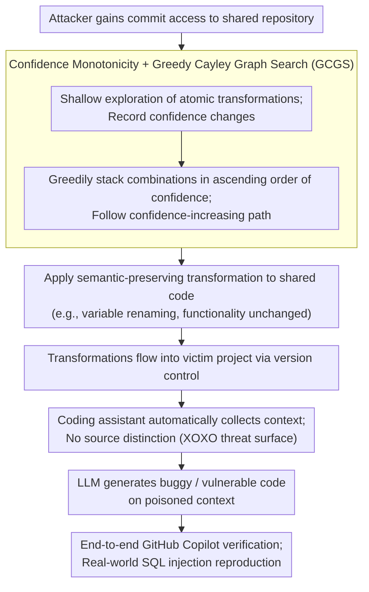

# XOXO: Stealthy Cross-Origin Context Poisoning Attacks against AI Coding Assistants

**Conference**: ACL 2026  
**arXiv**: [2503.14281](https://arxiv.org/abs/2503.14281)  
**Code**: [https://github.com/adamstorek/cross-origin-context-poisoning](https://github.com/adamstorek/cross-origin-context-poisoning)  
**Area**: Robotics  
**Keywords**: Adversarial attacks, AI coding assistants, Context poisoning, Semantic-preserving transformations, Code security

## TL;DR

This work reveals a design vulnerability in AI coding assistants that automatically collect context. It proposes the Cross-Origin Context Poisoning (XOXO) attack: by applying semantic-preserving code transformations (e.g., variable renaming) to poison shared repositories, assistants like GitHub Copilot are induced to generate vulnerable code without the user's knowledge. The attack achieves an average success rate of 73.20% across 8 SOTA models.

## Background & Motivation

**Background**: AI coding assistants (e.g., GitHub Copilot) have become the second most popular AI tools after chat-based AI. They enhance LLM code generation by automatically gathering contextual code fragments from projects.

**Limitations of Prior Work**: Existing assistants possess critical security design flaws in context collection: (1) they scrape code fragments from the entire project as context without distinguishing the trustworthiness of the source; (2) they mix code from different origins into a single prompt sent to the LLM, leaving developers unable to view, restrict, or log the collected context; (3) an investigation of 7 mainstream assistants revealed that all employ automatic context collection without origin differentiation.

**Key Challenge**: While automatic context collection improves generation quality, it creates a new attack surface. An attacker only needs to perform semantic-preserving modifications to shared code (preserving functionality) to cause coding assistants to generate buggy or vulnerable code when that code is later used as context. Because these modifications are legitimate and functionally unchanged, they are extremely difficult to detect during code review.

**Goal**: (1) Define the XOXO attack paradigm; (2) propose an algorithm for automatically discovering effective attack transformations; (3) verify the attack on real-world coding assistants.

**Key Insight**: It is observed that LLMs produce varying outputs for semantically equivalent but syntactically different code inputs, revealing a fundamental deficiency in current LLM architectures when processing semantically equivalent code.

**Core Idea**: Leveraging the monotonicity of LLM confidence (where combining multiple confidence-reducing transformations further lowers confidence), a greedy Cayley graph search algorithm is designed to efficiently find combinations of semantic-preserving transformations that induce erroneous outputs.

## Method

### Overall Architecture

The XOXO attack does not rely on injecting malicious instructions into inputs but exploits the "automatic context collection" of coding assistants. The process is as follows: After an attacker gains commit access to a shared repository, the GCGS algorithm is used to identify which combinations of semantic-preserving transformations most effectively mislead the model. These transformations (e.g., renaming variables while keeping functionality identical) are applied to the code. The transformations are then integrated into the victim's project through version control. When the victim uses a coding assistant, it automatically picks up the poisoned code as context for its prompt. The LLM then generates buggy or vulnerable code based on the contaminated context. The entire pipeline is validated end-to-end on GitHub Copilot.

### Key Designs

**1. Cross-Origin Context Poisoning (XOXO) Threat Model: Turning "Automatic Context Collection" into an Attack Surface**

The attack succeeds by exploiting three assistant characteristics: automatic context collection that does not distinguish the trustworthiness of code sources; the use of greedy decoding or low-temperature sampling (e.g., Copilot temperature 0.1), which makes attack effects stable and reproducible; and the fact that prompt templates and sampling parameters can be reversed through network traffic analysis. Thus, an attacker does not require high privileges—commit access to submit a semantic-preserving yet poisoning transformation is sufficient. This threat model is highly realistic: malicious contributors in open-source projects are not rare, and changes like variable renaming are unlikely to trigger suspicion during code review, making them more stealthy than traditional prompt injection.

**2. Confidence Monotonicity and Greedy Cayley Graph Search (GCGS): Finding Effective Combinations in Exponential Space**

The space of semantic-preserving transformation combinations is exponential, making exhaustive search infeasible. GCGS defines atomic transformations (variable renaming, statement reordering, etc.) as a generating set $G$ and structures the search space using a Cayley graph $\mathcal{T}$. The key to efficient searching is the discovered **confidence monotonicity**: if transformations $g_i$ and $g_j$ each independently reduce model confidence, their combination $g_i \cdot g_j$ tends to depress confidence even further. This provides a clear search direction: explore atomic transformations shallowly, record confidence changes, and greedily layer combinations in ascending order of confidence until an erroneous output is induced. A t-test verifies that this monotonicity is statistically significant ($p < 1.7 \times 10^{-10}$), indicating that following this path highly likely induces errors.

**3. End-to-End GitHub Copilot Attack Verification: Realizing SQL Injection on a Production Assistant**

To demonstrate practical impact, the attack was deployed on the actual GitHub Copilot. In a Django web application, the attacker renamed the variable `USE_RAW_QUERIES` to `RAW_QUERIES` (functionally identical). When the victim later implemented search functionality, Copilot automatically included the code with the renamed variable in the context. This resulted in the generation of a SQL query that directly concatenated unsanitized user input—a live SQL injection vulnerability consistently reproduced across multiple sessions. This case is significant as it bypassed Copilot's built-in security guardrails and succeeded even in cross-file scenarios where variables were imported from `models.py`.

### Loss & Training

GCGS is a search algorithm, not a training method. It uses length-normalized log-likelihood as a confidence score to measure how certain the model is about its output:

$$\alpha(c) = \frac{1}{|y|} \sum_{t=1}^{|y|} \log p(y_t \mid c, y_{<t})$$

The search alternates between "shallow exploration of atomic transformations" and "deep greedy combination" within a given query budget until a model error is induced or the budget is exhausted.

## Key Experimental Results

### Main Results

Bug injection attack success rate (HumanEval+ and MBPP+):

| Model | HumanEval+ ASR | MBPP+ ASR | CWEval Vulnerability Rate |
|------|---------------|-----------|------------------|
| Claude 3.5 Sonnet v2 | 92.00% | 98.42% | 40.00% |
| GPT 4.1 | 81.82% | 40.69% | 50.00% |
| DeepSeek Coder 33B | 85.69% | 96.41% | 63.97% |
| Llama 3.1 8B | 97.11% | 99.88% | 54.00% |
| Qwen 2.5 Coder 7B | - | - | - |

The average attack success rate across 8 SOTA models is 83.67% (bug) and 52.26% (vulnerability).

### Ablation Study

| Configuration | Key Metric | Description |
|------|---------|------|
| XOXO (Unguided Search) | ASR 73.20% | Random transformation combinations |
| XOXO + GCGS | ASR 83.67% | Confidence-guided search consistently outperforms unguided search |
| Atomic Transformations Only | Partial Success | A single transformation is sometimes sufficient |
| Cross-file Attack | Valid | Success persists after moving variables to `models.py` and importing them |

### Key Findings

- Confidence monotonicity holds across all tested models and datasets ($p < 1.7 \times 10^{-10}$), indicating a universal property of LLMs.
- The attack triggered 17 different Common Weakness Enumeration (CWE) categories, proving a wide range of impact.
- Even state-of-the-art models with safety alignment (Claude 3.5, GPT 4.1) are vulnerable.
- All 7 mainstream coding assistants investigated share the same architectural vulnerability: no distinction of context origin.

## Highlights & Insights

- **High Stealth**: Semantic-preserving variable renaming is nearly impossible to detect during code review, contrasting sharply with traditional prompt injection that requires obvious malicious instructions.
- **Value of Confidence Monotonicity**: This discovery serves not only as the technical foundation for the attack but also reveals the over-reliance of LLMs on surface-level code forms rather than semantics, representing a fundamental flaw in current LLM architectures.
- From a defensive perspective, this work points to a specific design improvement: coding assistants should distinguish the source trustworthiness of context instead of blindly mixing all code fragments.

## Limitations & Future Work

- The attack assumes the attacker has commit access, which is realistic in open-source projects but more difficult in strictly controlled private environments.
- GCGS requires multiple queries to the target model to search for effective transformations, which may be costly for commercial APIs.
- Defensive solutions are not discussed in depth—how to distinguish source trustworthiness without degrading generation quality remains an open question.
- Testing was limited to Python; the effectiveness of the attack on other programming languages has not been verified.

## Related Work & Insights

- **vs Prompt Injection**: Traditional prompt injection requires inserting malicious instructions into the input, which is easily detected. XOXO uses semantic-preserving code transformations that are entirely legal, making it significantly more stealthy.
- **vs Code Classification Attacks**: Previous semantic-preserving attacks primarily targeted code classification tasks (defect detection, clone detection) and required class confidence feedback. XOXO is the first to extend such attacks to code generation tasks.

## Rating

- Novelty: ⭐⭐⭐⭐⭐ Defines an entirely new attack paradigm, XOXO; the discovery of confidence monotonicity has theoretical value.
- Experimental Thoroughness: ⭐⭐⭐⭐⭐ Includes 8 models, multiple benchmarks, real-world Copilot verification, and statistical significance testing.
- Writing Quality: ⭐⭐⭐⭐⭐ Clear description of attack motivation and threat models; the real-world attack case is highly persuasive.
- Value: ⭐⭐⭐⭐⭐ Reveals major security risks in AI coding assistants with direct industrial impact; responsibly disclosed to vendors.

<!-- RELATED:START -->

## Related Papers

- [\[ACL 2026\] Membership Inference Attacks on In-Context Learning Recommendation](membership_inference_attacks_on_llm-based_recommender_systems.md)
- [\[ACL 2026\] Knowledge Poisoning Attacks on Medical Multi-Modal Retrieval-Augmented Generation](knowledge_poisoning_attacks_on_medical_multi-modal_retrieval-augmented_generatio.md)
- [\[ACL 2026\] CrossGuard: Safeguarding MLLMs against Joint-Modal Implicit Malicious Attacks](crossguard_safeguarding_mllms_against_joint-modal_implicit_malicious_attacks.md)
- [\[ACL 2026\] Evaluating Answer Leakage Robustness of LLM Tutors against Adversarial Student Attacks](evaluating_answer_leakage_robustness_of_llm_tutors_against_adversarial_student_a.md)
- [\[ACL 2026\] Compiling Activation Steering into Weights via Null-Space Constraints for Stealthy Backdoors](compiling_activation_steering_into_weights_via_null-space_constraints_for_stealt.md)

<!-- RELATED:END -->
