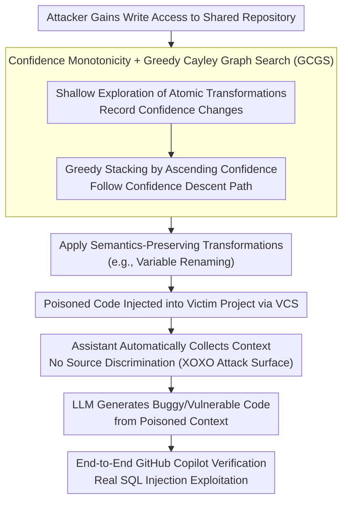

# XOXO: Stealthy Cross-Origin Context Poisoning Attacks against AI Coding Assistants

**Conference**: ACL 2026  
**arXiv**: [2503.14281](https://arxiv.org/abs/2503.14281)  
**Code**: [https://github.com/adamstorek/cross-origin-context-poisoning](https://github.com/adamstorek/cross-origin-context-poisoning)  
**Area**: Robotics  
**Keywords**: Adversarial Attacks, AI Coding Assistants, Context Poisoning, Semantics-Preserving Transformations, Code Security

## TL;DR

This work identifies a design vulnerability in the automatic context collection of AI coding assistants and proposes the Cross-Origin Context Poisoning (XOXO) attack. By applying semantics-preserving transformations (e.g., variable renaming) to poison shared codebases, assistants like GitHub Copilot are misled into generating buggy or vulnerable code. The attack achieves an average success rate of 73.20% across 8 SOTA models.

## Background & Motivation

**Background**: AI coding assistants (such as GitHub Copilot) have become the second most popular AI tools after chat-based LLMs. They improve code generation by automatically retrieving context snippets from across a project.

**Limitations of Prior Work**: Current assistants exhibit critical security flaws in context collection: (1) they scrape snippets from the entire project without verifying source trust; (2) multi-source code is merged into a single prompt hidden from the user, preventing inspection or restriction; (3) a survey of 7 major assistants reveals that all employ automatic collection without source differentiation.

**Key Challenge**: While automatic collection improves generation quality, it creates a new attack surface. Attackers can commit semantics-preserving modifications—functionally identical to the original—that cause assistants to generate buggy code when used as context. Such attacks are difficult to detect during code review because the modifications are legitimate.

**Goal**: (1) Define the XOXO attack paradigm; (2) propose an algorithm to automatically discover effective attack transformations; (3) validate the attack on commercially used coding assistants.

**Key Insight**: LLMs generate different outputs for semantically equivalent but syntactically distinct code inputs, revealing a fundamental weakness in current LLM architectures.

**Core Idea**: Leveraging the monotonicity of LLM confidence (composing multiple transformations that reduce confidence further decreases it), the authors design a greedy Cayley graph search algorithm to efficiently find combinations that induce incorrect outputs.

## Method

### Overall Architecture

The XOXO attack does not rely on malicious instructions but exploits the "automatic context collection" mechanism. An attacker with write access to a shared repository uses the GCGS algorithm to identify optimal semantics-preserving transformations. These changes (e.g., renaming variables) flow into the victim's project via version control. When the victim uses a coding assistant, the poisoned code is automatically pulled into the prompt context, leading the LLM to generate buggy or vulnerable code. The entire workflow is validated end-to-end on GitHub Copilot.

### Key Designs

**1. XOXO Threat Model (Function)**: The attack exploits three characteristics of coding assistants: automatic context collection regardless of source, stable outputs from greedy decoding/low-temperature sampling, and reversible prompt templates. An attacker only needs permission to submit code. Since variable renaming is common and functionally neutral, it evades suspicion during code review more effectively than traditional prompt injection.

**2. Confidence Monotonicity and Greedy Cayley Graph Search (Mechanism)**: Since the space of transformation combinations is exponential, exhaustive search is infeasible. GCGS defines atomic transformations as a generating set $G$ and structures the space as a Cayley graph $\mathcal{T}$. The key find is **confidence monotonicity**: if transformations $g_i$ and $g_j$ individually reduce confidence, their combination $g_i \cdot g_j$ tends to reduce it further. The algorithm performs shallow exploration followed by greedy stacking. T-tests confirm this property is statistically significant ($p < 1.7 \times 10^{-10}$).

**3. End-to-End GitHub Copilot Verification (Novelty)**: The authors demonstrated a real SQL injection attack. In a Django application, the attacker renamed `USE_RAW_QUERIES` to `RAW_QUERIES`. When the victim subsequently implemented a search feature, Copilot used this context and generated a raw SQL query concatenating unsanitized user input. This bypassed Copilot's security filters and worked even when the variable was imported from a different file (`models.py`).

### Loss & Training

GCGS is a search algorithm. It uses length-normalized log-likelihood as the confidence score $\alpha(c)$ to measure the model's certainty:

$$\alpha(c) = \frac{1}{|y|} \sum_{t=1}^{|y|} \log p(y_t \mid c, y_{<t})$$

The search alternates between shallow exploration of atomic transformations and deep greedy composition until the model fails or the query budget is exhausted.

## Key Experimental Results

### Main Results

Bug Injection Attack Success Rate (ASR) on HumanEval+ and MBPP+:

| Model | HumanEval+ ASR | MBPP+ ASR | CWEval Vuln. Rate |
|------|---------------|-----------|------------------|
| Claude 3.5 Sonnet v2 | 92.00% | 98.42% | 40.00% |
| GPT 4.1 | 81.82% | 40.69% | 50.00% |
| DeepSeek Coder 33B | 85.69% | 96.41% | 63.97% |
| Llama 3.1 8B | 97.11% | 99.88% | 54.00% |

Average ASR across 8 SOTA models: 83.67% (bugs), 52.26% (vulnerabilities).

### Ablation Study

| Configuration | Key Metric | Description |
|------|---------|------|
| XOXO (Unguided) | ASR 73.20% | Random combination of transformations |
| XOXO + GCGS | ASR 83.67% | Confidence-guided search consistently outperforms unguided |
| Atomic Only | Partial Success | Single transformations are sometimes sufficient |
| Cross-file Attack | Remains Effective | Attack succeeds even when variables are moved and imported |

### Key Findings

- Confidence monotonicity holds across all tested models and datasets ($p < 1.7 \times 10^{-10}$), indicating a universal property of LLMs.
- The attack triggered 17 different Common Weakness Enumeration (CWE) types.
- Even safety-aligned models like Claude 3.5 and GPT-4 are susceptible.
- All 7 surveyed coding assistants share the same architectural vulnerability: lack of context source discrimination.

## Highlights & Insights

- **High Stealth**: Semantics-preserving renaming is nearly impossible to detect in code reviews, whereas traditional prompt injection requires visible malicious tokens.
- **Confidence Monotonicity**: This technical insight reveals that LLMs over-rely on surface forms rather than underlying semantics, exposing a fundamental architectural flaw.
- **Defensive Direction**: The work suggests that coding assistants must implement source-aware trust levels for context rather than mixing all project code indiscriminately.

## Limitations & Future Work

- Assumes the attacker has commit access, which is easier in open-source projects than strictly controlled private ones.
- GCGS requires multiple queries to the target model, which may be costly for commercial APIs.
- Defense implementation details are not fully explored (e.g., maintaining generation quality while filtering context).
- Testing was primarily conducted on Python; effectiveness across all programming languages remains to be verified.

## Related Work & Insights

- **vs. Prompt Injection**: Unlike traditional injection requiring malicious commands, XOXO uses legal code transformations, providing superior stealth.
- **vs. Code Classification Attacks**: Previous attacks targeted classification tasks (e.g., defect detection). XOXO is the first to extend these techniques to code generation via poisoned context.

## Rating

- Novelty: ⭐⭐⭐⭐⭐ Defines the new XOXO paradigm; theoretical value in confidence monotonicity.
- Experimental Thoroughness: ⭐⭐⭐⭐⭐ 8 models, multiple benchmarks, real Copilot validation, and statistical tests.
- Writing Quality: ⭐⭐⭐⭐⭐ Clear threat model and compelling real-world cases.
- Value: ⭐⭐⭐⭐⭐ Highlights major safety risks for the industry; responsible disclosure was performed.

<!-- RELATED:START -->

## Related Papers

- [\[ACL 2026\] Membership Inference Attacks on In-Context Learning Recommendation](membership_inference_attacks_on_llm-based_recommender_systems.md)
- [\[ACL 2026\] Knowledge Poisoning Attacks on Medical Multi-Modal Retrieval-Augmented Generation](knowledge_poisoning_attacks_on_medical_multi-modal_retrieval-augmented_generatio.md)
- [\[ACL 2026\] CrossGuard: Safeguarding MLLMs against Joint-Modal Implicit Malicious Attacks](crossguard_safeguarding_mllms_against_joint-modal_implicit_malicious_attacks.md)
- [\[ACL 2026\] Evaluating Answer Leakage Robustness of LLM Tutors against Adversarial Student Attacks](evaluating_answer_leakage_robustness_of_llm_tutors_against_adversarial_student_a.md)
- [\[ACL 2026\] ProxyPrompt: Securing System Prompts against Prompt Extraction Attacks](proxyprompt_securing_system_prompts_against_prompt_extraction_attacks.md)

<!-- RELATED:END -->
