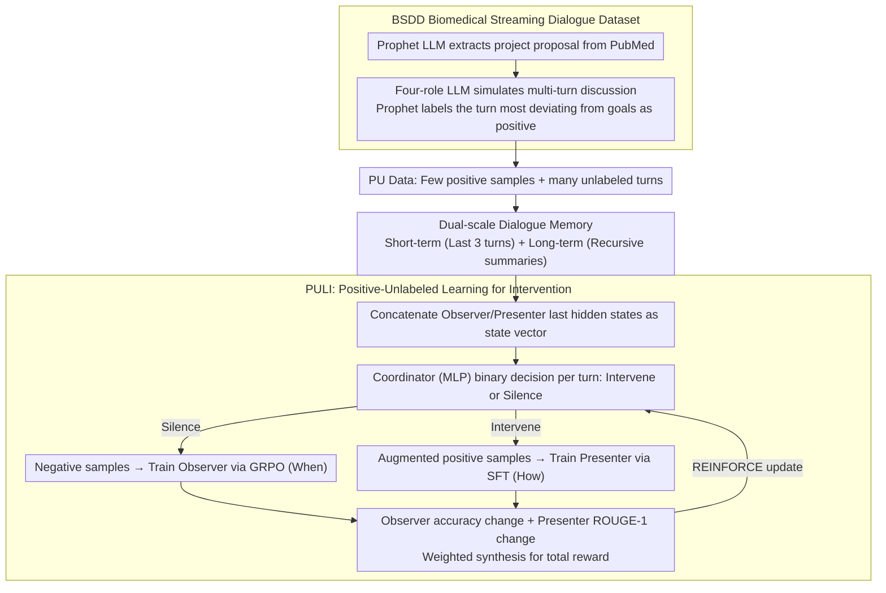

# "Excuse Me, May I Say Something…" CoLabScience: A Proactive AI Assistant for Biomedical Discovery

**Conference**: ACL 2026  
**arXiv**: [2604.15588](https://arxiv.org/abs/2604.15588)  
**Code**: [https://github.com/YANGWU001/CoLabScience](https://github.com/YANGWU001/CoLabScience)  
**Area**: Medical NLP  
**Keywords**: Proactive Intervention, Scientific Collaboration, Positive-Unlabeled Learning, Reinforcement Learning, Biomedical Dialogue

## TL;DR
CoLabScience utilizes the PULI (Positive-Unlabeled Learning for Intervention) framework to train an LLM assistant capable of **proactively deciding when and how to intervene** in biomedical team discussions. It leverages GRPO and an RL coordinator to automatically identify optimal intervention timings and generate scientific suggestions from streaming dialogues.

## Background & Motivation

**Background**: LLMs have been widely applied in biomedical research tasks such as drug repurposing, disease diagnosis, and clinical Q&A. However, existing models primarily operate in a "reactive" mode—only responding when explicitly prompted by a user.

**Limitations of Prior Work**: In multi-person scientific collaboration scenarios, team discussions are often streaming and involve multiple roles. Reactive LLMs fail to intervene promptly when discussions deviate from goals or miss critical knowledge, potentially overlooking significant scientific insights.

**Key Challenge**: Scientific collaboration requires "proactive participation," yet existing methods either rely on manual prompt rules or lack a learnable mechanism for intervention timing, making them unable to provide adaptive, context-aware interventions.

**Goal**: To design a proactive LLM assistant capable of: (1) determining **when to intervene** during streaming scientific discussions; (2) generating **high-quality intervention content**.

**Key Insight**: Model the problem as a "Positive-Unlabeled" (PU) learning problem—only a few optimal intervention points in dialogues are labeled as positive samples, while the rest are unlabeled. An RL coordinator is used to discover latent positive and negative samples.

**Core Idea**: Use a lightweight Observer to judge intervention timing and a large-model Presenter to generate intervention content, with an RL coordinator performing end-to-end joint optimization for both.

## Method

### Overall Architecture

To enable an LLM to learn "whether to interrupt and what to say" in multi-person scientific discussions, CoLabScience assigns these tasks to three collaborative components. For streaming dialogue, the **Coordinator** (a lightweight MLP) first reads the current state to make a binary decision—intervene or remain silent. If intervention is chosen, the **Observer** (a small LLM trained with GRPO) determines if it is the "right moment," while the **Presenter** (a large LLM trained with SFT) generates the actual scientific suggestion. All components access a project proposal $C$ (research goals, background, datasets) and a dual-scale memory: short-term memory $\mathcal{M}^S$ retains the last 3 turns as raw text, and long-term memory $\mathcal{M}^L$ recursively summarizes earlier history. The system is jointly optimized end-to-end via an RL coordination mechanism, driving both "when" and "how" to intervene.

### Key Designs

**1. PULI Framework: Converting intervention detection into a PU learning problem with sparse labels**

In real-world collaboration, it is impractical to label every turn for intervention necessity. Forced fine-grained judgment often introduces hallucinatory noise. PULI labels only the turn most deviating from research goals as a positive sample, treating all others as unlabeled. The Coordinator predicts "intervene/silence" for unlabeled turns: silent turns are used as negative examples to train the Observer, while intervention turns enhance the positive set for training the Presenter. Model performance changes—Observer's accuracy change $r^{\text{when}}$ and Presenter's ROUGE-1 change $r^{\text{how}}$—serve as rewards for updating the Coordinator via REINFORCE. This sparse labeling approach drives the cycle, saving annotation costs while suppressing hallucinations.

**2. Dual-Scale Dialogue Memory: Balancing immediate context with long-term research goals**

Intervention decisions require the immediate context without losing sight of early research objectives. However, storing the entire history causes infinite memory expansion. The memory is split into two scales: short-term memory $\mathcal{M}^S$ keeps the raw text of the current and previous two turns to capture sudden contextual shifts; long-term memory $\mathcal{M}^L$ uses an LLM summarizer $\Gamma(\cdot)$ to recursively compress all historical dialogues, preventing the loss of critical background. The state vector $S_n$ for the Coordinator is formed by concatenating the last hidden layer representations from both the Observer and Presenter, allowing the coordinator to perceive both timing and content signals.

**3. BSDD Dataset: Creating training and evaluation benchmarks for "Proactive Intervention"**

Existing biomedical dialogue datasets (e.g., MedDialog) focus on doctor-patient Q&A, lacking multi-role scientific discussions and intervention timing labels. BSDD fills this gap via an LLM pipeline: a Prophet LLM extracts project proposals from PubMed papers; a Dialogue-Simulator LLM simulates multi-turn discussions among four roles (pharmacologist, medicinal chemist, bioinformatician, and clinician); and finally, the Prophet LLM labels the turn that deviates most from research goals as the positive intervention point.

### Loss & Training

The total reward for the coordinator combines both objectives:

$$r_{\text{total}} = \lambda \cdot r^{\text{when}} + (1-\lambda) \cdot r^{\text{how}}$$

Setting $\lambda = 0.6$ balances intervention timing and content quality. The components use distinct training methods: the Coordinator uses REINFORCE policy gradients, the Observer uses GRPO, and the Presenter uses LoRA (rank=16, $\alpha=64$) for SFT.

## Key Experimental Results

### Main Results

| Model Configuration | Metric | Ours (PULI) | ICL | Proactive Agent |
|--------|------|------|----------|------|
| Qwen3-0.6B + Qwen3-14B | Accuracy | **64.1%** | 55.7% | 53.9% |
| Qwen3-0.6B + Qwen3-14B | F1 | **46.4%** | 28.9% | 24.5% |
| Qwen3-0.6B + Qwen3-14B | ROUGE-1 | **32.4%** | 29.4% | 27.6% |
| LLaMA3.2-1B + LLaMA3.1-8B | Accuracy | **67.4%** | 58.4% | 54.5% |
| LLaMA3.2-1B + LLaMA3.1-8B | F1 | **65.4%** | 56.7% | 60.2% |
| LLaMA3.2-1B + LLaMA3.1-8B | WR-Intra | **39.2%** | 20.8% | 7.5% |

### Ablation Study

| Configuration | Accuracy | F1 | WR-Intra | Description |
|------|---------|------|------|------|
| Ours (PULI) | **67.4%** | **65.4%** | **57.5%** | Full Model |
| w DPO | 64.6% | 63.1% | 31.7% | Replace GRPO with DPO |
| w SFT | 61.9% | 58.6% | 6.7% | Pure SFT for Observer |
| w PN | 57.3% | 54.5% | 4.1% | Treat all unlabeled as negative |

### Key Findings
- In cross-model comparisons, PULI with LLaMA3 achieved a WR of 45.8%, significantly outperforming GPT with ICL (18.3%), indicating that small open-source models with PULI can surpass GPT-4o.
- $\lambda=0.6$ is the optimal balance; smaller values cause Observer accuracy to plummet, while larger values degrade Presenter quality.
- Human evaluations showed PULI outperforming GPT baselines in Timing (4.65 vs 4.36), Quality (4.35 vs 4.18), and Helpfulness (4.60 vs 4.43).

## Highlights & Insights
- **PU Learning for Intervention Detection** is a clever modeling choice: sparse labeling avoids hallucinatory noise from fine-grained turn-by-turn judgments, while the RL coordinator automatically identifies hidden patterns in unlabeled data.
- **Observer-Presenter Separation** balances efficiency and quality: the lightweight Observer monitors in real-time, calling the expensive Presenter only when needed, which is ideal for real-time collaboration.
- This "When to act + How to act" dual-objective RL framework is transferable to other timing-sensitive tasks, such as automated prompting in education or highlight reminders for meeting assistants.

## Limitations & Future Work
- Data is based on LLM-simulated dialogues; complexities such as speech overlap, informal reasoning, and dynamic goal evolution in real scientific meetings are not fully captured.
- Labeling only one positive intervention point per dialogue may miss multiple valuable intervention opportunities.
- Practical deployment requires ASR/TTS integration; the prototype introduces approximately 0.8 seconds of latency per turn.
- Current focus is restricted to "goal deviation" interventions, not yet covering clarification or collaboration facilitation.

## Related Work & Insights
- **vs Proactive Agent (Lu et al., 2024b)**: The latter uses manual system prompts for proactivity, while PULI learns adaptive strategies via RL, achieving 12.9% higher accuracy.
- **vs VideoLLM-Online**: The latter learns narration timing in multimodal streams; PULI targets intervention timing in textual scientific dialogues, focusing specifically on scientific collaboration.

## Rating
- **Novelty**: ⭐⭐⭐⭐ The combination of PU learning and RL coordinators for proactive intervention is a fresh approach, though the dataset construction method is somewhat standard.
- **Experimental Thoroughness**: ⭐⭐⭐⭐ Comprehensive coverage across multiple model families, baselines, human evaluations, and ablation studies.
- **Writing Quality**: ⭐⭐⭐⭐ Clear problem definition and understandable framework diagrams, though the notation system is slightly heavy.

<!-- RELATED:START -->

## Related Papers

- [\[ACL 2026\] Responsible Evaluation of AI for Mental Health](responsible_evaluation_of_ai_for_mental_health.md)
- [\[ACL 2026\] Dr. Assistant: Enhancing Clinical Diagnostic Inquiry via Structured Diagnostic Reasoning Data and Reinforcement Learning](dr_assistant_enhancing_clinical_diagnostic_inquiry_via_structured_diagnostic_rea.md)
- [\[ACL 2026\] BioHiCL: Hierarchical Multi-Label Contrastive Learning for Biomedical Retrieval with MeSH Labels](biohicl_hierarchical_multi-label_contrastive_learning_for_biomedical_retrieval_w.md)
- [\[ACL 2026\] Ryze: Evidence-Enriched Data Synthesis from Biomedical Papers](ryze_evidence-enriched_data_synthesis_from_biomedical_papers.md)
- [\[ACL 2025\] One Size Fits None: Rethinking Fairness in Medical AI](../../ACL2025/medical_nlp/one_size_fits_none_rethinking_fairness_in_medical_ai.md)

<!-- RELATED:END -->
