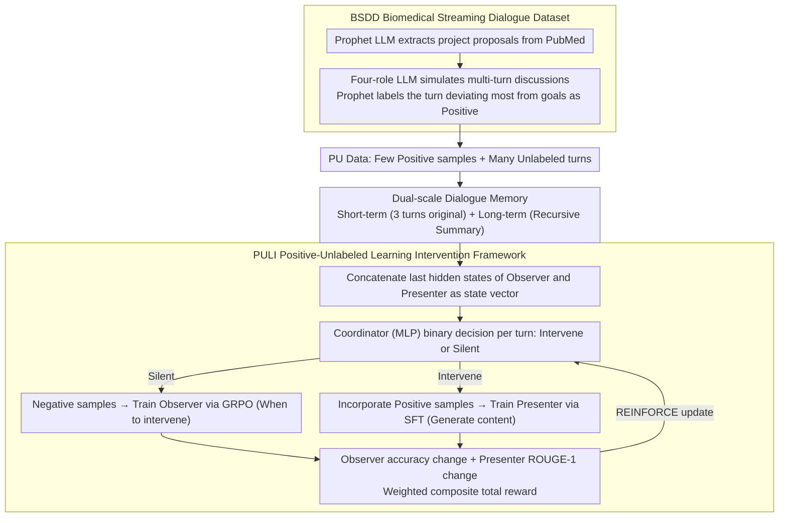

# "Excuse Me, May I Say Something…" CoLabScience: A Proactive AI Assistant for Biomedical Discovery

**Conference**: ACL 2026  
**arXiv**: [2604.15588](https://arxiv.org/abs/2604.15588)  
**Code**: [https://github.com/YANGWU001/CoLabScience](https://github.com/YANGWU001/CoLabScience)  
**Area**: Medical NLP  
**Keywords**: Proactive intervention, Scientific collaboration, Positive-Unlabeled learning, Reinforcement learning, Biomedical dialogue

## TL;DR
CoLabScience proposes the PULI (Positive-Unlabeled Learning for Intervention) framework to train an LLM assistant capable of **proactively deciding when and how to intervene** in biomedical team discussions. It utilizes GRPO and a reinforcement learning coordinator to automatically identify optimal intervention timings from streaming dialogues and generate scientific recommendations.

## Background & Motivation

**Background**: LLMs have been widely applied in biomedical research tasks such as drug repurposing, disease diagnosis, and clinical Q&A. However, existing models primarily operate in a "reactive" mode—responding only after an explicit user query.

**Limitations of Prior Work**: In multi-party scientific collaboration scenarios, team discussions are often streaming and multi-role. Reactive LLMs fail to intervene timely when discussions deviate from goals or miss critical knowledge, leading to missed opportunities for important scientific insights.

**Key Challenge**: Scientific collaboration requires "proactive participation," but existing methods either rely on hand-crafted prompt rules or lack learnable mechanisms for judging intervention timing, making them unable to achieve adaptive, context-aware intervention.

**Goal**: Design a proactive LLM assistant capable of: (1) determining **when to intervene** in streaming scientific discussions; (2) generating **high-quality intervention content**.

**Key Insight**: Model the problem as a "Positive-Unlabeled" (PU) learning task. In a dialogue, only a few optimal intervention points are labeled as positive samples, while the rest are unlabeled. An RL coordinator is used to discover latent positive and negative samples from this data.

**Core Idea**: Utilize a lightweight Observer to judge intervention timing and a large Presenter LLM to generate intervention content, with an RL coordinator performing end-to-end joint optimization of both.

## Method

### Overall Architecture

To enable an LLM to learn "whether to speak up and what to say" in multi-party scientific discussions, CoLabScience decomposes the task into three collaborative components. For streaming dialogue input, the **Coordinator** (a lightweight MLP) first reads the current state and makes a binary decision—intervene or stay silent. If intervention is decided, the **Observer** (a small LLM trained with GRPO) identifies if "now is the right time," while the **Presenter** (a large LLM trained with SFT) generates the scientific suggestion. The context accessible to all three includes the project proposal $C$ (research goals, background knowledge, datasets) and a dual-scale memory: short-term memory $\mathcal{M}^S$ retaining the last 3 turns of original text, and long-term memory $\mathcal{M}^L$ which recursively compresses earlier history into summaries. The entire system is optimized end-to-end via an RL coordination mechanism, where the goals of "when to intervene" and "how to intervene" are jointly trained.

### Key Designs

**1. PULI Framework: Converting intervention detection into PU learning rather than expensive full-turn labeling.**

In real collaboration, no one can label every turn for whether an AI should intervene. Forcing an LLM to make fine-grained judgments for every turn introduces hallucination noise. PULI labels only the single turn that deviates most from research goals as a positive sample, treating all others as unlabeled. It then uses RL to uncover latent positive and negative samples. Specifically, the Coordinator predicts "Intervene/Silent" for each unlabeled turn: turns predicted as silent are used as negative examples to train the Observer, while turns predicted as intervention are added to the positive set to train the Presenter. Performance changes—the Observer's accuracy change $r^{\text{when}}$ and the Presenter's ROUGE-1 change $r^{\text{how}}$—are fed back as rewards to update the Coordinator via REINFORCE. This requires only a small amount of high-confidence positive samples to drive the cycle, saving labeling costs while suppressing hallucination risks.

**2. Dual-scale Dialogue Memory: Balancing immediate context shifts with long-term research trajectories.**

Intervention timing depends on immediate context but must not lose sight of early research goals. However, feeding the entire history leads to memory bloat. Thus, memory is split into two scales: short-term memory $\mathcal{M}^S$ keeps original text from the current and previous two turns to capture immediate shifts; long-term memory $\mathcal{M}^L$ uses an LLM summarizer $\Gamma(\cdot)$ to recursively compress all historical dialogue. The state vector $S_n$ for the Coordinator's decision is concatenated from the final hidden layers of the Observer and Presenter, allowing the coordinator to read both "timing" and "content" signals simultaneously.

**3. BSDD Dataset: Creating training and evaluation data for proactive scientific intervention.**

Existing biomedical dialogue datasets (e.g., MedDialog) focus on doctor-patient Q&A and lack multi-role scientific team discussions and intervention timing labels. BSDD fills this gap using an LLM pipeline: the Prophet LLM extracts project proposals from PubMed papers, a Dialogue-Simulator LLM simulates discussions between four roles (Pharmacologist, Medicinal Chemist, Bioinformatician, Clinician), and the Prophet LLM labels the turn deviating most from the goal as the positive intervention point. This produces dialogues with realistic scientific collaboration patterns and the sparse positive labels required by PULI.

### Loss & Training

The total reward for the coordinator combines the two objectives:

$$r_{\text{total}} = \lambda \cdot r^{\text{when}} + (1-\lambda) \cdot r^{\text{how}}$$

Setting $\lambda = 0.6$ balances intervention timing and content quality (too small causes Observer accuracy to plummet; too large degrades Presenter quality). The components use different training methods: the Coordinator uses REINFORCE policy gradient, the Observer uses GRPO, and the Presenter uses SFT with LoRA (rank=16, $\alpha=64$).

## Key Experimental Results

### Main Results

| Model Configuration | Metric | PULI | ICL | Proactive Agent |
|--------|------|------|----------|------|
| Qwen3-0.6B + Qwen3-14B | Accuracy | **64.1%** | 55.7% | 53.9% |
| Qwen3-0.6B + Qwen3-14B | F1 | **46.4%** | 28.9% | 24.5% |
| Qwen3-0.6B + Qwen3-14B | ROUGE-1 | **32.4%** | 29.4% | 27.6% |
| LLaMA3.2-1B + LLaMA3.1-8B | Accuracy | **67.4%** | 58.4% | 54.5% |
| LLaMA3.2-1B + LLaMA3.1-8B | F1 | **65.4%** | 56.7% | 60.2% |
| LLaMA3.2-1B + LLaMA3.1-8B | WR-Intra | **39.2%** | 20.8% | 7.5% |

### Ablation Study

| Configuration | Accuracy | F1 | WR-Intra | Description |
|------|---------|------|------|------|
| PULI | **67.4%** | **65.4%** | **57.5%** | Full Model |
| w DPO | 64.6% | 63.1% | 31.7% | GRPO replaced by DPO |
| w SFT | 61.9% | 58.6% | 6.7% | Pure SFT Observer |
| w PN | 57.3% | 54.5% | 4.1% | All unlabeled as negative |

### Key Findings
- In cross-model comparisons, LLaMA3 with PULI reached a WR of 45.8%, significantly outperforming the GPT pair using ICL (18.3%), indicating that small open-source models with PULI can surpass GPT-4o.
- $\lambda=0.6$ is the optimal balance point; lower values lead to a crash in Observer accuracy, while higher values damage Presenter quality.
- Human evaluations show PULI outperforms the GPT pair baseline across Timing (4.65 vs 4.36), Quality (4.35 vs 4.18), and Helpfulness (4.60 vs 4.43).

## Highlights & Insights
- **PU Learning for Intervention Detection** is an ingenious modeling choice: sparse labeling avoids hallucination noise from fine-grained turn judgment, while the RL coordinator automatically discovers latent patterns in unlabeled data.
- **Observer-Presenter Decoupling** achieves a balance between efficiency and quality: the lightweight Observer monitors in real-time, calling the expensive Presenter only when needed, suitable for real-time collaboration.
- This "when to act + how to act" dual-objective RL framework can be transferred to other timing-sensitive tasks, such as automated hinting in tutoring or meeting assistants reminding participants of key points.

## Limitations & Future Work
- Data is based on LLM-simulated dialogues; complexities in real scientific meetings like overlapping speech, informal reasoning, and dynamic goal evolution are not fully captured.
- Each dialogue only labels one positive intervention point, potentially missing multiple valuable intervention opportunities.
- Actual deployment requires ASR/TTS integration; the prototype introduces approximately 0.8s of latency per turn.
- Currently focuses on "goal deviation" interventions, not covering diverse types like clarifying misunderstandings or facilitating collaboration.

## Related Work & Insights
- **vs Proactive Agent (Lu et al., 2024b)**: The latter uses manual system prompts to control proactive behavior; PULI learns adaptive strategies via RL, achieving 12.9% higher accuracy.
- **vs VideoLLM-Online**: The latter learns narration timing in multimodal streams; PULI targets intervention timing in text-based scientific dialogues, focusing more on scientific collaboration.

## Rating
- Novelty: ⭐⭐⭐⭐ PU learning + RL coordinator for proactive intervention is a novel combination, though dataset construction follows established patterns.
- Experimental Thoroughness: ⭐⭐⭐⭐ Comprehensive coverage of model families, baselines, human evaluation, and ablation studies.
- Writing Quality: ⭐⭐⭐⭐ Clear problem definition and intuitive diagrams, though the notation system is somewhat heavy.

<!-- RELATED:START -->

## Related Papers

- [\[ACL 2026\] Responsible Evaluation of AI for Mental Health](responsible_evaluation_of_ai_for_mental_health.md)
- [\[ACL 2026\] Dr. Assistant: Enhancing Clinical Diagnostic Inquiry via Structured Diagnostic Reasoning Data and Reinforcement Learning](dr_assistant_enhancing_clinical_diagnostic_inquiry_via_structured_diagnostic_rea.md)
- [\[ACL 2026\] BioHiCL: Hierarchical Multi-Label Contrastive Learning for Biomedical Retrieval with MeSH Labels](biohicl_hierarchical_multi-label_contrastive_learning_for_biomedical_retrieval_w.md)
- [\[ACL 2026\] Ryze: Evidence-Enriched Data Synthesis from Biomedical Papers](ryze_evidence-enriched_data_synthesis_from_biomedical_papers.md)
- [\[ACL 2025\] One Size Fits None: Rethinking Fairness in Medical AI](../../ACL2025/medical_nlp/one_size_fits_none_rethinking_fairness_in_medical_ai.md)

<!-- RELATED:END -->
