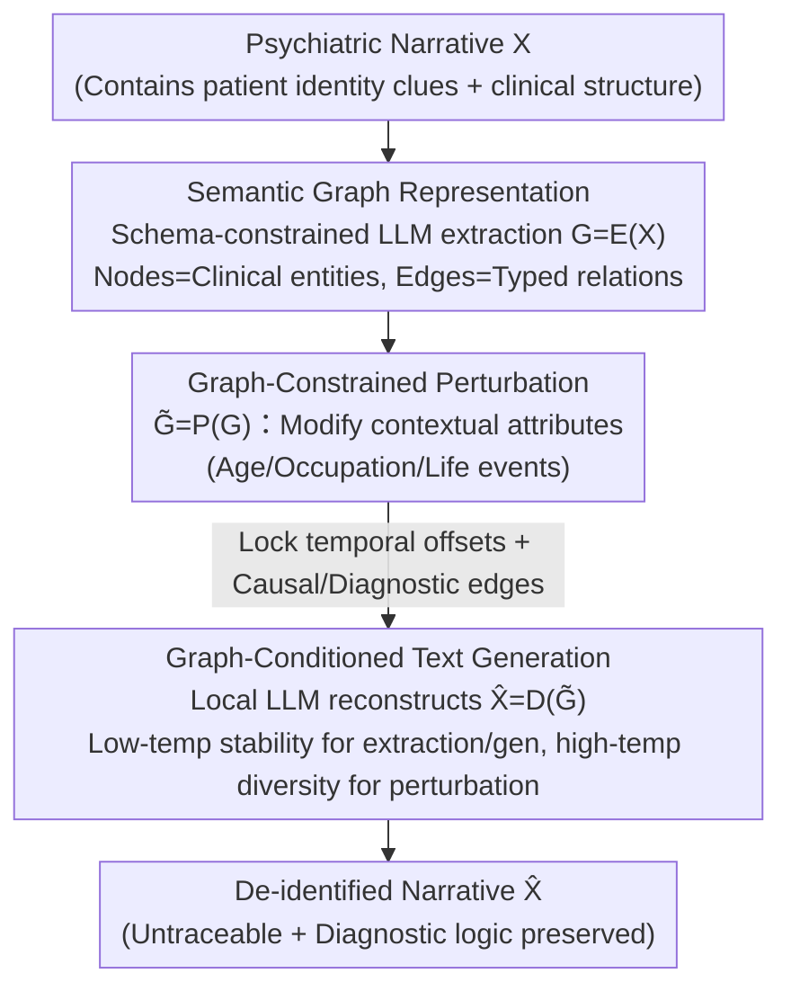

# Anonpsy: A Graph-Based Framework for Structure-Preserving De-identification of Psychiatric Narratives

**Conference**: ACL 2026 Findings  
**arXiv**: [2601.13503](https://arxiv.org/abs/2601.13503)  
**Code**: None  
**Area**: Medical NLP  
**Keywords**: De-identification, Psychiatric Narratives, Semantic Graph, Structure Preservation, LLM Generation  

## TL;DR

Ours proposes the Anonpsy framework, which reformulates the de-identification of psychiatric narratives as a graph-guided semantic rewriting problem—first converting narratives into semantic graphs, performing constrained perturbations on the graph to modify identity information while maintaining clinical structures, and finally reconstructing the narrative through graph-conditioned generation.

## Background & Motivation

**Background**: Psychiatric narratives contain rich clinical information (symptom timelines, causal relationships, diagnostic logic), which is crucial for downstream tasks like diagnostic prediction, but they also embed substantial patient identity information.

**Limitations of Prior Work**: (1) Token-level PHI masking preserves clinical structure but results in excessively high semantic similarity, leading to a high residual re-identification risk; (2) LLM-based Synthetic Data Creation (SDC) reduces identifiability but uncontrollably distorts clinical structure—such as changing persecutory delusions to grandiose delusions; (3) Both methods treat text as unstructured sequences, ignoring relationships and temporal dependencies in psychiatric narratives.

**Key Challenge**: In psychiatric narratives, identifiability stems from the narrative structure itself (specific life events, timelines) rather than just explicit identifiers. There is a need to simultaneously modify identity information and preserve clinical structure—a fundamental contradiction for text-level methods.

**Goal**: Reformulate de-identification as a structure-preserving generation problem, achieving fine-grained control over intermediate graph representations.

**Key Insight**: Convert narratives into semantic graphs containing clinical entities, temporal anchors, and typed relationships, and perform constrained perturbations on the graph.

**Core Idea**: By decoupling event structure from surface text, it is possible to precisely control what to preserve and what to modify at the graph level, then regenerate a coherent narrative from the modified graph.

## Method

### Overall Architecture

The core difficulty Anonpsy addresses is that the identifiability of psychiatric narratives is hidden not only in explicit identifiers but also in the narrative structure itself—specific life events and the sequence of symptoms unfolding over time can be used to trace back to a patient. Masking or rewriting directly on text sequences either fails to clean thoroughly (residual traceability) or over-edits (damaging clinical logic). Its breakthrough approach moves de-identification to an intermediate graph representation: first encoding the narrative into a semantic graph $G = \mathcal{E}(X)$, decoupling "event structure" from "surface text"; then performing constrained perturbation on the graph $\tilde{G} = \mathcal{P}(G)$, modifying only identity-revealing contextual attributes while preserving diagnostic structures; finally, regenerating a coherent narrative $\hat{X} = \mathcal{D}(\tilde{G})$ conditioned on the modified graph. All three operators are implemented using locally deployed LLMs without training.

### Key Designs

**1. Semantic Graph Representation: Decoupling structure and content by decomposing narratives into "editable structures"**

The reason text-level methods struggle is that they treat narratives as unstructured token sequences, unable to distinguish between identity clues and clinical skeletons. Anonpsy first uses a schema-constrained LLM to extract the narrative into a semantic graph: nodes $V$ represent clinical entities (symptoms, treatments, diagnoses), and edges $E$ represent typed relationships (diagnostic dependence, causal relations, temporal sequences). The value of this step lies in explicitly laying out "what to keep and what to change" on the graph—demographic attributes and specific life events fall into editable node attributes, while symptom-to-diagnosis relationships reside in immutable edges. Clinical staff can even directly inspect this graph and manually intervene in the rewriting scope.

**2. Graph-Constrained Perturbation: Modifying only identity-exposing contexts while locking diagnostic-supporting structures**

Psychiatric diagnosis relies heavily on the temporal progression and causal chains of symptoms. Once these are perturbed, the narrative might drift from "persecutory delusion" to something clinically entirely different like "grandiose delusion"—a common failure of direct LLM synthesis (SDC). The perturbation operator selectively modifies only contextual attributes (age, occupation, specific life events) while leaving temporal offset relationships and causal/diagnostic edges untouched. In other words, "who it happened to and what happened" is rewritten, while "the order symptoms appeared and what caused what" is strictly preserved, eliminating traceability without destroying clinical logic.

**3. Graph-Conditioned Text Generation: Reconstructing coherent narratives from modified graphs using temperature allocation to balance stability and diversity**

Having a modified graph is insufficient; it must be converted back into a natural narrative understandable by doctors. The generation operator uses $\tilde{G}$ as a condition for a local LLM (gpt-oss:120b) to rewrite the new narrative. Stability and diversity are balanced through temperature allocation: lower temperatures are used for schema extraction and narrative generation to ensure stability (avoiding errors in graph structure and formatting), while higher temperatures are used for the perturbation phase to gain diversity (preventing repetitive rewriting that might leave new pattern clues). The entire pipeline runs locally because real clinical privacy environments typically prohibit sending patient data to cloud APIs.

### Loss & Training

No training is required. The three operators (transformation, perturbation, generation) are implemented via prompt engineering and deterministic control flows. All LLM processing runs locally on 4 RTX A6000 GPUs.

## Key Experimental Results

### Main Results

| Method | Diagnostic Fidelity (F1) | Identifiability (cosine sim) | Description |
|------|--------------|---------------------|------|
| PHI Masking | High | High (Risky) | Structurally complete but traceable |
| LLM-SDC | Low (Semantic drift) | Low | Safe but clinically distorted |
| Anonpsy | High | Low | Balanced both |

### Ablation Study

| Configuration | Key Metric | Description |
|------|---------|------|
| No Graph Perturbation | High Identifiability | Unchanged structure is highly traceable |
| No Structural Constraints | Lower Diagnostic F1 | Free rewriting damages clinical meaning |
| Expert Evaluation | Low Re-identification Risk | Psychiatrists cannot trace original cases |
| GPT-5 Evaluation | Low Semantic Similarity | Automated evaluation aligns with humans |

### Key Findings
- Anonpsy achieves the best position in the trade-off between privacy protection and clinical fidelity.
- The intermediate graph representation makes "what to modify" transparent and controllable.
- Expert evaluation confirms that de-identified narratives maintain the original diagnostic logic.

## Highlights & Insights
- A paradigm shift from "text processing" to "structure-aware generation" for de-identification.
- Semantic graph representation allows clinical personnel to inspect and intervene in the modification process.
- Full local deployment ensures usability in real-world clinical environments.

## Limitations & Future Work
- Tested on only 90 psychiatric cases; the scale is small.
- Extraction quality of the semantic graph depends on LLM capabilities.
- Currently targets only psychiatric narratives; applicability to other clinical specialties is unverified.
- Future work could extend to multilingual and larger-scale clinical data.

## Related Work & Insights
- **vs PHI Masking**: Operates at the semantic level rather than the token level, eliminating identifiable information more thoroughly.
- **vs LLM-SDC**: Controls the rewriting scope through graph constraints, avoiding uncontrolled semantic drift.
- **vs Knowledge Graph methods**: Used for controlling generation rather than retrieval or reasoning, representing a new use for KGs.

## Rating
- Novelty: ⭐⭐⭐⭐⭐ Graph-guided de-identification is a brand-new paradigm.
- Experimental Thoroughness: ⭐⭐⭐ The data scale is small, but evaluation dimensions are comprehensive.
- Writing Quality: ⭐⭐⭐⭐ The problem definition is clear, and the method formalization is rigorous.
- Value: ⭐⭐⭐⭐⭐ Significant practical importance for clinical NLP privacy protection.

## Related Papers

- [\[ACL 2025\] RedactX: An LLM-Powered Framework for Automatic Clinical Data De-Identification](../../ACL2025/medical_nlp/redactor_an_llm-powered_framework_for_automatic_clinical_data_de-identification.md)
- [\[ACL 2026\] Reliable Automated Triage in Spanish Clinical Notes: A Hybrid Framework for Risk-Aware HIV Suspicion Identification](reliable_automated_triage_in_spanish_clinical_notes_a_hybrid_framework_for_risk-.md)
- [\[ACL 2026\] Region-Grounded Report Generation for 3D Medical Imaging: A Fine-Grained Dataset and Graph-Enhanced Framework](region-grounded_report_generation_for_3d_medical_imaging_a_fine-grained_dataset_.md)
- [\[ACL 2026\] MultiDx: A Multi-Source Knowledge Integration Framework towards Diagnostic Reasoning](multidx_a_multi-source_knowledge_integration_framework_towards_diagnostic_reason.md)
- [\[ACL 2026\] HeteroRAG: A Heterogeneous Retrieval-Augmented Generation Framework for Medical Vision Language Tasks](heterorag_a_heterogeneous_retrieval-augmented_generation_framework_for_medical_v.md)

<!-- RELATED:END -->

<!-- RELATED:START -->

## Related Papers

- [\[ACL 2026\] Reliable Automated Triage in Spanish Clinical Notes: A Hybrid Framework for Risk-Aware HIV Suspicion Identification](reliable_automated_triage_in_spanish_clinical_notes_a_hybrid_framework_for_risk-.md)
- [\[ACL 2026\] Region-Grounded Report Generation for 3D Medical Imaging: A Fine-Grained Dataset and Graph-Enhanced Framework](region-grounded_report_generation_for_3d_medical_imaging_a_fine-grained_dataset_.md)
- [\[ACL 2026\] Text-Attributed Knowledge Graph Enrichment with Large Language Models for Medical Concept Representation](text-attributed_knowledge_graph_enrichment_with_large_language_models_for_medica.md)
- [\[ACL 2026\] SEMA-RAG: A Self-Evolving Multi-Agent Retrieval-Augmented Generation Framework for Medical Reasoning](sema-rag_a_self-evolving_multi-agent_retrieval-augmented_generation_framework_fo.md)
- [\[ACL 2026\] IndicMedDialog: A Parallel Multi-Turn Medical Dialogue Dataset for Accessible Healthcare in Indic Languages](indicmeddialog_a_parallel_multi-turn_medical_dialogue_dataset_for_accessible_hea.md)

<!-- RELATED:END -->
