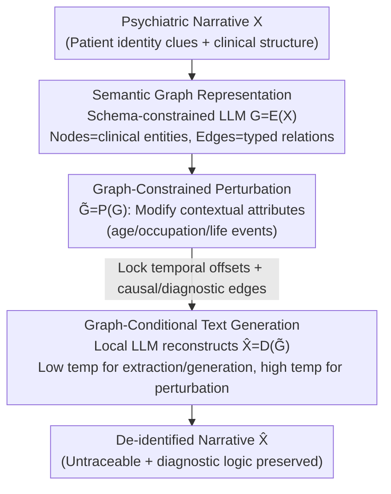

# Anonpsy: A Graph-Based Framework for Structure-Preserving De-identification of Psychiatric Narratives

**Conference**: ACL 2026 Findings  
**arXiv**: [2601.13503](https://arxiv.org/abs/2601.13503)  
**Code**: None  
**Area**: Medical NLP  
**Keywords**: De-identification, psychiatric narratives, semantic graphs, structure preservation, LLM generation

## TL;DR

Anonpsy is proposed to redefine the de-identification of psychiatric narratives as a graph-guided semantic rewriting problem—narratives are first converted into semantic graphs, then constrained perturbations are performed on the graph to modify identity information while preserving clinical structure, followed by narrative reconstruction through graph-conditional generation.

## Background & Motivation

**Background**: Psychiatric narratives contain rich clinical information (symptom timelines, causality, diagnostic logic) crucial for downstream tasks like diagnostic prediction, but they also embed significant patient identity information.

**Limitations of Prior Work**: (1) Token-level PHI masking preserves clinical structure but results in excessively high semantic similarity, leaving high residual re-identification risks; (2) LLM-based synthetic data creation (SDC) reduces identifiability but uncontrollably distorts clinical structure—for example, changing persecutory delusions to grandiose delusions; (3) Both methods treat text as an unstructured sequence, ignoring relational and temporal dependencies in psychiatric narratives.

**Key Challenge**: In psychiatric narratives, identifiability stems from the narrative structure itself (specific life events, timelines) rather than just explicit identifiers. There is a need to simultaneously modify identity information and preserve clinical structure—a fundamental contradiction for text-level methods.

**Goal**: To redefine de-identification as a structure-preserving generation problem, achieving fine-grained control over intermediate graph representations.

**Key Insight**: Convert narratives into semantic graphs containing clinical entities, temporal anchors, and typed relations, then perform constrained perturbations on the graph.

**Core Idea**: By decoupling event structure and surface text, one can precisely control what to preserve and what to modify at the graph level, subsequently regenerating a coherent narrative from the modified graph.

## Method

### Overall Architecture

The core challenge Anonpsy addresses is that identifiability in psychiatric narratives resides not only in explicit identifiers but also in the narrative structure—specific life events and the sequence of symptoms can trace back to a specific patient. Masking or rewriting directly on text sequences either fails to clean thoroughly (residual traceability) or over-edits (damaging clinical logic). The solution is to transition de-identification to an intermediate graph representation: first encode the narrative into a semantic graph $G = \mathcal{E}(X)$, decoupling "event structure" from "surface text"; then perform constrained perturbations $\tilde{G} = \mathcal{P}(G)$ on the graph, modifying only identity-exposing contextual attributes while preserving diagnostic structures; finally, regenerate a coherent narrative $\hat{X} = \mathcal{D}(\tilde{G})$ conditioned on the modified graph. All three operators are implemented using locally deployed LLMs without training.

### Key Designs

**1. Semantic Graph Representation: Decoupling structure and content into "editable structures"**

Text-level methods struggle because they treat narratives as unstructured token sequences, unable to distinguish identity clues from clinical skeletons. Anonpsy uses a schema-constrained LLM to extract narratives into semantic graphs: nodes $V$ are clinical entities (symptoms, treatments, diagnoses), and edges $E$ are typed relations (diagnostic dependency, causality, temporal sequences). The value lies in explicitly mapping what to preserve and what to modify—demographic attributes and specific life events fall into modifiable node attributes, while symptom-to-diagnosis relations fall into immutable edges. Clinical personnel can even directly inspect this graph and manually intervene in the rewriting scope.

**2. Graph-Constrained Perturbation: Modifying identity-exposing context while locking diagnostic structures**

Psychiatric diagnosis relies heavily on the temporal development and causal chains of symptoms. If these are perturbed, the narrative might drift (e.g., from "persecutory delusion" to "grandiose delusion"), which is a common failure in direct LLM SDC. The perturbation operator selectively modifies contextual attributes (age, occupation, specific life events) while keeping temporal offset relations and causal/diagnostic edges intact. Consequently, "who it happened to and what it was" is rewritten, while "the order of symptoms and their causality" is strictly preserved, eliminating traceability without breaking clinical logic.

**3. Graph-Conditional Text Generation: Reconstructing coherent narratives and balancing stability with diversity via temperature**

The modified graph must be converted back into a natural narrative understandable by clinicians. The generation operator, conditioned on $\tilde{G}$, uses a local LLM (gpt-oss:120b) to rewrite the narrative. A temperature-based division of labor is used: low temperatures for schema extraction and narrative generation to ensure stability (preventing errors in graph structure or writing), while high temperatures for the perturbation stage to achieve diversity (avoiding repetitive patterns that could leave new traceable clues). The entire pipeline runs locally as real clinical environments typically prohibit sending patient data to cloud APIs.

### Loss & Training

No training is required; the three operators (transformation, perturbation, generation) are implemented via prompt engineering and deterministic control flows. All LLM processing was performed locally on 4 RTX A6000 GPUs.

## Key Experimental Results

### Main Results

| Method | Diagnostic Fidelity (F1) | Identifiability (cosine sim) | Description |
|------|--------------|---------------------|------|
| PHI Masking | High | High (Dangerous) | Structurally complete but traceable |
| LLM-SDC | Low (Semantic Drift) | Low | Safe but clinically distorted |
| **Ours** (Anonpsy) | High | Low | Balanced both |

### Ablation Study

| Configuration | Key Metrics | Description |
|------|---------|------|
| No graph perturbation | High identifiability | Highly traceable if structure remains unchanged |
| No structural constraints | Lower diagnostic F1 | Free rewriting damages clinical meaning |
| Expert Evaluation | Low re-identification risk | Psychiatrists cannot trace back original cases |
| GPT-5 Evaluation | Low semantic similarity | Automated evaluation aligns with human assessment |

### Key Findings
- Anonpsy achieves the best position in the privacy protection vs. clinical fidelity trade-off.
- The intermediate graph representation makes "what is modified" transparent and controllable.
- Expert evaluation confirms that de-identified narratives maintain the original diagnostic logic.

## Highlights & Insights
- A paradigm shift from "text processing" to "structure-aware generation" for de-identification.
- Semantic graph representation allows clinical personnel to inspect and intervene in the modification process.
- Full local deployment ensures usability in real-world clinical privacy environments.

## Limitations & Future Work
- Tested on only 90 psychiatric cases, which is a small scale.
- The quality of semantic graph extraction depends heavily on LLM capabilities.
- Currently specifically targets psychiatric narratives; applicability to other clinical specialties is unverified.
- Future work may expand to multi-language and larger-scale clinical data.

## Related Work & Insights
- **vs PHI masking**: Operates at the semantic level rather than the token level, eliminating identifiable information more thoroughly.
- **vs LLM-SDC**: Controls the rewriting scope through graph constraints, avoiding uncontrolled semantic drift.
- **vs Knowledge Graph methods**: Not used for retrieval or reasoning, but for controlling generation—a novel use of KGs.

## Rating
- Novelty: ⭐⭐⭐⭐⭐ Graph-guided de-identification is a brand-new paradigm.
- Experimental Thoroughness: ⭐⭐⭐ Data scale is small, but evaluation dimensions are comprehensive.
- Writing Quality: ⭐⭐⭐⭐ Problem definition is clear, and method formalization is rigorous.
- Value: ⭐⭐⭐⭐⭐ High practical significance for privacy protection in clinical NLP.

<!-- RELATED:START -->

## Related Papers

- [\[ACL 2025\] RedactX: An LLM-Powered Framework for Automatic Clinical Data De-Identification](../../ACL2025/medical_nlp/redactor_an_llm-powered_framework_for_automatic_clinical_data_de-identification.md)
- [\[ACL 2026\] Reliable Automated Triage in Spanish Clinical Notes: A Hybrid Framework for Risk-Aware HIV Suspicion Identification](reliable_automated_triage_in_spanish_clinical_notes_a_hybrid_framework_for_risk-.md)
- [\[ACL 2026\] Region-Grounded Report Generation for 3D Medical Imaging: A Fine-Grained Dataset and Graph-Enhanced Framework](region-grounded_report_generation_for_3d_medical_imaging_a_fine-grained_dataset_.md)
- [\[ACL 2026\] MultiDx: A Multi-Source Knowledge Integration Framework towards Diagnostic Reasoning](multidx_a_multi-source_knowledge_integration_framework_towards_diagnostic_reason.md)
- [\[ACL 2026\] HeteroRAG: A Heterogeneous Retrieval-Augmented Generation Framework for Medical Vision Language Tasks](heterorag_a_heterogeneous_retrieval-augmented_generation_framework_for_medical_v.md)

<!-- RELATED:END -->
