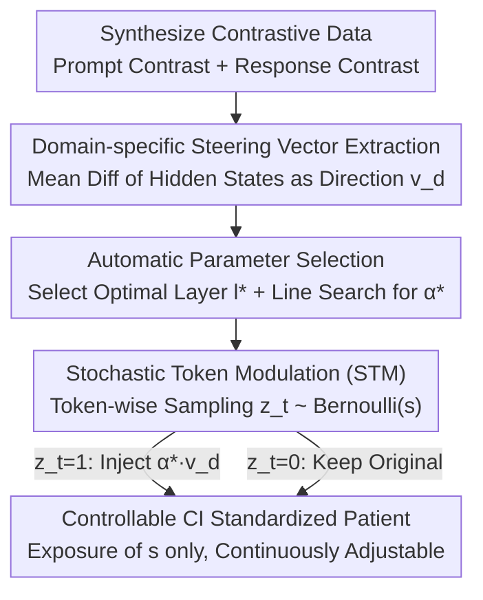

# Beyond Prompt: Fine-grained Simulation of Cognitively Impaired Standardized Patients via Stochastic Steering

**Conference**: ACL 2026 Findings  
**arXiv**: [2604.12210](https://arxiv.org/abs/2604.12210)  
**Code**: None  
**Area**: Medical NLP  
**Keywords**: Standardized Patient Simulation, Cognitive Impairment, Steering Vector, Stochastic Modulation, Clinical Training

## TL;DR
This paper proposes StsPatient, which extracts domain-specific steering vectors from contrastive instruction/response pairs and employs a Stochastic Token Modulation (STM) mechanism to simulate standardized patients (SP) across various cognitive impairment domains and severity levels. Results show an average improvement of 11.23% in clinical authenticity and an 18.54% improvement in severity controllability over the best baselines compared to prompt engineering methods.

## Background & Motivation

**Background**: Patients with cognitive impairment (CI) (e.g., Alzheimer’s Disease, Mild Cognitive Impairment) exhibit deficits in multiple cognitive domains such as memory and attention, which significantly impact their linguistic patterns. Clinical staff require specialized training for communication with such patients, traditionally relying on human actors as Standardized Patients (SP).

**Limitations of Prior Work**: (1) High heterogeneity of cognitive impairment—the same diagnosis can manifest as deficits in different domains (attention/memory/executive function, etc.) with severity ranging from mild to severe, which is difficult and costly for human actors to cover; (2) Existing LLM-based SP methods primarily rely on prompt engineering, which is inherently discrete and coarse-grained, making it impossible to precisely control the degree of deficit in specific cognitive domains; (3) Traditional steering vector methods control intensity via a scaling coefficient $\alpha$, but the relationship between $\alpha$ and behavioral output is highly non-linear and unstable.

**Key Challenge**: Achieving fine-grained, stable, and controllable simulation in the combined space of multiple cognitive domains $\times$ multiple severity levels, whereas prompts are too coarse and traditional steering vectors are too unstable.

**Goal**: Design a framework that can (1) extract specific behavioral modulation signals for different cognitive domains and (2) stably control deficit manifestations on a continuous severity spectrum.

**Key Insight**: Inspiration is drawn from the probabilistic nature of synaptic transmission in biological neuroscience—synaptic strength is regulated not by signal amplitude, but by the probability of neurotransmitter release. Analogously, instead of changing the magnitude of the steering vector, the probability of its application at each token is varied.

**Core Idea**: Fix the intensity of the steering vector (at a level sufficient to trigger deficits) and use Bernoulli sampling to control whether the steering vector is injected at each token, where the probability $s$ maps directly to the severity level.

## Method

### Overall Architecture
StsPatient aims to enable an LLM to stably, continuously, and controllably portray a patient within combinations of multiple cognitive domains (attention/memory/executive function) $\times$ multiple severity levels, rather than relying on coarse-grained "acting" via prompts. The workflow consists of two phases: an **offline** phase to extract domain-specific steering vectors for each cognitive domain—using LLM-synthesized "impaired vs. healthy" contrastive data to calculate the mean difference in hidden states and automatically determining the injection layer and intensity; and an **inference** phase using Stochastic Token Modulation (STM)—fixing the vector intensity and using Bernoulli sampling with probability $s$ to decide whether to inject the vector into the current token, where $s$ serves as the severity dial.

### Key Designs

**1. Domain-specific Steering Vector Extraction: Dual-channel contrast to extract linguistic directions of specific cognitive deficits.**

To precisely simulate "memory impairment" rather than a generic "patient persona," specific directions encoding memory deficits in the hidden state space must be identified. StsPatient constructs two complementary contrastive subsets: the **Prompt Contrast Subset** for control at the system instruction level ("portray a memory-impaired patient" vs. "portray a healthy person"), and the **Response Contrast Subset** for control at the behavioral level (impaired response vs. healthy response to the same clinical question). By feeding these pairs into the model, the steering vector is obtained as $\mathbf{v}_d = \text{mean}(\mathbf{h}^+ - \mathbf{h}^-)$. Dual-channel extraction is used because instructions capture "intent" signals while responses capture "behavioral representations"; combining both provides complete deficit features.

**2. Automatic Parameter Selection: Hiding internal dials, leaving only severity $s$ for the user.**

Traditional steering vector methods require manual adjustment of the scaling coefficient $\alpha$ and selection of injection layers, which is difficult to reproduce. StsPatient automates both: the optimal injection layer $l^*$ is selected by maximizing the centroid distance between positive and negative sample embeddings; the intensity $\alpha^*$ is determined via line search within $[1, 6]$ based on the criteria "observable deficits + non-collapsed text." Once determined, $\alpha^*$ remains fixed during inference.

**3. Stochastic Token Modulation (STM): Replacing "amplitude" with "probability" for continuous severity control.**

Traditional methods rely on $\alpha$ to control intensity, but the relationship is non-linear—small changes may have no effect, while large changes cause incoherent output. STM treats intensity as a fixed $\alpha^*$ and performs sampling for each generated token $z_t \sim \text{Bernoulli}(s)$, injecting $\alpha^* \cdot \mathbf{v}_d$ into the hidden state only when $z_t=1$.

$$z_t \sim \text{Bernoulli}(s), \qquad \mathbf{h}_t \leftarrow \mathbf{h}_t + z_t \cdot \alpha^* \cdot \mathbf{v}_d$$

The severity $s \in [0, 1]$ thus gains a straightforward statistical meaning: higher $s$ results in a higher proportion of modulated tokens and more severe deficits. This ensures smooth control while maintaining linguistic integrity even at $s=0.9$.

## Key Experimental Results

### Main Results (GPT-5 Therapist Scenario, LLM + Human Evaluation)

| Method | CDC↑(LLM) | CDC↑(Human) | IDI↓(LLM) | IDI↓(Human) | Auth↑ | Tra↑ |
|------|----------|-------------|----------|-------------|-------|------|
| Direct Prompt | 0.54 | 0.68 | 0.47 | 0.42 | 3.32 | 3.40 |
| PATIENT-ψ | 0.50 | 0.60 | 0.52 | 0.48 | 3.83 | 3.96 |
| Roleplay-doh | 0.58 | 0.68 | 0.44 | 0.38 | 3.78 | 3.72 |
| **Ours** | **Best** | **Best** | **Best** | **Best** | **Best** | **Best** |

### Ablation Study

| Configuration | Description |
|------|------|
| w/o STM (Scaling α only) | Unstable severity control; high $\alpha$ leads to output collapse. |
| Prompt Contrast Only | Lacks behavioral information; deficit manifestations are less natural. |
| Response Contrast Only | Lacks intent signals; reduced domain specificity. |
| **Full StsPatient** | Optimal across all metrics. |

### Key Findings
- **StsPatient improves average performance by 11.23%** across all metrics and exceeds the best baseline in severity controllability by 18.54%.
- **STM is critical**: Traditional scaling methods often produce incoherent output when $\alpha > 4$, whereas STM maintains linguistic integrity even at $s = 0.9$.
- **Domain-specific steering vectors encode distinct deficit features**: Vectors for attention and memory deficits show clearly different directions in the representation space.
- **The relationship between severity $s$ and clinical scores is monotonic**, satisfying the requirements for educational simulators.

## Highlights & Insights
- **Analogy from synaptic transmission probability to token modulation probability** is elegant, transferring control principles from neuroscience to LLM behavior. This "probabilistic gating" can be applied to any scenario requiring continuous behavioral modulation.
- **Domain specificity of steering vectors** proves that the latent space of LLMs encodes linguistic features of different cognitive domains, which is insightful for interpretability research.
- **Inference-time intervention without fine-tuning** allows the method to be plug-and-play across different LLMs.

## Limitations & Future Work
- The mapping between severity $s$ and standard clinical scores (e.g., MMSE) is not a direct linear relationship.
- Cognitive domains are currently manually defined; future work could explore automatic discovery of latent dimensions of cognitive impairment.
- Stability of steering vectors depends on the quality of synthetic contrastive data.
- Validation is limited to English; cross-linguistic features (e.g., Chinese CI patients) remain to be explored.
- No direct comparison/validation with real clinical data (e.g., actual AD patient recordings).

## Related Work & Insights
- **vs. Prompt-based SP**: Prompts offer discrete, coarse-grained control, while StsPatient operates in the continuous representation space for finer control.
- **vs. Traditional SV Methods (Rimsky et al.)**: Traditional methods using scaling $\alpha$ are unstable; STM solves this via probabilistic control.
- **vs. PATIENT-ψ**: Focuses on narrative control but lacks domain-specific deficit simulation; StsPatient allows precise control over which domain is impaired.

## Rating
- Novelty: ⭐⭐⭐⭐⭐ Stochastic Token Modulation (STM) is a novel bio-inspired design.
- Experimental Thoroughness: ⭐⭐⭐⭐ Includes LLM and human evaluation, though lacks comparison with real clinical datasets.
- Writing Quality: ⭐⭐⭐⭐⭐ Motivation and methodology are clearly articulated.
- Value: ⭐⭐⭐⭐ Highly relevant for clinical AI training; STM is transferable to other behavioral control tasks.

<!-- RELATED:START -->

## Related Papers

- [\[ACL 2025\] LLMs Can Simulate Standardized Patients via Agent Coevolution](../../ACL2025/medical_nlp/evopatient_standardized_patient.md)
- [\[ACL 2026\] ProMedical: Hierarchical Fine-Grained Criteria Modeling for Medical LLM Alignment via Explicit Injection](promedical_hierarchical_fine-grained_criteria_modeling_for_medical_llm_alignment.md)
- [\[ACL 2026\] CT-FineBench: A Diagnostic Fidelity Benchmark for Fine-Grained Evaluation of CT Report Generation](ct-finebench_a_diagnostic_fidelity_benchmark_for_fine-grained_evaluation_of_ct_r.md)
- [\[ACL 2026\] Region-Grounded Report Generation for 3D Medical Imaging: A Fine-Grained Dataset and Graph-Enhanced Framework](region-grounded_report_generation_for_3d_medical_imaging_a_fine-grained_dataset_.md)
- [\[ACL 2026\] Beyond the Individual: Virtualizing Multi-Disciplinary Reasoning for Clinical Intake via Collaborative Agents](beyond_the_individual_virtualizing_multi-disciplinary_reasoning_for_clinical_int.md)

<!-- RELATED:END -->
