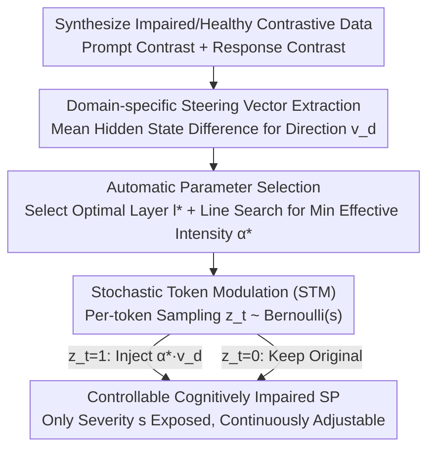

# Beyond Prompt: Fine-grained Simulation of Cognitively Impaired Standardized Patients via Stochastic Steering

**Conference**: ACL 2026 Findings  
**arXiv**: [2604.12210](https://arxiv.org/abs/2604.12210)  
**Code**: None  
**Area**: Medical NLP  
**Keywords**: Standardized Patient Simulation, Cognitive Impairment, Steering Vector, Stochastic Modulation, Clinical Training

## TL;DR
This paper proposes StsPatient, which simulates standardized patients across various cognitive impairment domains and severity levels by extracting domain-specific Steering Vectors from contrastive instruction/response pairs. Combined with a Stochastic Token Modulation (STM) mechanism to control injection probability, it achieves an average improvement of 11.23% in clinical authenticity compared to prompt engineering methods and exceeds the best baseline by 18.54% in severity controllability.

## Background & Motivation

**Background**: Patients with cognitive impairment (e.g., Alzheimer's disease, Mild Cognitive Impairment) exhibit varying degrees of deficits in multiple cognitive domains such as memory and attention, which significantly impact their language patterns. Clinical staff require specialized training for communicating with such patients, traditionally relying on human actors playing Standardized Patients (SP).

**Limitations of Prior Work**: (1) The heterogeneity of cognitive impairment is extremely high—the same diagnosis may manifest as deficits in different domains (attention, memory, executive function, etc.) with severity ranging from mild to severe, making it costly and difficult for human actors to cover this diversity; (2) Existing LLM-based SP methods primarily rely on prompt engineering, but prompts are inherently discrete and coarse-grained, failing to precisely control the degree of deficits in specific cognitive domains; (3) Traditional steering vector methods control intensity through a scaling coefficient $\alpha$, but the relationship between $\alpha$ and behavioral output is highly non-linear and unstable.

**Key Challenge**: The need to achieve fine-grained, stable, and controllable simulation within a combinatorial space of multiple cognitive domains $\times$ multiple severity levels, whereas prompts are too coarse and traditional steering vectors are too unstable.

**Goal**: Design a framework that can (1) extract specific behavioral modulation signals for different cognitive domains and (2) stably control deficit performance across a continuous severity spectrum.

**Key Insight**: Inspired by the probabilistic nature of synaptic transmission in biological neuroscience—synaptic strength is not regulated by signal amplitude, but by the probability of neurotransmitter release. Analogously, instead of changing the magnitude of the steering vector, the application probability of the vector at each token is modified.

**Core Idea**: Fix the intensity of the steering vector (at a level sufficient to trigger deficits) and use Bernoulli sampling to control whether to inject the steering vector into each token. The probability $s$ directly maps to the severity level.

## Method

### Overall Architecture
StsPatient enables an LLM to stably, continuously, and controllably simulate cognitive impairment across multiple domains (attention/memory/executive function) and severity levels, moving beyond coarse-grained "acting" via prompts. The pipeline consists of two stages: In the **offline** stage, domain-specific steering vectors are extracted for each cognitive domain—using LLM-synthesized "impaired vs. healthy" contrastive data, taking the mean difference of hidden states, and automatically determining the injection layer and intensity; in the **inference** stage, Stochastic Token Modulation (STM) is performed—fixing the vector intensity and using Bernoulli sampling with probability $s$ to decide whether to inject the vector into the current token, where $s$ serves as the severity dial.

### Key Designs

**1. Domain-specific Steering Vector Extraction: Using Dual-channel Contrast to Extract Linguistic Directions of Cognitive Deficits**

To precisely simulate "memory impairment" rather than a generic "patient tone," it is necessary to identify the specific direction in the hidden state space that encodes memory deficits. StsPatient constructs two complementary contrastive subsets: the **Prompt Contrast Subset** for system-level control ("play a memory-impaired patient" vs. "play a healthy person") and the **Response Contrast Subset** for behavior-level control (impaired response vs. healthy response under the same clinical question). By feeding these pairs into the model, the steering vector is calculated as the mean difference of hidden states: $\mathbf{v}_d = \text{mean}(\mathbf{h}^+ - \mathbf{h}^-)$. Applying both channels ensures the feature set is complete, as instructions capture "intent" and responses capture "behavioral representation."

**2. Automatic Parameter Selection: Hiding Internal Knobs to Only Expose Severity $s$**

Traditional steering vector methods require manual tuning of the scaling coefficient $\alpha$ and selection of injection layers, which is difficult to replicate. StsPatient automates these: the optimal injection layer $l^*$ is automatically selected by maximizing the distance between positive and negative sample embedding centroids; the intensity $\alpha^*$ is determined via line search within $[1,6]$ based on the criteria of "observable deficit + no text collapse." Once determined, $\alpha^*$ is fixed during inference, leaving severity $s$ as the only semantically clear control parameter for the user, allowing the method to be used plug-and-play across different LLMs.

**3. Stochastic Token Modulation (STM): Changing the Control Variable from "Amplitude" to "Probability"**

Traditional steering vectors rely on the scaling coefficient $\alpha$ for intensity control, but the relationship between $\alpha$ and actual behavior is highly non-linear and unstable. Small adjustments may have no effect, while large adjustments can cause the model to produce gibberish. STM is inspired by synaptic transmission, where strength is regulated by the **probability** of neurotransmitter release rather than signal amplitude. It fixes the intensity at the automatically selected $\alpha^*$ and, during each token generation step, samples $z_t \sim \text{Bernoulli}(s)$. Only when $z_t=1$ is the $\alpha^* \cdot \mathbf{v}_d$ injected into the hidden state.

$$z_t \sim \text{Bernoulli}(s), \qquad \mathbf{h}_t \leftarrow \mathbf{h}_t + z_t \cdot \alpha^* \cdot \mathbf{v}_d$$

This gives the severity $s \in [0,1]$ a direct statistical meaning: a larger $s$ leads to a higher proportion of modulated tokens and more severe deficits. This results in smooth and predictable control; experiments show that language remains coherent even at $s=0.9$, whereas traditional scaling frequently yields incoherent text when $\alpha>4$.

## Key Experimental Results

### Main Results (GPT-5 Therapist Scenario, LLM + Human Evaluation)

| Method | CDC↑(LLM) | CDC↑(Human) | IDI↓(LLM) | IDI↓(Human) | Auth↑ | Tra↑ |
|------|----------|-------------|----------|-------------|-------|------|
| Direct Prompt | 0.54 | 0.68 | 0.47 | 0.42 | 3.32 | 3.40 |
| PATIENT-ψ | 0.50 | 0.60 | 0.52 | 0.48 | 3.83 | 3.96 |
| Roleplay-doh | 0.58 | 0.68 | 0.44 | 0.38 | 3.78 | 3.72 |
| **StsPatient** | **Best** | **Best** | **Best** | **Best** | **Best** | **Best** |

### Ablation Study

| Configuration | Description |
|------|------|
| No STM (Scaling α only) | Unstable severity control; high $\alpha$ leads to output collapse |
| Prompt Contrast Only | Lacks behavioral information; deficit manifestation is less natural |
| Response Contrast Only | Lacks intent signals; reduced domain specificity |
| **Full StsPatient** | Optimal across all metrics |

### Key Findings
- **StsPatient improves by an average of 11.23% across all metrics**, exceeding the best baseline by 18.54% in severity controllability.
- **STM is critical**: Traditional scaling methods often produce incoherent outputs at α > 4, while STM maintains linguistic integrity even at $s=0.9$.
- **Steering vectors for different cognitive domains encode distinct deficit features**: Vectors for attention deficits and memory deficits show clearly different directions in the representation space.
- **Relationship between severity $s$ and clinical scores is monotonic**, meeting the requirements for educational simulators despite not being strictly linear.

## Highlights & Insights
- **The analogy from synaptic transmission probability to token modulation probability** is elegant, transferring biological control principles to LLM behavior. This "probability gating" approach is broadly applicable to any scenario requiring continuous controllable behavior modulation.
- **Domain specificity of steering vectors** demonstrates that LLM hidden state spaces indeed encode linguistic features of different cognitive domains, which is insightful for interpretability research.
- **Inference-time intervention without fine-tuning** allows the method to be used plug-and-play on various LLMs.

## Limitations & Future Work
- The mapping between severity $s$ and standard clinical scores (e.g., MMSE) is not a direct linear relationship.
- Cognitive domains are currently manually defined; can latent dimensions of cognitive impairment be discovered automatically?
- The stability of steering vectors depends on the quality of the synthesized contrastive data.
- Validation is limited to English; cross-linguistic features of cognitive impairment (e.g., in Chinese patients) remain to be explored.
- No direct comparative validation with real clinical data (e.g., actual Alzheimer's patient dialogue recordings).

## Related Work & Insights
- **vs. Prompt-based SP**: Prompts are discrete, coarse-grained controls; StsPatient operates in continuous representation space for finer control.
- **vs. Traditional SV Methods (Rimsky et al.)**: Traditional methods are unstable when scaling $\alpha$; STM solves this core issue through probabilistic control.
- **vs. PATIENT-ψ**: While the former focuses on narrative control without domain-specific deficit simulation, StsPatient allows precise control over "which domain is failing."

## Rating
- Novelty: ⭐⭐⭐⭐⭐ The bio-inspired design of the STM mechanism is highly novel, and the application of domain-specific steering vectors is a first.
- Experimental Thoroughness: ⭐⭐⭐⭐ Includes both LLM and human evaluations, though lacks comparison with real clinical data.
- Writing Quality: ⭐⭐⭐⭐⭐ Motivation and methodology are clearly articulated with intuitive illustrations.
- Value: ⭐⭐⭐⭐ Practical significance for clinical AI training; the STM method is transferable to other behavior control scenarios.

<!-- RELATED:START -->

## Related Papers

- [\[ACL 2025\] LLMs Can Simulate Standardized Patients via Agent Coevolution](../../ACL2025/medical_nlp/evopatient_standardized_patient.md)
- [\[ACL 2026\] ProMedical: Hierarchical Fine-Grained Criteria Modeling for Medical LLM Alignment via Explicit Injection](promedical_hierarchical_fine-grained_criteria_modeling_for_medical_llm_alignment.md)
- [\[ACL 2026\] CT-FineBench: A Diagnostic Fidelity Benchmark for Fine-Grained Evaluation of CT Report Generation](ct-finebench_a_diagnostic_fidelity_benchmark_for_fine-grained_evaluation_of_ct_r.md)
- [\[ACL 2026\] Region-Grounded Report Generation for 3D Medical Imaging: A Fine-Grained Dataset and Graph-Enhanced Framework](region-grounded_report_generation_for_3d_medical_imaging_a_fine-grained_dataset_.md)
- [\[ACL 2026\] Beyond the Individual: Virtualizing Multi-Disciplinary Reasoning for Clinical Intake via Collaborative Agents](beyond_the_individual_virtualizing_multi-disciplinary_reasoning_for_clinical_int.md)

<!-- RELATED:END -->
