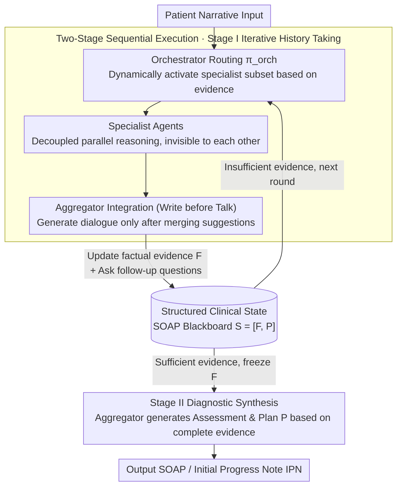

# Beyond the Individual: Virtualizing Multi-Disciplinary Reasoning for Clinical Intake via Collaborative Agents

**Conference**: ACL 2026 Findings  
**arXiv**: [2604.08927](https://arxiv.org/abs/2604.08927)  
**Code**: [GitHub](https://github.com/HovChen/Aegle)  
**Area**: Medical NLP  
**Keywords**: Multi-Disciplinary Consultation, Multi-Agent, Clinical Intake, SOAP Notes, Dynamic Topology

## TL;DR
The proposed Aegle framework virtualizes Multi-Disciplinary Teams (MDT) through a graph-structured multi-agent architecture. By introducing decoupled parallel reasoning and dynamic topology into the clinical intake process, it outperforms SOTA models on 53 metrics across 24 clinical departments.

## Background & Motivation

**Background**: Initial clinical intake is a critical stage in clinical decision-making, where physicians must transform unstructured patient narratives into structured SOAP-formatted Initial Progress Notes (IPN). Current LLM-assisted intake systems mainly fall into two categories: document generation (e.g., Med-PaLM 2) and interactive intake (e.g., AMIE), both utilizing single-model architectures.

**Limitations of Prior Work**: (1) Single doctors or models are prone to anchoring bias under time pressure, focusing excessively on prominent symptoms while ignoring subtle cues; (2) Existing interactive systems act mostly as "passive receivers," lacking proactive exclusionary questioning capabilities; (3) While Multi-Disciplinary Team (MDT) consultations mitigate cognitive bias, they are costly and difficult to scale to daily outpatient clinics.

**Key Challenge**: The contradiction between the systemic depth of MDT-level reasoning and the resource constraints of real-time clinical scenarios. Additionally, multi-agent systems face the "flawed consensus" problem, where agents might reinforce biases or suppress correct minority opinions.

**Goal**: Virtualize the cognitive advantages of MDT to achieve low-cost collaborative reasoning in real-time clinical intake.

**Key Insight**: Utilize a graph-structured multi-agent architecture to simulate MDT collaboration—keeping hypothesis diversity through decoupled parallel reasoning, activating specialist agents on demand via dynamic topology, and ensuring reasoning traceability through structured SOAP states.

**Core Idea**: Virtualize the MDT consultation process via a three-layer architecture: an Orchestrator dynamically activates specialist agents, agents perform decoupled parallel reasoning, and an Aggregator integrates outputs to update structured clinical states.

## Method

### Overall Architecture
Aegle is built on DeepSeek-V3.2 and employs a two-stage finite state machine for intake: Stage I is iterative history taking (evidence collection), and Stage II is diagnostic synthesis (generating diagnosis after freezing the evidence set). Throughout the process, an incrementally updated structured clinical state $\mathcal{S}_t = [\mathcal{F}_t, \mathcal{P}_t]$ is maintained, where $\mathcal{F}$ corresponds to the S+O (factual evidence) of SOAP, and $\mathcal{P}$ corresponds to A+P (assessment and plan). In Stage I, Orchestrator, Specialist Agents, and Aggregator nodes collaborate in a loop, all reading from and writing to the same SOAP blackboard; only after evidence is sufficient does the system switch to Stage II for the final diagnosis.

### Key Designs

**1. Structured Clinical State: Using a SOAP blackboard to strictly separate "evidence collection" from "diagnosis"**

LLM intake often suffers from "premature commitment," where models rush to a diagnosis before collecting sufficient evidence. Aegle formalizes the SOAP medical record into a shared blackboard $\mathcal{S}_t = [\mathcal{F}_t, \mathcal{P}_t]$: $\mathcal{F}$ (Case Features) corresponds to SOAP’s S+O, continuously accumulating verifiable facts like basic info, history of present illness, and physical exam results; $\mathcal{P}$ (Diagnosis & Plan) corresponds to A+P and is only generated after $\mathcal{F}$ stabilizes. The framework enforces a unidirectional dependency $\mathcal{F} \to \mathcal{P}$, ensuring any diagnosis can be traced back to specific evidence, preventing premature commitment and ensuring reasoning traceability.

**2. Dynamic Multi-Agent Graph Topology: Summoning specialists as needed rather than overwhelming the system**

Including all departments in the context is expensive and causes interference; real MDTs are convened based on relevance. Aegle uses three roles to replicate this: the Orchestrator acts as a routing policy $\pi_{orch}$ to dynamically select a specialist subset $A_{sub}$ based on dialogue history and evidence; selected Specialist Agents analyze the case independently and in parallel, invisible to each other’s intermediate reasoning (decoupled reasoning); the Aggregator then follows a "write-before-talk" protocol to integrate advice into state $\mathcal{S}_{t+1}$ before generating patient-facing dialogue. Decoupled parallelism is key—it maintains hypothesis diversity and avoids "group think" or "flawed consensus" where minority viewpoints are suppressed.

**3. Two-Stage Sequential Execution: Explicit bias control as a system gate**

Anchoring bias often stems from locking in a diagnostic direction prematurely. Aegle enforces a two-stage finite state machine: Stage I is iterative history taking, where the Orchestrator repeatedly activates specialist agents for follow-up questions and the Aggregator generates intake dialogue. This cycle continues until evidence is sufficient. Stage II then freezes $\mathcal{F}$ and generates $\mathcal{P}$ (diagnosis + plan) based on the complete evidence set. This physical isolation turns the MDT discipline of "discussing the condition before concluding" into a system-level constraint.

### Loss & Training
Aegle is an inference framework (not a training method) utilizing the zero-shot capabilities of DeepSeek-V3.2 through structured prompting and role assignment. No additional training is required.

## Key Experimental Results

### Main Results

| Dataset | Metric | Aegle | DeepSeek-V3.2 | GPT-4o | Gain |
|--------|------|-------|---------------|--------|------|
| ClinicalBench | IDEA | 63.80 | 50.51 | 41.05 | +13.3 |
| ClinicalBench | SOAP | 53.42 | 38.64 | 29.38 | +14.8 |
| ClinicalBench | READ | 76.20 | 71.73 | 67.66 | +4.5 |
| RAPID-IPN | IDEA | 67.31 | 54.35 | 44.70 | +13.0 |
| RAPID-IPN | SOAP | 60.09 | 47.39 | 34.79 | +12.7 |
| RAPID-IPN | READ | 80.18 | 72.14 | 69.89 | +8.0 |

The evaluation covers 24 clinical departments with 53 fine-grained metrics.

### Ablation Study

| Configuration | IDEA | SOAP | Description |
|------|------|------|------|
| Aegle (Full) | 63.80 | 53.42 | Complete framework |
| Single Agent (DeepSeek-V3.2) | 50.51 | 38.64 | No MDT collaboration |
| MiniMax-M2 | 57.78 | 46.18 | Strongest single-model baseline |

### Key Findings
- Aegle consistently outperforms all baselines, including closed-source models like GPT-4o and Gemini 2.5, across all 53 metrics.
- Even with the same base model (DeepSeek-V3.2), the multi-agent framework provides a +13.3 IDEA score gain, proving the value of the collaborative architecture.
- Performance gains on the real-world clinical dataset RAPID-IPN are even more significant, indicating good generalization in real scenarios.

## Highlights & Insights
- **Decoupled Parallel Reasoning**: Independent analysis by specialist agents avoids "flawed consensus," making it safer and more controllable than debate-based multi-agent systems. This is transferable to other domains requiring multi-perspective analysis (e.g., legal or financial risk assessment).
- **SOAP Structured State as a Shared Blackboard**: Treating clinical documentation standards as a reasoning control mechanism—not just a record format but a bias control tool—is highly inspiring.
- **Write-before-talk Protocol**: Ensuring the Aggregator updates internal states before generating dialogue separates technical accuracy from patient communication, which is crucial for the deployability of medical AI.

## Limitations & Future Work
- Relies entirely on the zero-shot capabilities of DeepSeek-V3.2 without exploring fine-tuning for clinical scenarios.
- Multiple agent calls increase inference costs (multiplying API calls); real-world deployment must consider latency and cost.
- Evaluation is primarily based on Chinese clinical data; cross-linguistic and cross-cultural generalization remains to be verified.
- Does not yet integrate multi-modal information such as imaging or laboratory tests.

## Related Work & Insights
- **vs AMIE**: AMIE is a single-model interactive intake system susceptible to anchoring bias; Aegle expands the hypothesis space through multi-agent parallel reasoning.
- **vs MDAgents**: MDAgents adjusts topology based on task complexity, but interactions remain a black box; Aegle explicitly constrains reasoning paths via the SOAP structured state.
- **vs MedAgents**: MedAgents uses debate-based collaboration, which may lead to flawed consensus; Aegle’s decoupled parallelism and independent reasoning avoid mutual interference between agents.

## Rating
- Novelty: ⭐⭐⭐⭐ The framework design virtualizing MDT is novel, and the formalization of the SOAP structured state is creative.
- Experimental Thoroughness: ⭐⭐⭐⭐⭐ 24 departments, 53 metrics, ClinicalBench + real-world datasets, and comparisons with multiple SOTA baselines.
- Writing Quality: ⭐⭐⭐⭐ Clear description of the framework, though formulaic notation and certain sections could be further simplified.

<!-- RELATED:START -->

## Related Papers

- [\[ACL 2026\] MultiDx: A Multi-Source Knowledge Integration Framework towards Diagnostic Reasoning](multidx_a_multi-source_knowledge_integration_framework_towards_diagnostic_reason.md)
- [\[ICLR 2026\] KnowGuard: Knowledge-Driven Abstention for Multi-Round Clinical Reasoning](../../ICLR2026/medical_nlp/knowguard_knowledge-driven_abstention_for_multi-round_clinical_reasoning.md)
- [\[ACL 2026\] MARCH: Multi-Agent Radiology Clinical Hierarchy for CT Report Generation](march_multi-agent_radiology_clinical_hierarchy_for_ct_report_generation.md)
- [\[ACL 2026\] SEMA-RAG: A Self-Evolving Multi-Agent Retrieval-Augmented Generation Framework for Medical Reasoning](sema-rag_a_self-evolving_multi-agent_retrieval-augmented_generation_framework_fo.md)
- [\[ACL 2026\] Dr. Assistant: Enhancing Clinical Diagnostic Inquiry via Structured Diagnostic Reasoning Data and Reinforcement Learning](dr_assistant_enhancing_clinical_diagnostic_inquiry_via_structured_diagnostic_rea.md)

<!-- RELATED:END -->
