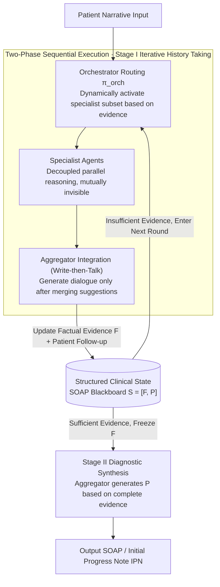

# Beyond the Individual: Virtualizing Multi-Disciplinary Reasoning for Clinical Intake via Collaborative Agents

**Conference**: ACL 2026 Findings  
**arXiv**: [2604.08927](https://arxiv.org/abs/2604.08927)  
**Code**: [GitHub](https://github.com/HovChen/Aegle)  
**Area**: Medical NLP
**Keywords**: Multi-Disciplinary Team (MDT), Multi-Agent Systems, Clinical Intake, SOAP Notes, Dynamic Topology

## TL;DR
The Aegle framework is proposed to virtualize Multi-Disciplinary Teams (MDT) through a graph-structured multi-agent architecture. By introducing decoupled parallel reasoning and dynamic topology into the clinical intake process, it outperforms SOTA models across 53 metrics in 24 departments.

## Background & Motivation

**Background**: Initial consultation is a critical phase for clinical decision-making, where physicians transform unstructured patient narratives into structured Initial Progress Notes (IPN) in SOAP format. Current LLM-assisted intake methods primarily fall into two categories: document generation (e.g., Med-PaLM 2) and interactive consultation (e.g., AMIE), both utilizing single-model architectures.

**Limitations of Prior Work**: (1) Single physicians or models are prone to anchoring bias under time pressure, focusing excessively on prominent symptoms while ignoring subtle cues; (2) Existing interactive systems act mostly as "passive receivers" and lack proactive exclusionary questioning capabilities; (3) While MDT can mitigate cognitive bias, it is costly and difficult to scale to daily outpatient settings.

**Key Challenge**: The contradiction between the depth of MDT-level systemic reasoning and the resource constraints of real-time clinical scenarios. Additionally, the "flawed consensus" problem in multi-agent systems—where agents may reinforce biases or suppress correct minority opinions.

**Goal**: To virtualize the cognitive advantages of MDT to achieve multi-perspective collaborative reasoning in real-time clinics at low cost.

**Key Insight**: Simulating MDT collaboration via a graph-structured multi-agent architecture—decoupling parallel reasoning to maintain hypothesis diversity, using dynamic topology to activate specialized agents on demand, and ensuring reasoning traceability through SOAP structured states.

**Core Idea**: Virtualize the MDT consultation process through a three-layer architecture where an Orchestrator dynamically activates Specialist Agents, agents perform decoupled parallel reasoning, and an Aggregator integrates outputs to update the structured clinical state.

## Method

### Overall Architecture
Aegle is built on DeepSeek-V3.2 and utilizes a two-phase Finite State Machine (FSM) for intake: Stage I for iterative history taking (evidence collection), and Stage II for diagnostic synthesis (generating diagnosis after freezing the evidence set). Throughout the process, an incrementally updated structured clinical state $\mathcal{S}_t = [\mathcal{F}_t, \mathcal{P}_t]$ is maintained, where $\mathcal{F}$ corresponds to the S+O (factual evidence) of SOAP, and $\mathcal{P}$ corresponds to the A+P (assessment and plan). In Stage I, three types of nodes—Orchestrator, Specialist Agents, and Aggregator—collaborate in a loop, all reading from and writing to a shared SOAP blackboard. Diagnosis is performed in Stage II only after sufficient evidence is collected.

### Key Designs

**1. Structured Clinical State: Hard separation of "Evidence Collection" and "Diagnosis" using a SOAP blackboard**

A common error in LLM intake is premature commitment—rushing to a diagnosis before evidence is complete. Once a conclusion is voiced, it is difficult to retract. Aegle formalizes the SOAP record as a blackboard $\mathcal{S}_t = [\mathcal{F}_t, \mathcal{P}_t]$ shared by all agents: $\mathcal{F}$ (Case Features) corresponds to SOAP’s S+O, accumulating verifiable facts like history and physical exams; $\mathcal{P}$ (Diagnosis & Plan) corresponds to A+P and is generated only after $\mathcal{F}$ stabilizes. The framework enforces a unidirectional dependency $\mathcal{F} \to \mathcal{P}$, allowing any diagnostic conclusion to be traced back to specific evidence, preventing premature commitment and ensuring traceability.

**2. Dynamic Multi-Agent Graph Topology: Summoning specialists on-demand rather than overwhelming the system**

Including all departments in the context is expensive and causes interference; real MDTs convene experts as needed. Aegle replicates this through three node types: the Orchestrator acts as a routing policy $\pi_{orch}$ to dynamically select a subset of Specialist Agents $A_{sub}$ based on dialogue history and evidence. Selected agents perform independent, parallel analysis without seeing each other's intermediate reasoning (decoupled reasoning). The Aggregator then integrates suggestions into state $\mathcal{S}_{t+1}$ following a "Write-then-Talk" protocol before generating patient-facing dialogue. Decoupled parallelism is key—it maintains hypothesis diversity and avoids "flawed consensus" where minority opinions are suppressed.

**3. Two-Phase Sequential Execution: Explicit bias control through "Discuss then Conclude" logic**

Anchoring bias often stems from locking in a diagnostic direction prematurely. Aegle enforces this via a two-phase FSM: Stage I is iterative history taking, where the Orchestrator repeatedly activates specialists for follow-up questions and the Aggregator generates dialogue until evidence is sufficient. Only then does the system transition to Stage II, freezing $\mathcal{F}$ and generating $\mathcal{P}$ (Diagnosis + Plan) based on the complete evidence set. This physical isolation turns the MDT discipline of "gathering all facts before concluding" into a system-level constraint.

### Loss & Training
Aegle is an inference framework (not a training method). It leverages the zero-shot capabilities of DeepSeek-V3.2 through structured prompting and role assignment to achieve collaboration. No additional training is required.

## Key Experimental Results

### Main Results

| Dataset | Metric | Aegle | DeepSeek-V3.2 | GPT-4o | Gain |
|--------|------|-------|---------------|--------|------|
| ClinicalBench | IDEA | 63.80 | 50.51 | 41.05 | +13.3 |
| ClinicalBench | SOAP | 53.42 | 38.64 | 29.38 | +14.8 |
| ClinicalBench | READ | 76.20 | 71.73 | 67.66 | +4.5 |
| RAPID-IPN | IDEA | 67.31 | 54.35 | 44.70 | +13.0 |
| RAPID-IPN | SOAP | 60.09 | 47.39 | 34.79 | +12.7 |
| RAPID-IPN | READ | 80.18 | 72.14 | 69.89 | +8.0 |

The evaluation covers 24 clinical departments and 53 fine-grained metrics.

### Ablation Study

| Configuration | IDEA | SOAP | Description |
|------|------|------|------|
| Aegle (Full) | 63.80 | 53.42 | Full Framework |
| Single Agent (DeepSeek-V3.2) | 50.51 | 38.64 | No MDT Collaboration |
| MiniMax-M2 | 57.78 | 46.18 | Strongest Single-Model Baseline |

### Key Findings
- Aegle consistently outperforms all baselines, including closed-source models like GPT-4o and Gemini 2.5, across all 53 metrics.
- Even with the same base model (DeepSeek-V3.2), the multi-agent framework provides a +13.3 IDEA score improvement, proving the value of the collaborative architecture.
- Improvements are more significant on the real clinical dataset RAPID-IPN, indicating strong generalization in real-world scenarios.

## Highlights & Insights
- **Decoupled Parallel Reasoning**: Independent analysis by specialized agents avoids "flawed consensus" issues, making it safer and more controllable than debate-based MAS. This is transferable to other multi-perspective tasks like legal or financial risk assessment.
- **SOAP Structured State as Blackboard**: Elevating clinical documentation standards to a reasoning control mechanism—it is not just a recording format, but a tool for bias control. This "Structure as Constraint" approach is highly insightful.
- **Write-then-Talk Protocol**: The Aggregator updates internal states before generating dialogue, ensuring the separation of technical precision from patient communication, which is vital for clinical deployability.

## Limitations & Future Work
- Relies entirely on the zero-shot capabilities of DeepSeek-V3.2; fine-tuning for clinical scenarios was not explored.
- Multi-agent calls increase inference costs (multiplied API calls); latency and cost must be considered for actual deployment.
- Evaluation is primarily based on Chinese clinical data; cross-lingual and cross-cultural generalization remains to be verified.
- Integration of multimodal information such as medical imaging and lab results was not addressed.

## Related Work & Insights
- **vs AMIE**: AMIE uses a single-model interactive approach susceptible to anchoring bias; Aegle expands the hypothesis space through multi-agent parallel reasoning.
- **vs MDAgents**: MDAgents adjust topology based on task complexity, but interactions remain a black box; Aegle explicitly constrains reasoning paths via SOAP structured states.
- **vs MedAgents**: MedAgents use collaborative debate which may lead to flawed consensus; Aegle’s decoupled parallel reasoning avoids mutual interference between agents.

## Rating
- Novelty: ⭐⭐⭐⭐ The MDT virtualization is novel, and the formalization of SOAP structured states is creative.
- Experimental Thoroughness: ⭐⭐⭐⭐⭐ 24 departments, 53 metrics, ClinicalBench + real-world data, and multiple SOTA baseline comparisons.
- Writing Quality: ⭐⭐⭐⭐ Clear framework description, though the heavy use of symbols could be further simplified in parts.

<!-- RELATED:START -->

## Related Papers

- [\[ACL 2026\] MultiDx: A Multi-Source Knowledge Integration Framework towards Diagnostic Reasoning](multidx_a_multi-source_knowledge_integration_framework_towards_diagnostic_reason.md)
- [\[ACL 2026\] MARCH: Multi-Agent Radiology Clinical Hierarchy for CT Report Generation](march_multi-agent_radiology_clinical_hierarchy_for_ct_report_generation.md)
- [\[ACL 2026\] SEMA-RAG: A Self-Evolving Multi-Agent Retrieval-Augmented Generation Framework for Medical Reasoning](sema-rag_a_self-evolving_multi-agent_retrieval-augmented_generation_framework_fo.md)
- [\[ACL 2026\] Dr. Assistant: Enhancing Clinical Diagnostic Inquiry via Structured Diagnostic Reasoning Data and Reinforcement Learning](dr_assistant_enhancing_clinical_diagnostic_inquiry_via_structured_diagnostic_rea.md)
- [\[ACL 2025\] ReflecTool: Towards Reflection-Aware Tool-Augmented Clinical Agents](../../ACL2025/medical_nlp/reflectool_clinical_agent.md)

<!-- RELATED:END -->
