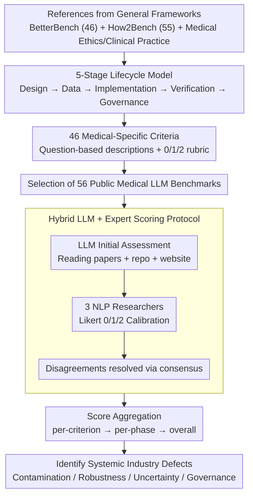

# Beyond the Leaderboard: Rethinking Medical Benchmarks for Large Language Models

**Conference**: ACL 2026  
**arXiv**: [2508.04325](https://arxiv.org/abs/2508.04325)  
**Code**: To be confirmed  
**Area**: Medical NLP / LLM Evaluation / Benchmark Audit  
**Keywords**: MedCheck, Medical benchmark, Lifecycle assessment, Clinical validity, Data contamination

## TL;DR
The authors propose MedCheck—the first evaluation framework for the **lifecycle** of medical LLM benchmarks, decomposing benchmark construction into 5 stages with a total of 46 criteria. Auditing 56 medical benchmarks using this framework reveals three systemic issues: (1) 50% do not align with any medical standards (ICD/SNOMED), (2) 88% do not handle data contamination, and (3) 89% do not test model robustness while 91% do not test uncertainty—concluding that current "leaderboard progress" is largely an illusion.

## Background & Motivation

**Background**: Medical LLM benchmarks have exploded over the past three years, evolving from exam-based QA such as MedQA and MedMCQA to comprehensive clinical tasks like MedHELM and AgentClinic. However, most of these benchmarks are paper-driven one-off outputs—they are no longer maintained after publication, and their quality varies significantly.

**Limitations of Prior Work**: The authors identify three problems that are frequently criticized but have never been systematically quantified: (1) **Clinical disconnect**—a large number of benchmarks use closed-form MCQA to test "medical knowledge," whereas clinical reality involves open-ended reasoning; (2) **Data contamination**—benchmarks originate from academic materials (USMLE, textbooks) that the LLMs have already seen during pre-training, leading to inflated scores; (3) **Lack of safety evaluation**—medical scenarios have extremely high demands for model robustness, uncertainty expression, and reasoning interpretability, yet the vast majority of benchmarks only focus on accuracy.

**Key Challenge**: While general AI benchmark governance frameworks (BetterBench, How2Bench) exist, they **do not adapt to the specificities of the medical field**—medicine requires specialized terminology, patient data ethics, and strict safety standards. The BetterBench framework by Reuel et al. (2024) consists of 46 general criteria that cannot determine whether a benchmark is ICD-compatible, HIPAA-compliant, or how it was reviewed by experts.

**Goal**: To establish a medical-specific evaluation framework from a **lifecycle perspective** and use it to perform an empirical audit of 56 existing benchmarks to answer "where exactly current medical LLM benchmarks fall short."

**Key Insight**: Drawing from software engineering lifecycle concepts—a benchmark is not a one-off dataset but an engineering product that must be viewed through its full cycle from design to governance.

**Core Idea**: **Decompose medical benchmark construction into five consecutive stages (Design → Data → Implementation → Verification → Governance), define medical-specific criteria (46 in total) for each stage, and systematically score 56 benchmarks to identify systemic weaknesses.**

## Method

### Overall Architecture
This paper does not train a model; instead, it "builds a yardstick to measure the entire industry." It answers where current medical LLM benchmarks are deficient. The methodology follows a three-step process similar to an engineered systematic review: first, **framework construction**—based on the general benchmark framework BetterBench (46 criteria) and the code benchmark framework How2Bench (55 criteria), combined with medical ethics and clinical practice, it distills 46 medical-specific criteria across five lifecycle stages; second, **systematic scoring**—selecting 56 public medical LLM benchmarks, using LLM-as-judge for initial assessment of papers, repos, and websites, followed by calibration by 3 NLP researchers with clinical informatics backgrounds using a 0/1/2 Likert scale, resolving disagreements through consensus; finally, **aggregate analysis**—summarizing scores from per-criterion to per-phase and then overall to identify industry-wide weaknesses.

### Key Designs

**1. 5-Stage Medical Benchmark Lifecycle Model: Decomposing the abstract concept of "benchmark quality" into auditable steps**

Existing evaluations often "pick a dataset and take a look," lacking lifecycle awareness, which leads to missing dimensions. Borrowing the software engineering approach of treating products as full-cycle engineering artifacts, the authors split benchmark construction into five consecutive stages: (I) **Design & Conceptualization**—what medical capability is being assessed (QA / diagnostic reasoning), clinical validity, and involvement of medical experts; (II) **Dataset Construction & Management**—source traceability, privacy compliance (HIPAA/GDPR), expert audit, and contamination detection; (III) **Technical Implementation & Evaluation Methodology**—reproducibility, moving beyond simple accuracy, assessing reasoning processes, and testing robustness / generalization / uncertainty; (IV) **Benchmark Validity & Performance Verification**—content/construct validity, discriminative power, and correlation with real clinical performance; (V) **Documentation, Openness, Governance**—documentation, open source, licensing, maintenance plans, and feedback channels. Once the process is unfolded, issues immediately surface: Stage III has the lowest average score (52.4%), indicating that "how to evaluate" is more neglected than "how to collect data."

**2. 46 Medical-Specific Evaluation Criteria: Converting abstract goals of each stage into repeatable yes/no audit items**

The five stages alone are too broad; each criterion must be independently and repeatably determinable. Thus, each criterion is written as a question with a standard 0/1/2 Likert rubric. Examples include Criterion #9 "Is it aligned with international medical standards like ICD, SNOMED CT, or LOINC?", #23 "Is the risk of data contamination detected and handled?", #28 "Are there experiments to evaluate model robustness?", and #30 "Is the model's ability to express uncertainty measured?". The key difference from BetterBench is that all 46 criteria are **specialized for medical scenarios**—terms like HIPAA, ICD, clinical guidelines, patient safety, and physician-in-the-loop are integrated throughout, making the audit results directly readable for medical practitioners rather than just general AI jargon.

**3. Hybrid LLM + Expert Scoring Protocol: Maintaining scale and credibility across 2,576 evaluation cells**

Auditing 56 benchmarks across 46 criteria results in 2,576 cells to be evaluated. Pure manual labor is unsustainable, while pure LLM assessment is prone to hallucinations and prompt sensitivity. The protocol divides the work: the LLM performs the initial assessment based on the paper, code, and website; then, 3 NLP researchers independently review and adjust these scores, with disagreements resolved through consensus discussion. The entire process relies only on public artifacts without subjective speculation. The LLM handles the volume, while experts ensure quality, with the 3-scale Likert and consensus providing a reliability ceiling—a pragmatic and reusable compromise for large-scale auditing.

### Loss & Training
This paper does not train a model; it focuses on evaluation methodology. The research consists of a "tool development + empirical audit" dual-task, similar to a systematic review.

## Key Experimental Results

### Main Results: Overall Compliance of 56 Medical Benchmarks across 5 Stages

| Lifecycle Stage | Avg. Compliance | Most Severe Deficiencies |
|---|---|---|
| I. Design & Conceptualization | ~75% | 50% lack ICD/SNOMED alignment; 45% ignore safety/fairness; 34% only assess accuracy |
| II. Dataset Construction & Management | ~60% | **88% do not handle data contamination**; 66% lack diversity/representativeness; 55% lack expert review |
| III. Technical Implementation & Evaluation Methodology | **52.4% (Lowest)** | **89% do not test robustness**; **91% do not test uncertainty**; 48% do not evaluate reasoning |
| IV. Benchmark Validity & Performance Verification | ~60% | Only 54% provide content validity; only 38% use high-fidelity clinical scenarios |
| V. Documentation, Openness, Governance | ~65% | 39% do not specify license; **80% have no clear maintenance plan**; 63% lack feedback channels |

### Ablation Study: Typical Benchmark Deficiencies Revealed by MedCheck (Trigger Rate among 56 Benchmarks)

| Deficiency Type | Trigger Rate | Impact |
|---|---|---|
| Lack of Medical Standard Alignment (ICD/SNOMED/LOINC) | 50% (28/56) | Poor clinical interoperability |
| Neglect of Safety and Fairness | 45% (25/56) | High deployment risk |
| Single Dimension Accuracy Evaluation | 34% (19/56) | Lack of completeness/interpretability |
| No Data Contamination Detection/Handling | 88% (49/56) | Inflated scores, untrustworthy leadboards |
| Insufficient Diversity/Representativeness | 66% (37/56) | Performance on marginal patient groups unknown |
| No Robustness Testing (Input Perturbation) | 89% (50/56) | Model vulnerability unknown |
| No Uncertainty Testing | 91% (51/56) | Clinical safety hazard |
| No Reasoning Process Evaluation | 48% (27/56) | Black-box decision risk |
| No Clear Maintenance Plan | 80% (45/56) | "Fire-and-forget" approach is unsustainable |
| No Public Feedback Channel | 63% (35/56) | Community cannot correct errors |

### Key Findings
- **"Clinical Disconnect" is the most prevalent issue in the design stage**: While 98% of benchmarks "define a goal," 50% do not align with any medical standards. The authors call this an "academic-first, clinical-second" mindset—developers prefer ready-made exam questions (MedQA/MedMCQA) over real clinical workflows.
- **Data Contamination Crisis is deep**: 88% of benchmarks do not handle contamination at all. Even if closed-source models are difficult to detect post-hoc, developers can use **proactive** methods like canary strings or temporal cutoffs, yet almost no one does.
- **Stage III (Evaluation Methodology) has the lowest score (52.4%)**: This is the authors' biggest concern because robustness, uncertainty, and reasoning are the core of clinical trust; not testing them implies the industry assumes they are unimportant.
- **Governance is a mess**: 80% of benchmarks have no maintenance plan. This means once a benchmark is published, it becomes a "museum piece" that cannot evolve with model updates—this is the root of the ad-hoc paper-driven evaluation ecosystem.

## Highlights & Insights
- **The approach of treating benchmarks as engineering products with a lifecycle is highly appropriate**: This mature perspective from SE/clinical informatics, when applied to NLP evaluation, immediately reveals neglected dimensions (maintenance, feedback, licensing).
- **The diagnosis of "academic-first, clinical-second" is precise**: It explains why medical LLM benchmarks seem to flourish while clinicians remain skeptical—the evaluation metrics are simply not what doctors care about.
- **The 46-item checklist can be used directly as a to-do list for benchmark authors**: This paper does more than audit the status quo; it provides actionable guidelines with strong steering power for future designs.
- **The hybrid LLM + expert scoring protocol**: A pragmatic approach for systematic review engineering that is reusable for other large-scale benchmark/dataset audits.
- **The conclusion that Stage III is the worst is counter-intuitive**: One would typically assume data or transparency is the biggest issue. This paper uses data to show that "evaluation methods" are the real black hole—shifting community attention from "more data" to "better metrics."

## Limitations & Future Work
- The authors admit: (1) The 56 benchmarks are not exhaustive; (2) Scoring has some subjectivity despite the protocol; (3) Only public artifacts are examined, missing internal practices; (4) MedCheck is a snapshot and must evolve with AI capabilities (multimodal, agentic).
- Personal observations (Ours): (a) The study is primarily diagnostic and **does not verify the correlation between MedCheck scores and "model performance in real clinical deployment,"** so whether a high MedCheck score translates to reliability remains open; (b) Independence between the 46 criteria is not addressed, and weighting schemes are not discussed; (c) No case study was provided on "how to design a model benchmark using MedCheck."
- Future Work: (a) Build a living repository where benchmarks are scored by MedCheck upon release; (b) Extend MedCheck to multimodal, agentic, and long-horizon clinical reasoning; (c) Include empirical validation of the correlation between benchmarks and real clinical outcomes.

## Related Work & Insights
- **vs BetterBench (Reuel et al., 2024)**: BetterBench provides 46 general criteria; this work provides 46 medical-specific criteria. The difference lies in the medical depth within terminology, ethics, and safety—e.g., this work explicitly requires HIPAA compliance and ICD/SNOMED alignment.
- **vs How2Bench (Cao et al., 2025)**: How2Bench uses a 55-item checklist for code benchmarks; it shares the lifecycle-aware philosophy but differs in domain.
- **vs TRIPOD-LLM (Gallifant et al., 2025)**: TRIPOD-LLM focuses on reporting standards, while this work focuses on construction quality—one manages "how to write the paper," the other "how to build the dataset."
- **vs Alaa et al. 2025**: They empirically showed that medical benchmark scores correlate weakly with real clinical performance; this work provides a diagnostic framework for that finding—telling you why it happens and which dimensions need improvement.
- **Insight**: The lifecycle-aware checklist paradigm can be transferred to (a) Legal LLM benchmarks, (b) Educational LLM benchmarks, and (c) AI safety benchmarks. Any high-stakes domain requires this level of engineering-grade evaluation discipline.

## Rating
- Novelty: ⭐⭐⭐⭐ First lifecycle evaluation framework specific to the medical domain; mature ideas applied effectively to a specialized field.
- Experimental Thoroughness: ⭐⭐⭐⭐⭐ 56 benchmarks × 46 criteria × multiple human + LLM protocol; robust statistics.
- Writing Quality: ⭐⭐⭐⭐⭐ Clear structure (5 stages → 46 criteria → findings); effective terminology (Clinical Disconnect / Crisis of Foundational Validity) that aids dissemination.
- Value: ⭐⭐⭐⭐⭐ Directly serves the community; the 46-item checklist can be adopted by future designers and serves as a reference for ACL/EMNLP review processes.

<!-- RELATED:START -->

## Related Papers

- [\[ACL 2026\] Inflated Excellence or True Performance? Rethinking Medical Diagnostic Benchmarks with Dynamic Evaluation](inflated_excellence_or_true_performance_rethinking_medical_diagnostic_benchmarks.md)
- [\[ACL 2026\] Text-Attributed Knowledge Graph Enrichment with Large Language Models for Medical Concept Representation](text-attributed_knowledge_graph_enrichment_with_large_language_models_for_medica.md)
- [\[AAAI 2026\] Measuring Stability Beyond Accuracy in Small Open-Source Medical Large Language Models for Pediatric Endocrinology](../../AAAI2026/medical_nlp/measuring_stability_beyond_accuracy_in_small_open-source_medical_large_language_.md)
- [\[ACL 2026\] MedFact: Benchmarking the Fact-Checking Capabilities of Large Language Models on Chinese Medical Texts](medfact_benchmarking_the_fact-checking_capabilities_of_large_language_models_on_.md)
- [\[ACL 2026\] RePrompT: Recurrent Prompt Tuning for Integrating Structured EHR Encoders with Large Language Models](reprompt_recurrent_prompt_tuning_for_integrating_structured_ehr_encoders_with_la.md)

<!-- RELATED:END -->
