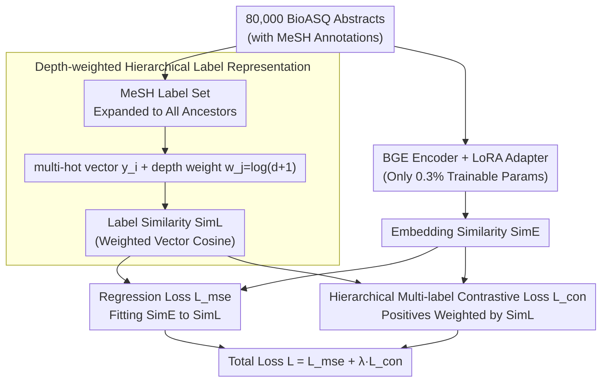

# BioHiCL: Hierarchical Multi-Label Contrastive Learning for Biomedical Retrieval with MeSH Labels

**Conference**: ACL 2026  
**arXiv**: [2604.15591](https://arxiv.org/abs/2604.15591)  
**Code**: [https://github.com/MengfeiLan/BioHiCL](https://github.com/MengfeiLan/BioHiCL)  
**Area**: Medical NLP  
**Keywords**: Biomedical Retrieval, MeSH Hierarchy, Contrastive Learning, Multi-label, Parameter-Efficient Fine-Tuning

## TL;DR
BioHiCL utilizes **hierarchical multi-label annotations** of MeSH (Medical Subject Headings) to provide structured supervision for dense retrievers. By aligning the embedding space with the MeSH semantic space through depth-weighted label similarity, a 0.1B model outperforms most specialized models on biomedical retrieval, sentence similarity, and question-answering tasks.

## Background & Motivation

**Background**: General-domain dense retrievers (e.g., BGE, E5) perform excellently on general IR benchmarks but fail to capture biomedical-specific terminology and semantic relationships. Specialized biomedical retrieval models (e.g., MedCPT, BMRetriever) enhance semantic alignment through large-scale contrastive learning.

**Limitations of Prior Work**: Existing biomedical retrieval models rely on coarse-grained relevance signals—either binary labels (relevant/irrelevant) or query-article click data. These coarse signals fail to capture complex relationships of **partial semantic overlap** in biomedical texts (e.g., two articles labeled as "irrelevant" may actually share a parent concept in the disease hierarchy).

**Key Challenge**: Semantic relationships between biomedical texts are graded and hierarchical, but training signals are typically binary—using binary signals to learn graded semantic relationships leads to limited retrieval precision.

**Goal**: Design a method that adapts general retrievers to the biomedical domain by providing **fine-grained, hierarchical supervision signals** utilizing the MeSH hierarchical structure.

**Key Insight**: MeSH provides natural multi-faceted supervision—each document has multiple MeSH labels, and the labels themselves form a hierarchical tree. The degree of label overlap and hierarchical depth can quantify semantic similarity.

**Core Idea**: Align the similarity in the embedding space with the similarity in the depth-weighted label space of MeSH, replacing binary contrastive learning with hierarchical multi-label contrastive learning.

## Method

### Overall Architecture
Based on the general-domain dense retriever BGE, LoRA fine-tuning is performed using 80,000 abstracts with MeSH annotations from BioASQ. The entire training is a **dual-path alignment** pipeline: the label path expands the MeSH labels of each abstract along the hierarchy tree and calculates "label similarity" $\text{SimL}$ after depth weighting. The embedding path calculates "embedding similarity" $\text{SimE}$ using the BGE+LoRA encoder. The two paths converge in two losses: (1) a regression loss $\mathcal{L}_{\text{mse}}$ to fit $\text{SimE}$ to $\text{SimL}$; (2) a hierarchical contrastive loss $\mathcal{L}_{\text{con}}$ to bring semantically related documents closer in the embedding space and push irrelevant ones further apart.

### Key Designs

**1. Depth-weighted Hierarchical Label Representation: Compressing the MeSH tree structure into a calculable similarity**

In binary annotations, two articles are only "relevant / irrelevant," but biomedical texts often have partial semantic overlap—two articles labeled as "irrelevant" may share the same parent concept in the disease hierarchy. BioHiCL quantifies this graded relationship using MeSH labels: the MeSH label set of each abstract is first expanded along the hierarchy tree to include all ancestor nodes, resulting in a complete path $m_i^{\text{hier}}$, encoded as a multi-hot vector $y_i \in \{0,1\}^C$. A key step is assigning a weight to each concept $c_j$ based on its depth $w_j = \log(d(c_j)+1)$, where deeper, more specific concepts carry greater weight. The label similarity between two documents is defined as the cosine similarity of the weighted vectors $\text{SimL}(k_p, k_q) = \cos(y_p \odot \mathbf{w}, y_q \odot \mathbf{w})$. Consequently, matches of shallow labels (e.g., "Diseases") are less significant, while matches of deep labels (e.g., "Intracranial Hemorrhages") are treated as true semantic relevance, automatically focusing supervision on meaningful fine-grained matches.

**2. Hierarchical Multi-label Contrastive Loss: Bracing the embedding space against collapse while fitting similarity**

Relying solely on a regression loss to force embedding similarity to fit label similarity can easily collapse all vectors into a single point, losing discriminative power. The contrastive loss is responsible for keeping the space expanded: document pairs with $\text{SimL} > \beta$ are considered positive samples, while pairs with no label overlap ($\text{SimL}=0$) are considered negative samples. Furthermore, positive pairs are weighted by their label similarity:

$$\mathcal{L}_{\text{con}} = -\mathbb{E}_i \log\frac{\text{SimL}(k_i, k_i^+) \cdot \exp(\text{SimE}(k_i, k_i^+))}{\sum_{k_j^-} \exp(\text{SimE}(k_i, k_j^-))}$$

The threshold $\beta$ filters out weak association pairs to reduce noisy supervision. This design is bidirectional: the contrastive term maintains spatial structure by pushing away irrelevant documents, while "label similarity weighting" allows truly highly correlated positive pairs to contribute larger gradients, effectively embedding hierarchical supervision directly into the contrastive objective.

**3. LoRA Parameter-Efficient Fine-Tuning: Adapting the general retriever to the biomedical domain with 0.3% parameters**

Performing full-parameter fine-tuning on the limited BioASQ data is prone to overfitting, expensive, and risks washing out the original general language understanding of BGE. BioHiCL adopts LoRA: all original weights of BGE are frozen, and low-rank adapters $W_{\text{adapted}}^{(l)} = W^{(l)} + B^{(l)} A^{(l)}$ are injected into each layer. Trainable parameters account for only 0.3%. This preserves the general capability of the base model while completing domain adaptation at a very low cost—its performance in ablations is nearly identical to full-parameter fine-tuning.

### Loss & Training
The total loss is $\mathcal{L} = \mathcal{L}_{\text{mse}} + \lambda \mathcal{L}_{\text{con}}$, with $\lambda=0.1$ and $\beta=0.3$. The model is trained on 80,000 abstracts from BioASQ v2022, and the optimal checkpoint is selected using the TREC-CT 2022 validation set. Training and inference can be completed on a single A100 40GB GPU.

## Key Experimental Results

### Main Results

| Task/Dataset | Metric | BioHiCL-Base (0.1B) | BMRetriever-1B | bge-base (0.1B) |
|--------|------|------|----------|------|
| IR Average | nDCG@10 | **0.543** | 0.531 | 0.529 |
| NFCorpus | nDCG@10 | 0.379 | 0.344 | 0.368 |
| TREC-COVID | nDCG@10 | **0.812** | 0.840 | 0.798 |
| BIOSSES | Spearman | **0.896** | 0.858 | 0.860 |
| PubMedQA | Recall@1 | 0.893 | 0.810 | 0.856 |

### Ablation Study

| Configuration | IR Avg | Description |
|------|---------|------|
| BioHiCL-Base | **0.543** | Full Model |
| w/o $\mathcal{L}_{\text{con}}$ | 0.528 | Removing contrastive loss causes the largest drop |
| w/o Ancestor Label | 0.538 | No ancestor node expansion |
| w/o $\mathcal{L}_{\text{mse}}$ | 0.537 | Removing regression loss |
| w/o Depth Weight | 0.541 | No depth weighting |
| w/o LoRA (Full Parameter) | 0.542 | LoRA performs comparably to full-parameter fine-tuning |

### Key Findings
- The 0.1B BioHiCL-Base outperforms the 1B BMRetriever on IR mean metrics, indicating that structured supervision signals can compensate for gaps in model scale.
- The contrastive loss is the most critical component (IR average drops by 0.015 after removal), validating the necessity of preventing embedding collapse.
- Fine-tuning BMRetriever using the BioHiCL method leads to a severe performance drop (0.501→0.279), because replacing the original instruction-based training objective disrupts its retrieval-specialized embedding geometry.
- LoRA achieves performance comparable to full-parameter fine-tuning with only 0.3% of the parameters, validating the effectiveness of parameter-efficient methods for domain adaptation.

## Highlights & Insights
- **Utilizing the MeSH hierarchical structure as a hierarchical supervision signal** is a natural and effective design: MeSH is a standardized vocabulary maintained by experts, naturally providing a precise measure of semantic relationships between documents. This concept of "borrowing existing structured knowledge for supervision" can be transferred to any domain with hierarchical label systems (e.g., legal statute classification, product categorization).
- **Depth-weighted label similarity** encodes the domain intuition that "specific concepts are more important than abstract concepts" in a minimalist way (via the formula $w_j = \log(d(c_j)+1)$).
- The extreme efficiency of the 0.1B model makes it suitable for large-scale practical deployment, offering a clear practical advantage over systems like BMRetriever/MedCPT that require 1B+ parameters.

## Limitations & Future Work
- Training was conducted on only 80,000 BioASQ abstracts, a data scale significantly smaller than that of MedCPT (click data) and BMRetriever (multi-task data).
- The coverage and granularity of MeSH annotations are limited by the label set maintained by the NLM; emerging concepts may be lacking.
- The possibility of combining MeSH hierarchical information with instruction-based retrieval remains unexplored.
- Improvement on SCIDOCS is limited (0.215→0.225), suggesting that cross-domain generalization still requires improvement.

## Related Work & Insights
- **vs MedCPT (Jin et al., 2023)**: The latter uses query-article clicks for contrastive learning, whereas BioHiCL uses MeSH hierarchy to provide finer-grained supervision signals.
- **vs BMRetriever (Xu et al., 2024)**: The latter employs large-scale multi-task training for a 1B model; BioHiCL achieves equivalent performance with only 0.1B + MeSH supervision, offering higher efficiency.
- **vs BiCA (Sinha et al., 2025)**: The latter performs biomedical adaptation but does not utilize hierarchical label structures; BioHiCL supplements the hierarchical dimension.

## Rating
- Novelty: ⭐⭐⭐ Contrastive learning with MeSH supervision is a natural combination, though the core idea is not entirely unexpected.
- Experimental Thoroughness: ⭐⭐⭐⭐ Comprehensive coverage with multi-task evaluation (IR+similarity+QA), detailed ablations, and efficiency analysis.
- Writing Quality: ⭐⭐⭐⭐ Methodology is described clearly and concisely, although Related Work is slightly thin.

<!-- RELATED:START -->

## Related Papers

- [\[AAAI 2026\] Learning Cell-Aware Hierarchical Multi-Modal Representations for Robust Molecular Modeling](../../AAAI2026/medical_nlp/learning_cell-aware_hierarchical_multi-modal_representations.md)
- [\[ACL 2026\] Multi-View Attention Multiple-Instance Learning Enhanced by LLM Reasoning for Cognitive Distortion Detection](multi-view_attention_multiple-instance_learning_enhanced_by_llm_reasoning_for_co.md)
- [\[ACL 2026\] ProMedical: Hierarchical Fine-Grained Criteria Modeling for Medical LLM Alignment via Explicit Injection](promedical_hierarchical_fine-grained_criteria_modeling_for_medical_llm_alignment.md)
- [\[ACL 2026\] SEMA-RAG: A Self-Evolving Multi-Agent Retrieval-Augmented Generation Framework for Medical Reasoning](sema-rag_a_self-evolving_multi-agent_retrieval-augmented_generation_framework_fo.md)
- [\[AAAI 2026\] BiCA: Effective Biomedical Dense Retrieval with Citation-Aware Hard Negatives](../../AAAI2026/medical_nlp/bica_effective_biomedical_dense_retrieval_with_citation-aware_hard_negatives.md)

<!-- RELATED:END -->
