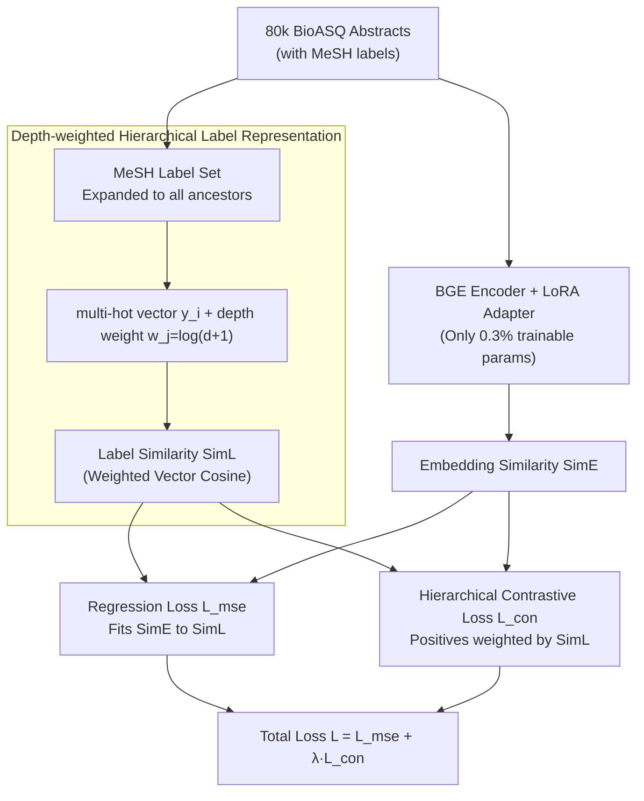

# BioHiCL: Hierarchical Multi-Label Contrastive Learning for Biomedical Retrieval with MeSH Labels

**Conference**: ACL 2026  
**arXiv**: [2604.15591](https://arxiv.org/abs/2604.15591)  
**Code**: [https://github.com/MengfeiLan/BioHiCL](https://github.com/MengfeiLan/BioHiCL)  
**Area**: Biomedical NLP  
**Keywords**: Biomedical Retrieval, MeSH Hierarchy, Contrastive Learning, Multi-label, Parameter-Efficient Fine-Tuning

## TL;DR
BioHiCL leverages the **hierarchical multi-label annotations** of MeSH (Medical Subject Headings) to provide structured supervision for dense retrievers. By aligning the embedding space with the MeSH semantic space via depth-weighted label similarity, the 0.1B model surpasses most specialized models on biomedical retrieval, sentence similarity, and question answering tasks.

## Background & Motivation

**Background**: General-domain dense retrievers (e.g., BGE, E5) perform exceptionally on general IR benchmarks but fail to capture biomedical-specific terminology and semantic relationships. Specialized biomedical retrieval models (e.g., MedCPT, BMRetriever) enhance semantic alignment through large-scale contrastive learning.

**Limitations of Prior Work**: Existing biomedical retrieval models rely on coarse-grained relevance signals—either binary labels (relevant/irrelevant) or query-article click data. Such coarse signals cannot capture complex relationships involving **partial semantic overlap** in biomedical texts (e.g., two articles labeled as "unrelated" may actually share a parent concept in the disease hierarchy).

**Key Challenge**: Semantic relationships between biomedical texts are graded and hierarchical, but training signals are binary. Learning graded semantic relationships with binary signals limits retrieval precision.

**Goal**: Design a method to adapt general retrievers to the biomedical domain by utilizing the MeSH hierarchical structure to provide **fine-grained, graded supervision signals**.

**Key Insight**: MeSH provides natural multi-faceted supervision—each document has multiple MeSH labels, the labels themselves form a hierarchical tree, and the degree of label overlap and hierarchical depth can quantify semantic similarity.

**Core Idea**: Align the similarity in the embedding space with the similarity in the depth-weighted MeSH label space, replacing binary contrastive learning with hierarchical multi-label contrastive learning.

## Method

### Overall Architecture
Building on the general-domain dense retriever BGE, LoRA fine-tuning is performed using 80,000 MeSH-annotated abstracts from BioASQ. The training follows a **dual-path alignment** pipeline: the label path expands the MeSH labels of each abstract along the hierarchy tree and calculates a depth-weighted "Label Similarity" $\text{SimL}$; the embedding path uses the BGE+LoRA encoder to compute "Embedding Similarity" $\text{SimE}$. The two paths converge in two losses: (1) a regression loss $\mathcal{L}_{\text{mse}}$ that fits $\text{SimE}$ to $\text{SimL}$, and (2) a hierarchical contrastive loss $\mathcal{L}_{\text{con}}$ that brings semantically related documents closer in the embedding space while pushing unrelated ones apart.

### Key Designs

**1. Depth-weighted Hierarchical Label Representation: Compressing the MeSH tree into a computable similarity**

In binary annotation, two articles are simply "relevant" or "irrelevant," yet biomedical texts often exhibit partial semantic overlap. BioHiCL quantifies these graded relationships via MeSH labels: the label set for each abstract is expanded along the hierarchy to include all ancestor nodes, resulting in a full path $m_i^{\text{hier}}$ encoded as a multi-hot vector $y_i \in \{0,1\}^C$. A key step is assigning a weight to each concept $c_j$ based on its depth $w_j = \log(d(c_j)+1)$, where deeper, more specific concepts receive higher weights. The label similarity is defined as the cosine similarity of the weighted vectors: $\text{SimL}(k_p, k_q) = \cos(y_p \odot \mathbf{w}, y_q \odot \mathbf{w})$. Consequently, matches of shallow labels (e.g., "Diseases") are less significant, while matches of deep labels (e.g., "Intracranial Hemorrhages") are treated as true semantic relevance, automatically focusing supervision on meaningful fine-grained matches.

**2. Hierarchical Multi-label Contrastive Loss: Maintaining embedding space structure while fitting similarity**

Relying solely on a regression loss to force embedding similarity to fit label similarity can lead to embedding collapse, where all vectors converge to a single point. The contrastive loss maintains the discriminative structure: document pairs with $\text{SimL} > \beta$ are treated as positives, while those with no label overlap ($\text{SimL}=0$) are negatives. Furthermore, positive pairs are weighted by their label similarity:

$$\mathcal{L}_{\text{con}} = -\mathbb{E}_i \log\frac{\text{SimL}(k_i, k_i^+) \cdot \exp(\text{SimE}(k_i, k_i^+))}{\sum_{k_j^-} \exp(\text{SimE}(k_i, k_j^-))}$$

The threshold $\beta$ filters out weakly associated pairs to reduce noisy supervision. This design is bidirectional: the contrastive term preserves spatial structure by pushing away unrelated documents, while the "label similarity weighting" ensures highly relevant positive pairs contribute larger gradients, directly embedding graded supervision into the contrastive objective.

**3. LoRA Parameter-Efficient Fine-Tuning: Adapting general retrievers to the biomedical domain with 0.3% parameters**

Full parameter fine-tuning on the specialized BioASQ dataset risks overfitting and high costs, potentially erasing BGE's general language understanding. BioHiCL utilizes LoRA by freezing all original BGE weights and injecting low-rank adapters $W_{\text{adapted}}^{(l)} = W^{(l)} + B^{(l)} A^{(l)}$ into each layer. Trainable parameters account for only 0.3% of the total, preserving the base model's general capabilities while achieving domain adaptation at minimal cost.

### Loss & Training
The total loss is $\mathcal{L} = \mathcal{L}_{\text{mse}} + \lambda \mathcal{L}_{\text{con}}$, where $\lambda=0.1$ and $\beta=0.3$. Training is conducted on 80,000 abstracts from BioASQ v2022, with the best checkpoint selected via the TREC-CT 2022 validation set. Training and inference can be completed on a single A100 40GB GPU.

## Key Experimental Results

### Main Results

| Task/Dataset | Metric | BioHiCL-Base (0.1B) | BMRetriever-1B | bge-base (0.1B) |
|--------|------|------|----------|------|
| IR Average | nDCG@10 | **0.543** | 0.531 | 0.529 |
| NFCorpus | nDCG@10 | 0.379 | 0.344 | 0.368 |
| TREC-COVID | nDCG@10 | **0.812** | 0.840 | 0.798 |
| BIOSSES | Spearman | **0.896** | 0.858 | 0.860 |
| PubMedQA | Recall@1 | 0.893 | 0.810 | 0.856 |

### Ablation Study

| Configuration | IR Avg | Description |
|------|---------|------|
| BioHiCL-Base | **0.543** | Full model |
| w/o $\mathcal{L}_{\text{con}}$ | 0.528 | Removes contrastive loss; largest performance drop |
| w/o Ancestor Label | 0.538 | No ancestor node expansion |
| w/o $\mathcal{L}_{\text{mse}}$ | 0.537 | Removes regression loss |
| w/o Depth Weight | 0.541 | No depth-based weighting |
| w/o LoRA (Full FT) | 0.542 | LoRA performs comparably to full fine-tuning |

### Key Findings
- The 0.1B BioHiCL-Base outperforms the 1B BMRetriever on average IR metrics, suggesting that structured supervision signals can compensate for model scale gaps.
- The contrastive loss is the most critical component (averaging a 0.015 IR drop when removed), validating the necessity of preventing embedding collapse.
- If BMRetriever is fine-tuned using the BioHiCL method, performance drops significantly (0.501 → 0.279), as replacing its original instruction-based training objective disrupts its retrieval-specialized embedding geometry.
- LoRA achieves performance comparable to full fine-tuning using only 0.3% of parameters, verifying the efficacy of parameter-efficient methods in domain adaptation.

## Highlights & Insights
- **Utilizing MeSH hierarchy as a graded supervision signal** is a natural and effective design: MeSH is an expert-maintained standardized vocabulary that inherently provides precise measurements of semantic relationships between documents. This "leveraging existing structured knowledge for supervision" approach is transferable to any domain with hierarchical label systems (e.g., legal classification, product taxonomies).
- **Depth-weighted label similarity** encodes the domain intuition that "specific concepts are more important than abstract ones" in a simple formula: $w_j = \log(d(c_j)+1)$.
- The high efficiency of the 0.1B model makes it suitable for large-scale practical deployment, offering a clear utility advantage over systems like BMRetriever or MedCPT that require 1B+ parameters.

## Limitations & Future Work
- Training is limited to 80,000 BioASQ abstracts, a much smaller scale than MedCPT (click data) or BMRetriever (multi-task data).
- The coverage and granularity of MeSH annotations are restricted by the sets maintained by the NLM; emerging concepts may be missing.
- The potential for combining MeSH hierarchical information with instruction-based retrieval has not yet been explored.
- Improvement on SCIDOCS is limited (0.215 → 0.225), indicating that cross-domain generalization still needs refinement.

## Related Work & Insights
- **vs MedCPT (Jin et al., 2023)**: MedCPT uses query-article clicks for contrastive learning; BioHiCL uses MeSH hierarchy for finer-grained supervision.
- **vs BMRetriever (Xu et al., 2024)**: BMRetriever uses large-scale multi-task training for a 1B model; BioHiCL achieves similar performance with 0.1B + MeSH supervision, offering higher efficiency.
- **vs BiCA (Sinha et al., 2025)**: BiCA performs biomedical adaptation but does not utilize hierarchical label structures; BioHiCL complements this with the hierarchical dimension.

## Rating
- Novelty: ⭐⭐⭐ MeSH-supervised contrastive learning is a natural combination, though the core idea is not entirely unexpected.
- Experimental Thoroughness: ⭐⭐⭐⭐ Comprehensive coverage with multi-task evaluation (IR, similarity, QA), detailed ablations, and efficiency analysis.
- Writing Quality: ⭐⭐⭐⭐ The methodology is described clearly and concisely, though the Related Work section is somewhat brief.

<!-- RELATED:START -->

## Related Papers

- [\[AAAI 2026\] Learning Cell-Aware Hierarchical Multi-Modal Representations for Robust Molecular Modeling](../../AAAI2026/medical_nlp/learning_cell-aware_hierarchical_multi-modal_representations.md)
- [\[ACL 2026\] Multi-View Attention Multiple-Instance Learning Enhanced by LLM Reasoning for Cognitive Distortion Detection](multi-view_attention_multiple-instance_learning_enhanced_by_llm_reasoning_for_co.md)
- [\[ACL 2026\] ProMedical: Hierarchical Fine-Grained Criteria Modeling for Medical LLM Alignment via Explicit Injection](promedical_hierarchical_fine-grained_criteria_modeling_for_medical_llm_alignment.md)
- [\[ACL 2026\] SEMA-RAG: A Self-Evolving Multi-Agent Retrieval-Augmented Generation Framework for Medical Reasoning](sema-rag_a_self-evolving_multi-agent_retrieval-augmented_generation_framework_fo.md)
- [\[AAAI 2026\] BiCA: Effective Biomedical Dense Retrieval with Citation-Aware Hard Negatives](../../AAAI2026/medical_nlp/bica_effective_biomedical_dense_retrieval_with_citation-aware_hard_negatives.md)

<!-- RELATED:END -->
