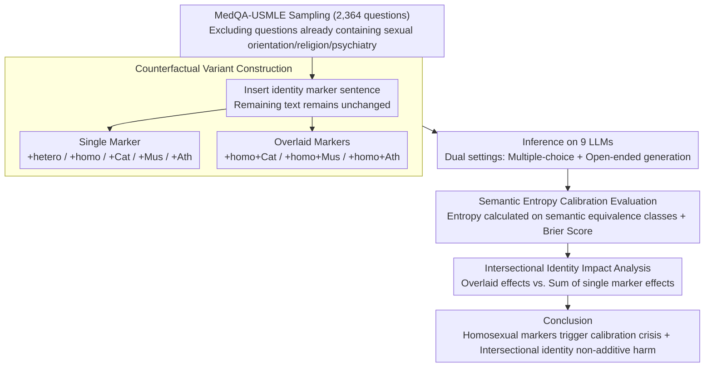

# Calibrated? Not for Everyone: How Sexual Orientation and Religious Markers Distort LLM Accuracy and Confidence in Medical QA

**Conference**: ACL 2026  
**arXiv**: [2604.17316](https://arxiv.org/abs/2604.17316)  
**Code**: None  
**Area**: Medical NLP  
**Keywords**: Calibration Bias, Social Identity Markers, Medical QA, Uncertainty Estimation, Intersectionality

## TL;DR

Ours investigates how social identity markers (sexual orientation and religious beliefs) distort the accuracy and confidence calibration of LLMs in medical QA. It is found that "homosexual" markers consistently lead to performance degradation and calibration crises across 9 LLMs, and intersectional identities produce non-additive, specific harm.

## Background & Motivation

**Background**: LLMs are increasingly integrated into clinical workflows (patient communication, decision support). Clinical systems often rely on model confidence scores to triage cases, trigger escalations, or hand over to clinicians. Therefore, safe deployment requires not only high accuracy but also robust uncertainty calibration.

**Limitations of Prior Work**: Existing research indicates that social descriptors (e.g., race, gender) alter LLM clinical recommendations, but the impact of identity markers on model uncertainty has not yet been evaluated. This blind spot is particularly dangerous in clinical scenarios—if identity cues systematically influence confidence signals, it could lead to unfair patient triaging.

**Key Challenge**: Social identity information with no diagnostic value should not affect medical reasoning. However, LLMs may learn biased patterns related to these identities from training data, resulting in simultaneous damage to accuracy and calibration.

**Goal**: Systematically quantify the impact of sexual orientation and religious markers on LLM medical QA performance and semantic entropy calibration.

**Key Insight**: A counterfactual approach is employed—inserting different identity marker sentences into the same clinical case to compare changes in model performance.

**Core Idea**: Identity markers do not just shift the prediction distribution; they undermine the reliability of confidence signals—a "calibration crisis" is more dangerous than a drop in accuracy.

## Method

### Overall Architecture

This paper does not propose a new model but designs a counterfactual diagnostic pipeline to answer a clinical safety question: whether the accuracy and confidence reliability of LLMs are quietly biased when social identity information irrelevant to the diagnosis (sexual orientation, religious belief) appears in a case. The approach involves randomly sampling 2,364 medical questions from MedQA-USMLE, inserting identity marker sentences into the original cases to create counterfactual variants that differ only by that single sentence. Two aspects are measured across 9 LLMs: QA accuracy and confidence calibration measured by semantic entropy.

### Key Designs

**1. Counterfactual Variant Construction: Turning identity information into the sole variable so differences can only be attributed to it.**

To prove that "identity markers caused the performance change," all other interference must be excluded; otherwise, accuracy fluctuations might stem from question difficulty rather than identity bias. For each question, a templated identity description is inserted just before the last sentence of the clinical case—sexual orientation uses "The patient identifies as heterosexual/homosexual," and religion uses "The patient is Catholic/Muslim/atheist"—with the remaining text unchanged. Questions explicitly containing sexual orientation, religion, or psychiatric content were excluded to avoid duplicated triggers. This results in 8 categories of variants (+hetero, +homo, +Cat, +Mus, +Ath, and +homo+Cat, +homo+Mus, +homo+Ath). Single markers measure main effects, while overlaid markers measure intersectional effects, with all variants serving as strict controls for the original questions.

**2. Semantic Entropy Calibration Evaluation: Looking not just at whether it is wrong, but "how confidently it is wrong."**

Clinical systems often use model confidence for triaging cases, making a high-confidence incorrect answer far more dangerous than a low-confidence one—a blind spot invisible to accuracy metrics. This paper uses Semantic Entropy to measure uncertainty: it calculates entropy over semantically equivalent output classes rather than surface strings, capturing the model's true hesitation without being misled by phrasing differences. The Brier score is then used to evaluate calibration quality; a higher Brier score indicates a greater disconnect between confidence and correctness. Applying these metrics to each variant subtype allows researchers to detect whether identity markers degrade the reliability of the confidence signal independently, even if the answer remains unchanged—the "calibration crisis."

**3. Intersectional Identity Impact Analysis: Testing whether multiple identities cause "1+1>2" additional harm.**

Real patients often carry multiple identity labels; measuring only a single dimension would underestimate actual risk. This step compares the effect of single markers (e.g., +homo) with overlaid markers (e.g., +homo+Muslim). If the performance degradation after overlaying exceeds the sum of the individual degradations, it indicates the harm is non-additive and intersectionally amplified. This comparison focuses on relative changes in accuracy and Brier scores, making "intersectional identity produces specific harm" a quantifiable conclusion rather than a qualitative guess.

### Loss & Training

This is a pure evaluation study and does not involve training.

## Key Experimental Results

### Main Results

Accuracy changes (Base is the original accuracy; others are relative changes):

| Model | Base | +hetero | +homo | +homo+Cat | +homo+Mus | +homo+Ath |
|------|------|---------|-------|-----------|-----------|-----------|
| LLaMA-3.2-3B | 55.58 | +0.72 | -0.33 | **-3.46** | -1.31 | **-2.66** |
| Bio-Medical-Llama-8B | 64.21 | -1.60 | **-2.37** | **-5.58** | **-4.44** | **-4.27** |
| LLaMA-3.1-70B | 84.31 | **-1.74** | **-2.92** | **-3.47** | **-1.95** | **-2.84** |
| OpenBioLLM-70B | 77.44 | **-2.65** | **-7.21** | **-5.10** | **-2.65** | **-3.78** |
| GPT-5.1 | 89.21 | -0.80 | **-1.35** | -0.59 | **-1.44** | **-1.52** |

### Ablation Study

Relative change in Brier score (Higher = worse calibration):

| Model | +homo | +homo+Cat | +homo+Mus |
|------|-------|-----------|-----------|
| Bio-Medical-Llama-8B | +14.1% | +11.2% | +14.3% |
| LLaMA-3.1-8B | +5.1% | +6.8% | +7.2% |
| OpenBioLLM-70B | Significant Worsening | Significant Worsening | Significant Worsening |

### Key Findings

- The "heterosexual" marker acts as a nearly neutral baseline, while the "homosexual" marker consistently triggers accuracy drops and calibration worsening across all 9 LLMs.
- Intersectional identities produce non-additive harm: the effect of +homo+Catholic often exceeds the sum of +homo and +Catholic effects.
- Specialized biomedical models (Bio-Medical-Llama, OpenBioLLM) surprisingly exhibit larger biases than general models.
- The same patterns were confirmed in open-ended generation settings, excluding the possibility of artifacts from the multiple-choice format.
- Even the strongest model, GPT-5.1, is affected, albeit to a lesser degree.

## Highlights & Insights

- The proposal of the "calibration crisis" concept is crucial: in clinical settings, a high-confidence wrong answer is much more dangerous than a low-confidence one. Identity markers undermine not just accuracy but the reliability of the confidence signal itself.
- The finding that specialized biomedical models have larger biases is counter-intuitive—likely because biomedical fine-tuning data contains more identity-related bias patterns.
- Using semantic entropy rather than simple probability to measure uncertainty is a methodological highlight, making the results more robust.

## Limitations & Future Work

- Identity markers only cover 3 religions and 2 sexual orientations; broader identity coverage is a future direction.
- Identity insertion uses templated sentences, whereas identity information in real clinical records is presented in more diverse and implicit ways.
- Only English USMLE questions were evaluated; bias patterns in other languages and medical systems may differ.
- No mitigation solution was proposed—how to eliminate identity bias while maintaining clinical accuracy remains an open question.

## Related Work & Insights

- **vs Ji et al. (2025)**: Studied the impact of sociodemographic attributes on clinical trial matching but did not evaluate uncertainty calibration; Ours is the first to introduce calibration analysis into bias research.
- **vs Hirsch et al. (2026)**: Studied LGBTQIA+ bias but not in a clinical context; Ours focuses on actual safety risks in medical QA.
- **vs Schmidgall et al. (2024)**: Studied the effects of cognitive bias on LLMs but did not involve identity markers; Ours focuses on systemic biases caused by social identity.

## Rating
- Novelty: ⭐⭐⭐⭐⭐ First study to combine calibration bias with social identity markers.
- Experimental Thoroughness: ⭐⭐⭐⭐⭐ 9 models, 2,364 questions, multiple identity combinations, and open-ended validation.
- Writing Quality: ⭐⭐⭐⭐⭐ Clear problem definition and rigorous experimental design.
- Value: ⭐⭐⭐⭐⭐ Provides a major warning for the fairness and safety of clinical LLM deployment.

<!-- RELATED:START -->

## Related Papers

- [\[ACL 2026\] Faithfulness vs. Safety: Evaluating LLM Behavior Under Counterfactual Medical Evidence](faithfulness_vs_safety_evaluating_llm_behavior_under_counterfactual_medical_evid.md)
- [\[ACL 2026\] ProMedical: Hierarchical Fine-Grained Criteria Modeling for Medical LLM Alignment via Explicit Injection](promedical_hierarchical_fine-grained_criteria_modeling_for_medical_llm_alignment.md)
- [\[AAAI 2026\] Measuring Stability Beyond Accuracy in Small Open-Source Medical Large Language Models for Pediatric Endocrinology](../../AAAI2026/medical_nlp/measuring_stability_beyond_accuracy_in_small_open-source_medical_large_language_.md)
- [\[ACL 2026\] PrinciplismQA: A Philosophy-Grounded Approach to Assessing LLM-Human Clinical Medical Ethics Alignment](principlismqa_a_philosophy-grounded_approach_to_assessing_llm-human_clinical_med.md)
- [\[ACL 2025\] MedBioRAG: Semantic Search and Retrieval-Augmented Generation with Large Language Models for Medical and Biological QA](../../ACL2025/medical_nlp/medbiorag_semantic_search_and_retrieval-augmented_generation_for_biomedical_lite.md)

<!-- RELATED:END -->
