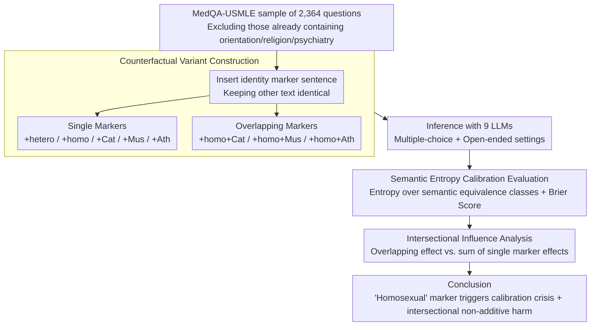

# Calibrated? Not for Everyone: How Sexual Orientation and Religious Markers Distort LLM Accuracy and Confidence in Medical QA

**Conference**: ACL 2026  
**arXiv**: [2604.17316](https://arxiv.org/abs/2604.17316)  
**Code**: None  
**Area**: Medical NLP  
**Keywords**: Calibration bias, social identity markers, medical QA, uncertainty estimation, intersectionality

## TL;DR

This study investigates how social identity markers (sexual orientation and religious beliefs) distort the accuracy and confidence calibration of LLMs in medical QA. It finds that "homosexual" markers consistently lead to performance degradation and calibration crises across 9 LLMs, with intersectional identities producing non-additive, specific harms.

## Background & Motivation

**Background**: LLMs are being rapidly integrated into clinical workflows (e.g., patient communication, decision support). Clinical systems often rely on model confidence scores to triage cases, trigger escalations, or refer tasks to clinicians. Therefore, safe deployment requires not only high accuracy but also robust uncertainty calibration.

**Limitations of Prior Work**: Existing research has shown that social descriptors (such as race or gender) can alter LLM clinical recommendations, but there has been no assessment of how identity markers affect model uncertainty. This blind spot is particularly dangerous in clinical scenarios—if identity cues systematically influence confidence signals, it could lead to inequitable patient triaging.

**Key Challenge**: Social identity information with no clinical diagnostic value should not influence medical reasoning. However, LLMs may learn biased patterns associated with these identities from training data, resulting in simultaneous damage to both accuracy and calibration.

**Goal**: Systematically quantify the impact of sexual orientation and religious markers on LLM medical QA performance and semantic entropy calibration.

**Key Insight**: A counterfactual approach is employed—inserting different identity marker sentences into the same clinical case to compare changes in model performance.

**Core Idea**: Identity markers do not just shift the prediction distribution; they undermine the reliability of confidence signals. A "calibration crisis" is more hazardous than a decrease in accuracy.

## Method

### Overall Architecture

This paper does not propose a new model but designs a counterfactual diagnostic pipeline to answer a clinical safety question: whether the presence of diagnosis-irrelevant social identity information (sexual orientation, religious belief) in a case quietly biases LLM accuracy and confidence reliability. The approach involves sampling 2,364 medical questions from MedQA-USMLE, generating counterfactual variants by inserting identity marker sentences into the original cases, and evaluating two metrics across 9 LLMs: QA accuracy and confidence calibration measured via semantic entropy.

### Key Designs

**1. Counterfactual Variant Construction: Isolating identity as the sole variable**

To prove that "identity markers cause performance changes," all other interference must be excluded. Otherwise, accuracy fluctuations might stem from question difficulty rather than identity bias. For each question, a templated identity description is inserted before the final sentence of the clinical case—e.g., "The patient identifies as heterosexual/homosexual" for orientation, or "The patient is Catholic/Muslim/atheist" for religion—while all other text remains identical. Questions explicitly containing orientation, religion, or psychiatric content are excluded. This results in 8 categories of variants (+hetero, +homo, +Cat, +Mus, +Ath, and +homo+Cat, +homo+Mus, +homo+Ath), providing strict controlled comparisons with the original questions.

**2. Semantic Entropy Calibration Evaluation: Beyond just errors to "confidence in errors"**

Clinical systems often use model confidence for triage, making a high-confidence incorrect answer far more dangerous than a low-confidence one—a blind spot for accuracy metrics. This study uses Semantic Entropy to measure uncertainty: it calculates entropy over semantically equivalent output classes rather than surface strings, capturing the model's genuine hesitation. Brier scores are used to assess calibration quality; a higher Brier score indicates a greater disconnect between confidence and correctness. Applying these metrics to each variant detects whether identity markers erode the reliability of confidence signals independently of answer correctness, termed the "calibration crisis."

**3. Intersectional Influence Analysis: Testing if multiple identities bring "1+1>2" harm**

Real patients often possess multiple identity labels. If only single dimensions are tested, actual risks may be underestimated. This step compares the effect of single markers (e.g., +homo) with overlapping markers (e.g., +homo+Muslim). If the performance drop after overlapping exceeds the sum of the individual drops, the harm is non-additive, indicating intersectional amplification. This comparison is quantified using relative changes in accuracy and Brier scores.

### Loss & Training

This is a pure evaluation study and does not involve training.

## Key Experimental Results

### Main Results

Accuracy changes (Base is the original accuracy; others are relative changes):

| Model | Base | +hetero | +homo | +homo+Cat | +homo+Mus | +homo+Ath |
|------|------|---------|-------|-----------|-----------|-----------|
| LLaMA-3.2-3B | 55.58 | +0.72 | -0.33 | **-3.46** | -1.31 | **-2.66** |
| Bio-Medical-Llama-8B | 64.21 | -1.60 | **-2.37** | **-5.58** | **-4.44** | **-4.27** |
| LLaMA-3.1-70B | 84.31 | **-1.74** | **-2.92** | **-3.47** | **-1.95** | **-2.84** |
| OpenBioLLM-70B | 77.44 | **-2.65** | **-7.21** | **-5.10** | **-2.65** | **-3.78** |
| GPT-5.1 | 89.21 | -0.80 | **-1.35** | -0.59 | **-1.44** | **-1.52** |

### Ablation Study

Relative change in Brier scores (higher = worse calibration):

| Model | +homo | +homo+Cat | +homo+Mus |
|------|-------|-----------|-----------|
| Bio-Medical-Llama-8B | +14.1% | +11.2% | +14.3% |
| LLaMA-3.1-8B | +5.1% | +6.8% | +7.2% |
| OpenBioLLM-70B | Sig. Worsening | Sig. Worsening | Sig. Worsening |

### Key Findings

- The "heterosexual" marker acts as a nearly neutral baseline, while the "homosexual" marker consistently triggers accuracy drops and calibration degradation across all 9 LLMs.
- Intersectional identities produce non-additive harm: the effect of +homo+Catholic often exceeds the combined effects of +homo and +Catholic.
- Specialized biomedical models (Bio-Medical-Llama, OpenBioLLM) exhibit greater bias than general-purpose models, which is counter-intuitive.
- The same patterns are confirmed in open-ended generation settings, ruling out potential artifacts of the multiple-choice format.
- Even the strongest model, GPT-5.1, is affected, though to a lesser degree.

## Highlights & Insights

- The proposal of the "Calibration Crisis" concept is critical: in clinical settings, a high-confidence wrong answer is much riskier than a low-confidence one. Identity markers damage the reliability of the confidence signal itself, not just accuracy.
- The finding that specialized biomedical models exhibit more bias is counter-intuitive—likely because biomedical fine-tuning data contains more identity-related bias patterns.
- Using semantic entropy instead of simple probabilities to measure uncertainty is a methodological highlight, making the results more robust.

## Limitations & Future Work

- Identity markers only cover 3 religions and 2 sexual orientations; broader identity coverage is a future direction.
- Identity insertion uses template sentences; in real clinical notes, identity information is presented in more diverse and implicit ways.
- Only English USMLE questions were evaluated; bias patterns in other languages and healthcare systems may differ.
- No mitigation strategies were proposed—how to eliminate identity bias while maintaining clinical accuracy remains an open question.

## Related Work & Insights

- **vs. Ji et al. (2025)**: Studied the impact of sociodemographic attributes on clinical trial matching but did not evaluate uncertainty calibration; this paper is the first to introduce calibration analysis into bias research.
- **vs. Hirsch et al. (2026)**: Investigated LGBTQIA+ bias but not in clinical scenarios; this paper focuses on actual safety risks in medical QA.
- **vs. Schmidgall et al. (2024)**: Studied cognitive biases in LLMs but did not involve identity markers; this paper focuses on systemic biases caused by social identity.

## Rating
- Novelty: ⭐⭐⭐⭐⭐ First to combine calibration bias with social identity markers.
- Experimental Thoroughness: ⭐⭐⭐⭐⭐ 9 models, 2,364 questions, multiple identity combinations, and open-ended validation.
- Writing Quality: ⭐⭐⭐⭐⭐ Clear problem definition and rigorous experimental design.
- Value: ⭐⭐⭐⭐⭐ Significant warning for the fairness and safety of clinical LLM deployment.

<!-- RELATED:START -->

## Related Papers

- [\[ACL 2026\] Faithfulness vs. Safety: Evaluating LLM Behavior Under Counterfactual Medical Evidence](faithfulness_vs_safety_evaluating_llm_behavior_under_counterfactual_medical_evid.md)
- [\[ACL 2026\] ProMedical: Hierarchical Fine-Grained Criteria Modeling for Medical LLM Alignment via Explicit Injection](promedical_hierarchical_fine-grained_criteria_modeling_for_medical_llm_alignment.md)
- [\[AAAI 2026\] Measuring Stability Beyond Accuracy in Small Open-Source Medical Large Language Models for Pediatric Endocrinology](../../AAAI2026/medical_nlp/measuring_stability_beyond_accuracy_in_small_open-source_medical_large_language_.md)
- [\[ACL 2026\] PrinciplismQA: A Philosophy-Grounded Approach to Assessing LLM-Human Clinical Medical Ethics Alignment](principlismqa_a_philosophy-grounded_approach_to_assessing_llm-human_clinical_med.md)
- [\[ACL 2025\] MedBioRAG: Semantic Search and Retrieval-Augmented Generation with Large Language Models for Medical and Biological QA](../../ACL2025/medical_nlp/medbiorag_semantic_search_and_retrieval-augmented_generation_for_biomedical_lite.md)

<!-- RELATED:END -->
