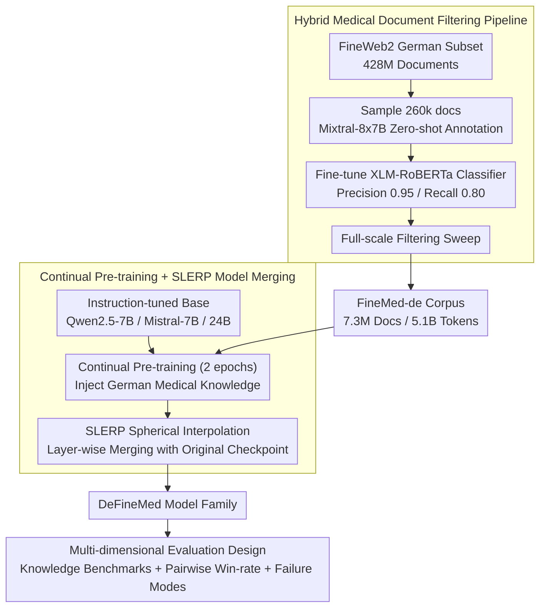

# Can Continual Pre-training Bridge the Performance Gap between General-purpose and Specialized Language Models in the Medical Domain?

**Conference**: ACL 2026  
**arXiv**: [2604.19394](https://arxiv.org/abs/2604.19394)  
**Code**: None  
**Area**: Medical NLP  
**Keywords**: Continual Pre-training, Domain Adaptation, German Medical LLM, Model Merging, Data Filtering

## TL;DR

This paper constructs a high-quality German medical corpus, FineMed-de (7.3 million documents/5.1 billion tokens filtered from FineWeb2), performs continual pre-training and SLERP model merging on three LLMs (7B-24B) to create the DeFineMed model family. It demonstrates that domain-specialized 7B models can significantly bridge the performance gap with 24B general-purpose models on German medical tasks (with approximately a 3.5x increase in win rate).

## Background & Motivation

**Background**: LLMs have demonstrated transformative potential in the medical field, but integrating them into clinical workflows remains challenging. General-purpose models often fail to capture domain-specific knowledge and terminology with sufficient accuracy.

**Limitations of Prior Work**: (1) Strict data protection regulations require local deployment, making large-scale API services infeasible and favoring smaller models; (2) Small models lack the support of domain-specific data, making it difficult to process complex medical terminology; (3) High-quality medical data in languages other than English (particularly German) is scarce.

**Key Challenge**: Regulatory constraints necessitate the use of small models, yet these models require targeted domain knowledge to reach clinical-grade performance—creating a critical trade-off between compliance and performance.

**Goal**: To adapt models through continual pre-training and model merging, enabling 7B models to compete with 24B general-purpose models in complex medical tasks.

**Key Insight**: Develop a comprehensive methodology from data filtering to model adaptation, combining LLM-assisted annotation with classical ML classifiers to achieve scalable data screening.

**Core Idea**: High-quality domain data + Continual Pre-training + Model Merging can transform resource-efficient small models into competitive solutions for complex medical tasks.

## Method

### Overall Architecture

The methodology is divided into two primary components: (1) **Medical Filtering Pipeline**: Uses Mixtral for zero-shot annotation of a German subset of FineWeb2, followed by training an XLM-RoBERTa classifier to scale to the full dataset, resulting in the FineMed-de corpus; (2) **Model Adaptation**: Performs continual pre-training on instruction-tuned models, then employs SLERP to merge them with the original instruction-tuned checkpoints to restore instruction-following capabilities. Finally, a multi-dimensional evaluation examines whether DeFineMed effectively bridges the gap with larger models.

### Key Designs

**1. Hybrid Medical Document Filtering Pipeline: Feeding Classical Classifier Throughput with LLM Annotation Quality**

High-quality German medical corpora are scarce, while the FineWeb2 German subset contains a raw treasure trove of 428 million documents. The challenge is extracting the "medical" subset at an affordable cost—using LLMs for document-by-document classification is high-quality but prohibitively expensive, while pure keyword matching conflates "medical news" with "clinical guidelines." This paper adopts a two-stage approach: first, sampling 260,000 documents for zero-shot medical/non-medical binary classification via Mixtral-8x7B (human audit F1=91.1%). This high-quality annotation serves as a training signal to fine-tune a 279M XLM-RoBERTa classifier (Precision 0.95, Recall 0.80). This lightweight classifier then sweeps all 428 million documents, yielding 7.3 million medical documents (5.1 billion tokens), named FineMed-de. The LLM "defines medical relevance," while the small classifier "deploys this definition cheaply," maximizing both quality and cost-efficiency.

**2. Continual Pre-training + SLERP Model Merging: Injecting Knowledge and Restoring Eroded Instruction Capabilities**

Continual pre-training on domain corpora often suffers from a known issue: the next-token objective can erode the dialogue and following capabilities established during instruction tuning, leading to catastrophic forgetting. This work first performs 2 epochs of continual pre-training on instruction-tuned models using FineMed-de (utilizing FSDP + Flash Attention + Mixed Precision) to inject German medical knowledge. Subsequently, SLERP (Spherical Linear Interpolation) is used to merge the pre-trained weights with the original instruction-tuned checkpoints layer by layer. SLERP finds a balance between "newly injected domain knowledge" and "original instruction-following capability" without additional fine-tuning, effectively recovering lost dialogue capabilities through near-zero-cost weight fusion. This process is applied to Qwen2.5-7B, Mistral-7B, and Mistral-Small-24B, resulting in the DeFineMed model family.

**3. Multi-dimensional Evaluation Design: Using Complementary Probes to Prevent Single Benchmarks from Masking Reality**

To understand what domain adaptation provides and at what cost, the evaluation is split into three orthogonal axes: knowledge-intensive benchmarks (MMLU-de medical subset + MedQA-de) to measure "stored medical knowledge"; pairwise win-rate analysis to measure how well "complex medical instructions are followed"—crucial evidence for whether 7B can challenge 24B; and failure mode analysis to monitor side effects. While SLERP merging restores instruction capabilities, it also introduces issues like German-English language mixing and increased verbosity. Explicitly measuring these costs provides an honest boundary for the "7B competing with 24B" conclusion.

### Loss & Training

Continual pre-training utilizes the standard language modeling objective (next token prediction), the AdamW optimizer, linear learning rate decay, and a 500-step warmup. Training efficiency is optimized via FSDP, Flash Attention, activation checkpointing, and sequence packing.

## Key Experimental Results

### Main Results

**Average Accuracy on German Medical Benchmarks**

| Model | Average Accuracy |
|------|----------|
| BioMistral-7B (Baseline) | 43.55 |
| BioMistral-7B-SLERP | 48.22 |
| Mistral-7B-Instruct | 49.73 |
| DeFineMed-Mistral-7B-SLERP | **56.46** |
| Qwen2.5-7B-Instruct | 59.08 |
| DeFineMed-Qwen2.5-7B | **64.91** |

### Ablation Study

- The Qwen2.5-based DeFineMed 7B model showed approximately a 3.5x increase in win rate against Mistral-Small-24B-Instruct in pairwise analysis.
- Model merging (SLERP) successfully recovered instruction-following capabilities but introduced side effects such as language mixing (German-English) and increased verbosity.
- The improvement from continual pre-training was greater for the Qwen2.5 base model (+5.83) than for the Mistral model (+6.73), though both were significant.

### Key Findings

- Continual pre-training + model merging can enable 7B models to approach or even compete with 24B models on German medical tasks.
- Data quality is more important than data scale—a carefully filtered 5.1 billion token corpus is sufficient for significant improvements.
- Model merging is effective for restoring instruction-following capabilities but involves inherent trade-offs like language mixing.
- The choice of base model has a major impact on the final performance (Qwen2.5 > Mistral).

## Highlights & Insights

- The hybrid data filtering pipeline (LLM annotation + ML classifier) is practical and replicable for other domains and languages.
- The "7B competing with 24B" conclusion has significant practical implications for resource-constrained clinical scenarios.
- Failure mode analysis (language mixing, verbosity) provides a transparent assessment of trade-offs.
- The methodology can be directly generalized to medical LLM development for other non-English languages.

## Limitations & Future Work

- Focused solely on German without extension to other languages.
- Language mixing and verbosity issues require subsequent targeted fine-tuning.
- The optimal sequence of continual pre-training and instruction tuning remains an open question.
- Model usability has not been validated in real-world clinical settings.

## Related Work & Insights

- Compared to BioMistral, this work focuses not only on benchmark score improvements but also on the competitiveness of small models against large models.
- While Apollo-2 follows an instruction-tuning route, this work follows a continual pre-training route; the two are complementary.
- The efficacy of SLERP in the medical domain is further validated.

## Rating

- Novelty: ⭐⭐⭐ The components of the method are known techniques, but their combined application for the German medical scenario is valuable.
- Experimental Thoroughness: ⭐⭐⭐⭐ Complete evaluation across multiple benchmarks, win-rate analysis, and failure mode analysis.
- Writing Quality: ⭐⭐⭐⭐ Clear structure and rational experimental design.

<!-- RELATED:START -->

## Related Papers

- [\[ACL 2026\] Beyond the Leaderboard: Rethinking Medical Benchmarks for Large Language Models](beyond_the_leaderboard_rethinking_medical_benchmarks_for_large_language_models.md)
- [\[ACL 2026\] Inflated Excellence or True Performance? Rethinking Medical Diagnostic Benchmarks with Dynamic Evaluation](inflated_excellence_or_true_performance_rethinking_medical_diagnostic_benchmarks.md)
- [\[ICLR 2026\] SimpleToM: Exposing the Gap between Explicit ToM Inference and Implicit ToM Application in LLMs](../../ICLR2026/medical_nlp/simpletom_exposing_the_gap_between_explicit_tom_inference_and_implicit_tom_appli.md)
- [\[ACL 2026\] Text-Attributed Knowledge Graph Enrichment with Large Language Models for Medical Concept Representation](text-attributed_knowledge_graph_enrichment_with_large_language_models_for_medica.md)
- [\[ACL 2026\] Empathy Applicability Modeling for General Health Queries](empathy_applicability_modeling_for_general_health_queries.md)

<!-- RELATED:END -->
