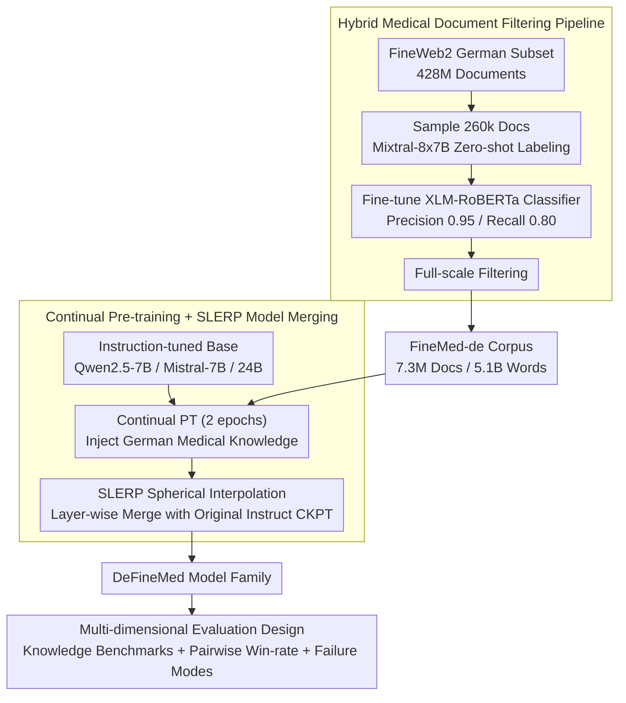

# Can Continual Pre-training Bridge the Performance Gap between General-purpose and Specialized Language Models in the Medical Domain?

**Conference**: ACL 2026  
**arXiv**: [2604.19394](https://arxiv.org/abs/2604.19394)  
**Code**: None  
**Area**: Medical NLP  
**Keywords**: Continual Pre-training, Domain Adaptation, German Medical LLM, Model Merging, Data Filtering

## TL;DR

This paper constructs a high-quality German medical corpus, FineMed-de (7.3 million documents / 5.1 billion tokens filtered from FineWeb2), performs continual pre-training and SLERP model merging on three LLMs (7B-24B) to create the DeFineMed model family. It demonstrates that domain-specialized 7B models can significantly bridge the performance gap with general 24B models on German medical tasks (win rate improved by ~3.5x).

## Background & Motivation

**Background**: LLMs have shown transformative potential in the medical field, but integrating them into clinical workflows remains challenging. General-purpose models often fail to capture domain-specific knowledge and terminology with sufficient accuracy.

**Limitations of Prior Work**: (1) Strict data protection regulations necessitate local deployment, making large-scale API services unfeasible and favoring smaller models; (2) Small models lack domain-specific data support, making it difficult to handle complex medical terminology; (3) High-quality medical data for non-English languages (especially German) is scarce.

**Key Challenge**: Regulatory constraints require the use of small models, but small models need targeted domain knowledge to reach clinically applicable performance levels—this creates a critical trade-off between compliance and performance.

**Goal**: To achieve domain adaptation through continual pre-training and model merging, enabling 7B models to compete with 24B general-purpose models on complex medical tasks.

**Key Insight**: Build a complete methodology from data filtering to model adaptation, combining LLM-assisted labeling with classical ML classifiers for scalable data screening.

**Core Idea**: High-quality domain data + continual pre-training + model merging can make resource-efficient small models a competitive solution for complex medical tasks.

## Method

### Overall Architecture

The methodology consists of two major parts: (1) **Medical Filtering Pipeline**—using Mixtral for zero-shot labeling of the FineWeb2 German subset, training an XLM-RoBERTa classifier to scale to the full dataset, resulting in the FineMed-de corpus; (2) **Model Adaptation**—performing continual pre-training on instruction-tuned models, followed by SLERP model merging with the original instruction-tuned checkpoints to restore instruction-following capabilities. Finally, a multi-dimensional evaluation examines whether DeFineMed truly closes the gap with larger models.

### Key Designs

**1. Hybrid Medical Document Filtering Pipeline: Feeding the throughput of classical classifiers with the labeling quality of LLMs**

High-quality German medical corpora are scarce, while the FineWeb2 German subset contains a raw treasure of 428 million documents. The difficulty lies in extracting the "medical" portion at an affordable cost—using an LLM for document-by-document quality assessment is effective but too expensive for the full scale, while pure keywords would conflate "medical news" with "clinical guidelines." Ours follows a two-stage approach: first, sample 260,000 documents for zero-shot binary classification (medical/non-medical) using Mixtral-8x7B (human-verified F1=91.1%). These high-quality labels are used as training signals to fine-tune a 279M XLM-RoBERTa classifier (Precision 0.95, Recall 0.80). This lightweight classifier then sweeps all 428 million documents, filtering out 7.3 million medical documents (5.1 billion words), named FineMed-de. The LLM "defines what is medical," while the small classifier "spreads this definition across the full volume cheaply."

**2. Continual Pre-training + SLERP Model Merging: Injecting knowledge and interpolating back instruction capabilities**

Continual pre-training directly on domain corpora often suffers from catastrophic forgetting, where the next-token objective erodes the dialogue and following capabilities established during instruction fine-tuning. Ours performs 2 epochs of continual pre-training on instruction-tuned models using FineMed-de (FSDP + Flash Attention + mixed precision) to inject German medical knowledge. Subsequently, SLERP (Spherical Linear Interpolation) is used to merge the pre-trained weights with the original instruction-tuned checkpoints layer by layer. SLERP finds a balancing point between "newly injected domain knowledge" and "original instruction-following capability" without additional fine-tuning, effectively recovering conversation skills lost during C-PT. This process is applied to Qwen2.5-7B, Mistral-7B, and Mistral-Small-24B.

**3. Multi-dimensional Evaluation Design: Using complementary probes to reveal real performance gaps**

To understand what domain adaptation gains and costs, accuracy alone is insufficient. Ours splits evaluation into three orthogonal axes: Knowledge-intensive benchmarks (MMLU-de medical subset + MedQA-de) to measure "retained medical knowledge"; pairwise win-rate analysis to measure "complex medical instruction following," which is key evidence for whether 7B can challenge 24B; and failure mode analysis to monitor side effects—specifically language mixing (German-English) and increased verbosity introduced by SLERP.

### Loss & Training

Continual pre-training uses the standard language modeling objective (next token prediction), AdamW optimizer, linear learning rate decay, and 500 steps of warmup. Training efficiency is optimized using FSDP, Flash Attention, activation checkpointing, and sequence packing.

## Key Experimental Results

### Main Results

**Average Accuracy on German Medical Benchmarks**

| Model | Average Accuracy |
|------|----------|
| BioMistral-7B (Baseline) | 43.55 |
| BioMistral-7B-SLERP | 48.22 |
| Mistral-7B-Instruct | 49.73 |
| DeFineMed-Mistral-7B-SLERP | **56.46** |
| Qwen2.5-7B-Instruct | 59.08 |
| DeFineMed-Qwen2.5-7B | **64.91** |

### Ablation Study

- The Qwen2.5-based DeFineMed 7B model showed an approximate 3.5x increase in win rate against Mistral-Small-24B-Instruct in pairwise analysis.
- Model merging (SLERP) successfully restored instruction-following capabilities but introduced side effects such as language mixing (German-English) and increased verbosity.
- The improvement from continual pre-training for the Qwen2.5 base model (+5.83) was lower than for the Mistral model in relative terms, but both were significant (+6.73).

### Key Findings

- Continual pre-training + model merging allows 7B models to approach or even compete with 24B models on German medical tasks.
- Data quality is more important than data scale—a carefully filtered 5.1-billion-token corpus is sufficient for significant improvements.
- Model merging is effective for restoring instruction-following capabilities but involves inherent trade-offs like language mixing.
- The choice of base model (Qwen2.5 > Mistral) has a major impact on final performance.

## Highlights & Insights

- The hybrid data filtering pipeline (LLM labeling + ML classifier) is practical and replicable for other domains/languages.
- The conclusion that "7B competes with 24B" has significant practical implications for resource-constrained clinical settings.
- Failure mode analysis (language mixing, verbosity) provides an honest assessment of trade-offs.
- The methodology is directly generalizable to the development of medical LLMs in other non-English languages.

## Limitations & Future Work

- Focused only on German; not yet extended to other languages.
- Language mixing and verbosity issues require subsequent targeted fine-tuning.
- The optimal order of continual pre-training and instruction fine-tuning remains an open question.
- Model usability has not been validated in real-world clinical scenarios.

## Related Work & Insights

- Compared to BioMistral, Ours focuses not just on benchmark score improvements but on the competitiveness of small models against large models.
- While Apollo-2 uses an instruction fine-tuning route, Ours utilizes a continual pre-training route, which is complementary.
- The effectiveness of SLERP in the medical domain is further validated.

## Rating

- Novelty: ⭐⭐⭐ Components are known, but the combination for the German medical scenario is valuable.
- Experimental Thoroughness: ⭐⭐⭐⭐ Complete evaluation across benchmarks, win-rate, and failure modes.
- Writing Quality: ⭐⭐⭐⭐ Clear structure and rational experimental design.

<!-- RELATED:START -->

## Related Papers

- [\[ACL 2026\] Beyond the Leaderboard: Rethinking Medical Benchmarks for Large Language Models](beyond_the_leaderboard_rethinking_medical_benchmarks_for_large_language_models.md)
- [\[ACL 2026\] Inflated Excellence or True Performance? Rethinking Medical Diagnostic Benchmarks with Dynamic Evaluation](inflated_excellence_or_true_performance_rethinking_medical_diagnostic_benchmarks.md)
- [\[ACL 2026\] Text-Attributed Knowledge Graph Enrichment with Large Language Models for Medical Concept Representation](text-attributed_knowledge_graph_enrichment_with_large_language_models_for_medica.md)
- [\[ICLR 2026\] SimpleToM: Exposing the Gap between Explicit ToM Inference and Implicit ToM Application in LLMs](../../ICLR2026/medical_nlp/simpletom_exposing_the_gap_between_explicit_tom_inference_and_implicit_tom_appli.md)
- [\[ACL 2026\] Empathy Applicability Modeling for General Health Queries](empathy_applicability_modeling_for_general_health_queries.md)

<!-- RELATED:END -->
