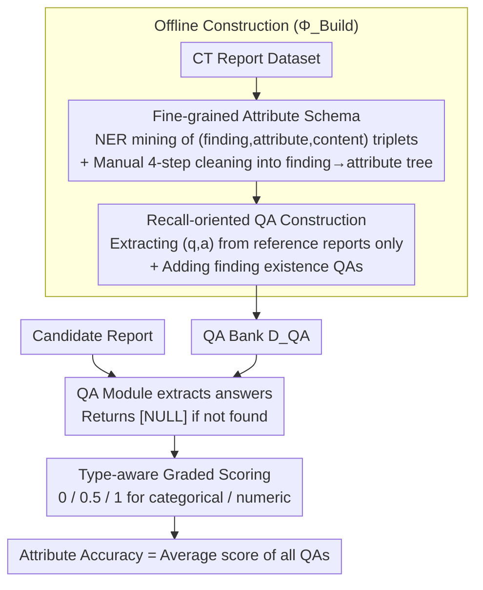

# CT-FineBench: A Diagnostic Fidelity Benchmark for Fine-Grained Evaluation of CT Report Generation

**Conference**: ACL 2026  
**arXiv**: [2604.24001](https://arxiv.org/abs/2604.24001)  
**Code**: Not yet released  
**Area**: Medical NLP  
**Keywords**: CT Report Generation, Fine-grained Evaluation, QA-based metric, Clinical Attributes, CT-RATE, Merlin

## TL;DR
The authors decompose the ambiguous question of "quality of a CT report" into a QA checklist of "whether each fine-grained attribute of every finding matches," constructing the CT-FineBench benchmark with 44k questions. Its sensitivity to clinical errors and correlation with human expert scores significantly outperform existing metrics such as BLEU, BERTScore, RadGraph, RaTEScore, and GREEN.

## Background & Motivation
**Background**: Evaluation of automated radiology report generation (especially 3D CT reports) currently follows three main paths: lexical overlap-based (BLEU/ROUGE), embedding-based (BERTScore), and "medical-aware" entity-level metrics (CheXbert F1, RadGraph, RaTEScore) or LLM-as-Judge (GREEN).

**Limitations of Prior Work**: The first category only considers literal similarity, scoring reports high even if they are stylistically similar but clinically incorrect. The second category only compares coarse-grained entities (e.g., whether "lung nodule" is mentioned) while ignoring fine-grained attributes that truly determine diagnosis—location, size, morphology, density, and margin. The third category (LLM black-box scoring) lacks unified standards, has poor interpretability, and fluctuates wildly across datasets (GREEN scores 35.8 on CT-RATE but drops to 1.3 on Merlin). CT reports are often over a thousand words with dense attributes; changing "1.2cm solid nodule in the right lung" to "5mm ground-glass nodule in the left lung" is nearly undetectable by traditional metrics but is a clinical disaster.

**Key Challenge**: Evaluation needs to be "sensitive to clinical errors" and "robust to paraphrasing." Existing metrics are either insensitive to both or confuse the two—BLEU/ROUGE drops to 28 on paraphrased reports (CT-RATE-pos) but soars to 70 on erroneous reports (CT-RATE-neg), showing a completely inverse trend.

**Goal**: (1) Lower the evaluation granularity from coarse-grained finding levels to fine-grained attribute levels; (2) Reformulate "overall scoring" into a factual verification problem via "point-by-point QA validation," making evaluations interpretable and traceable to specific clinical error points.

**Key Insight**: Borrowing from the QAFactEval paradigm in the general domain for QA-based factual consistency—instead of letting the model judge the report as a whole, directly ask "Where is the lesion?" or "What is the nodule diameter in mm?" and verify the answers.

**Core Idea**: Offline, each reference report is parsed into a "finding × attribute" QA checklist. Online, a QA model extracts answers from candidate reports and performs type-aware (categorical/numeric/null) graded comparisons (0/0.5/1) against gold answers. The final score is the attribute accuracy.

## Method

### Overall Architecture
CT-FineBench consists of a three-stage pipeline, where the first two are offline ($\Phi_{\text{Build}}$) and the last is online ($\Phi_{\text{Eval}}$):

1. **Attribute Definition**: Data mining of $(finding, attribute, content)$ NER triplets from a CT report dataset, followed by manual cleaning via Remove/Split/Merge/Comment to establish a finding→attribute hierarchy schema (e.g., "lung nodule" → {Location, Shape, Density, Margin}).
2. **QA Construction**: For each reference report $x$, the system iterates through positive findings and corresponding attributes in the schema, using few-shot prompting to let an LLM generate $(q_i, a_i)$ pairs. QAs for attributes not mentioned in the report are discarded; supplementary finding-existence QAs are added to cover both coarse and fine granularities. This produces the benchmark $D_{\text{QA}} = \Phi_{\text{Build}}(\{x\}) = \{(q_i, a_i)\}$.
3. **Evaluation**: For a candidate report $\hat x$, the corresponding $D_{\text{QA}}(x)$ is retrieved. The QA module $\hat a_i = \Phi_{\text{QA}}(q_i, \hat x)$ extracts answers (returning a special `[NULL]` token if not found). The Compare module assigns 0/0.5/1 points based on attribute types, and the final average is calculated as $\text{Score}(x,\hat x) = \Phi_{\text{Eval}}(\hat x, D_{\text{QA}}(x))$.

The entire pipeline consumes significant LLM and manual labor only during the offline stage; online evaluation can be run with small local models, making it suitable for large-scale iterative evaluation.

### Key Designs

**1. Fine-grained Attribute Schema with Human-in-the-loop Curation: Explicitly building a finding→attribute tree for "what dimensions to check"**

For evaluations to be targeted, the system must first know which attributes to check for each type of lesion. This work explicitly builds this ontology as a finding→attribute tree: first, Qwen3-Max extracts $(finding, attribute, content)$ triplets across the full training and test sets. It aggregates by (finding, attribute) and discards long-tail items with frequency < 50. The remainder is handed to 4 annotators for Remove/Split/Merge/Comment steps, assisted by Gemini-2.5-Pro and GPT-5 for clinical knowledge. Purely automated extraction inevitably includes vague terms like "feature" and synonymous redundancies, while purely manual work is not exhaustive. This hybrid LLM-recall then human-induction workflow ensures the schema covers clinical essentials while remaining mutually exclusive and clear. Ultimately, CT-RATE yields 94 unique attributes (avg. 5.2 per finding) and Merlin yields 89 attributes (avg. 3.0). This tree is the basis of "what to ask."

**2. Recall-oriented Sensitivity Construction: QAs are mined only from reference reports, using dual pos/neg probes to self-verify "what is being measured"**

A good metric must simultaneously satisfy two seemingly contradictory requirements: high sensitivity to clinical errors and sufficient robustness to literal paraphrasing. All QAs in this study are mined only from reference reports (recall-oriented), so the metric naturally penalizes "omissions," though it does not directly penalize hallucinations not present in the reference. To verify sensitivity, the authors programmatically construct two control groups: the **neg** group (CT-RATE-neg / Merlin-neg) preserves phrasing but injects minimal clinical errors into fine-grained attributes like location/size; the **pos** group (CT-RATE-pos / Merlin-pos) paraphrases sentence structures and vocabulary while strictly preserving all clinical facts. An ideal metric should score near 100 on **pos** and drop significantly on **neg**. CT-FineBench scores pos=74.5 / neg=39.1 on CT-RATE, and pos=86.9 / neg=45.6 on Merlin. It is the only one among six metrics to satisfy both directional expectations—in contrast, BLEU-2 scores 70.0 on **neg** but only 28.0 on **pos**, showing a completely reversed trend.

**3. Type-aware Graded Scoring: Grading "correctness" based on attribute types instead of 0/1 hard judgment**

In CT reports, "1.0 cm vs 1.1 cm" should not be deemed entirely wrong, while "1 cm vs 5 cm" must be. ROUGE and BERTScore can neither parse numerical values nor tolerate minor differences, while simple string exact matching penalizes all variations equally. This paper provides differentiated scoring rules by attribute type: **Categorical/Location** types (e.g., density = solid / ground-glass) follow "synonym-aware exact match"—1.0 for exact, 0.5 for partial/over-specific, and 0 for wrong. **Numeric** types (size, density values) undergo unit standardization, then are graded by relative error $\epsilon = |a - \hat a|/|a|$: 1.0 for $\epsilon < 10\%$, 0.5 for $10\% \le \epsilon < 30\%$, and 0 for $\epsilon \ge 30\%$. Model output `[NULL]` is treated as a false negative (0 points). The final report score is the average of all QAs. This graded scoring keeps the tolerance interval within acceptable clinical limits.

### Loss & Training
This work is a benchmark rather than a training method, so there is no explicit loss function. Key hyperparameters: NER triplet aggregation threshold 50; numerical scoring thresholds 10% and 30%; default evaluation LLM is Qwen3-Max, with Qwen3-32B/8B used for lightweight alternatives; vLLM used for acceleration; hardware consists of A800 GPUs. The accompanying CT-FineData (439,665 QA / 44,302 reports) was produced from the training set using the same pipeline, which the authors reserved for future direct optimization of fine-grained attribute accuracy.

## Key Experimental Results

### Main Results
Multiple CT report generation models were evaluated on CT-RATE (chest, 1564 reports) and Merlin (abdomen, 5082 reports) test sets against 6 existing metrics. Key results from CT-RATE are selected below (values represent metric outputs; the lower half contains sensitivity probes):

| Report | BLEU-2 | ROUGE-L | BERTScore | RadGraph | RaTEScore | GREEN | CT-FineBench |
|------|--------|---------|-----------|----------|-----------|-------|--------------|
| RadFM | 4.1 | 12.0 | 80.6 | 2.3 | 40.7 | 3.2 | 4.4 |
| Hulu-Med | 11.5 | 20.0 | 84.2 | 9.5 | 49.8 | 15.3 | 12.2 |
| CT-CHAT | 29.0 | 35.6 | 87.5 | 21.5 | 65.2 | 35.8 | 15.8 |
| CT-RATE-pos (Paraphrased, Correct) | 28.0 | 34.3 | 89.5 | 22.2 | 77.3 | 56.1 | **74.5** |
| CT-RATE-neg (Modified, Incorrect) | 70.0 | 75.3 | 95.0 | 42.9 | 76.2 | 19.2 | **39.1** |

Observations: (1) Absolute scores of CT-FineBench on real models are much lower than BLEU/BERTScore, indicating that current CT report generators remain weak in fine-grained clinical accuracy; (2) Only CT-FineBench achieves high **pos** + low **neg** (74.5 vs 39.1). Other metrics either show pos ≈ neg (BERTScore 89.5 vs 95.0, RaTEScore 77.3 vs 76.2, indicating insensitivity) or directional inversion (BLEU-2 28.0 vs 70.0).

### Ablation Study
The authors replaced the online QA + Compare module with smaller models (Qwen3-32B / Qwen3-8B) to verify transferability:

| Configuration | CT-RATE Acc | CT-RATE Pearson τ | Merlin Acc | Merlin Pearson τ |
|------|-------------|--------------------|-------------|-------------------|
| Qwen3-Max (Default) | 15.8 | — | 22.4 | — |
| Qwen3-32B | 15.9 | 0.911 | 22.9 | 0.978 |
| Qwen3-8B | 15.0 | 0.863 | 24.6 | 0.953 |

When replaced with an open-source 32B model, the Pearson correlation with the Max score is >0.9 with nearly identical absolute scores. Appendix C reports speeds on an A800: Qwen3-8B evaluates CT-RATE at 0.42 reports/s and Merlin at 1.85 reports/s, suitable for large-scale application.

### Key Findings
- **Correlation with human experts**: Sampling 100 reports from each dataset with two radiologists providing 10-point independent scores. CT-FineBench achieved Pearson=0.622, Kendall=0.378, and Spearman=0.490 on CT-RATE, consistently exceeding the second-best RaTEScore (0.521/0.320/0.434). Stability was best across two anatomical sites.
- **Inter-metric correlation**: CT-FineBench shows only moderate correlation with traditional metrics, suggesting it captures an orthogonal set of "fine-grained clinical signals" and should complement rather than replace current metrics.
- **Performance bottleneck**: Even SOTA models (CT-CHAT, Merlin) score only 15.8 / 22.4 on CT-FineBench, far below the reference report upper bound, revealing that "apparent fluency with frequent detail failure" is the true bottleneck in the field.
- **Recall-oriented limitation**: The benchmark does not directly penalize hallucinations of findings not present in the gold standard; the authors suggest combining it with precision-based metrics.

## Highlights & Insights
- **Reframing medical report evaluation as QA fact-checking**: This reformulation allows the evaluation to precisely locate "which attribute is wrong" and provides natural interpretability—every low score corresponds to a specific $(q, a, \hat a)$ triplet.
- **Methodology of pos/neg counterfactual probes**: Programmatically synthesizing control reports to decouple "sensitivity" and "robustness" into quantifiable axes is a framework that can be transferred to metric design in summarization, code generation, etc.
- **Engineering significance of lightweight feasibility**: The >0.9 correlation between 8B/32B and Max means the benchmark can be reused frequently by any lab without relying on expensive APIs, which is crucial for becoming a community standard.
- **Value of CT-FineData**: The 440,000 training QAs serve as natural supervision signals for fine-grained attributes, which could be used for RL optimization to align the training objective with the evaluation.

## Limitations & Future Work
- **Limitations acknowledged by authors**: (1) Recall-oriented design cannot penalize hallucinations not present in gold labels; (2) The CT-FineData has not yet been used to train models; (3) The schema only covers findings already labeled in the source datasets.
- **Self-identified limitations**: The 10%/30% numeric thresholds are heuristic; different clinical scenarios may have different tolerances. The Compare module still relies on LLMs, incurring inference costs. The probes themselves are LLM-generated, which might overstate the "ideality" of the benchmark.
- **Future directions**: (1) Introduce open-attribute discovery decoupled from schemas; (2) Replace numeric thresholds with attribute-specific tolerance tables from clinical guidelines; (3) Add precision-side QAs (querying gold standards with attributes from candidate reports) for a bidirectional loop; (4) Incorporate CT-FineData into GRPO/ORPO training.

## Related Work & Insights
- **vs RadGraph / RaTEScore**: Those stop at the entity level (finding + anatomy); CT-FineBench pushes granularity down to the attribute level (size, density, margin) with explicit type-based scoring.
- **vs GREEN / LLM-as-judge**: GREEN uses holistic LLM scoring; CT-FineBench splits "judgment" into "extraction + comparison," where the LLM only handles local QA tasks, making the aggregate score much more robust.
- **vs QAFactEval**: The core idea of QA-based verification is shared, but CT-FineBench introduces the finding→attribute schema and type-aware graded scoring, proving the effectiveness of QA-based evaluation in high-expertise domains.
- **Inspiration**: The QA-based + type-aware scoring paradigm is worth replicating for any long-form generation task with strong factual constraints, such as legal, financial, or maintenance reporting.

## Rating
- **Novelty**: ⭐⭐⭐⭐ Systematically introducing QA-based factual consistency to CT report evaluation with attribute schemas and graded scoring is a solid and clear trans-disciplinary innovation.
- **Experimental Thoroughness**: ⭐⭐⭐⭐ Covers two datasets, 6 metrics, 4 generation models + counterfactual probes + human scores + lightweight LLM ablations.
- **Writing Quality**: ⭐⭐⭐⭐ Clear structure with well-coordinated formulas and flowcharts.
- **Value**: ⭐⭐⭐⭐⭐ Solves the long-standing pain point of "literal gambling" in evaluation and provides CT-FineData for training, offering direct utility to the medical report generation community.

<!-- RELATED:START -->

## Related Papers

- [\[ACL 2026\] MARCH: Multi-Agent Radiology Clinical Hierarchy for CT Report Generation](march_multi-agent_radiology_clinical_hierarchy_for_ct_report_generation.md)
- [\[ACL 2026\] CT-Flow: Orchestrating CT Interpretation Workflow with Model Context Protocol Servers](ct-flow_orchestrating_ct_interpretation_workflow_with_model_context_protocol_ser.md)
- [\[ACL 2026\] Region-Grounded Report Generation for 3D Medical Imaging: A Fine-Grained Dataset and Graph-Enhanced Framework](region-grounded_report_generation_for_3d_medical_imaging_a_fine-grained_dataset_.md)
- [\[ACL 2026\] ProMedical: Hierarchical Fine-Grained Criteria Modeling for Medical LLM Alignment via Explicit Injection](promedical_hierarchical_fine-grained_criteria_modeling_for_medical_llm_alignment.md)
- [\[ACL 2026\] Inflated Excellence or True Performance? Rethinking Medical Diagnostic Benchmarks with Dynamic Evaluation](inflated_excellence_or_true_performance_rethinking_medical_diagnostic_benchmarks.md)

<!-- RELATED:END -->
