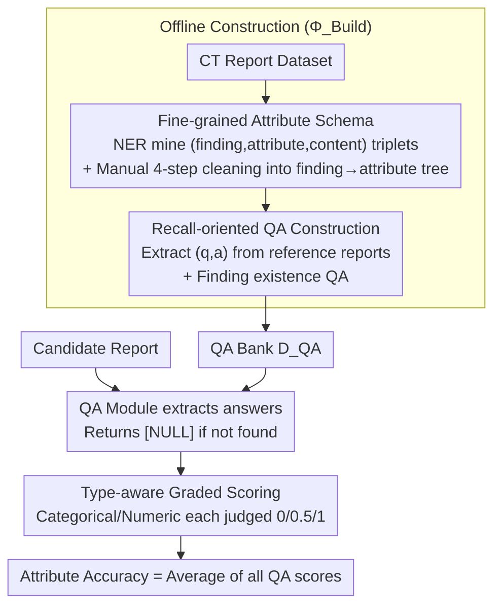

# CT-FineBench: A Diagnostic Fidelity Benchmark for Fine-Grained Evaluation of CT Report Generation

**Conference**: ACL 2026  
**arXiv**: [2604.24001](https://arxiv.org/abs/2604.24001)  
**Code**: Not yet released  
**Area**: Medical NLP  
**Keywords**: CT Report Generation, Fine-grained Evaluation, QA-based metric, Clinical Attributes, CT-RATE, Merlin

## TL;DR
The authors decompose the ambiguous question of "quality of a CT report" into a QA checklist verifying whether every fine-grained attribute of each finding is correct. They construct CT-FineBench with 44k questions, demonstrating sensitivity to clinical errors and correlation with human expert scores that significantly surpass existing metrics like BLEU, BERTScore, RadGraph, RaTEScore, and GREEN.

## Background & Motivation
**Background**: Evaluation of automated radiology report generation (especially 3D CT) currently follows three main paths: lexical overlap-based metrics (BLEU/ROUGE), embedding-based metrics (BERTScore), and more "medical-aware" entity-level metrics (CheXbert F1, RadGraph, RaTEScore) or LLM-as-Judge (GREEN).

**Limitations of Prior Work**: The first category only considers literal similarity, scoring reports high if they "sound similar" but are clinically incorrect. The second category only compares coarse-grained entities (e.g., whether a "lung nodule" is mentioned) while ignoring fine-grained attributes that determine diagnosis: location, size, morphology, density, and margin. The third category, LLM black-box scoring, lacks unified standards, has poor interpretability, and fluctuates wildly across datasets (e.g., GREEN scores 35.8 on CT-RATE but drops to 1.3 on Merlin). CT reports often exceed a thousand words with dense attributes; a "1.2cm solid nodule in the right lung" being written as a "5mm ground-glass nodule in the left lung" is nearly undetectable by traditional metrics but is a clinical disaster.

**Key Challenge**: Evaluation requires being "sensitive to clinical errors" and "robust to phrasing changes." Existing metrics either fail at both or confuse them—BLEU/ROUGE drops to 28 on rewritten reports (CT-RATE-pos) but surges to 70 on erroneously modified reports (CT-RATE-neg), showing completely reversed trends.

**Goal**: (1) To shift evaluation from coarse-grained finding levels to fine-grained attribute levels; (2) To reformulate "overall scoring" as a fact-checking problem via "point-by-point QA verification," making evaluation interpretable and traceable to specific clinical error points.

**Key Insight**: Borrowing from the QAFactEval paradigm used in general domain QA-based factual consistency evaluation—rather than asking a model to judge a report as a whole, directly ask questions like "Where is the lesion?" or "What is the nodule diameter in mm?" and verify the answers.

**Core Idea**: Each reference report is parsed offline into a "finding × attribute" QA list. During online evaluation, a QA model extracts answers from the candidate report and performs type-aware (categorical/numeric/null) graded comparisons (0/0.5/1) against the gold standard. The final score is the attribute accuracy.

## Method

### Overall Architecture
CT-FineBench consists of a three-stage pipeline, with the first two stages performed offline ($\Phi_{\text{Build}}$) and the final stage online ($\Phi_{\text{Eval}}$):

1.  **Attribute Definition**: NER triplet mining $(finding, attribute, content)$ is performed on a CT report dataset, followed by manual "Remove/Split/Merge/Comment" cleaning to establish a finding→attribute hierarchy schema (e.g., "lung nodule" → {Location, Shape, Density, Margin}).
2.  **QA Construction**: For each reference report $x$, positive findings and their corresponding attributes in the schema are traversed. Few-shot prompting is used to let an LLM generate $(q_i, a_i)$ pairs; QA pairs for attributes not mentioned in the report are discarded. Finding existence QA is added to cover both coarse and fine granularities. This produces the benchmark $D_{\text{QA}} = \Phi_{\text{Build}}(\{x\}) = \{(q_i, a_i)\}$.
3.  **Evaluation**: For a candidate report $\hat x$, the corresponding $D_{\text{QA}}(x)$ is retrieved. The QA module $\hat a_i = \Phi_{\text{QA}}(q_i, \hat x)$ extracts answers (returning a special token `[NULL]` if not found). The Compare module scores them as 0/0.5/1 based on attribute type, and the final average is calculated: $\text{Score}(x,\hat x) = \Phi_{\text{Eval}}(\hat x, D_{\text{QA}}(x))$.

The entire pipeline consumes significant LLM and manual resources only during the offline stage; online evaluation can be run with local small models, making it suitable for large-scale iterative evaluation.

### Key Designs

**1. Fine-grained Attribute Schema with Human-in-the-loop Curation: Explicitly building a finding→attribute tree**

Effective evaluation requires knowing which dimensions to check for each lesion. This work explicitly builds an ontology as a finding→attribute tree: first, Qwen3-Max extracts $(finding, attribute, content)$ triplets from the full training and test sets. These are aggregated by (finding, attribute), and long-tail entries with frequencies below 50 are discarded. The remainder is finalized by 4 annotators through Remove/Split/Merge/Comment steps, with assistance from Gemini-2.5-Pro and GPT-5 for clinical knowledge. While pure auto-extraction introduces vague terms like "feature" and synonymous redundancy, pure manual efforts cannot be exhaustive. This hybrid LLM-recall + manual-refinement process ensures the schema covers clinical essentials with clear mutual exclusivity. CT-RATE uses 94 unique attributes (avg. 5.2 per finding), and Merlin uses 89 (avg. 3.0 per finding).

**2. Recall-oriented Sensitivity Construction: QA extraction solely from reference reports with pos/neg probes**

A good metric must satisfy two seemingly contradictory requirements: high sensitivity to clinical errors and sufficient robustness to paraphrasing. All QA pairs in this work are derived only from reference reports (recall-oriented), so the metric naturally penalizes "omission," though it does not directly penalize hallucinations not present in the reference. To validate sensitivity, the authors programmatically construct two types of control reports: the **neg** group (CT-RATE-neg / Merlin-neg) preserves phrasing but injects minimal clinical errors into fine-grained attributes like location/size; the **pos** group (CT-RATE-pos / Merlin-pos) rewrites syntax/vocabulary while strictly preserving all clinical facts. An ideal metric should score near full marks on "pos" and drop significantly on "neg." CT-FineBench achieves pos=74.5 / neg=39.1 on CT-RATE, being the only metric among six to meet both expectations—in contrast, BLEU-2 scores 70.0 on "neg" but only 28.0 on "pos," reversing the logic.

**3. Type-aware Graded Scoring: Graded scoring based on attribute type instead of 0/1 binary judging**

In CT reports, "1.0 cm vs 1.1 cm" should not be considered a failure, while "1 cm vs 5 cm" must be. ROUGE/BERTScore cannot parse numerical values or tolerate minor differences, and literal exact matches penalize all deviations equally. This work applies differentiated scoring rules: Categorical/Location types (e.g., density = solid / ground-glass) use "synonym-aware exact match"—full match earns 1.0, partially correct or overly specific earns 0.5, and wrong earns 0. Numeric types (size, density) undergo unit standardization and are graded by relative error $\epsilon = |a - \hat a|/|a|$: $\epsilon < 10\%$ earns 1.0, $10\% \le \epsilon < 30\%$ earns 0.5, and $\epsilon \ge 30\%$ earns 0. If the model outputs `[NULL]`, it is treated as a false negative (0 points). The final report score is the average of all QA scores.

### Loss & Training
This work presents a benchmark rather than a training method, thus no explicit loss function is defined. Key hyperparameters: triplet aggregation threshold of 50; numerical scoring thresholds at 10% and 30%; default evaluation LLM is Qwen3-Max, with Qwen3-32B/8B used for lightweight replacement; vLLM is used for acceleration; hardware is a single A800 GPU. The accompanying CT-FineData (439,665 QA pairs / 44,302 reports) is generated via the same pipeline from the training set, intended for future use in optimizing fine-grained attribute accuracy during training.

## Key Experimental Results

### Main Results
Several CT report generation models were evaluated on CT-RATE (chest, 1,564 reports) and Merlin (abdomen, 5,082 reports) against 6 existing metrics. Key results on CT-RATE follow:

| Report | BLEU-2 | ROUGE-L | BERTScore | RadGraph | RaTEScore | GREEN | CT-FineBench |
| :--- | :--- | :--- | :--- | :--- | :--- | :--- | :--- |
| RadFM | 4.1 | 12.0 | 80.6 | 2.3 | 40.7 | 3.2 | 4.4 |
| Hulu-Med | 11.5 | 20.0 | 84.2 | 9.5 | 49.8 | 15.3 | 12.2 |
| CT-CHAT | 29.0 | 35.6 | 87.5 | 21.5 | 65.2 | 35.8 | 15.8 |
| CT-RATE-pos (Rewritten, correct) | 28.0 | 34.3 | 89.5 | 22.2 | 77.3 | 56.1 | **74.5** |
| CT-RATE-neg (Clinical errors) | 70.0 | 75.3 | 95.0 | 42.9 | 76.2 | 19.2 | **39.1** |

Observations: (1) Absolute scores on real models are much lower for CT-FineBench than BLEU/BERTScore, indicating that current generators are still weak in fine-grained clinical precision. (2) Only CT-FineBench achieves high "pos" + low "neg" scores (74.5 vs 39.1). Other metrics are either indifferent to errors (BERTScore 89.5 vs 95.0) or inverted (BLEU-2 28.0 vs 70.0).

### Ablation Study
The default Qwen3-Max for the online QA + Compare modules was replaced with smaller models (Qwen3-32B / 8B) to verify transferability:

| Configuration | CT-RATE Acc | CT-RATE Pearson $\tau$ | Merlin Acc | Merlin Pearson $\tau$ |
| :--- | :--- | :--- | :--- | :--- |
| Qwen3-Max (Default) | 15.8 | — | 22.4 | — |
| Qwen3-32B | 15.9 | 0.911 | 22.9 | 0.978 |
| Qwen3-8B | 15.0 | 0.863 | 24.6 | 0.953 |

The Pearson correlation between 32B and Max scores is >0.9, while 8B on Merlin actually scores slightly higher. Speed on A800: Qwen3-8B evaluates CT-RATE at 0.42 reports/s and Merlin at 1.85 reports/s.

### Key Findings
- **Human Correlation**: On 100 sampled reports from CT-RATE/Merlin, CT-FineBench achieved a Pearson of 0.622, Kendall of 0.378, and Spearman of 0.490 on CT-RATE, outperforming RaTEScore (0.521/0.320/0.434). Its stability across different anatomical regions (Chest vs. Abdomen) was the best among all metrics.
- **Inter-metric Correlation**: Correlation with traditional metrics is only moderate, suggesting it captures an orthogonal "fine-grained clinical signal."
- **Performance Gap**: Even SOTA models (CT-CHAT, Merlin) score only 15.8 / 22.4, far below the reference upper bound, revealing that "fluent but detail-deficient" generation is the current bottleneck.

## Highlights & Insights
- **Reformulating Evaluation as QA Fact-Checking**: This step allows the metric to precisely locate "which attribute is wrong" and provides natural interpretability—every low score corresponds to a specific $(q, a, \hat a)$ triplet.
- **Methodology of Pos/Neg Counterfactual Probes**: By programmatically synthesizing control reports, the authors move beyond simple human correlation to verify *what* the metric is actually measuring.
- **Engineering Feasibility**: The high correlation between 8B/32B and Max models means the benchmark can be reused frequently by any lab without relying on expensive APIs.

## Limitations & Future Work
- **Ours**: (1) The metric is recall-oriented and does not directly penalize hallucinations of findings not in the gold standard; (2) CT-FineData has not yet been used to train models; (3) The attribute schema is limited to findings pre-labeled in the source dataset.
- **Further Observations**: Numerical thresholds (10%/30%) are heuristic; clinical tolerance varies by lesion type. The Compare module still relies on LLMs, posing inference costs in low-resource settings.
- **Future Directions**: Introducing open attribute discovery, replacing thresholds with clinical guidelines, and incorporating CT-FineData into RLHF (e.g., GRPO/ORPO) to align training with fine-grained accuracy.

## Related Work & Insights
- **vs RadGraph / RaTEScore**: They stop at the entity level (finding + anatomy); CT-FineBench descends to the attribute level (size, density, margin) with explicit type-aware scoring.
- **vs GREEN**: GREEN performs holistic scoring via LLM-as-judge; CT-FineBench decomposes "judgment" into "extraction + comparison," which is more robust across datasets (Merlin score 1.3 for GREEN vs 22.4 for ours).
- **vs QAFactEval**: The concept is similar, but CT-FineBench adds specialized medical schemas, numerical grading, and adversarial probes.

## Rating
- **Novelty**: ⭐⭐⭐⭐ Successfully introduces QA-based factual consistency to CT report evaluation with attribute schemas.
- **Experimental Thoroughness**: ⭐⭐⭐⭐ Comprehensive coverage of datasets, metrics, and counterfactual probes.
- **Writing Quality**: ⭐⭐⭐⭐ Clear structure and effective diagrams.
- **Value**: ⭐⭐⭐⭐⭐ High utility for the medical report generation community by addressing literal-match blind spots.

<!-- RELATED:START -->

## Related Papers

- [\[ACL 2026\] MARCH: Multi-Agent Radiology Clinical Hierarchy for CT Report Generation](march_multi-agent_radiology_clinical_hierarchy_for_ct_report_generation.md)
- [\[ACL 2026\] CT-Flow: Orchestrating CT Interpretation Workflow with Model Context Protocol Servers](ct-flow_orchestrating_ct_interpretation_workflow_with_model_context_protocol_ser.md)
- [\[ACL 2026\] Region-Grounded Report Generation for 3D Medical Imaging: A Fine-Grained Dataset and Graph-Enhanced Framework](region-grounded_report_generation_for_3d_medical_imaging_a_fine-grained_dataset_.md)
- [\[ACL 2026\] ProMedical: Hierarchical Fine-Grained Criteria Modeling for Medical LLM Alignment via Explicit Injection](promedical_hierarchical_fine-grained_criteria_modeling_for_medical_llm_alignment.md)
- [\[ACL 2026\] Inflated Excellence or True Performance? Rethinking Medical Diagnostic Benchmarks with Dynamic Evaluation](inflated_excellence_or_true_performance_rethinking_medical_diagnostic_benchmarks.md)

<!-- RELATED:END -->
