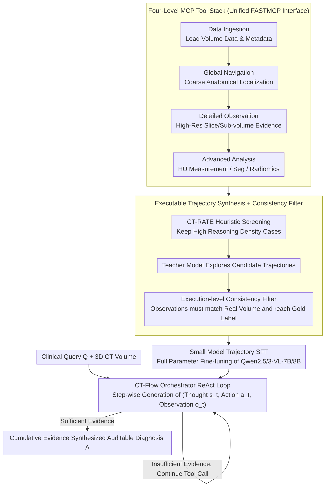

# CT-Flow: Orchestrating CT Interpretation Workflow with Model Context Protocol Servers

**Conference**: ACL 2026  
**arXiv**: [2603.00123](https://arxiv.org/abs/2603.00123)  
**Code**: Not yet public (The paper promises to release CT-FlowBench)  
**Area**: Medical NLP  
**Keywords**: CT Interpretation, MCP, Agentic LVLM, ReAct, Tool Orchestration, CT-FlowBench

## TL;DR
The authors remodel 3D CT interpretation as an agentic task where "radiologists iteratively explore via tools." By exposing four categories of tools—Data Ingestion, Global Navigation, Detailed Observation, and Advanced Analysis—through the Model Context Protocol (MCP), they construct CT-FlowBench with 2000+300 executable trajectories. They subsequently perform SFT to develop CT-Flow-8B, which achieves 69.46% ACC on 3D-RAD (a +22.46% improvement over slice-only baselines) with a tool name error rate of only 0.007/case.

## Background & Motivation
**Background**: Current 3D CT large models follow two main technical routes: native 3D backbones (using 3D ViT or full convolutional encoding like M3D and RadFM) and slice serialization (decomposing volume data into 2D slice sequences like Hulu-Med and OmniCT). Regardless of the route, these are end-to-end "one-shot" inferences: the model consumes the entire volume and outputs a snippet of text as the diagnosis or report.

**Limitations of Prior Work**: (1) 3D encoding inevitably introduces an "information bottleneck"—voxels are compressed into finite tokens, causing clinically decisive fine-grained signs like small hematomas, early ischemia, and faint ground-glass opacities to be filtered out; (2) This "read-only" mode is fundamentally out of sync with actual clinical workflows—radiologists actually iteratively interact with the data by scrolling through slices, switching planes, measuring HU values, and calling segmentation or radiomics tools as needed; (3) Existing medical agents (ChatCAD, ChatCAD+, Med-Agents, MedRAX) introduce tool usage, but tools are often ad-hoc and isolated, failing to accommodate the "multi-step, traceable, and verifiable" complex workflow required for 3D CT.

**Key Challenge**: CT diagnosis requires "fine-grained evidence + multi-step reasoning + tool verification," yet end-to-end LVLMs offer "coarse-grained perception + single-step prediction + lack of traceability"—a mismatch between architectural form and task requirements.

**Goal**: Reformulate 3D CT interpretation from a "perception problem" into an "agentic problem," allowing the model to explicitly plan, call tools, verify hypotheses, and produce auditable reasoning trajectories.

**Key Insight**: The Model Context Protocol (MCP), recently proposed by Anthropic, standardizes the interface between LLMs and external tools. It can encapsulate heterogeneous image processing tools (slicing, segmentation, radiomics, measurement) into a unified tool space. Furthermore, the ReAct paradigm can be layered on top to decompose the diagnostic process into a sequence of $(s_t, a_t, o_t)$ triples.

**Core Idea**: Using MCP as the foundation, the LVLM is upgraded from a "passive encoder" to an "active orchestrator." This approach provides both a tool space and execution environment (CT-Flow framework) and an executable trajectory training/evaluation benchmark (CT-FlowBench). Small models (Qwen2.5/Qwen3-VL) are trained to prove that this paradigm is more effective than simply increasing parameter counts.

## Method

### Overall Architecture
The CT-Flow system consists of three layers:

1.  **Tool Space**: Four MCP tool suites cover the entire pipeline from "data loading" to "pre-decision verification." **Data Ingestion** encapsulates CT volume data and metadata into standard query interfaces; **Global Navigation** provides full-volume and coarse anatomical localization; **Detailed Observation** retrieves high-resolution slices or sub-volumes for local evidence verification; **Advanced Analysis** provides quantitative analysis such as HU measurement, segmentation, and radiomics. Each tool is exposed to the LLM via FASTMCP.
2.  **Orchestrator**: This can be a general frontier model like GPT-5.2 or Gemini-3-Pro, or a 7B/8B small model SFT-ed on CT-Flow. At each time step, it generates a thought $s_t$, selects a tool call $a_t$, and receives an observation $o_t$ from the imaging environment.
3.  **CT-FlowBench**: Based on CT-RATE, it contains 2000 training and 300 evaluation trajectories, where each trajectory is a sequence of $(s, a, o)$ and the final answer is gold-standard labeled.

During diagnosis, given a clinical query $Q$, the system generates a complete Reasoning-Acting Trajectory $\mathcal{T} = \{(s_0, a_0, o_0), \ldots, (s_n, a_n, o_n)\}$. The final answer $A$ is synthesized from cumulative evidence rather than a single prediction.

### Key Designs

**1. MCP Standardized Four-Level Tool Stack (Data Ingestion → Global Navigation → Detailed Observation → Advanced Analysis): Abstracting all low-level imaging operations into composable atomic actions.**

End-to-end LVLMs compress entire CT volumes into limited tokens, potentially washing out definitive clinical signs in the encoding bottleneck. In contrast, radiologists work iteratively by scrolling, measuring HU, and using segmentation tools. This work abstracts heterogeneous operations (DICOM reading, view switching, ROI cropping, HU measurement, etc.) into atomic tools categorized into four clinical workflow levels: Data Ingestion (pre-condition), Global Navigation (localization), Detailed Observation (verification), and Advanced Analysis (quantification). Standardized via MCP (using FASTMCP), the LLM only observes tool names, parameter schemas, and observations, without needing to handle implementation details. This makes tools hot-swappable and constrains the agent's planning search space. Ablations (Fig 4) show that removing any category significantly drops ACC, proving they are complementary and necessary.

**2. Execution-in-the-loop Trajectory Synthesis + Procedural Consistency Filter: Upgrading static "case-to-answer" supervision to executable trajectories reproducible on actual CT scans.**

Traditional distillation-based trajectories often suffer from teacher models hallucinating unrepeatable intermediate observations. This study performs heuristic screening on CT-RATE for anatomical diversity and reasoning density. Teacher models (GPT-4o, Gemini-3-Pro, etc.) then explore candidate trajectories, but only those satisfying the following are retained:

$$\forall (a_i, o_i)\in \mathcal{T},\ \text{val}(o_i \mid \mathcal{V}) \land \text{pred}(\mathcal{T}) = y_{gt}$$

This means every observation must be realistically obtainable from the raw volume $\mathcal{V}$, and the sequence must terminate at the gold label $y_{gt}$. Re-running teacher trajectories in the actual tool environment serves as an execution constraint, ensuring the student learns real tool behavior rather than hallucinated patterns.

**3. Trajectory-form Instruction Tuning on Small Backbones: SFT-ing agentic capabilities directly into 7B/8B small models.**

While frontier models can call tools zero-shot, small models often struggle with "compliant calling" rather than "understanding." This work uses 2000 execution-level trajectories to perform full-parameter SFT on Qwen2.5-VL-7B and Qwen3-VL-8B using the LLaMA-Factory framework (lr $1\times 10^{-5}$, DeepSpeed ZeRO-2, 4×H100). The models learn to generate thoughts, call valid tools, and consume outputs in a single ReAct trajectory format. Post-SFT, the 8B model's ACC on 3D-RAD jumps to 69.46% (surpassing the 235B Qwen3-VL), confirming that "Small Model + High-Quality Trajectories + Clear Tool Interfaces" is more efficient than parameter scaling.

### A Complete Trajectory: From Clinical Query to Auditable Diagnosis

For a query like "Identify if lung nodules exist, and if so, their location and nature," CT-Flow iterates through a $(s, a, o)$ chain. Step 1: Thought $s_0$ identifies the need for data; Action $a_0$ calls Data Ingestion; Observation $o_0$ returns the volume handle. Step 2: Thought $s_1$ decides to localize; Action $a_1$ uses Global Navigation to find the lung field; Observation $o_1$ reports the slice range of suspicious areas. Step 3: Action $a_2$ calls Detailed Observation for high-res slices; Observation $o_2$ provides local image evidence. Step 4: Action $a_3$ uses Advanced Analysis for HU measurements to determine if a nodule is solid or ground-glass. The final diagnosis $A$ synthesizes these real-world observations. The trajectory $\mathcal{T}$ can be replayed for radiologist review, ensuring auditability.

### Loss & Training
Standard token-level autoregressive cross-entropy is used for next-token prediction across the entire trajectory (thought + action + observation). No Reinforcement Learning (RL) is introduced (PPO/DPO/RLCF is deferred to future work). Key hyperparameters: lr $1\times 10^{-5}$, DeepSpeed ZeRO-2, cosine schedule, 4×H100. Inference uses SGLang with OpenAI-compatible APIs. Multiple-choice evaluation uses ACC; open-ended questions use BLEU-4/ROUGE-L/BERTScore + LLM-as-Judge (averaging DeepSeek-V3, Kimi-K2-Thinking, and GPT-OSS-120B).

## Key Experimental Results

### Main Results
Comparison on 3D-RAD (200 stratified samples per sub-task) and CT-FlowBench (300 samples across QA/AM/DD categories):

| Model | Tool-use | 3D-RAD ACC↑ | 3D-RAD BLEU-4 | 3D-RAD ROUGE-L | CT-FlowBench Avg↑ |
|-------|----------|-------------|---------------|----------------|-------------------|
| GPT-5.2 | ✓ | 63.50 | 22.08 | 26.06 | 37.33 |
| Gemini-3-Pro-Preview | ✓ | 62.59 | 29.59 | 35.59 | 44.00 |
| Claude-Sonnet-4.5 | ✓ | 54.83 | 20.14 | 26.81 | 43.67 |
| Qwen3-VL-235B-A22B | ✓ | 54.21 | 20.55 | 22.62 | 34.00 |
| M3D-RAD (Med-Specific) | ✗ | 58.00 | 29.76 | 37.39 | 36.00 |
| Hulu-Med-7B | ✗ | 61.29 | 12.77 | 23.71 | 47.00 |
| Qwen2.5-VL-7B (Baseline) | ✓ | 26.83 | 18.33 | 23.46 | 19.00 |
| Qwen3-VL-8B (Baseline) | ✓ | 49.06 | 20.89 | 22.31 | 25.33 |
| **CT-Flow-7B (SFT)** | ✓ | 61.36 | 36.67 | 34.73 | 44.33 |
| **CT-Flow-8B (SFT)** | ✓ | **69.46** | **36.96** | 37.47 | 43.00 |

CT-Flow-8B's ACC on 3D-RAD is +20.40 higher than its backbone Qwen3-VL-8B and surpasses all medical-specific models and general frontiers. Its BLEU-4 (36.96) is the highest, indicating that SFT aligns the report style with clinical standards. On CT-FlowBench, Hulu-Med-7B performs best (47), likely due to its pure multimodal discriminative path avoiding long-horizon tool risks.

### Ablation Study
Tool usage statistics (Table 2):

| Model | 3D-RAD Calls | 3D-RAD Name Err | 3D-RAD Arg Err | CT-FlowBench Calls | CT-FlowBench Name Err | CT-FlowBench Arg Err |
|-------|--------------|-----------------|----------------|--------------------|------------------------|----------------------|
| GPT-5.2 | 4.13 | 0.006 | 0.056 | 7.19 | 0.003 | 0.108 |
| Claude-Sonnet-4.5 | 5.93 | 0.002 | 0.092 | 9.49 | 0.017 | 0.407 |
| Qwen3-VL-8B (zero-shot) | 5.96 | **0.782** | 0.211 | 11.20 | **0.969** | 0.385 |
| **CT-Flow-7B (SFT)** | 4.01 | **0.007** | **0.018** | 6.17 | **0.007** | **0.033** |
| **CT-Flow-8B (SFT)** | 4.25 | 0.007 | 0.057 | 7.48 | 0.027 | 0.282 |

Ablations of tool categories (Fig 4): Removing **Advanced Analysis** results in a loss of quantitative capabilities; removing **Detailed Observation** causes a sharp drop in sensitivity to small lesions; removing **Global Navigation** leads to "spatial disorientation," where the model cannot jump efficiently between slices.

### Key Findings
- **Tool-mediated reasoning significantly boosts 3D-RAD performance**: CT-Flow SFT (+22.46%), GPT-5.2 (+8.33%). The agentic framework allows models to surpass medical pre-training barriers with lower costs.
- **Tool discipline is a major bottleneck**: Qwen3-VL-8B's zero-shot tool name error rate (0.969 on CT-FlowBench) drops to 0.007 after SFT, suggesting that small models lack "compliant execution" rather than "understanding."
- **CT-FlowBench is more challenging than 3D-RAD**: Average scores are lower across all models, highlighting that multi-step planning is more cognitively demanding than single visual judgements.
- **Efficiency**: CT-Flow-7B requires the fewest tool calls (4.01/6.17) while maintaining accuracy, which is critical for latency-sensitive clinical scenarios.

## Highlights & Insights
- **MCP is a smart paradigm shift for medical imaging**: Leveraging MCP allows for a standardized, mature ecosystem (FASTMCP, compliance checks), avoiding the "reinvention of the wheel" for tool interfaces.
- **Execution-in-the-loop is vital for data trust**: Avoiding hallucinated observations by grounding trajectories in real volumes ensures that students learn genuine tool interactions.
- **"Small Model + High-Quality Trajectories" beats "Scaling + Zero-shot"**: CT-Flow-8B surpassing GPT-5.2 has direct implications for on-premise hospital deployments where cloud access is restricted.
- **ReAct triples provide auditability**: Every $(s, a, o)$ step can be reviewed by a radiologist, meeting regulatory requirements for explainable AI in healthcare.

## Limitations & Future Work
- **Limitations**: (1) Only SFT used, no RL (PPO/DPO); (2) Multi-step reasoning introduces higher latency compared to E2E models; (3) Trajectories rely on expensive teacher models; (4) Tool space is restricted to four categories and primarily thoracic CT.
- **Future Work**: (1) Optimize trajectory length via RLCF; (2) Expand tool space to 4D-CT, CTA, and PET-CT; (3) Multi-center validation; (4) Transition from linear trajectories to tool-use graphs for parallel hypothesis testing; (5) Integrate property-level evaluations into training objectives.

## Related Work & Insights
- **vs. RadFM / M3D / Hulu-Med**: These are end-to-end LVLMs. CT-Flow replaces "viewing" with "orchestrating," bypassing the 3D encoding bottleneck.
- **vs. ChatCAD / Med-Agents**: Earlier agents used ad-hoc tool stitching. CT-Flow introduces MCP standardization and trajectory-level supervision, transforming tool usage into a trainable strategy.
- **Insight**: The combination of MCP + trajectory SFT + execution-in-the-loop can be generalized to other tool-intensive diagnostics such as digital pathology (WSI) or endoscopy videos.

## Rating
- Novelty: ⭐⭐⭐⭐ First systematic introduction of MCP to 3D CT interpretation with an executable benchmark.
- Experimental Thoroughness: ⭐⭐⭐⭐ Good coverage of baselines and ablations, though focused on thoracic CT and lacks RL.
- Writing Quality: ⭐⭐⭐⭐ Clear storyline with high-density tables and intuitive figures.
- Value: ⭐⭐⭐⭐⭐ Provides an open-protocol paradigm (MCP) for medical agents with executable datasets, directly benefiting clinical AI deployment.

<!-- RELATED:START -->

## Related Papers

- [\[ACL 2026\] CT-FineBench: A Diagnostic Fidelity Benchmark for Fine-Grained Evaluation of CT Report Generation](ct-finebench_a_diagnostic_fidelity_benchmark_for_fine-grained_evaluation_of_ct_r.md)
- [\[ACL 2026\] MARCH: Multi-Agent Radiology Clinical Hierarchy for CT Report Generation](march_multi-agent_radiology_clinical_hierarchy_for_ct_report_generation.md)
- [\[ACL 2026\] CURA: Clinical Uncertainty Risk Alignment for Language Model-Based Risk Prediction](cura_clinical_uncertainty_risk_alignment_for_language_model-based_risk_predictio.md)
- [\[ACL 2026\] PCoA: A New Benchmark for Medical Aspect-Based Summarization With Phrase-Level Context Attribution](pcoa_a_new_benchmark_for_medical_aspect-based_summarization_with_phrase-level_co.md)
- [\[ICML 2025\] Agent WARPP: Workflow Adherence via Runtime Parallel Personalization](../../ICML2025/medical_nlp/agent_warpp_workflow_adherence_via_runtime_parallel_personalization.md)

<!-- RELATED:END -->
