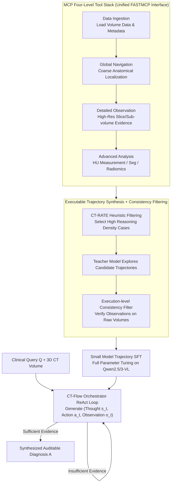

# CT-Flow: Orchestrating CT Interpretation Workflow with Model Context Protocol Servers

**Conference**: ACL 2026  
**arXiv**: [2603.00123](https://arxiv.org/abs/2603.00123)  
**Code**: Not yet public (The paper promises the release of CT-FlowBench)  
**Area**: Medical NLP  
**Keywords**: CT Interpretation, MCP, Agentic LVLM, ReAct, Tool Orchestration, CT-FlowBench

## TL;DR
The authors remodel 3D CT interpretation into an agentic task where "radiologists iteratively explore using tools." Using the Model Context Protocol (MCP), they expose four categories of tools—Data Ingestion, Global Navigation, Detailed Observation, and Advanced Analysis. They construct CT-FlowBench, containing 2000+300 executable trajectories, and perform SFT to develop CT-Flow-8B. This model achieves 69.46% ACC on 3D-RAD, a +22.46% improvement over pure slice-based baselines, with a tool name error rate of only 0.007/case.

## Background & Motivation
**Background**: Current 3D CT large models follow two mainstream approaches—native 3D backbones (using 3D ViT fully convolutional encoding like M3D and RadFM) and slice serialization (expanding volume data into 2D slice sequences like Hulu-Med and OmniCT). Both paradigms rely on end-to-end "one-shot" inference, where the model consumes the entire volume and outputs a diagnostic report.

**Limitations of Prior Work**: (1) 3D encoding inevitably introduces an "information bottleneck" where voxels are compressed into limited tokens, causing subtle but clinically decisive signs (e.g., small hematomas, early ischemia, faint ground-glass opacities) to be filtered out. (2) This "read-only" mode is asynchronous with actual clinical workflows, where radiologists iteratively scroll through slices, switch planes, and measure HU values or diameters using segmentation/radiomics tools. (3) Existing medical agents (e.g., ChatCAD, Med-Agents, MedRAX), while introducing tool calls, utilize them in an ad-hoc and isolated manner, failing to support the complex, multi-step, and reversible workflows required for 3D CT.

**Key Challenge**: CT diagnosis requires "fine-grained evidence + multi-step reasoning + tool verification," whereas end-to-end LVLMs offer "coarse-grained perception + single-step prediction + no traceability." There is a structural mismatch between the architectural form and the task requirements.

**Goal**: To reformulate 3D CT interpretation from a "perception problem" into an "agentic problem," allowing models to explicitly plan, invoke tools, verify hypotheses, and produce auditable reasoning trajectories.

**Key Insight**: The recently proposed Model Context Protocol (MCP) by Anthropic standardizes the interface between LLMs and external tools. It allows heterogeneous image processing tools (slicing, segmentation, radiomics, measurement) to be encapsulated into a unified tool space. Combined with the ReAct paradigm, the diagnostic process can be decomposed into sequences of $(s_t, a_t, o_t)$ triplets.

**Core Idea**: Using MCP as the foundation, the LVLM is upgraded from a "passive encoder" to an "active orchestrator." This framework provides a tool space and execution environment (CT-Flow framework), a benchmark of executable trajectories for training and evaluation (CT-FlowBench), and demonstrates that SFT on smaller models like Qwen2.5/Qwen3-VL is more effective than simply increasing parameter counts.

## Method

### Overall Architecture
The CT-Flow system consists of three layers:

1.  **Tool Space**: Four categories of MCP toolkits cover the entire pipeline from "loading data" to "pre-decision verification." *Data Ingestion* encapsulates CT volumes and metadata into standard query interfaces; *Global Navigation* provides full-volume and coarse anatomical localization; *Detailed Observation* retrieves high-resolution slices or sub-volumes for local evidence verification; *Advanced Analysis* provides quantitative tools such as HU measurement, segmentation, and radiomics. Each tool is exposed via FASTMCP.
2.  **Orchestrator**: This can be a frontier model (e.g., GPT-5.2) or a fine-tuned 7B/8B model. At each timestep, it generates a thought $s_t$, selects a tool action $a_t$, and receives an observation $o_t$ from the imaging environment.
3.  **CT-FlowBench**: A dataset comprising 2000 training and 300 evaluation trajectories built on CT-RATE, where each sequence $(s, a, o)$ leads to a gold-standard answer.

Given a clinical query $Q$, the system generates a complete Reasoning-Acting Trajectory $\mathcal{T} = \{(s_0, a_0, o_0), \ldots, (s_n, a_n, o_n)\}$, synthesizing the final answer $A$ from accumulated evidence.

### Key Designs

**1. MCP-Standardized Four-Level Tool Stack: Abstracting heterogeneous imaging operations into composable atomic actions.**

End-to-end LVLMs compress CT volumes into limited tokens, causing subtle signs to be lost. Radiologists, however, interactively explore data. This work abstracts low-level operations (DICOM reading, plane switching, ROI cropping, HU measurement) into atomic tools organized into four hierarchical levels: *Data Ingestion* (prerequisite for metadata loading), *Global Navigation* (coarse localization), *Detailed Observation* (local verification), and *Advanced Analysis* (quantitative analysis). All tools use a unified MCP interface via FASTMCP. The LLM only sees tool names, parameter schemas, and observations, narrowing the planning search space. Ablation (Fig 4) shows that removing any category significantly decreases ACC and increases format errors.

**2. Execution-in-the-loop Trajectory Synthesis + Procedural Consistency Filter: Upgrading static supervision to reproducible executable trajectories.**

Distillation-based trajectories often suffer from teacher models hallucinating unobservable data (e.g., fabricated HU values). This work performs heuristic filtering on CT-RATE tasks for high reasoning density. Teacher models (e.g., GPT-5.2, Claude-4.5) explore candidate trajectories, but only those satisfying the following are kept:

$$\forall (a_i, o_i)\in \mathcal{T},\ \text{val}(o_i \mid \mathcal{V}) \land \text{pred}(\mathcal{T}) = y_{gt}$$

This ensures every observation can be truthfully reproduced on the raw volume $\mathcal{V}$ and concludes with the correct label $y_{gt}$. This filtering is the key to ensuring the student model learns real tool behaviors rather than hallucinated invocations.

**3. Trajectory-form Instruction Tuning on Small Backbones: Embedding agentic capabilities into 7B/8B models.**

While frontier models can use tools zero-shot, small models often fail due to non-compliant calls rather than a lack of understanding. This work uses 2000 execution-level trajectories to perform full-parameter SFT on Qwen2.5-VL-7B and Qwen3-VL-8B using the LLaMA-Factory framework (LR $1\times 10^{-5}$, DeepSpeed ZeRO-2). The model simultaneously learns to generate thoughts, invoke valid tools, and process tool outputs. Post-SFT, the 8B model's tool name error rate dropped to 0.027, proving that "small model + high-quality trajectories" is a more efficient path than scaling parameters.

### Loss & Training
Standard token-level autoregressive cross-entropy is used for next-token prediction across the entire trajectory (thought + action + observation). No Reinforcement Learning was introduced in this phase. Hyperparameters: LR $1\times 10^{-5}$, DeepSpeed ZeRO-2, cosine schedule, 4×H100. Inference uses SGLang for OpenAI-compatible APIs. Evaluation employs ACC for multiple-choice and a combination of BLEU-4/ROUGE-L/BERTScore + LLM-as-Judge (averaging DeepSeek-V3, Kimi-K2, and GPT-OSS-120B) for open-ended QA.

## Key Experimental Results

### Main Results
Comparison on 3D-RAD and CT-FlowBench (QA/AM/DD tasks):

| Model | Tool-use | 3D-RAD ACC↑ | 3D-RAD BLEU-4 | 3D-RAD ROUGE-L | CT-FlowBench Avg↑ |
|------|----------|-------------|---------------|----------------|-------------------|
| GPT-5.2 | ✓ | 63.50 | 22.08 | 26.06 | 37.33 |
| Gemini-3-Pro-Preview | ✓ | 62.59 | 29.59 | 35.59 | 44.00 |
| Claude-Sonnet-4.5 | ✓ | 54.83 | 20.14 | 26.81 | 43.67 |
| Qwen3-VL-235B-A22B | ✓ | 54.21 | 20.55 | 22.62 | 34.00 |
| M3D-RAD (Med-Specific) | ✗ | 58.00 | 29.76 | 37.39 | 36.00 |
| Hulu-Med-7B | ✗ | 61.29 | 12.77 | 23.71 | 47.00 |
| Qwen2.5-VL-7B (Baseline) | ✓ | 26.83 | 18.33 | 23.46 | 19.00 |
| Qwen3-VL-8B (Baseline) | ✓ | 49.06 | 20.89 | 22.31 | 25.33 |
| **Ours: CT-Flow-7B** | ✓ | 61.36 | 36.67 | 34.73 | 44.33 |
| **Ours: CT-Flow-8B** | ✓ | **69.46** | **36.96** | 37.47 | 43.00 |

### Ablation Study
Tool usage statistics (Table 2):

| Model | 3D-RAD Calls | 3D-RAD Name Err | 3D-RAD Arg Err | CT-FlowBench Calls | CT-FlowBench Name Err | CT-FlowBench Arg Err |
|------|--------------|-----------------|----------------|--------------------|------------------------|----------------------|
| GPT-5.2 | 4.13 | 0.006 | 0.056 | 7.19 | 0.003 | 0.108 |
| Qwen3-VL-8B (ZS) | 5.96 | **0.782** | 0.211 | 11.20 | **0.969** | 0.385 |
| **Ours: CT-Flow-7B** | 4.01 | **0.007** | **0.018** | 6.17 | **0.007** | **0.033** |
| **Ours: CT-Flow-8B** | 4.25 | 0.007 | 0.057 | 7.48 | 0.027 | 0.282 |

### Key Findings
- **Tool-mediated reasoning significantly boosts 3D-RAD performance**: CT-Flow SFT gained +22.46% over the base model, outperforming medical-specific models like M3D-RAD.
- **Tool discipline is a bottleneck**: Qwen3-VL-8B's zero-shot name error rate was near 0.8-0.9; SFT reduced this to ~0.007, which is the primary driver of performance gains.
- **Complexity of CT-FlowBench**: Average scores on CT-FlowBench were lower than 3D-RAD across all models, indicating the high cognitive load of multi-step tool planning.
- **Efficiency**: CT-Flow-7B averaged only 4.01 calls, the lowest in the table, showing it learned to find answers with minimal tool usage.

## Highlights & Insights
- **Standardization with MCP**: Introducing MCP to medical imaging allows for a "plug-and-play" tool ecosystem, avoiding the need to reinvent interfaces for every agent.
- **Execution-in-the-loop Credibility**: Verifying trajectories against raw volumes ensures the SFT data is grounded in reality, preventing the model from learning hallucinated tool behaviors.
- **Small Model Superiority**: CT-Flow-8B outperforming frontier models like GPT-5.2 on 3D-RAD has significant implications for on-premise hospital deployments.
- **Auditability**: The ReAct structure provides a chain of evidence that radiographers can review, meeting high regulatory standards for explainability.

## Limitations & Future Work
- **Limitations**: (1) Relies solely on SFT without RL (PPO/DPO); (2) Multi-step reasoning has higher latency than end-to-end models; (3) Evaluation focused primarily on chest CTs.
- **Future Work**: (1) Implementing RLCF to optimize trajectory length; (2) Expanding the tool space to 4D-CT and CTA; (3) Cross-center generalizability validation.

## Related Work & Insights
- **vs. RadFM / M3D / Hulu-Med**: These remain end-to-end LVLMs. CT-Flow shifts from "image viewing" to "active manipulation" (microscopes/rulers/segmentors).
- **vs. ChatCAD / MedRAX**: Earlier agents used ad-hoc stitching. CT-Flow provides a standardized protocol (MCP) and trajectory-level supervision.
- **Mechanism**: CT-Flow transforms the ReAct paradigm into a version that can be grounded in physical volume environments through reproducibility constraints.

## Rating
- Novelty: ⭐⭐⭐⭐ (First systematic use of MCP in CT; comprehensive "Tool + Bench + SFT" paradigm).
- Experimental Thoroughness: ⭐⭐⭐⭐ (Competitive baselines, tool stats, and category ablations).
- Writing Quality: ⭐⭐⭐⭐ (Clear narrative and high information density).
- Value: ⭐⭐⭐⭐⭐ (Provides a reproducible open protocol for medical imaging agents).

<!-- RELATED:START -->

## Related Papers

- [\[ACL 2026\] CT-FineBench: A Diagnostic Fidelity Benchmark for Fine-Grained Evaluation of CT Report Generation](ct-finebench_a_diagnostic_fidelity_benchmark_for_fine-grained_evaluation_of_ct_r.md)
- [\[ACL 2026\] MARCH: Multi-Agent Radiology Clinical Hierarchy for CT Report Generation](march_multi-agent_radiology_clinical_hierarchy_for_ct_report_generation.md)
- [\[ACL 2026\] CURA: Clinical Uncertainty Risk Alignment for Language Model-Based Risk Prediction](cura_clinical_uncertainty_risk_alignment_for_language_model-based_risk_predictio.md)
- [\[ACL 2026\] PCoA: A New Benchmark for Medical Aspect-Based Summarization With Phrase-Level Context Attribution](pcoa_a_new_benchmark_for_medical_aspect-based_summarization_with_phrase-level_co.md)
- [\[ICML 2025\] Agent WARPP: Workflow Adherence via Runtime Parallel Personalization](../../ICML2025/medical_nlp/agent_warpp_workflow_adherence_via_runtime_parallel_personalization.md)

<!-- RELATED:END -->
