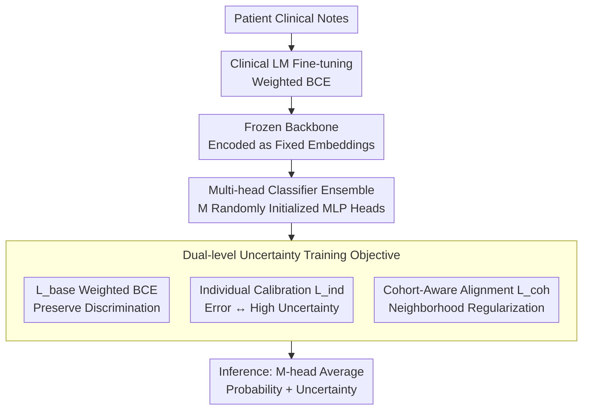

# CURA: Clinical Uncertainty Risk Alignment for Language Model-Based Risk Prediction

**Conference**: ACL 2026  
**arXiv**: [2604.14651](https://arxiv.org/abs/2604.14651)  
**Code**: [GitHub](https://github.com/sizhe04/CURA)  
**Area**: Medical NLP  
**Keywords**: Clinical Risk Prediction, Uncertainty Calibration, Dual-level Alignment, Cohort-aware, Clinical Language Models

## TL;DR
CURA proposes a dual-level uncertainty calibration framework: the individual level aligns predictive uncertainty with error probability, while the cohort level regularizes predictions via neighborhood risk rates in the embedding space. It consistently improves calibration metrics across five clinical risk prediction tasks on MIMIC-IV without sacrificing discriminative performance.

## Background & Motivation

**Background**: Clinical language models (e.g., BioClinicalBERT, BioGPT) excel at predicting risks such as mortality and ICU stay duration from free-text clinical notes. However, their uncertainty estimates are often poorly calibrated—overconfident erroneous predictions directly jeopardize patient safety.

**Limitations of Prior Work**: General uncertainty methods (MC Dropout, Deep Ensembles) aggregate predictions on isolated samples without utilizing the semantic structure of the representation space. LLM-specific calibration methods rely on expert reasoning chains or textual explanations from teacher models, but clinical tasks are typically binary classification with a lack of large-scale foundational explanations.

**Key Challenge**: Fine-tuning improves predictive performance but exacerbates overconfidence—high-confidence yet incorrect predictions for high-risk patients create "false reassurance," which is extremely dangerous in clinical settings.

**Goal**: Design a lightweight, plug-and-play calibration framework that maintains high confidence for correct predictions while assigning high uncertainty to incorrect ones.

**Key Insight**: Simultaneously align uncertainty at both individual and cohort levels—aligning with self-error rates at the individual level and with event rates of neighbors in the embedding space at the cohort level.

**Core Idea**: Freeze fine-tuned clinical LM embeddings → multi-head classifier + dual-level uncertainty objectives (individual calibration $L_{ind}$ + cohort-aware $L_{coh}$).

## Method

### Overall Architecture
CURA addresses the issue of clinical risk models "making confident mistakes" by decoupling calibration from the training pipeline and focusing only on a lightweight classification head. The pipeline consists of two steps: first, fine-tune a clinical LM (BioGPT/BioClinicalBERT, etc.) using standard weighted binary cross-entropy, then freeze it to encode each patient note into fixed embeddings. Second, an ensemble of $M$ randomly initialized MLP heads is trained on these frozen embeddings. The training objective incorporates two layers of uncertainty constraints beyond standard discriminative loss: individual-level $L_{ind}$ and cohort-level $L_{coh}$. During inference, the average of the $M$ heads provides the predictive probability and uncertainty. Since the backbone is frozen, the calibration is plug-and-play with zero additional inference overhead.

### Key Designs

**1. Individual Uncertainty Calibration $L_{ind}$: Binding "I am wrong" with "I am uncertain"**

Standard cross-entropy only pushes probabilities toward labels without constraining whether confidence matches error rates. CURA directly links uncertainty to correctness: define correctness probability $a(x) = y\bar{p}(x) + (1-y)(1-\bar{p}(x))$ and normalized entropy $u(x) = H(x)/H_{max}$ as the uncertainty score. It then aligns $u(x)$ to $1-a(x)$ using cross-entropy:

$$L_{ind} = -\lambda_{ind}\,[(1-a(x))\log u(x) + a(x)\log(1-u(x))]$$

When the prediction is correct ($a$ is high), the model is encouraged to lower entropy; when the prediction is incorrect ($a$ is low), a low entropy incurs a heavy penalty, forcing the sample into the high-uncertainty region.

**2. Cohort-Aware Risk Alignment $L_{coh}$: Patients with similar clinical presentations should have similar risk estimates**

Individual calibration lacks the clinical prior that "similar patients should have similar risks." CURA retrieves $K$ nearest neighbors for each patient $x_i$ in the frozen embedding space and uses the neighborhood event rate $q(x_i) = \frac{1}{K}\sum_{j \in \mathcal{N}_K(e_i)} y_j$ as the "cohort risk." The prediction is regularized toward this cohort risk using an adaptive weight based on neighborhood entropy: $w(x_i) = \lambda_{coh}\,\hat{H}(q(x_i))$. This acts as data-dependent label smoothing, where ambiguous regions receive heavier smoothing to suppress overconfidence.

**3. Multi-head Classifier Ensemble: Diverse uncertainty from a single backbone**

Instead of expensive Deep Ensembles that train multiple full models, CURA attaches $M$ independent, randomly initialized lightweight MLP heads to the same frozen embedding. Sharing the backbone keeps costs nearly constant, while the diversity in initialization preserves the benefits of ensemble-based uncertainty estimation.

### Loss & Training
The total loss is $L_{total} = L_{base} + L_{ind} + L_{coh}$. $L_{base}$ provides the discriminative foundation and prevents $L_{ind}$ from collapsing the output to a uniform probability of 0.5. $\lambda_{ind}$ and $\lambda_{coh}$ control the weights of the respective calibration terms, and neighbor size $K$ is a hyperparameter.

## Key Experimental Results

### Main Results

| Task | Method | AUROC | Brier↓ | NLL↓ | AURC↓ |
|------|------|-------|--------|------|-------|
| 7-day Mortality | Baseline | 0.852 | 0.032 | 0.120 | 0.008 |
| 7-day Mortality | Deep Ensemble | 0.856 | 0.029 | 0.110 | 0.007 |
| 7-day Mortality | CURA | **0.892** | **0.015** | **0.075** | **0.002** |
| 30-day Mortality | Baseline | 0.881 | 0.064 | 0.231 | 0.024 |
| 30-day Mortality | CURA | **0.890** | **0.038** | **0.146** | **0.009** |
| In-hospital Mortality | Baseline | 0.621 | 0.044 | 0.175 | 0.015 |
| In-hospital Mortality | CURA | **0.641** | **0.029** | **0.124** | **0.011** |

### Ablation Study

| Configuration | Key Metric | Description |
|------|---------|------|
| $L_{base}$ only (Multi-head) | Calibration near baseline | Multi-head alone is insufficient |
| $L_{base} + L_{ind}$ | Brier/NLL Improvement | Individual calibration is effective |
| $L_{base} + L_{coh}$ | Further Improvement | Cohort regularization is effective |
| $L_{base} + L_{ind} + L_{coh}$ | Best | Dual-level synergy is optimal |

### Key Findings
- CURA consistently improves calibration metrics (Brier, NLL, AURC) across all five tasks while maintaining or slightly improving discriminative performance (AUROC, AUPRC).
- Deep Ensembles and MC Dropout show limited improvement and can even slightly degrade calibration in some clinical tasks.
- CURA significantly reduces "false reassurance" for high-risk patients by reassigning high-confidence incorrect predictions to high-uncertainty zones.
- The framework is robust across multiple backbones: BioGPT, BioClinicalBERT, and ClinicalBERT.

## Highlights & Insights
- The **dual-level alignment approach** is elegant and practical—aligning individual error with uncertainty and cohort risk with neighborhood rates.
- The label-smoothing interpretation of $L_{coh}$ provides theoretical insight—essentially performing data-dependent label softening where ambiguous regions are smoothed more aggressively.
- As a plug-and-play loss term, CURA requires no architectural changes or complex inference pipelines, ensuring low deployment costs.

## Limitations & Future Work
- Evaluation is limited to MIMIC-IV; generalization to other EHR datasets needs validation.
- The neighborhood size $K$ is a hyperparameter that may vary by task.
- Embedding quality depends on the domain adaptation of the pre-trained LM.
- Binary classification settings limit applicability to multi-level risk stratification.

## Related Work & Insights
- **vs. Deep Ensembles**: Requires training multiple full models with limited calibration gain; CURA achieves better calibration at a lower cost using multi-head outputs and dual-level loss.
- **vs. MC Dropout**: Generates uncertainty via stochastic passes but ignores representation space structure; CURA utilizes semantic relationships in the embedding space via neighborhood relations.
- **vs. LLM Calibration Methods**: Rely on CoT explanations as supervision, which is often unavailable in clinical settings; CURA only requires binary labels.

## Rating
- Novelty: ⭐⭐⭐⭐ The design of dual-level uncertainty alignment is novel and theoretically grounded.
- Experimental Thoroughness: ⭐⭐⭐⭐⭐ Five tasks, three backbone models, five-fold cross-validation, and detailed ablation.
- Writing Quality: ⭐⭐⭐⭐⭐ Clear clinical motivation, complete mathematical derivation, and intuitive visualization.

<!-- RELATED:START -->

## Related Papers

- [\[ACL 2026\] Reliable Automated Triage in Spanish Clinical Notes: A Hybrid Framework for Risk-Aware HIV Suspicion Identification](reliable_automated_triage_in_spanish_clinical_notes_a_hybrid_framework_for_risk-.md)
- [\[ACL 2026\] ReMedi: Reasoner for Medical Clinical Prediction](remedi_reasoner_for_medical_clinical_prediction.md)
- [\[ACL 2025\] A Modular Approach for Clinical SLMs Driven by Synthetic Data with Pre-Instruction Tuning, Model Merging, and Clinical-Tasks Alignment](../../ACL2025/medical_nlp/a_modular_approach_for_clinical_slms_driven_by_synthetic_data_with_pre-instructi.md)
- [\[NeurIPS 2025\] CGBench: Benchmarking Language Model Scientific Reasoning for Clinical Genetics Research](../../NeurIPS2025/medical_nlp/cgbench_benchmarking_language_model_scientific_reasoning_for_clinical_genetics_r.md)
- [\[ACL 2026\] PrinciplismQA: A Philosophy-Grounded Approach to Assessing LLM-Human Clinical Medical Ethics Alignment](principlismqa_a_philosophy-grounded_approach_to_assessing_llm-human_clinical_med.md)

<!-- RELATED:END -->
