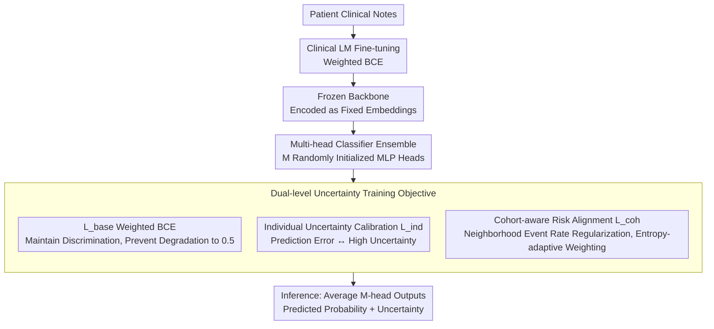

# CURA: Clinical Uncertainty Risk Alignment for Language Model-Based Risk Prediction

**Conference**: ACL 2026  
**arXiv**: [2604.14651](https://arxiv.org/abs/2604.14651)  
**Code**: [GitHub](https://github.com/sizhe04/CURA)  
**Area**: Medical NLP  
**Keywords**: Clinical Risk Prediction, Uncertainty Calibration, Dual-level Alignment, Cohort-aware, Clinical Language Models

## TL;DR
CURA proposes a dual-level uncertainty calibration framework: the individual level aligns prediction uncertainty with error probability, while the cohort level regularizes predictions via neighborhood risk rates in the embedding space. It consistently improves calibration metrics across five clinical risk prediction tasks on MIMIC-IV without sacrificing discriminative performance.

## Background & Motivation

**Background**: Clinical language models (e.g., BioClinicalBERT, BioGPT) excel at predicting risks such as mortality and ICU length of stay from free-text clinical notes. However, the uncertainty estimates of these models are often poorly calibrated—overconfident erroneous predictions directly jeopardize patient safety.

**Limitations of Prior Work**: General uncertainty methods (MC Dropout, Deep Ensembles) aggregate predictions on isolated samples without utilizing the semantic structure of the representation space. LLM-specific calibration methods rely on expert reasoning chains or textual explanations from teacher models, but clinical tasks often only have binary labels and lack large-scale foundational explanations.

**Key Challenge**: Fine-tuning improves predictive performance but exacerbates overconfidence—high-confidence yet incorrect predictions for high-risk patients create "false reassurance," which is extremely dangerous in clinical settings.

**Goal**: Design a lightweight, plug-and-play calibration framework that maintains high confidence for correct predictions while assigning high uncertainty to incorrect ones.

**Key Insight**: Align uncertainty simultaneously from both individual and cohort levels—aligning with self-error rates at the individual level and with event rates of neighbors in the embedding space at the cohort level.

**Core Idea**: Freeze the fine-tuned clinical LM embeddings $\rightarrow$ Multi-head classifier + Dual-level uncertainty objectives (individual calibration $L_{ind}$ + cohort-aware $L_{coh}$).

## Method

### Overall Architecture
CURA aims to solve the problem of clinical risk models "confidently making mistakes" by decoupling calibration from the training pipeline and focusing on a lightweight classification head. The pipeline consists of two steps: first, fine-tune a clinical LM (BioGPT / BioClinicalBERT, etc.) using standard weighted binary cross-entropy, then freeze it to encode each patient note into a fixed embedding. Second, train a classifier ensemble consisting of $M$ randomly initialized MLP heads on these frozen embeddings. The training objective adds two layers of uncertainty constraints—individual $L_{ind}$ and cohort-aware $L_{coh}$—to the conventional discriminative loss. During inference, the outputs of the $M$ heads are averaged to obtain the predicted probability and uncertainty. Since the backbone is frozen and only small classification heads are updated, the calibration is plug-and-play with zero additional inference cost.

### Key Designs

**1. Individual Uncertainty Calibration $L_{ind}$: Binding "I am wrong" with "I am uncertain"**

Standard cross-entropy only pushes probabilities toward labels and never constrains whether "confidence should match the error rate." Consequently, fine-tuned models often give high-confidence incorrect predictions for high-risk patients. CURA directly links uncertainty with correctness: first, define the correctness probability of a sample $a(x) = y\bar{p}(x) + (1-y)(1-\bar{p}(x))$ (higher $a$ means prediction is closer to the true label); then use normalized entropy $u(x) = H(x)/H_{max}$ as the uncertainty score, and align $u(x)$ to $1-a(x)$ using a cross-entropy term:

$$L_{ind} = -\lambda_{ind}\,[(1-a(x))\log u(x) + a(x)\log(1-u(x))]$$

Thus, when the prediction is correct ($a$ is high), the model is encouraged to lower entropy and maintain high confidence. When the prediction is wrong ($a$ is low), a low-entropy output incurs a heavy penalty, forcing such samples into the high-uncertainty zone. This calibration constraint is per-sample and directly coupled with actual correctness, rather than a post-hoc global temperature scaling.

**2. Cohort-aware Risk Alignment $L_{coh}$: Patients with similar clinical presentations should have similar risk estimates**

Individual calibration only focuses on single samples and ignores the clinical prior that "similar patients should have similar risks." Ambiguous samples near the decision boundary especially require such neighborhood information. CURA retrieves $K$ nearest neighbors for each patient $x_i$ in the frozen embedding space and uses the actual event rate in the neighborhood $q(x_i) = \frac{1}{K}\sum_{j \in \mathcal{N}_K(e_i)} y_j$ as the "cohort risk." The prediction is then regularized toward this cohort risk. Crucially, the weight is not fixed but adaptively determined by the entropy of the neighborhood event rate: $w(x_i) = \lambda_{coh}\,\hat{H}(q(x_i))$. The weight is maximal when the neighborhood event rate is near 0.5 (ambiguous cohort) and minimal for clear high/low-risk cohorts. This term can be interpreted as data-dependent label smoothing: it is equivalent to cross-entropy with a "soft label interpolated between the true label and the neighborhood event rate," where ambiguous regions are smoothed more aggressively to suppress overconfidence.

**3. Multi-head Classifier Ensemble: Diverse uncertainty from a single backbone**

To obtain reliable uncertainty estimates, Deep Ensembles require training several complete models, which is costly. CURA instead attaches $M$ independent, randomly initialized lightweight MLP heads to the same frozen embedding and averages their predictions during inference. Sharing the backbone keeps training and inference costs nearly constant, while the variance among heads due to different initializations maintains the diversity of ensemble-based uncertainty estimation, representing a trade-off between cost and quality.

### Loss & Training
The total loss is $L_{total} = L_{base} + L_{ind} + L_{coh}$. $L_{base}$ is weighted binary cross-entropy, providing the discriminative foundation and preventing $L_{ind}$ from degrading the output into uniform probabilities (avoiding a model that only outputs 0.5 to claim uncertainty). $L_{ind}$ and $L_{coh}$ are controlled by $\lambda_{ind}$ and $\lambda_{coh}$, respectively, with neighborhood size $K$ as a hyperparameter. During joint optimization, $L_{base}$ ensures discrimination, $L_{ind}$ handles individual calibration, and $L_{coh}$ manages cohort consistency, complementing each other.

## Key Experimental Results

### Main Results

| Task | Method | AUROC | Brier↓ | NLL↓ | AURC↓ |
|------|------|-------|--------|------|-------|
| 7-day Mortality | Baseline | 0.852 | 0.032 | 0.120 | 0.008 |
| 7-day Mortality | Deep Ensemble | 0.856 | 0.029 | 0.110 | 0.007 |
| 7-day Mortality | CURA | **0.892** | **0.015** | **0.075** | **0.002** |
| 30-day Mortality | Baseline | 0.881 | 0.064 | 0.231 | 0.024 |
| 30-day Mortality | CURA | **0.890** | **0.038** | **0.146** | **0.009** |
| In-hospital Mortality | Baseline | 0.621 | 0.044 | 0.175 | 0.015 |
| In-hospital Mortality | CURA | **0.641** | **0.029** | **0.124** | **0.011** |

### Ablation Study

| Configuration | Key Metric | Description |
|------|---------|------|
| $L_{base}$ only (Multi-head) | Calibration near baseline | Multi-head architecture alone is insufficient for calibration |
| $L_{base} + L_{ind}$ | Brier/NLL improved | Individual calibration is effective |
| $L_{base} + L_{coh}$ | Further improvement | Cohort regularization is effective |
| $L_{base} + L_{ind} + L_{coh}$ | Best | Dual-level synergy yields optimal results |

### Key Findings
- CURA consistently improves calibration metrics (Brier, NLL, AURC) across all five tasks without decreasing—and sometimes slightly improving—discriminative performance (AUROC, AUPRC).
- Deep Ensembles and MC Dropout show limited improvement in calibration metrics and even slight deterioration in some tasks.
- CURA significantly reduces "false reassurance" for high-risk patients by redistributing high-confidence incorrect predictions into high-uncertainty regions.
- The framework is robust across three backbones: BioGPT, BioClinicalBERT, and ClinicalBERT.

## Highlights & Insights
- **Dual-level Alignment** is an elegant and practical concept—aligning "saying I'm uncertain when I'm wrong" at the individual level and "similar patients should have similar risks" at the cohort level for complementary effects.
- The **Label Smoothing Interpretation** of $L_{coh}$ provides theoretical insight—it essentially softens labels in a data-dependent manner, applying stronger smoothing to ambiguous regions where overconfidence is most prevalent.
- As a **Plug-and-play Loss Term**, CURA does not require modifications to model architecture or inference pipelines, making deployment costs extremely low.

## Limitations & Future Work
- Evaluated only on MIMIC-IV; generalization to other EHR datasets needs verification.
- Neighborhood size $K$ is a hyperparameter and may require different settings for different tasks.
- Embedding quality depends on the degree of domain adaptation of the pre-trained LM.
- The binary classification setting limits applicability to multi-level risk stratification.

## Related Work & Insights
- **vs Deep Ensembles**: Requires training multiple full models but yields limited calibration gains; CURA achieves better calibration at a lower cost using multi-head + dual-level loss.
- **vs MC Dropout**: Obtains uncertainty via random dropout without utilizing representation space structure; CURA leverages semantic information in the embedding space via neighborhood relationships.
- **vs LLM Calibration Methods**: Relies on CoT explanations as supervision, which are absent in clinical scenarios; CURA only requires binary labels.

## Rating
- Novelty: ⭐⭐⭐⭐ The design of dual-level uncertainty alignment is novel and theoretically supported.
- Experimental Thoroughness: ⭐⭐⭐⭐⭐ Five tasks, three backbone models, five-fold cross-validation, and detailed ablation.
- Writing Quality: ⭐⭐⭐⭐⭐ Clear clinical motivation, complete mathematical derivation, and intuitive visualization.

<!-- RELATED:START -->

## Related Papers

- [\[ACL 2026\] Reliable Automated Triage in Spanish Clinical Notes: A Hybrid Framework for Risk-Aware HIV Suspicion Identification](reliable_automated_triage_in_spanish_clinical_notes_a_hybrid_framework_for_risk-.md)
- [\[ACL 2026\] ReMedi: Reasoner for Medical Clinical Prediction](remedi_reasoner_for_medical_clinical_prediction.md)
- [\[ACL 2025\] A Modular Approach for Clinical SLMs Driven by Synthetic Data with Pre-Instruction Tuning, Model Merging, and Clinical-Tasks Alignment](../../ACL2025/medical_nlp/a_modular_approach_for_clinical_slms_driven_by_synthetic_data_with_pre-instructi.md)
- [\[ACL 2026\] PrinciplismQA: A Philosophy-Grounded Approach to Assessing LLM-Human Clinical Medical Ethics Alignment](principlismqa_a_philosophy-grounded_approach_to_assessing_llm-human_clinical_med.md)
- [\[NeurIPS 2025\] CGBench: Benchmarking Language Model Scientific Reasoning for Clinical Genetics Research](../../NeurIPS2025/medical_nlp/cgbench_benchmarking_language_model_scientific_reasoning_for_clinical_genetics_r.md)

<!-- RELATED:END -->
