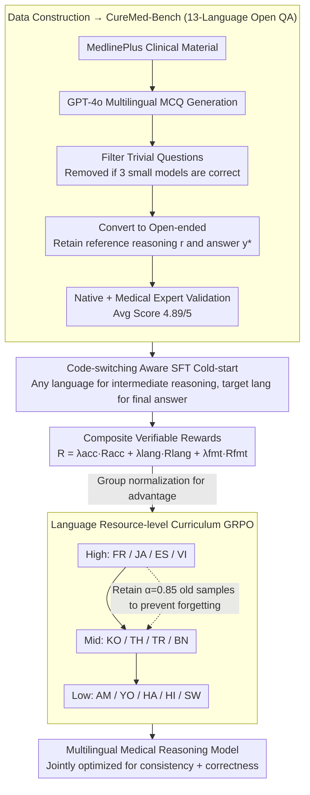

# CURE-Med: Curriculum-Informed Reinforcement Learning for Multilingual Medical Reasoning

**Conference**: ACL 2026 Oral  
**arXiv**: [2601.13262](https://arxiv.org/abs/2601.13262)  
**Code**: cure_med (Paper link provided, repository address not explicitly in cache)  
**Area**: Medical NLP / Multilingual LLM / Reinforcement Learning  
**Keywords**: Multilingual Medical Reasoning, GRPO, Curriculum Learning, Code-switching SFT, Low-resource Languages

## TL;DR
The authors construct CureMed-Bench, a medical reasoning dataset covering 13 languages (including low-resource languages like Amharic, Yoruba, and Swahili) with 15,774 open-ended questions. They propose Cure-Med: a two-stage "code-switching aware SFT + curriculum GRPO" framework that jointly optimizes reasoning correctness and language consistency. At 7B, it achieves a language consistency/logical accuracy of 85.21% / 54.35%, and at 32B, it reaches 94.96% / 70.04%.

## Background & Motivation
**Background**: Mainstream medical LLMs either follow "closed-form MCQ + supervised fine-tuning" (MedQA / MMedBench / MedMCQA) or perform monolingual open-ended QA (HealthSearchQA). Evaluations remain English-centric, leaving multilingual medical reasoning almost a blank space.

**Limitations of Prior Work**: On non-English, and especially low-resource languages like Amharic, Yoruba, and Hausa, LLMs exhibit two types of failures: (1) severe drops in logical accuracy; (2) "language drift" (input is Swahili, but intermediate or final answers drift back to English), making them unusable in clinical settings.

**Key Challenge**: To build trust among doctors and patients, a system must ensure both "transparent reasoning processes" and "stable output language." Existing SFT often sacrifices reasoning depth, while pure RL suffers from sparse rewards and poor early signals for low-resource languages, making it difficult to optimize both simultaneously.

**Goal**: (i) Provide the community with an open-ended medical reasoning benchmark covering 13 languages; (ii) Train a model that simultaneously optimizes "logical correctness" and "language fidelity," ensuring robustness for low-resource languages.

**Key Insight**: The authors observe that reward signals are more stable for high-resource languages. Consequently, they treat "language resource level" as curriculum difficulty, stabilizing RL on high-resource languages before gradually introducing mid- and low-resource languages; meanwhile, they allow intermediate reasoning to code-switch (thinking in English + clinical terminology, final answer in the target language) to preserve reasoning depth while stabilizing output language.

**Core Idea**: Jointly optimize multilingual medical reasoning using "code-switching SFT cold-start + resource-level curriculum GRPO + composite rewards (accuracy + language + format)."

## Method

### Overall Architecture
The pipeline consists of three stages: (A) Data Construction — pulls clinical materials from MedlinePlus, generates MCQs multilingually via GPT-4o, filters out trivial questions solvable by three small models, converts them to open-ended format (retaining reference reasoning chains $r$ and answers $y^*$), and finally undergoes validation by native speakers and medical experts with an average score of 4.89/5. (B) Cold-Start SFT — uses long CoT trajectories on a Qwen2.5-Instruct backbone that allow code-switching, where intermediate steps can use any language $\ell_t \in \mathcal{L}$, but the final answer must be in the target language $\ell$. (C) Curriculum GRPO — divides languages into high/mid/low tiers based on resource level, training in the order of high→mid→low. Upon entering a new tier, a ratio of $\alpha=0.85$ samples from previous tiers is retained to prevent forgetting, while composite rewards constrain accuracy, language, and format.

### Key Designs

**1. Code-switching Aware SFT Cold-start: Providing a robust starting point for RL**

If the model is forced to reason entirely in a low-resource language from the start, quality collapses—many medical terms lack equivalents in Amharic, and forced translation induces hallucinations. The cold-start phase relaxes language constraints for intermediate steps: for a query $x$ in target language $\ell$, a long CoT trajectory $\mathbf{r}=\{r_1,\dots,r_T\}$ is constructed where each step $r_t$ uses a language $\ell_t$ that can differ from $\ell$ (e.g., medical query in French using English clinical terms for reasoning), but only the final answer $y^*$ is mandatory in $\ell$. The loss is standard trajectory likelihood $\mathcal{L}_{\text{SFT}}=-\log p_\theta(\mathbf{r}, y^*\mid x)$. This allows the model to "think in its most proficient language and answer in the patient's language," preserving reasoning depth and leaving room for subsequent RL optimization without overwhelming the policy initially.

**2. Composite Verifiable Rewards: Disentangling accuracy, language fidelity, and formatting**

A single answer reward encourages "correct answers with messy language," while a single language reward encourages "giving up reasoning for format points." CURE-Med decouples rewards into three weighted paths:

$$R = \lambda_{\text{acc}} R_{\text{acc}} + \lambda_{\text{lang}} R_{\text{lang}} + \lambda_{\text{fmt}} R_{\text{fmt}}$$

Where $R_{\text{acc}} \in [0,1]$ is given by GPT-4.1 as a verifier (strict exact match for closed questions, partial scores for paraphrased open questions), $R_{\text{lang}}$ is a 0/1 indicator of whether output is strictly in the target language, and $R_{\text{fmt}}$ checks for `<thinking>/<step n>/<answer>` tag compliance. Decoupling these via a third-party scoring model prevents both "drifting language for accuracy" and "faking answers for consistency."

**3. Language Resource-level Curriculum GRPO: Distilling reward signals from high- to low-resource languages**

Performing RL on 13 mixed languages initially results in nearly zero positive samples for low-resource languages; rewards become constant and advantages approach zero, making updates useless. CURE-Med tiers languages—High (FR / JA / ES / VI), Mid (KO / TH / TR / BN), and Low (AM / YO / HA / HI / SW)—and trains in sequence. GRPO reaches a reward plateau on high-resource languages before expanding to mid and finally low tiers. At each new tier, sampling follows $\mathcal{D}_i = \alpha \mathcal{D}_{i-1} + (1-\alpha)\mathcal{D}_{L_i}$ with $\alpha=0.85$ to prevent forgetting, while the GRPO update rule $A_{i,k} = R_{i,k} - \text{mean}(\{R_{i,k}\})$ remains unchanged. This curriculum essentially "warms up" the reward surface using stable signals before tackling data-scarce low-resource languages.

### Loss & Training
The SFT phase maximizes $\log p_\theta(\mathbf{r}, y^*\mid x)$. The RL phase follows standard GRPO clipped objectives, using group-normalized rewards for advantage and KL regularization against the cold-start model. Cross-stage sample retention is $\alpha=0.85$, with scaling from 1.5B to 32B.

## Key Experimental Results

### Main Results
The benchmark reports average Language Consistency / Logical Accuracy (mean ± std) across 13 languages. Selected results for the 7B tier:

| Model | Consistency ↑ | Accuracy ↑ |
|------|---------------|------------|
| Qwen2.5-Instruct-7B (Base) | 25.44 ± 0.36 | 29.56 ± 0.42 |
| Mistral-7B | 18.70 ± 1.30 | 15.23 ± 1.20 |
| BioMistral-7B | 7.10 ± 0.90 | 4.80 ± 0.95 |
| MedAlpaca-7B | 3.50 ± 0.90 | 2.47 ± 0.95 |
| HuatuoGPT-o1-8B (Strongest baseline) | 67.30 ± 0.14 | 46.86 ± 0.09 |
| LLaMA-3.1-Instruct-8B | 36.56 ± 0.31 | 18.91 ± 0.18 |
| **Cure-Med-Qwen2.5-7B (Ours)** | **85.21** | **54.35** |

For the 3B tier:

| Model | Consistency ↑ | Accuracy ↑ |
|------|---------------|------------|
| Qwen2.5-Instruct-3B | 8.39 ± 0.42 | 10.83 ± 0.60 |
| LLaMA-3.2-3B | 23.69 ± 0.36 | 10.41 ± 0.38 |
| **Cure-Med-Qwen2.5-3B** | **74.28 ± 0.60** | **42.93 ± 0.60** |

At 32B, performance reaches Consistency 94.96 / Accuracy 70.04, showing strong scalability.

### Ablation Study

| Configuration | Consistency / Accuracy Trend | Description |
|------|------------------------------|------|
| Full Cure-Med (SFT + Curriculum GRPO + 3 Rewards) | 85.21 / 54.35 (7B) | Complete method |
| w/o code-switching SFT (Target lang only SFT) | Significant quality drop in low-resource | Code-switch is key for reasoning |
| w/o curriculum (Mixed 13-language GRPO) | Low-resource accuracy lags significantly | Curriculum order is vital for sparse samples |
| w/o $R_{\text{lang}}$ | Accuracy holds but consistency collapses | Language reward is indispensable |
| w/o $R_{\text{acc}}$ (Reward language + format only) | High consistency but hallucinated answers | Validates need for combined rewards |

### Key Findings
- The greatest gain from curriculum RL is in the low-resource tier: while methods perform similarly in high-resource tiers, Cure-Med doubles the strongest baseline in low-resource tiers, proving high-to-low curriculum effectively "distills" reward signals.
- Code-switching is an engineering necessity for multilingual medical reasoning: forced translation of missing clinical terms in low-resource languages causes hallucinations. Permitting English intermediate steps while answering in the target language preserves accuracy without hurting user experience.
- The model maintains advantages on OOD data (unseen medical questions + unseen languages), suggesting it learns a general "solve first, speak target language second" pattern rather than just memorizing distributions.

## Highlights & Insights
- Framing "language resource level as curriculum difficulty" is an elegant perspective shift. While standard curriculum learning sorts by task complexity, sorting by "reward signal stability" stabilizes the whole policy using early high-SNR rewards, applicable to any multilingual RL task with sparse rewards.
- The three-way decoupled rewards + third-party verifier is the minimum viable setup to prevent both language and accuracy drift.
- CureMed-Bench is a rare medical dataset offering "open-ended + single verifiable answer + low-resource + clinical validation," likely serving as a future de facto benchmark for multilingual medical RL.

## Limitations & Future Work
- Rewards still rely on GPT-4.1 as a verifier, introducing "homophilic bias" and black-box costs; the verifier itself may be inaccurate for low-resource languages, causing reward noise.
- The "optimal mixing ratio" for code-switching SFT data relies on heuristics; optimal switch patterns likely vary significantly by language pair.
- Evaluation focuses on single-turn QA, omitting multi-turn history taking and uncertainty communication in real clinical settings.
- Cultural and terminological variations (varying drug names by region) rely on manual review, limiting scalability.

## Related Work & Insights
- **vs HuatuoGPT-o1 / OpenBioLLM / UltraMedical**: These follow monolingual + domain-supervised paths; their consistency is near zero in low-resource multilingual scenarios. This work treats multilingual fidelity as a first-class optimization objective.
- **vs GRPO / DeepSeekMath**: Shares the GRPO framework but adapts it through curriculum and composite rewards for the reward-sparse multilingual medical task.
- **vs MMedBench / XMedBench**: These are MCQ-based, hiding intermediate reasoning. CureMed-Bench mandates open generation to independently measure reasoning process and language consistency.

## Rating
- Novelty: ⭐⭐⭐⭐ Treating language resource level as curriculum difficulty is a simple yet highly effective shift.
- Experimental Thoroughness: ⭐⭐⭐⭐ Covers 13 languages × 3 scales + multiple baselines, though more granular reward ablations could be included.
- Writing Quality: ⭐⭐⭐⭐ Clear pipeline with well-coordinated math and diagrams.
- Value: ⭐⭐⭐⭐ Both the dataset and framework directly advance equity in medical AI for low-resource regions.

<!-- RELATED:START -->

## Related Papers

- [\[ACL 2026\] Eliciting Medical Reasoning with Knowledge-enhanced Data Synthesis: A Semi-Supervised Reinforcement Learning Approach](eliciting_medical_reasoning_with_knowledge-enhanced_data_synthesis_a_semi-superv.md)
- [\[ACL 2026\] From Answers to Arguments: Toward Trustworthy Clinical Diagnostic Reasoning with Toulmin-Guided Curriculum Goal-Conditioned Learning](from_answers_to_arguments_toward_trustworthy_clinical_diagnostic_reasoning_with_.md)
- [\[ACL 2026\] Dr. Assistant: Enhancing Clinical Diagnostic Inquiry via Structured Diagnostic Reasoning Data and Reinforcement Learning](dr_assistant_enhancing_clinical_diagnostic_inquiry_via_structured_diagnostic_rea.md)
- [\[ACL 2026\] RADS: Reinforcement Learning-Based Sample Selection Improves Transfer Learning in Low-resource and Imbalanced Clinical Settings](rads_reinforcement_learning-based_sample_selection_improves_transfer_learning_in.md)
- [\[ICLR 2026\] Doctor-R1: Mastering Clinical Inquiry with Experiential Agentic Reinforcement Learning](../../ICLR2026/medical_nlp/doctor-r1_mastering_clinical_inquiry_with_experiential_agentic_reinforcement_lea.md)

<!-- RELATED:END -->
