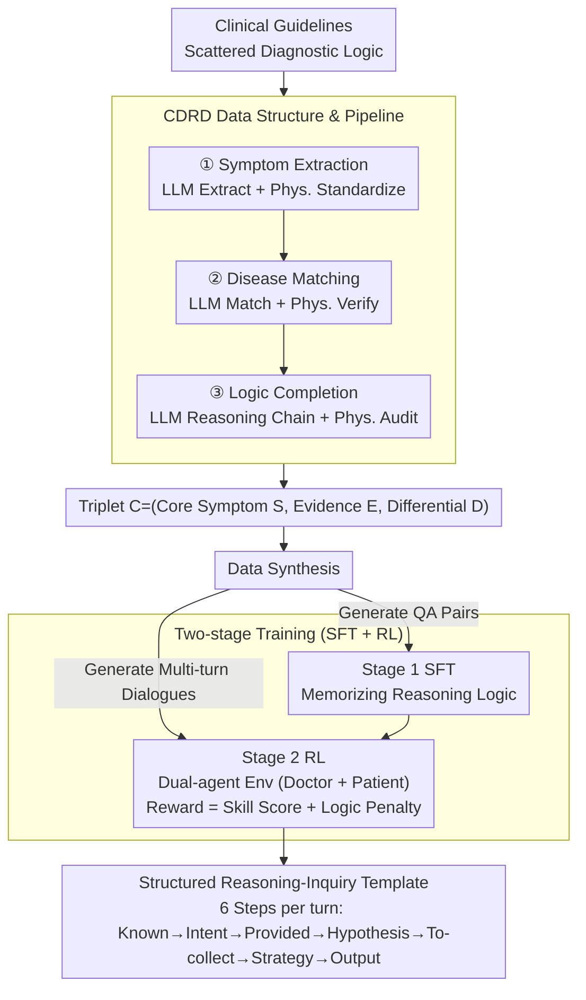

# Dr. Assistant: Enhancing Clinical Diagnostic Inquiry via Structured Diagnostic Reasoning Data and Reinforcement Learning

**Conference**: ACL 2026 Findings  
**arXiv**: [2601.13690](https://arxiv.org/abs/2601.13690)  
**Code**: [GitHub](https://github.com/YGswu/Dr.-Assistant)  
**Area**: Medical NLP  
**Keywords**: Clinical Diagnostic Reasoning, Reinforcement Learning, Structured Data, Inquiry Guidance, CDSS

## TL;DR

This paper proposes the Clinical Diagnostic Reasoning Data (CDRD) structure to capture the abstract clinical reasoning logic from symptoms to differential diagnosis. Based on CDRD, the Dr. Assistant model (14B) is developed using a two-stage SFT+RL training process. It outperforms HuatuoGPT-o1-72B by 13.59% in ICD-Recall on clinical inquiry benchmarks, achieving performance competitive with GPT-5.

## Background & Motivation

**Background**: Clinical Decision Support Systems (CDSS) provide reasoning and inquiry guidance for doctors. LLMs have been widely applied to medical consultation due to their extensive medical knowledge and excel on medical benchmarks.

**Limitations of Prior Work**: (1) Traditional CDSS rely on structured knowledge bases and rule-based algorithms, which are costly to maintain and lack adaptability; (2) Existing medical LLMs (e.g., Baichuan-M2, HuatuoGPT-o1) primarily optimize for patient consultation experience, lacking professional clinical diagnostic reasoning and inquiry skills; (3) Diagnostic reasoning logic in clinical guidelines is scattered across different chapters, making it difficult to use directly for training; (4) Even with high-quality data, training models to master clinical inquiry skills remains a significant challenge.

**Key Challenge**: LLMs possess broad medical knowledge but lack systematic clinical diagnostic reasoning logic—failing to perform structured symptom analysis and differential diagnosis like experienced physicians under zero-shot prompting.

**Goal**: (1) Design the CDRD data structure to capture abstract diagnostic reasoning logic; (2) Develop the Dr. Assistant model with diagnostic reasoning and inquiry skills; (3) Construct a clinical diagnostic reasoning and inquiry evaluation benchmark.

**Key Insight**: Extract structured diagnostic reasoning logic (CDRD) from clinical guidelines, use it as a seed to synthesize SFT and RL training data, and internalize clinical reasoning capabilities through two-stage training.

**Core Idea**: Clinical diagnostic reasoning can be abstracted into a structured triplet of (core symptoms, diagnostic evidence, differential diagnosis). This serves as a seed for generating training data, and a reward function including "logical deviation penalty" constrains the model's reasoning behavior during RL.

## Method

### Overall Architecture

The framework consists of a CDRD construction pipeline (three-stage LLM+physician collaboration: symptom extraction → disease matching → logic completion), data synthesis (CDRD → QA pairs for SFT + CDRD → multi-turn inquiry dialogues for RL), and a two-stage training for Dr. Assistant (SFT for memorizing reasoning logic + RL for strengthening inquiry skills). The resulting model follows a structured template to "think before speaking" in every inquiry turn.

### Key Designs

**1. CDRD Structure & Pipeline: Reorganizing scattered logic into symptom-driven differential paths**

Diagnostic reasoning logic in guidelines is fragmented—symptoms are in one chapter, differential diagnosis in another, and tests elsewhere. CDRD abstracts this logic into a triplet $\mathcal{C} = (\mathcal{S}, \mathcal{E}, \mathcal{D})$: core symptoms $\mathcal{S}$, diagnostic evidence $\mathcal{E}$ (related symptoms/signs/labs), and differential diagnosis $\mathcal{D}$ (candidate diseases with typical presentations and required tests). The pipeline uses LLM for candidates and physicians for validation/standardization across three stages, leveraging LLM productivity while ensuring clinical reliability through human oversight.

**2. Two-stage Training (SFT + RL): Memorizing logic then practicing as a skill**

Learning logic via SFT does not guarantee flexible application in multi-turn inquiries. Dr. Assistant uses Stage 1 SFT on CDRD-generated QA pairs for initial memorization. Stage 2 RL uses a dual-agent environment (Doctor agent for inquiry, Patient agent responding based on settings). The reward function includes clinical reasoning/inquiry scores (LLM-judged coverage, accuracy, logic) and CDRD logic fidelity (punishing deviations from standard reasoning paths), preventing "skipping steps" in reasoning.

**3. Structured Reasoning-Inquiry Template: Making every turn evidence-based**

Unstructured inquiry risks missing info or jumping to conclusions. Dr. Assistant standardizes each turn into six steps: Known Information → User Intent → Provided Information → Diagnostic Hypothesis → To-collect Information → Response Strategy → Final Output. The model must complete this Chain-of-Thought before generating a response, ensuring systematicity and completeness.

### A Complete Example: One turn of "Headache" inquiry

For a patient with "three-day headache": The model registers "headache, 3 days" in **Known Information**; identifies the **User Intent** as symptom description; notes only location and duration in **Provided Information**. It then lists migraines, tension headaches, or intracranial lesions in **Diagnostic Hypothesis** based on CDRD. **To-collect Information** targets evidence like nausea, photophobia, or sudden onset. The **Response Strategy** prioritizes the most discriminative question, and the **Output** asks: "Have you had nausea or light sensitivity with these headaches?" After a reply, evidence feeds back into the next turn's "Known Information."

### Loss & Training

SFT stage uses standard cross-entropy loss. RL stage: Reward = Clinical reasoning and inquiry skill score (LLM assessment of coverage, accuracy, logic) + CDRD logic fidelity penalty (deviation from standard logic). The base model has 14B parameters.

## Key Experimental Results

### Main Results

**Diagnostic Reasoning Evaluation (242 real cases, 8 departments)**

| Model | Params | ICD-Recall ↑ | Overall Score |
|------|------|-------------|---------|
| HuatuoGPT-o1 | 72B | Baseline | - |
| GPT-5 | - | High | Competitive |
| **Dr. Assistant** | **14B** | **+13.59%** | **Competitive with GPT-5** |

### Ablation Study

| Configuration | ICD-Recall | Inquiry Quality |
|------|-----------|---------|
| SFT only | Base level | Moderate |
| SFT + RL (w/o Logic Penalty) | Gain | Improved but with logic deviations |
| SFT + RL (Full Reward) | **Highest** | **Highest** |

### Key Findings

- Dr. Assistant (14B) outperforms HuatuoGPT-o1 (72B) with a 13.59% ICD-Recall gain, proving specialized reasoning training is more critical than model scale.
- The CDRD logic fidelity penalty in RL is crucial; without it, models generate plausible but logically loose reasoning.
- Structured templates ensure evidence-based inquiries, improving systematicity.
- Dr. Assistant achieves performance competitive with GPT-5, offering a feasible solution for CDSS deployment.

## Highlights & Insights

- The CDRD structure is a general clinical knowledge representation scheme extensible to more guidelines.
- The LLM+physician collaboration pipeline balances efficiency and reliability.
- The "logical deviation penalty" in RL rewards ensures exploration remains aligned with clinical reasoning standards.

## Limitations & Future Work

- CDRD currently only covers internal medicine-related guidelines, with limited specialty coverage.
- The evaluation benchmark size (242 cases, 147 turns) is relatively small.
- Lacks prospective evaluation in real clinical environments.
- Weight tuning for RL rewards may require more involvement from domain experts.

## Related Work & Insights

- **vs Baichuan-M2/HuatuoGPT-o1**: While prior models optimize for general consultation, Ours focuses on specializing clinical diagnostic reasoning and inquiry skills.
- **vs Traditional CDSS**: Traditional systems are hard to scale; Ours achieves flexibility through LLMs and structured reasoning data.
- **vs Doctor-R1**: Doctor-R1 emphasizes the reasoning process, while Ours focuses more on the structural logic of diagnostic reasoning and inquiry skills.

## Rating

- Novelty: ⭐⭐⭐⭐ Innovative CDRD structure and logic-penalized RL design.
- Experimental Thoroughness: ⭐⭐⭐⭐ Comprehensive comparison but limited benchmark scale.
- Writing Quality: ⭐⭐⭐⭐ Method is clear and systematic, with accurate clinical problem definition.
- Value: ⭐⭐⭐⭐⭐ Provides an effective LLM solution for practical CDSS deployment.

<!-- RELATED:START -->

## Related Papers

- [\[ACL 2026\] From Answers to Arguments: Toward Trustworthy Clinical Diagnostic Reasoning with Toulmin-Guided Curriculum Goal-Conditioned Learning](from_answers_to_arguments_toward_trustworthy_clinical_diagnostic_reasoning_with_.md)
- [\[ACL 2026\] Eliciting Medical Reasoning with Knowledge-enhanced Data Synthesis: A Semi-Supervised Reinforcement Learning Approach](eliciting_medical_reasoning_with_knowledge-enhanced_data_synthesis_a_semi-superv.md)
- [\[ACL 2026\] RADS: Reinforcement Learning-Based Sample Selection Improves Transfer Learning in Low-resource and Imbalanced Clinical Settings](rads_reinforcement_learning-based_sample_selection_improves_transfer_learning_in.md)
- [\[ACL 2026\] MultiDx: A Multi-Source Knowledge Integration Framework towards Diagnostic Reasoning](multidx_a_multi-source_knowledge_integration_framework_towards_diagnostic_reason.md)
- [\[ICLR 2026\] Doctor-R1: Mastering Clinical Inquiry with Experiential Agentic Reinforcement Learning](../../ICLR2026/medical_nlp/doctor-r1_mastering_clinical_inquiry_with_experiential_agentic_reinforcement_lea.md)

<!-- RELATED:END -->
