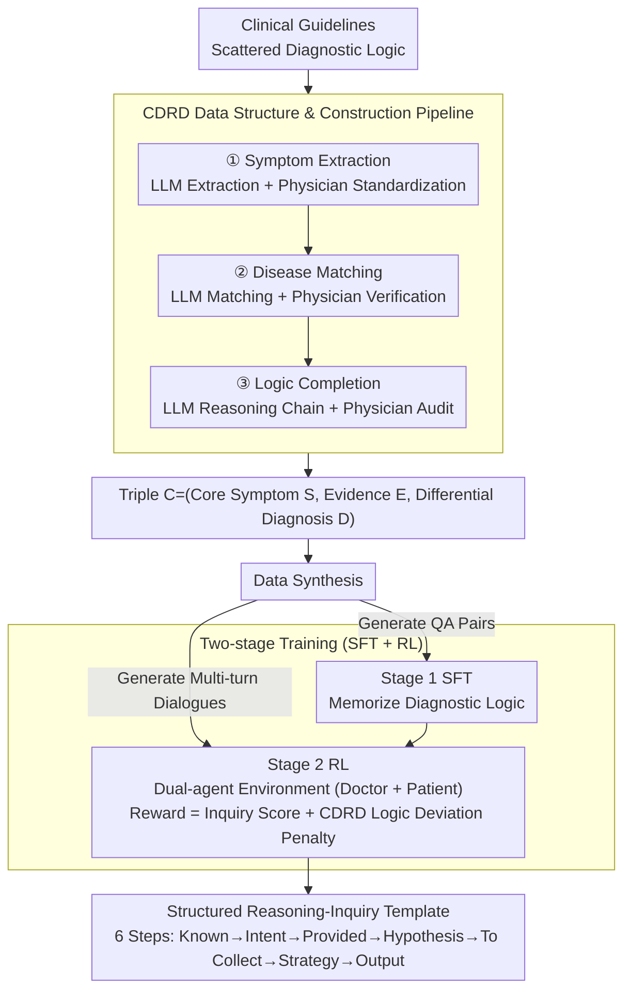

# Dr. Assistant: Enhancing Clinical Diagnostic Inquiry via Structured Diagnostic Reasoning Data and Reinforcement Learning

**Conference**: ACL 2026 Findings  
**arXiv**: [2601.13690](https://arxiv.org/abs/2601.13690)  
**Code**: [GitHub](https://github.com/YGswu/Dr.-Assistant)  
**Area**: Medical NLP  
**Keywords**: Clinical diagnostic reasoning, reinforcement learning, structured data, inquiry guidance, CDSS

## TL;DR

This paper proposes the Clinical Diagnostic Reasoning Data (CDRD) structure to capture abstract clinical reasoning logic from symptoms to differential diagnosis. Based on CDRD, the Dr. Assistant model (14B) is constructed via a two-stage SFT+RL training process, exceeding HuatuoGPT-o1-72B by 13.59% in ICD-Recall on clinical inquiry benchmarks and achieving performance competitive with GPT-5.

## Background & Motivation

**Background**: Clinical Decision Support Systems (CDSS) provide reasoning and inquiry guidance for physicians. LLMs have been widely applied in medical consultation due to their extensive medical knowledge, performing exceptionally well on medical benchmarks.

**Limitations of Prior Work**: (1) Traditional CDSS rely on structured knowledge bases and rule-based algorithms, which involve high maintenance costs and poor adaptability; (2) Existing medical LLMs (e.g., Baichuan-M2, HuatuoGPT-o1) primarily optimize the patient consultation experience, lacking professional clinical diagnostic reasoning and inquiry skills; (3) Diagnostic reasoning logic in clinical guidelines is scattered across different chapters, making it difficult to use directly for training; (4) Even with high-quality data, training models to master clinical inquiry skills remain a significant challenge.

**Key Challenge**: LLMs possess broad medical knowledge but lack systematic clinical diagnostic reasoning logic—they fail to perform structured symptom analysis and differential diagnosis like experienced physicians under zero-shot prompting.

**Goal**: (1) Design the CDRD data structure to capture abstract diagnostic reasoning logic; (2) Construct the Dr. Assistant model equipped with diagnostic reasoning and inquiry skills; (3) Build a benchmark for evaluating clinical diagnostic reasoning and inquiry.

**Key Insight**: Extract structured diagnostic reasoning logic (CDRD) from clinical guidelines, then use CDRD as a seed to synthesize SFT and RL training data, enabling the model to internalize clinical reasoning capabilities through two-stage training.

**Core Idea**: Clinical diagnostic reasoning can be abstracted into a structured triple (core symptom, diagnostic evidence, differential diagnosis). This serves as the seed for generating training data, with the model's reasoning behavior constrained by an RL reward function that includes a "logic deviation penalty."

## Method

### Overall Architecture

The method consists of the CDRD construction pipeline (a three-stage LLM+physician collaboration: symptom extraction → disease matching → logic completion) → Data synthesis (CDRD to QA pairs for SFT + CDRD to multi-turn inquiry dialogues for RL) → Two-stage training of Dr. Assistant (Stage 1 SFT for memorizing reasoning logic + Stage 2 RL for strengthening inquiry skills). The resulting model follows a structured template in every inquiry round to "think clearly before speaking."

### Key Designs

**1. CDRD Data Structure and Construction Pipeline: Reorganizing scattered diagnostic logic into differential diagnosis paths starting from symptoms.**

Diagnostic reasoning logic in clinical guidelines is fragmented—symptom descriptions are in one chapter, differential diagnosis in another, and laboratory tests elsewhere, making it unsuitable for direct training. CDRD abstracts this logic into a triple $\mathcal{C} = (\mathcal{S}, \mathcal{E}, \mathcal{D})$: core symptoms $\mathcal{S}$ (e.g., headache), diagnostic evidence $\mathcal{E}$ (associated symptoms/signs/lab results), and differential diagnosis $\mathcal{D}$ (candidate diseases with typical manifestations and required tests). The pipeline utilizes LLM-physician collaboration: LLMs extract candidate symptoms for physicians to standardize, match diseases for physician verification, and complete reasoning chains for physician auditing. This leverages LLM productivity while maintaining clinical reliability through human oversight.

**2. Two-stage Training (SFT + RL): Memorizing reasoning logic first, then refining it into a skill through simulated inquiry.**

Simply feeding reasoning logic to a model does not guarantee flexible application in real-world multi-turn inquiries. Dr. Assistant uses a two-stage process: Stage 1 involves SFT using QA pairs generated from CDRD to anchor initial diagnostic logic; Stage 2 employs RL with multi-turn dialogues in a dual-agent environment (a doctor agent performs inquiry while a patient agent responds based on settings). The RL reward has two dimensions—clinical reasoning and inquiry skill scores (evaluated by an LLM for coverage, accuracy, and logic) and CDRD logic fidelity (penalizing deviations from CDRD standard reasoning paths). This logic deviation penalty is crucial, as it prevents the model from generating "reasonable-looking but skip-step" reasoning during exploratory inquiry.

**3. Structured Reasoning-Inquiry Template: Making every round of inquiry evidence-based.**

Unstructured inquiry often misses critical information or jumps prematurely to a diagnosis. Dr. Assistant formalizes the reasoning process into six steps per round: Known Information → User Intent → Already Provided Info → Diagnostic Hypothesis → Information to be Collected → Response Strategy → Final Inquiry/Diagnostic Output. The model must complete this Chain-of-Thought (CoT) before deciding to ask the next question or provide a diagnosis, effectively enforcing systematic and complete inquiry behavior.

### A Complete Example: One Round of a "Headache" Inquiry

Taking a patient with a chief complaint of "headache for three days" as an example: the model first logs "headache, duration 3 days" in **Known Information**; the **User Intent** is identified as seeking consultation; **Already Provided Info** confirms only site and duration are known; cross-referencing $\mathcal{E}$ and $\mathcal{D}$ for headache in CDRD, the **Diagnostic Hypothesis** lists migraine, tension headache, and red-flag intracranial lesions; **Information to be Collected** targets evidence to differentiate these—nausea/vomiting, photophobia, or sudden onset (to rule out subarachnoid hemorrhage); the **Response Strategy** decides to ask the most discriminative question first; the final **Output** is "Have you had any nausea or sensitivity to light with the headaches?" After the patient agent responds, new evidence is fed into the next round's **Known Information**, narrowing the hypothesis set until the evidence supports a differential diagnosis. The process is strictly guided by the CDRD logic fidelity penalty.

### Loss & Training

SFT stage: Standard cross-entropy loss. RL stage: Reward function = Clinical reasoning and inquiry skill score (assessed by LLM for coverage, accuracy, and logic) + CDRD logic fidelity (penalizing deviations from standard logic). The base model has 14B parameters.

## Key Experimental Results

### Main Results

**Diagnostic Reasoning Evaluation (242 real clinical cases, 8 second-level departments)**

| Model | Parameters | ICD-Recall ↑ | Overall Score |
| :--- | :--- | :--- | :--- |
| HuatuoGPT-o1 | 72B | Baseline | - |
| GPT-5 | - | High | Competitive |
| **Dr. Assistant** | **14B** | **+13.59%** | **Competitive with GPT-5** |

### Ablation Study

| Configuration | ICD-Recall | Inquiry Quality |
| :--- | :--- | :--- |
| SFT Only | Base Level | Medium |
| SFT + RL (No Logic Penalty) | Improvement | Improved but with logic deviations |
| SFT + RL (Full Reward) | **Highest** | **Highest** |

### Key Findings

- Dr. Assistant (14B) outperforms HuatuoGPT-o1 (72B) as a smaller model, with a 13.59% improvement in ICD-Recall—proving that specialized diagnostic reasoning training is more important than model scale.
- The CDRD logic fidelity penalty in RL is critical—without it, the model tends to produce plausible but logically loose reasoning.
- The structured reasoning template ensures every round of inquiry is evidence-based, enhancing the systematic nature and completeness of the process.
- Dr. Assistant reaches a level competitive with GPT-5, providing a feasible solution for the practical deployment of CDSS.

## Highlights & Insights

- The CDRD data structure is a general clinical knowledge representation scheme that can be extended to more clinical guidelines.
- The LLM+physician collaborative data construction pipeline balances efficiency and reliability.
- The "logic deviation penalty" in the RL reward function ensures that the model's free exploration does not deviate from the clinical reasoning track.

## Limitations & Future Work

- Currently, CDRD is only constructed based on internal medicine guidelines, representing limited department coverage.
- The evaluation benchmark scale is small (242 cases, 147 inquiry rounds), limiting statistical power.
- No prospective evaluation has been conducted in real-world clinical environments.
- Weight adjustment for the RL reward function may require the participation of domain experts.

## Related Work & Insights

- **vs Baichuan-M2/HuatuoGPT-o1**: These models optimize general medical consultation; this work focuses on the specialization of clinical diagnostic reasoning and inquiry skills.
- **vs Traditional CDSS**: Traditional systems rely on rigid rules and are difficult to scale; Dr. Assistant achieves flexibility through LLMs and structured reasoning data.
- **vs Doctor-R1**: While Doctor-R1 emphasizes the reasoning process, this work focuses more on the structuralization of diagnostic reasoning logic and inquiry skills.

## Rating

- Novelty: ⭐⭐⭐⭐ The design of the CDRD data structure and the logic deviation penalty in RL is novel.
- Experimental Thoroughness: ⭐⭐⭐⭐ Comparisons are comprehensive, though the evaluation scale is limited.
- Writing Quality: ⭐⭐⭐⭐ Method is clear and systematic, with accurate clinical problem definitions.
- Value: ⭐⭐⭐⭐⭐ Provides an effective LLM solution for practical CDSS deployment.

<!-- RELATED:START -->

## Related Papers

- [\[ACL 2026\] From Answers to Arguments: Toward Trustworthy Clinical Diagnostic Reasoning with Toulmin-Guided Curriculum Goal-Conditioned Learning](from_answers_to_arguments_toward_trustworthy_clinical_diagnostic_reasoning_with_.md)
- [\[ACL 2026\] Eliciting Medical Reasoning with Knowledge-enhanced Data Synthesis: A Semi-Supervised Reinforcement Learning Approach](eliciting_medical_reasoning_with_knowledge-enhanced_data_synthesis_a_semi-superv.md)
- [\[ACL 2026\] RADS: Reinforcement Learning-Based Sample Selection Improves Transfer Learning in Low-resource and Imbalanced Clinical Settings](rads_reinforcement_learning-based_sample_selection_improves_transfer_learning_in.md)
- [\[ACL 2026\] MultiDx: A Multi-Source Knowledge Integration Framework towards Diagnostic Reasoning](multidx_a_multi-source_knowledge_integration_framework_towards_diagnostic_reason.md)
- [\[ICML 2026\] MedCase-Structured: A Text-to-FHIR Dataset for Benchmarking Diagnostic Reasoning in Clinically Realistic EHR Settings](../../ICML2026/medical_nlp/medcase-structured_a_text-to-fhir_dataset_for_benchmarking_diagnostic_reasoning_.md)

<!-- RELATED:END -->
