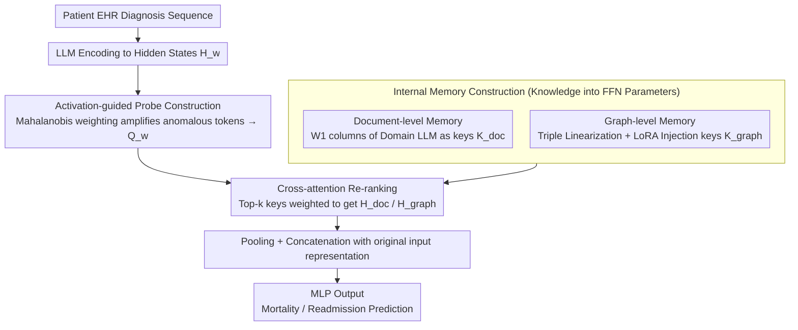

# Efficient and Effective Internal Memory Retrieval for LLM-Based Healthcare Prediction

**Conference**: ACL 2026 Findings  
**arXiv**: [2604.07659](https://arxiv.org/abs/2604.07659)  
**Code**: [https://anonymous.4open.science/r/K2K-2390/](https://anonymous.4open.science/r/K2K-2390/)  
**Area**: Medical NLP  
**Keywords**: Internal memory retrieval, FFN key-value memory, healthcare prediction, knowledge injection, cross-attention re-ranking

## TL;DR
This paper proposes the K2K framework, which treats the LLM's FFN parameter space as a retrievable knowledge base. By injecting clinical knowledge via LoRA, constructing precise retrieval with activation-guided probes, and adaptively integrating via cross-attention re-ranking, it achieves medical prediction SOTA without external retrieval latency.

## Background & Motivation

**Background**: LLMs have demonstrated significant potential in the medical field, but deployment faces challenges such as hallucinations and a lack of fine-grained medical context. RAG is the mainstream knowledge grounding strategy, where existing methods retrieve from knowledge graphs, unstructured documents, or self-generated knowledge.

**Limitations of Prior Work**: Traditional RAG pipelines face two critical bottlenecks—(1) injecting external knowledge through input prompts expands context length, increasing inference costs and limiting scalability; (2) constructing high-quality retrievers remains difficult, as supervised retrieval requires extensive labeled query-context pairs, and structured retrieval relies on expensive graph searches or oversimplified heuristics. These issues are unacceptable in time-sensitive clinical environments.

**Key Challenge**: The need for both accurate and fast access to relevant medical knowledge, yet the latency and complexity introduced by external retrieval conflict with the requirements of real-time clinical decision-making. Existing research suggests that FFN layers implicitly store factual knowledge (key-value memory interpretation), but directly using raw queries to retrieve internal keys is inaccurate—keys retrieved by different queries are highly similar, and probe representations lack discriminative power.

**Goal**: Design a framework to retrieve knowledge directly from the LLM’s internal parameter space, avoiding the latency and complexity of external retrieval.

**Key Insight**: Leverage the FFN key-value memory interpretation by Geva et al.—the columns of the FFN weight matrix $W_1$ serve as "keys" storing semantic patterns, and the rows of $W_2$ serve as "values" storing corresponding knowledge. After injecting domain knowledge via LoRA, these keys become a searchable internal knowledge base.

**Core Idea**: "Write" medical knowledge into the LLM parameter space via LoRA, then use activation-guided probes to precisely retrieve relevant internal keys, followed by dynamic integration via cross-attention.

## Method

### Overall Architecture

K2K aims to solve the problem where healthcare prediction requires external medical knowledge grounding but cannot tolerate the latency and context expansion of external retrieval. The strategy is to "move" knowledge into the LLM's own parameters for on-site retrieval. The pipeline consists of three steps: first, injecting document-level and knowledge graph (KG) knowledge into the FFN parameter space via domain adaptation and LoRA to form retrievable internal memory; second, using activation-guided probes to make the input query discriminative for precise key retrieval; finally, re-ranking and weighting multi-source retrieval results using cross-attention. The input is a diagnosis code sequence from the patient's longitudinal EHR, and the output is a binary prediction for mortality or readmission.

### Key Designs

**1. Internal Memory Construction: "Welding" external clinical knowledge into FFN weights to eliminate the need for external retrieval systems**

External RAG requires maintaining an additional retriever and stuffing long contexts into prompts, both of which are difficult to afford in time-sensitive clinical scenarios. K2K adopts the FFN key-value memory interpretation from Geva et al.—where the columns of the first FFN layer $W_1$ are "keys" storing semantic patterns and the rows of the second layer $W_2$ are "values" storing knowledge—to encode knowledge directly into parameters. It follows two paths: document-level memory directly uses $W_1$ from a domain-adapted LLM (e.g., BioMistral) as keys $K_{\text{doc}}^l$; graph-level memory first linearizes medical KG triples into text (e.g., "The relationship between [head] and [tail] is [relation]") and then injects it via LoRA fine-tuning, treating the LoRA matrices $A_1 B_1$ as graph keys $K_{\text{graph}}^l$. Both paths provide complementary unstructured and structured knowledge, while the low-rank nature of LoRA ensures efficient injection without damaging original model capabilities, completely eliminating retrieval latency during inference.

**2. Activation-guided Probe Construction: Using Mahalanobis weighting to amplify anomalous tokens for discriminative queries**

Directly using the raw query to retrieve internal keys faces a fatal issue: probes obtained via mean pooling are highly similar across different queries, lacking discriminative power and resulting in indistinguishable retrieval results. K2K avoids simple averaging by calculating the Mahalanobis distance (diagonal approximation) for each token in the input hidden states $H_w$ relative to the contextual mean:

$$\phi_j^w \approx \sqrt{\sum_d \frac{(h_{j,d}^w - \bar{z}_d^w)^2}{\sigma_d^2}}$$

This distance is normalized into a soft attention weight $\alpha_j^w$, and the enhanced probe is aggregated as $Q_w = \sum_j \alpha_j^w \cdot h_j^w$. The Mahalanobis distance scales by dimensional variance, making it highly sensitive to deviations in low-variance directions. Consequently, truly scarce and informative semantic anchor tokens are amplified while common tokens are suppressed, granting the probe discriminative power to precisely hit relevant internal keys.

**3. Cross-attention Re-ranking: Dynamically selecting and weighting multi-source internal knowledge in a task-aware manner**

Keys retrieved from internal memory are latent and lack explicit sourcing; simply stacking them does not indicate which is more important for the current task. K2K segments the input representation into multiple windows, where the enhanced probe $Q_w^+$ of each window retrieves top-k keys from both document and graph memories. Cross-attention (CA) is then used to re-rank these keys, resulting in document knowledge $H_{\text{doc}}^w$ and graph knowledge $H_{\text{graph}}^w$. After pooling and concatenation, these are merged with the original input representation and fed into the MLP for the final prediction. Cross-attention acts as an adaptive gate: it allows the model to dynamically determine the weights of multi-source internal knowledge based on the patient's specific condition, rather than applying fixed weights.

### Mechanism Example

Consider a patient EHR sequence: the input is a sequence of ICD diagnosis codes from previous visits, and the goal is to predict future readmission. Internal memory is already established—BioMistral FFN columns store document-level clinical knowledge keys, and LoRA-injected graph keys store structural relationships between diagnoses. During inference, the model encodes this sequence into hidden states and calculates Mahalanobis weights for each token. Rare but critical diagnosis codes (rather than repetitive common codes) are amplified to aggregate into a discriminative probe $Q_w$. The probe retrieves top-k keys from both document and graph memories. Cross-attention re-weights the two sources of knowledge based on the patient's specific condition—for instance, increasing the weight of structured complication relationships and lowering generic document-level knowledge—before concatenating the weighted knowledge with the original representation for the MLP to output the readmission probability. No external database is accessed throughout the process.

### Loss & Training

Standard cross-entropy loss is used for the classification stage, and LoRA is used for the knowledge injection stage. Evaluations are conducted on MIMIC-III and MIMIC-IV, with train/test splits partitioned by patient ID to prevent data leakage.

## Key Experimental Results

### Main Results

| Method | MIMIC-III Mort Avg | MIMIC-III Read Avg | MIMIC-IV Mort Avg | MIMIC-IV Read Avg |
|------|-------------------|-------------------|-------------------|-------------------|
| KARE (Prev. SOTA) | Lower | Lower | Lower | Lower |
| Standard RAG | Medium | Medium | Medium | Medium |
| K2K (BioMistral) | Higher | Higher | Higher | Higher |
| K2K (Meditron3) | **Highest** | **Highest** | **Highest** | **Highest** |

### Ablation Study

| Configuration | Effect | Description |
|------|------|------|
| Full K2K | Optimal | Complete framework |
| w/o Graph Memory | Decrease | Contribution of structured knowledge |
| w/o Activation Guidance | Decrease | Importance of probe discriminative power |
| w/o Cross-attention Re-ranking | Decrease | Necessity of dynamic integration |
| Using Mean Pooling Probes | Significant Decrease | Validates advantage of Mahalanobis weighting |

### Key Findings
- K2K achieves SOTA across four benchmarks, with retrieval efficiency far exceeding KARE and prompt-based methods.
- Meditron3-Qwen2.5-7B outperforms BioMistral-7B, indicating that base model capability significantly impacts internal memory quality.
- Activation-guided probes significantly improve retrieval precision compared to standard mean pooling, validating the effectiveness of Mahalanobis distance.
- Using both document-level and graph-level memory outperforms single-source usage, as the two provide complementary information.

## Highlights & Insights
- **Parameters as Knowledge Base**: Converts the theoretical insight of FFN key-value memory into a practical system, retrieving knowledge directly in parameter space and eliminating external retrieval latency. This concept can be generalized to any scenario requiring fast knowledge access.
- **Mahalanobis Distance Enhanced Probes**: Weighting token importance by considering dimensional variance identifies semantic anchors better than simple Euclidean distance or mean pooling. This is a general-purpose representation enhancement technique.
- **LoRA as a Knowledge Injection Tool**: Instead of using LoRA to fine-tune task performance, it is used to "write" new knowledge into the parameter space. This usage opens new application directions for LoRA.

## Limitations & Future Work
- Internal keys are latent and ungrounded, leading to a lack of interpretability—it is unclear what specific knowledge retrieved keys represent.
- Dependency on domain-adapted base models (BioMistral/Meditron3); performance on general LLMs is unknown.
- Validated only on classification tasks for ICD code sequences; generative tasks have not been tested.
- The quality of KG linearization depends on how triples are phrased.

## Related Work & Insights
- **vs KARE**: KARE combines document retrieval and KG shortest paths but suffers from high graph search costs. K2K encodes all knowledge into parameters, achieving zero latency during inference.
- **vs Standard RAG**: RAG increases context length and inference cost; K2K avoids context expansion via internal retrieval.
- **vs RETRO**: RETRO also uses window-based retrieval and cross-attention but retrieves from an external database. K2K adapts this architecture for internal parameter retrieval.

## Rating
- Novelty: ⭐⭐⭐⭐⭐ Converting FFN key-value memory interpretation into a practical internal retrieval system is a very novel idea.
- Experimental Thoroughness: ⭐⭐⭐⭐ Four datasets, multiple baselines, and comprehensive ablation studies.
- Writing Quality: ⭐⭐⭐⭐ Clear method descriptions, effective combination of theory and practice.
- Value: ⭐⭐⭐⭐ Provides a low-latency knowledge grounding solution for time-sensitive clinical scenarios.

<!-- RELATED:START -->

## Related Papers

- [\[AAAI 2026\] BiCA: Effective Biomedical Dense Retrieval with Citation-Aware Hard Negatives](../../AAAI2026/medical_nlp/bica_effective_biomedical_dense_retrieval_with_citation-aware_hard_negatives.md)
- [\[ACL 2026\] ReMedi: Reasoner for Medical Clinical Prediction](remedi_reasoner_for_medical_clinical_prediction.md)
- [\[ACL 2026\] HypEHR: Hyperbolic Modeling of Electronic Health Records for Efficient Question Answering](hypehr_hyperbolic_modeling_of_electronic_health_records_for_efficient_question_a.md)
- [\[NeurIPS 2025\] The Physical Basis of Prediction: World Model Formation in Neural Organoids via an LLM-Generated Curriculum](../../NeurIPS2025/medical_nlp/the_physical_basis_of_prediction_world_model_formation_in_neural_organoids_via_a.md)
- [\[ACL 2026\] Faithfulness vs. Safety: Evaluating LLM Behavior Under Counterfactual Medical Evidence](faithfulness_vs_safety_evaluating_llm_behavior_under_counterfactual_medical_evid.md)

<!-- RELATED:END -->
