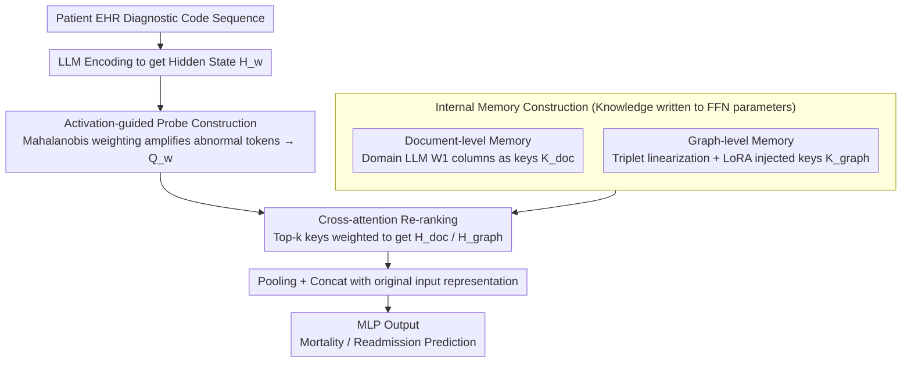

# Efficient and Effective Internal Memory Retrieval for LLM-Based Healthcare Prediction

**Conference**: ACL 2026 Findings  
**arXiv**: [2604.07659](https://arxiv.org/abs/2604.07659)  
**Code**: [https://anonymous.4open.science/r/K2K-2390/](https://anonymous.4open.science/r/K2K-2390/)  
**Area**: Medical NLP  
**Keywords**: Internal memory retrieval, FFN key-value memory, healthcare prediction, knowledge injection, cross-attention re-ranking

## TL;DR
This paper proposes the K2K framework, which treats the FFN parameter space of LLMs as a retrievable knowledge base. By injecting clinical knowledge via LoRA, constructing precise retrieval through activation-guided probes, and adaptively integrating information via cross-attention re-ranking, it achieves SOTA in healthcare prediction without external retrieval latency.

## Background & Motivation

**Background**: LLMs have shown significant potential in the medical field but face hallucinations and a lack of fine-grained medical context during deployment. RAG is a mainstream strategy for knowledge grounding, where existing methods retrieve from knowledge graphs, unstructured documents, or self-generated knowledge.

**Limitations of Prior Work**: Traditional RAG pipelines face two key bottlenecks: (1) injecting external knowledge through input prompts expands the context length, increasing inference costs and limiting scalability; (2) building high-quality retrievers remains challenging, as supervised retrieval requires many labeled query-context pairs, while structured retrieval depends on expensive graph searches or oversimplified heuristics. These are unacceptable in time-sensitive clinical environments.

**Key Challenge**: There is a need for both accurate and rapid access to relevant medical knowledge, but the latency and complexity of external retrieval conflict with the requirements of real-time clinical decision-making. Existing research indicates that FFN layers implicitly store factual knowledge (key-value memory interpretation), but retrieving internal keys directly with raw queries is inaccurate—keys retrieved for different queries are highly similar, and probe representations lack discriminative power.

**Goal**: Design a framework to retrieve knowledge directly from the LLM's internal parameter space, avoiding the latency and complexity of external retrieval.

**Key Insight**: Utilize Geva et al.'s FFN key-value memory interpretation—the columns of the FFN weight matrix $W_1$ act as "keys" storing semantic patterns, and the rows of $W_2$ act as "values" storing corresponding knowledge. After injecting domain knowledge via LoRA, these keys form a searchable internal knowledge base.

**Core Idea**: "Write" medical knowledge into the LLM parameter space via LoRA, then use activation-guided probes to precisely retrieve relevant internal keys, followed by dynamic integration using cross-attention.

## Method

### Overall Architecture

K2K aims to solve the problem where healthcare prediction requires external medical knowledge grounding but cannot tolerate the latency and context expansion brought by external retrieval. The strategy is to "move" knowledge into the LLM’s own parameters and retrieve it locally. The pipeline consists of three steps: first, injecting document-level and knowledge graph-level knowledge into the FFN parameter space through domain adaptation and LoRA to form retrievable internal memory; second, using activation-guided probes to make the input query discriminative and precisely fetch keys from internal memory; finally, using cross-attention to re-rank and adaptively integrate multi-source retrieval results. The input consists of diagnostic code sequences from a patient's longitudinal EHR, and the output is a binary prediction for mortality or readmission.

### Key Designs

**1. Internal Memory Construction: "Welding" external clinical knowledge into FFN weights to eliminate external systems**

External RAG requires maintaining a separate retriever and stuffing long contexts into prompts, both of which are costly in time-sensitive clinical scenarios. K2K adopts the FFN key-value memory interpretation from Geva et al.—where columns of the first FFN layer $W_1$ are "keys" and rows of the second layer $W_2$ are "values"—to encode knowledge directly into parameters. It follows two paths: document-level memory uses $W_1$ of a domain-adapted LLM (e.g., BioMistral) as keys $K_{\text{doc}}^l$; graph-level memory linearizes medical knowledge graph triplets into text (e.g., "The relationship between [head] and [tail] is [relation]") and injects them via LoRA fine-tuning, using the LoRA matrices $A_1 B_1$ as graph keys $K_{\text{graph}}^l$. These two paths provide complementary unstructured and structured knowledge, while the low-rank nature of LoRA ensures efficient injection without damaging original capabilities, completely eliminating retrieval latency during inference.

**2. Activation-guided Probe Construction: Scaling abnormal tokens via Mahalanobis weighting to differentiate queries**

Retrieving internal keys with raw queries faces a fatal issue: probes obtained via mean pooling are highly similar across different queries, lacking discriminative power and resulting in indistinguishable retrieval results. K2K avoids simple averaging and instead calculates the Mahalanobis distance (diagonal approximation) for each token in the hidden state $H_w$ relative to the contextual mean:

$$\phi_j^w \approx \sqrt{\sum_d \frac{(h_{j,d}^w - \bar{z}_d^w)^2}{\sigma_d^2}}$$

After normalization, this is used as a soft attention weight $\alpha_j^w$ to aggregate the enhanced probe $Q_w = \sum_j \alpha_j^w \cdot h_j^w$. The Mahalanobis distance scales by dimensional variance and is particularly sensitive to deviations in low-variance directions. Consequently, truly scarce and informative semantic anchor tokens are amplified while common tokens are suppressed, giving the probe the discriminative power necessary to accurately hit relevant internal keys.

**3. Cross-attention Re-ranking: Dynamically selecting and weighting multi-source internal knowledge in a task-aware manner**

Keys retrieved from internal memory are latent and lack explicit sources; simply stacking them does not reveal which is more important for the current task. K2K segments the input representation into multiple windows. The enhanced probe $Q_w^+$ for each window retrieves top-k keys from both document and graph memories, then uses cross-attention (CA) to re-rank these keys, obtaining document knowledge $H_{\text{doc}^w}$ and graph knowledge $H_{\text{graph}}^w$. Both are pooled, concatenated, merged with the original input representation, and passed to an MLP for the final prediction. Cross-attention acts as an adaptive gate, allowing the model to dynamically determine the weights of multi-source internal knowledge based on the specific patient's condition.

### Mechanism

Taking a patient's EHR as an example: the input is a sequence of ICD diagnostic codes from previous visits, and the goal is to predict if they will be readmitted. Internal memory is already prepared—FFN columns of BioMistral store document-level clinical knowledge keys, and LoRA-injected graph keys store structured relationships between diagnoses. During inference, the model encodes the sequence into hidden states and calculates Mahalanobis weights for each token. Rare but critical diagnostic codes (rather than repeated common codes) are amplified to form the discriminative probe $Q_w$. The probe retrieves top-k keys from both memories, and cross-attention re-weights the two paths according to the patient's specific symptoms—for instance, elevating the weight of structured complication relationships while down-weighting general document knowledge. The weighted knowledge is concatenated with the original representation for the MLP to output the readmission probability. No external database is accessed throughout the process.

### Loss & Training

Standard cross-entropy loss is used for the classification stage, and LoRA is used for the knowledge injection stage. Evaluation is conducted on MIMIC-III and MIMIC-IV, with train/test splits grouped by patient ID to prevent data leakage.

## Key Experimental Results

### Main Results

| Method | MIMIC-III Mort Avg | MIMIC-III Read Avg | MIMIC-IV Mort Avg | MIMIC-IV Read Avg |
|------|-------------------|-------------------|-------------------|-------------------|
| KARE (Prev. SOTA) | Lower | Lower | Lower | Lower |
| Standard RAG | Medium | Medium | Medium | Medium |
| K2K (BioMistral) | Higher | Higher | Higher | Higher |
| K2K (Meditron3) | **Highest** | **Highest** | **Highest** | **Highest** |

### Ablation Study

| Configuration | Gain | Notes |
|------|------|------|
| Full K2K | Optimal | Complete framework |
| w/o Graph Memory | Decrease | Contribution of structured knowledge |
| w/o Activation Guidance | Decrease | Importance of probe discriminative power |
| w/o Cross-attention Re-ranking | Decrease | Necessity of dynamic integration |
| Using Mean Pooling Probe | Significant Decrease | Validates advantage of Mahalanobis weighting |

### Key Findings
- K2K achieves SOTA on four benchmarks, with retrieval efficiency significantly higher than KARE and prompt-based methods.
- Meditron3-Qwen2.5-7B performs better than BioMistral-7B, indicating that base model capability significantly affects internal memory quality.
- Activation-guided probes significantly improve retrieval accuracy compared to standard mean pooling, validating the effectiveness of the Mahalanobis distance.
- Using both document-level and graph-level memory outperforms using a single source, as they provide complementary information.

## Highlights & Insights
- **Parameters as Knowledge Base**: Transforms the FFN key-value memory interpretation from a theoretical insight into a practical system, retrieving knowledge directly in the parameter space and eliminating external retrieval latency. This approach can be generalized to any scenario requiring rapid knowledge access.
- **Mahalanobis Distance Enhanced Probes**: Weighting token importance by considering the variance of each dimension identifies semantic anchors better than simple Euclidean distance or mean pooling. This is a general technique for representation enhancement.
- **LoRA as a Knowledge Injection Tool**: Rather than using LoRA to fine-tune task performance, it is used to "write" new knowledge into the parameter space. This usage opens new application directions for LoRA.

## Limitations & Future Work
- Internal keys are latent and ungrounded, lacking interpretability—it is unclear what specific knowledge a retrieved key corresponds to.
- Dependence on domain-adapted base models (BioMistral/Meditron3); the effect on general LLMs is unknown.
- Validated only on ICD code sequence classification tasks; generative tasks have not been tested.
- The quality of knowledge graph linearization depends on the phrasing of the triplets.

## Related Work & Insights
- **vs KARE**: KARE combines document retrieval and KG shortest paths but with high graph search costs. K2K encodes all knowledge into parameters, achieving zero latency during inference.
- **vs Standard RAG**: RAG increases inference costs by expanding context length; K2K avoids context bloat through internal retrieval.
- **vs RETRO**: RETRO also uses window-based retrieval and cross-attention but retrieves from an external database. K2K adapts this architecture for internal parameter retrieval.

## Rating
- Novelty: ⭐⭐⭐⭐⭐ Transforming FFN key-value memory interpretation into a practical internal retrieval system is a highly novel idea.
- Experimental Thoroughness: ⭐⭐⭐⭐ Four datasets, multiple baselines, and sufficient ablation studies.
- Writing Quality: ⭐⭐⭐⭐ Clear method description, good integration of theory and practice.
- Value: ⭐⭐⭐⭐ Provides a low-latency knowledge grounding solution for time-sensitive clinical scenarios.

<!-- RELATED:START -->

## Related Papers

- [\[AAAI 2026\] BiCA: Effective Biomedical Dense Retrieval with Citation-Aware Hard Negatives](../../AAAI2026/medical_nlp/bica_effective_biomedical_dense_retrieval_with_citation-aware_hard_negatives.md)
- [\[ACL 2026\] ReMedi: Reasoner for Medical Clinical Prediction](remedi_reasoner_for_medical_clinical_prediction.md)
- [\[ACL 2026\] HypEHR: Hyperbolic Modeling of Electronic Health Records for Efficient Question Answering](hypehr_hyperbolic_modeling_of_electronic_health_records_for_efficient_question_a.md)
- [\[NeurIPS 2025\] The Physical Basis of Prediction: World Model Formation in Neural Organoids via an LLM-Generated Curriculum](../../NeurIPS2025/medical_nlp/the_physical_basis_of_prediction_world_model_formation_in_neural_organoids_via_a.md)
- [\[ACL 2026\] Faithfulness vs. Safety: Evaluating LLM Behavior Under Counterfactual Medical Evidence](faithfulness_vs_safety_evaluating_llm_behavior_under_counterfactual_medical_evid.md)

<!-- RELATED:END -->
