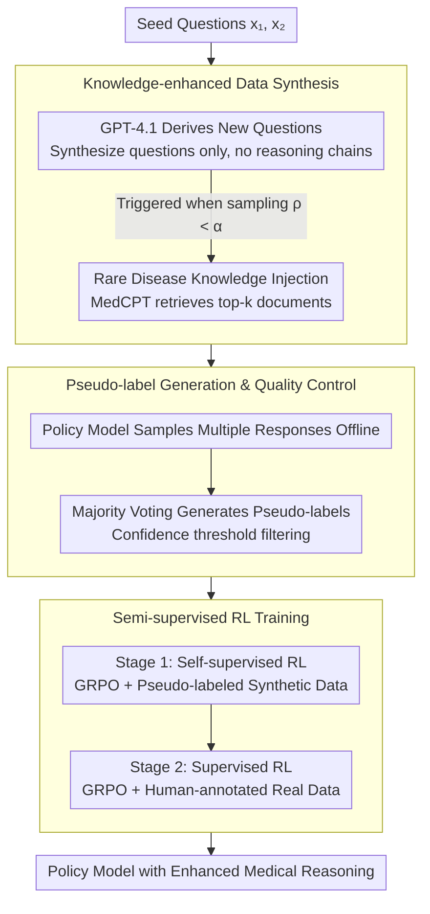

# Eliciting Medical Reasoning with Knowledge-enhanced Data Synthesis: A Semi-Supervised Reinforcement Learning Approach

**Conference**: ACL 2026 Findings  
**arXiv**: [2604.11547](https://arxiv.org/abs/2604.11547)  
**Code**: [https://github.com/tdlhl/MedSSR](https://github.com/tdlhl/MedSSR)  
**Area**: Medical NLP  
**Keywords**: Medical reasoning, rare diseases, data synthesis, semi-supervised reinforcement learning, GRPO

## TL;DR
This paper proposes the MedSSR framework, which efficiently enhances the medical reasoning capabilities of LLMs through controllable data synthesis injected with rare disease knowledge and a "self-supervised RL → supervised RL" semi-supervised training paradigm. It achieves up to a +5.93% improvement on rare disease tasks, breaking the +3% improvement ceiling of existing methods.

## Background & Motivation

**Background**: The development of LLMs in medical reasoning is limited by the scarcity of high-quality reasoning data. Existing methods primarily initialize policy models by distilling Chain-of-Thought (CoT) reasoning chains from large closed-source models like GPT-4o, followed by Reinforcement Learning (RL) training.

**Limitations of Prior Work**: (1) Only 22% of questions in existing medical benchmarks are reasoning-intensive, with only 3% involving rare diseases; (2) Distilling long reasoning chains from closed-source models is highly expensive; (3) Existing methods fail to exceed a +3% improvement ceiling on rare diseases—even when using fully supervised GRPO; (4) Privacy constraints and professional expertise requirements make acquiring complex medical reasoning data extremely challenging.

**Key Challenge**: Rare disease data is extremely scarce, and the data distribution of existing methods is limited by available annotated data, leading to a low improvement ceiling for rare disease tasks. Furthermore, synthetic data may contain factual errors, which are unacceptable in medical scenarios.

**Goal**: To efficiently improve LLM performance across broad medical reasoning tasks, including rare diseases, without relying on expensive reasoning chain distillation.

**Key Insight**: (1) Synthesize only questions (rather than long reasoning chains) to significantly reduce generation costs; (2) Inject rare disease knowledge to control the distribution of synthesized data; (3) Generate pseudo-labels using the policy model itself to avoid dependence on external models.

**Core Idea**: Synthesize medical reasoning questions with controllable distributions (via rare disease knowledge injection), generate pseudo-labels using the model's own majority voting, and execute a curriculum of "self-supervised RL → supervised RL."

## Method

### Overall Architecture
MedSSR sequences the entire process into a curriculum of "Synthesize Questions → Self-Pseudo-labeling → Two-stage RL." First, a knowledge-enhanced data synthesis pipeline derives new problems from seed questions (controlling the rare disease ratio via threshold $\alpha$). Next, the policy model generates pseudo-labels for these unanswered questions through majority voting. Finally, training proceeds via self-supervised RL on pseudo-labeled synthetic data (intrinsic learning, broad exploration), followed by supervised RL on human-annotated real data (extrinsic learning, calibration). These three stages are connected end-to-end, where the output of the previous stage serves as the input for the next.

### Key Designs

**1. Knowledge-enhanced Data Synthesis: Reducing synthesis to "questions only" and controlling rare disease ratios via knowledge injection**

Distilling long reasoning chains is both expensive and risks learning factual errors. MedSSR synthesizes questions only: given seed questions $\{x_1^s, x_2^s\}$, new questions are derived using GPT-4.1, while the reasoning chains are generated by the policy model itself. This significantly reduces API token costs and eliminates dependence on external reasoning quality. To break the 3% ceiling for rare diseases, the synthesis distribution is made controllable: for each synthesized sample, $\rho \sim \text{Uniform}(0,1)$ is sampled. When $\rho < \alpha$, a rare disease entity $e$ is selected, and top-k related documents $\mathcal{C}(e)$ are retrieved via MedCPT to be injected into the synthesis prompt. The threshold $\alpha$ thus acts as a dial to adjust the long-tail distribution, while injected documents ensure medical accuracy.

**2. Pseudo-label Generation and Quality Control: Self-majority voting ensures labels align with model capability**

Synthesized questions lack answers and cannot be used for RL directly. Labeling via external models risks distribution mismatch (inducing reward hacking). MedSSR utilizes self-bootstrapping: the base policy model samples multiple responses offline for each synthesized question, uses the majority vote as the pseudo-label, and retains only those exceeding a confidence threshold. This ensures labels naturally align with the model's capability trajectory, while majority voting serves as a quality filter: questions with inconsistent answers represent high-noise samples that should be discarded.

**3. Semi-supervised RL Training Strategy: Broad exploration via "Self-supervised RL" followed by calibration via "Supervised RL"**

Pseudo-labels are inherently noisy; using them immediately for supervised training can cause instability. MedSSR employs a "broad-then-refined" curriculum: Stage 1 performs self-supervised RL using GRPO on pseudo-labeled synthetic data (intrinsic learning), allowing the model to learn from its own knowledge and reasoning to expand coverage, especially for rare diseases. Stage 2 performs supervised RL using GRPO on human-annotated real data (extrinsic learning) to calibrate and consolidate the reasoning abilities explored in the first stage. This sequence enables the stable utilization of synthetic data.

### Loss & Training
Optimization is performed using GRPO with a validation reward $r(y, y') = \mathbb{I}[\text{ans}(y') = y]$. KL divergence constraints prevent the model from deviating too far from the reference policy. The method was validated on Qwen3-8B and Llama-3.1-8B-Instruct.

## Key Experimental Results

### Main Results

| Method | General Medical Gain | Rare Disease Gain | API Token Cost per Sample |
|------|------------|-----------|-------------------|
| HuatuoGPT-O1 | Moderate | <3% | High (long CoT) |
| MedReason | Moderate | <3% | High |
| Fully Supervised GRPO | Moderate | <3% | Low |
| MedSSR (Ours, Llama) | **+3.91%** | **+5.93%** | Low (questions only) |
| MedSSR (Ours, Qwen3) | Significant | Broke 3% ceiling | Low |

### Ablation Study

| Configuration | General | Rare Disease | Description |
|------|------|--------|------|
| Full MedSSR | Optimal | Optimal | Full framework |
| w/o Knowledge Injection | Decrease | Significant Decrease | Insufficient rare disease data distribution |
| w/o Self-supervised RL | Decrease | Decrease | Lack of broad coverage from synthetic data |
| w/o Pseudo-label Filter | Decrease | Decrease | Noise labels impact training |
| Single-stage Mixed Training | Lower than two-stage | Lower than two-stage | Necessity of curriculum design |

### Key Findings
- MedSSR is the first method to break the +3% improvement ceiling on rare disease tasks, reaching +5.93%.
- Synthesizing labels via the policy model's own reasoning (questions only) effectively improves performance at a significantly lower cost.
- The two-stage semi-supervised RL curriculum outperforms single-stage mixed training, validating the "broad-then-refined" strategy.
- The knowledge injection threshold $\alpha$ provides precise control over the rare disease data distribution.
- The method consistently outperforms existing approaches across 10 medical benchmarks.

## Highlights & Insights
- **Synthesize questions, not answers**: This approach cleverly simplifies high-cost "question + reasoning chain" synthesis into low-cost "question only" synthesis, leveraging the policy model's own reasoning capability. This greatly reduces reliance on closed-source APIs.
- **Bootstrapped learning via pseudo-labels**: Using the model's own majority voting for pseudo-labels is an elegant self-bootstrapping strategy that ensures training data aligns with model capabilities.
- **Distribution-controllable synthesis**: Precise control over the rare disease data ratio via the $\alpha$ threshold provides a direct tool for addressing long-tail distribution issues in the medical domain.

## Limitations & Future Work
- Pseudo-label quality depends on the policy model's initial capability; if a model is entirely ignorant of certain rare diseases, pseudo-labels may be unreliable.
- The coverage of the rare disease knowledge base may be limited; rare diseases not included remain difficult to synthesize.
- Validated only on 8B scale models; performance on larger models is unknown.
- The diversity of synthetic questions is constrained by the quality and quantity of seed questions.

## Related Work & Insights
- **vs HuatuoGPT-O1**: Distills GPT-4o reasoning chains + SFT + RL, which is high-cost with limited rare disease gains. MedSSR synthesizes questions only, reducing cost while significantly improving rare disease performance.
- **vs MedReason**: Uses Knowledge Graphs to improve factual accuracy in CoT but still relies on long-chain distillation. MedSSR ensures accuracy during synthesis via knowledge injection.
- **vs Self-Instruct**: A general self-instruction synthesis method; MedSSR introduces domain-specific knowledge retrieval and distribution control for medicine.

## Rating
- Novelty: ⭐⭐⭐⭐ The combination of "question synthesis + self-pseudo-labeling + semi-supervised RL" is a novel and efficient paradigm.
- Experimental Thoroughness: ⭐⭐⭐⭐⭐ 10 medical benchmarks, two base models, and comprehensive ablation/comparison.
- Writing Quality: ⭐⭐⭐⭐ Clear motivation and precise problem definition (the 3% ceiling for rare diseases).
- Value: ⭐⭐⭐⭐⭐ Provides a practical and efficient solution for data scarcity in medical LLMs.

<!-- RELATED:START -->

## Related Papers

- [\[ACL 2026\] CURE-Med: Curriculum-Informed Reinforcement Learning for Multilingual Medical Reasoning](cure-med_curriculum-informed_reinforcement_learning_for_multilingual_medical_rea.md)
- [\[ACL 2026\] Dr. Assistant: Enhancing Clinical Diagnostic Inquiry via Structured Diagnostic Reasoning Data and Reinforcement Learning](dr_assistant_enhancing_clinical_diagnostic_inquiry_via_structured_diagnostic_rea.md)
- [\[ACL 2026\] Ryze: Evidence-Enriched Data Synthesis from Biomedical Papers](ryze_evidence-enriched_data_synthesis_from_biomedical_papers.md)
- [\[ACL 2026\] RADS: Reinforcement Learning-Based Sample Selection Improves Transfer Learning in Low-resource and Imbalanced Clinical Settings](rads_reinforcement_learning-based_sample_selection_improves_transfer_learning_in.md)
- [\[ACL 2026\] Multi-View Attention Multiple-Instance Learning Enhanced by LLM Reasoning for Cognitive Distortion Detection](multi-view_attention_multiple-instance_learning_enhanced_by_llm_reasoning_for_co.md)

<!-- RELATED:END -->
