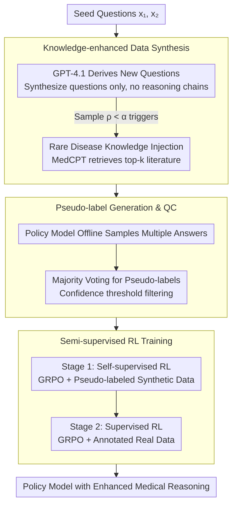

# Eliciting Medical Reasoning with Knowledge-enhanced Data Synthesis: A Semi-Supervised Reinforcement Learning Approach

**Conference**: ACL 2026 Findings  
**arXiv**: [2604.11547](https://arxiv.org/abs/2604.11547)  
**Code**: [https://github.com/tdlhl/MedSSR](https://github.com/tdlhl/MedSSR)  
**Area**: Medical NLP  
**Keywords**: Medical Reasoning, Rare Diseases, Data Synthesis, Semi-supervised Reinforcement Learning, GRPO

## TL;DR
This paper proposes the MedSSR framework, which efficiently enhances the medical reasoning capabilities of LLMs through controllable data synthesis injected with rare disease knowledge and a "Self-supervised RL $\rightarrow$ Supervised RL" semi-supervised training paradigm. It achieves a maximum improvement of +5.93% on rare disease tasks, breaking the +3% improvement ceiling of existing methods.

## Background & Motivation

**Background**: LLM development in medical reasoning is limited by the scarcity of high-quality reasoning data. Existing methods primarily initialize strategy models by distilling CoT reasoning chains from large closed-source models like GPT-4o, followed by RL training.

**Limitations of Prior Work**: (1) Only 22% of existing medical benchmarks are reasoning-intensive, with only 3% involving rare diseases; (2) Distilling long reasoning chains from closed-source models is expensive; (3) All existing methods fail to exceed a +3% improvement ceiling on rare diseases—even with fully supervised GRPO; (4) Privacy constraints and expert requirements make acquiring complex medical reasoning data extremely challenging.

**Key Challenge**: Rare disease data is extremely scarce, and the data distribution of existing methods is limited by existing annotated data, leading to a low improvement ceiling for rare disease tasks. Meanwhile, synthetic data may contain factual errors, which are unacceptable in medical scenarios.

**Goal**: Efficiently enhance LLM performance on a wide range of medical reasoning tasks, including rare diseases, without relying on expensive reasoning chain distillation.

**Key Insight**: (1) Synthesize only questions (instead of long reasoning chains), significantly reducing generation costs; (2) Inject rare disease knowledge to control the distribution of synthetic data; (3) Use the policy model itself to generate pseudo-labels, avoiding reliance on external models.

**Core Idea**: Synthesize medical reasoning questions with controllable distributions (via rare disease knowledge injection), generate pseudo-labels using the model's own majority voting, and then execute "Self-supervised RL $\rightarrow$ Supervised RL" curriculum training.

## Method

### Overall Architecture
MedSSR chains the entire process into a "Synthesize Questions $\rightarrow$ Self-pseudo-labeling $\rightarrow$ Two-stage RL" curriculum: first, use a knowledge-enhanced data synthesis pipeline to derive new questions from seed questions (controlled by threshold $\alpha$ for rare disease proportion); then, use the policy model's own majority voting to generate pseudo-labels for these unanswered questions; finally, execute self-supervised RL on the pseudo-labeled synthetic data (intrinsic learning, broad coverage) followed by supervised RL on manually annotated real data (extrinsic learning, calibration). The outputs of each stage serve as the inputs for the next.

### Key Designs

**1. Knowledge-enhanced Data Synthesis: Synthesizing only questions and controlling rare disease proportions via knowledge injection**

Distilling long reasoning chains is expensive and risks propagating factual errors. MedSSR synthesizes questions only: given seed questions $\{x_1^s, x_2^s\}$, GPT-4.1 derives new questions, leaving the reasoning chains for the policy model to generate. This keeps API token costs significantly lower than distillation and avoids dependence on external model reasoning quality. To break the 3% rare disease ceiling, the synthesis distribution is made controllable: for each synthetic sample, $\rho \sim \text{Uniform}(0,1)$ is sampled; if $\rho < \alpha$, a rare disease entity $e$ is selected and MedCPT retrieves top-k relevant literature $\mathcal{C}(e)$ for the synthesis prompt. The threshold $\alpha$ serves as a dial for the long-tail distribution, while retrieved literature ensures synthesis accuracy.

**2. Pseudo-label Generation and Quality Control: Using the model's own majority voting for alignment with model capability**

Synthetic questions lack answers and cannot be used for RL directly. Relying on external models for labeling risks distribution mismatch (inducing reward hacking). MedSSR utilizes bootstrapping: the policy model (base model) offline samples multiple answers for each synthetic question, uses majority voting for pseudo-labels, and filters samples below a confidence threshold. This keeps labels aligned with the model's own capability trajectory, while majority voting acts as a quality filter: inconsistent answers often represent high-noise samples to be discarded.

**3. Semi-supervised RL Training Strategy: Broad coverage via self-supervised RL followed by calibration via supervised RL**

Pseudo-labels contain noise; immediate supervised training can lead to instability. MedSSR splits this into a "broad-to-fine" curriculum: Stage 1 (Self-supervised RL) uses GRPO on pseudo-labeled synthetic data (intrinsic learning) to expand coverage, especially for rare diseases; Stage 2 (Supervised RL) uses GRPO on annotated real data (extrinsic learning) to calibrate and consolidate the reasoning capabilities. This sequential order allows the semi-supervised paradigm to stably leverage synthetic data.

### Loss & Training
Optimized using GRPO, with a verification reward $r(y, y') = \mathbb{I}[\text{ans}(y') = y]$. KL divergence constraints prevent excessive deviation from the reference policy. The method was validated on Qwen3-8B and Llama-3.1-8B-Instruct.

## Key Experimental Results

### Main Results

| Method | General Med Gain | Rare Disease Gain | Per-Sample API Cost |
|------|------------|-----------|-------------------|
| HuatuoGPT-O1 | Medium | <3% | High (Long CoT) |
| MedReason | Medium | <3% | High |
| Supervised GRPO | Medium | <3% | Low |
| MedSSR (Llama) | **+3.91%** | **+5.93%** | Low (Question only) |
| MedSSR (Qwen3) | Significant | >3% Ceiling | Low |

### Ablation Study

| Config | General | Rare Disease | Description |
|------|------|--------|------|
| Full MedSSR | Optimal | Optimal | Complete framework |
| w/o Knowledge Injection | Decrease | Significant Decrease | Insufficient rare disease data |
| w/o Self-supervised RL | Decrease | Decrease | Lack of broad synthesis coverage |
| w/o Pseudo-label Filter | Decrease | Decrease | Noise labels impact training |
| Single-stage Mixed | Lower | Lower | Necessity of curriculum design |

### Key Findings
- MedSSR is the first method to break the +3% improvement ceiling on rare disease tasks, achieving +5.93%.
- Synthesizing only questions (without reasoning chains) effectively enhances reasoning capabilities at a significantly lower cost.
- The semi-supervised RL two-stage curriculum outperforms single-stage mixed training, validating the "broad-to-fine" strategy.
- The threshold $\alpha$ for rare disease knowledge injection provides precise control over data distribution.
- Comprehensive outperformance on 10 medical benchmarks.

## Highlights & Insights
- **Question-only Synthesis**: Cleverly simplifies expensive "question + reasoning chain" synthesis into low-cost "question only" synthesis, leveraging the policy model's own reasoning generation.
- **Bootstrapped Pseudo-labeling**: Using the model's own majority voting for pseudo-labels is an elegant bootstrapping strategy that ensures training data matches model capability.
- **Controllable Distribution Synthesis**: Precise control of rare disease data via the $\alpha$ threshold provides a direct tool for addressing long-tail distributions in medicine.

## Limitations & Future Work
- Pseudo-label quality depends on the policy model's capability—if the model is completely ignorant of a rare disease, pseudo-labels may be unreliable.
- The coverage of the rare disease knowledge base might be limited; unmapped diseases remain difficult to synthesize.
- Validated only on 8B-scale models; performance on larger models is unknown.
- Synthetic question diversity is limited by the quality and quantity of seed questions.

## Related Work & Insights
- **vs HuatuoGPT-O1**: Distills GPT-4o reasoning chains + SFT + RL; expensive with limited rare disease gains. MedSSR synthesizes questions only, reducing cost and significantly boosting rare disease performance.
- **vs MedReason**: Uses KGs to improve CoT factual accuracy but still relies on expensive distillation. MedSSR ensures accuracy during synthesis via knowledge injection.
- **vs Self-Instruct**: A general self-instruction synthesis method; MedSSR adds knowledge retrieval and distribution control for the medical domain.

## Rating
- Novelty: ⭐⭐⭐⭐ The combination of "question-only synthesis + self-pseudo-labeling + semi-supervised RL" is a novel and efficient paradigm.
- Experimental Thoroughness: ⭐⭐⭐⭐⭐ 10 medical benchmarks, two foundation models, and thorough ablation/comparison.
- Writing Quality: ⭐⭐⭐⭐ Clear motivation and precise problem definition (the 3% ceiling for rare diseases).
- Value: ⭐⭐⭐⭐⭐ Provides a practical and efficient solution for data scarcity in the medical LLM domain.

<!-- RELATED:START -->

## Related Papers

- [\[ACL 2026\] CURE-Med: Curriculum-Informed Reinforcement Learning for Multilingual Medical Reasoning](cure-med_curriculum-informed_reinforcement_learning_for_multilingual_medical_rea.md)
- [\[ACL 2026\] Dr. Assistant: Enhancing Clinical Diagnostic Inquiry via Structured Diagnostic Reasoning Data and Reinforcement Learning](dr_assistant_enhancing_clinical_diagnostic_inquiry_via_structured_diagnostic_rea.md)
- [\[ACL 2026\] Ryze: Evidence-Enriched Data Synthesis from Biomedical Papers](ryze_evidence-enriched_data_synthesis_from_biomedical_papers.md)
- [\[ACL 2026\] RADS: Reinforcement Learning-Based Sample Selection Improves Transfer Learning in Low-resource and Imbalanced Clinical Settings](rads_reinforcement_learning-based_sample_selection_improves_transfer_learning_in.md)
- [\[ACL 2026\] Multi-View Attention Multiple-Instance Learning Enhanced by LLM Reasoning for Cognitive Distortion Detection](multi-view_attention_multiple-instance_learning_enhanced_by_llm_reasoning_for_co.md)

<!-- RELATED:END -->
