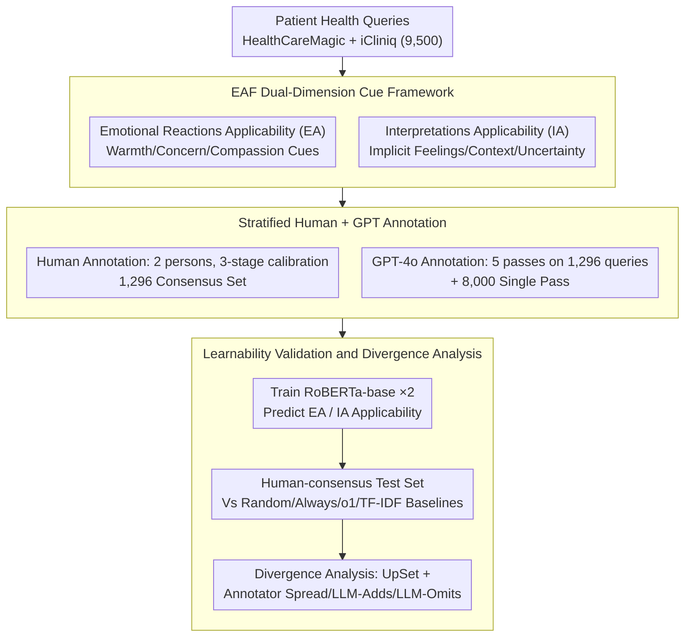

# Empathy Applicability Modeling for General Health Queries

**Conference**: ACL2026 Findings  
**arXiv**: [2601.09696](https://arxiv.org/abs/2601.09696)  
**Code**: https://github.com/shanmrandhawa/Empathy-Applicability-Framework  
**Area**: Medical NLP / Clinical Empathy Modeling  
**Keywords**: clinical empathy, health queries, empathy applicability, annotation framework, RoBERTa classifier

## TL;DR
This paper proposes the Empathy Applicability Framework (EAF) to first determine whether it is "appropriate" to express emotional reactions or interpretive understanding in single-turn patient health queries. By constructing a benchmark with human and GPT-4o annotations and training classifiers, the study provides upstream signals for identifying empathy needs before medical LLMs generate responses.

## Background & Motivation
**Background**: Empathy in clinical communication typically includes components such as understanding the patient's situation, responding to emotions, and taking action. Existing NLP frameworks like EmpatheticDialogues, ESConv, and EPITOME mostly focus on "how to generate or evaluate empathetic responses."

**Limitations of Prior Work**: Not every medical Q&A query requires an emotional response. For instance, purely factual questions are better suited for direct medical information, whereas queries involving fear, severe symptoms, life burdens, or uncertainty require varying degrees of emotional reaction or interpretive understanding. Existing frameworks often label empathy after the response is generated, lacking an applicability decision prior to the response.

**Key Challenge**: If LLMs express empathy indiscriminately, they may appear vacuous, offensive, or deviate from facts; if they do not express it at all, they might miss the patient's genuine emotional needs. Thus, the system needs to determine "when to respond with empathy and which type of empathy to use" beforehand.

**Goal**: The authors aim to establish a cue-based framework to predict the applicability of two empathy dimensions in single-turn, asynchronous, general health queries: Emotional Reactions Applicability (EA) and Interpretations Applicability (IA).

**Key Insight**: The paper reframes empathy from a response quality problem to a query understanding problem. Instead of evaluating empathy after generating a response, the framework identifies clinical, contextual, and linguistic cues within the patient's query before answering.

**Core Idea**: Using EAF, the tasks of "suitability for expressing emotional warmth" and "suitability for understanding/interpreting feelings or situations" are treated as two binary classification tasks. These are validated through human and GPT annotations, classifier training, and divergence analysis to prove the framework is learnable and interpretable while retaining subjectivity.

## Method
The focus of EAF is on applicability rather than generating specific empathetic sentences. The framework labels patient queries as EA Applicable/Not Applicable and IA Applicable/Not Applicable. EA leans toward emotional responses (e.g., warmth, concern, compassion), while IA focuses on cognitive empathy (e.g., understanding explicit/implicit feelings, experiences, context, or health uncertainty).

### Overall Architecture
The authors sampled 9,500 patient queries from public HealthCareMagic and iCliniq data. Among these, 1,500 were reserved for dual human and GPT-4o annotation, while the remaining 8,000 were annotated only by GPT-4o. Following a three-stage calibration process for human annotation, a final consensus set of 1,296 queries was independently labeled by two human annotators. GPT-4o performed five annotation passes on these 1,296 queries using majority vote for labels, and a single pass on the remaining 8,000. Subsequently, two independent RoBERTa-base binary classifiers were trained to predict the applicability of EA and IA, compared against baselines such as random, always applicable, always not applicable, o1 zero-shot, and TF-IDF+LR/SVM.

### Key Designs
**1. EAF Dual-Dimension Cue Framework: Splitting "Empathy Need" into Upstream Judgments for Emotional Reaction and Interpretive Understanding**

In medical Q&A, "the patient having emotions" and "the response needing to express understanding" are not identical. Coarsely categorizing all non-factual questions as requiring emotional support makes responses feel vacuous. EAF splits empathy into two binary dimensions: EA (Emotional Reactions Applicability) assesses whether to provide emotional responses like warmth or sympathy. Its Applicable cues include severe negative emotion, inferred negative state, seriousness of symptoms, and concern for relations; Not Applicable cues include routine health management and purely factual medical queries. IA (Interpretations Applicability) focuses on cognitive empathy, targeting cues like expression of feeling, experiences/context affecting emotional state, and distressing uncertainty about health. Judging these independently captures queries that lack explicit emotion but carry life burdens or uncertainty requiring understanding rather than comfort.

**2. Stratified Data Construction with Human + GPT Annotation: Calibrating with Small, Gold Human Sets and Scaling with GPT**

Empathy judgment is highly subjective, making crowdsourcing difficult for stable labels, yet relying solely on humans limits scale. EAF uses two layers: two calibrated annotators independently labeled 1,296 queries for a high-trust human consensus set. GPT-4o used contrastive prompts with definitions and sub-indices to label the same 1,296 queries five times (majority vote) for stability, and labeled 8,000 additional queries once. Emphasizing consistency over crowdsourcing controls subjective noise, while the 8,000 GPT labels test whether automated labels can train models that approximate human consensus.

**3. Learnability Validation and Divergence Analysis: Proving Labels are Learnable while Clarifying Reasons for Disagreement**

EAF would lack persuasion if it remained a conceptual framework. It must prove it forms predictable, interpretable label patterns. All classifiers were evaluated on the human-consensus test set for accuracy and F1 scores. However, medical empathy cannot just chase the highest F1—which cues cause disagreement and why determines how the framework calibrates in real systems. The authors used UpSet plots to check rationale overlaps and divergence bars to split mismatches into "Annotator Spread," "LLM-Adds," and "LLM-Omits," treating disagreement as an analytical signal rather than noise.

### Loss & Training
The modeling task consists of two independent binary classification tasks: given a patient query $P_i$, predict whether $A_{i,EA}$ and $A_{i,IA}$ are Applicable. The model uses RoBERTa-base, trained for 10 epochs with a learning rate of $2\times10^{-5}$ and a batch size of 8. The Human Set was split 75%/5%/20% for training, validation, and testing. The Autonomous Set used 8,000 GPT-labeled queries for training but was still tested on the same human-consensus test set for aligned comparison. The authors emphasize the goal is validating learnability, not chasing SOTA architecture.

## Key Experimental Results

### Main Results
The reliability of EAF was first measured by annotation consistency. Humans achieved moderate agreement, while GPT showed higher agreement with the human-consensus subset.

| Dimension | Human-Human κ | Human-Human Agree/Disagree | Human-GPT κ | Human-GPT Agree/Disagree |
|-----------|--------------:|----------------------------:|------------:|--------------------------:|
| EA | 0.521 | 981 / 315 | 0.614 | 667 / 153 |
| IA | 0.404 | 898 / 398 | 0.659 | 681 / 139 |

Classification results show RoBERTa-base significantly outperforms simple baselines and classical text classifiers, indicating that EAF labels possess learnable linguistic patterns.

| Training Set / Model | EA Acc | EA Macro-F1 | EA Wtd-F1 | IA Acc | IA Macro-F1 | IA Wtd-F1 |
|----------------------|-------:|------------:|----------:|-------:|------------:|----------:|
| Random | 0.47 | 0.47 | 0.47 | 0.44 | 0.43 | 0.44 |
| Always Applicable | 0.52 | 0.34 | 0.36 | 0.53 | 0.35 | 0.37 |
| Always Not Applicable | 0.48 | 0.32 | 0.31 | 0.47 | 0.32 | 0.30 |
| o1 Zero-Shot | 0.55 | 0.40 | 0.41 | 0.62 | 0.53 | 0.54 |
| Logistic Regression | 0.84 | 0.84 | 0.84 | 0.80 | 0.80 | 0.80 |
| Linear SVM | 0.83 | 0.83 | 0.83 | 0.77 | 0.77 | 0.77 |
| RoBERTa, Human Set | 0.92 | 0.92 | 0.92 | 0.87 | 0.87 | 0.87 |
| RoBERTa, GPT Autonomous Set | 0.85 | 0.85 | 0.85 | 0.78 | 0.77 | 0.77 |

### Ablation Study
While there was no traditional module ablation, the training data sources and baselines provided interpretable comparisons.

| Comparison | Purpose | Key Result | Explanation |
|------------|---------|------------|-------------|
| o1 Zero-Shot vs RoBERTa | Test if framework labels are more learnable than direct LLM judgment | EA Macro-F1 0.40 vs 0.92, IA 0.53 vs 0.87 | Structured labeling training significantly outperforms zero-shot judgment. |
| LR/SVM vs RoBERTa | Test if local surface features are sufficient | LR EA/IA Macro-F1 0.84/0.80, RoBERTa 0.92/0.87 | Surface cues are strong, but contextual representation still adds gain. |
| Human Set vs GPT-only Set | Test if GPT labels can replace human labels | GPT-only RoBERTa EA/IA Macro-F1 0.85/0.77 | Automated labels are useful but show loss compared to human consensus. |
| EA vs IA | Test difficulty difference between dimensions | Human-Human κ: 0.521 vs 0.404 | IA relies more on implicit feelings and context, leading to higher subjectivity. |

### Key Findings
- Human annotation consistency falls within the moderate range common for empathy annotation, confirming the task is not purely objective fact classification.
- The κ between GPT and human-consensus exceeded 0.6, indicating EAF effectively guides GPT to predict empathy applicability in clear cases.
- RoBERTa achieved EA 0.92 Macro-F1 and IA 0.87 Macro-F1 on the human-consensus set, proving EAF cues are stable linguistic signals rather than arbitrary labels.
- Three systemic challenges stand out: subjective inference of implied distress, clinical severity ambiguity, and cultural differences in contextual hardship.

## Highlights & Insights
- The biggest highlight is shifting empathy modeling upstream to "whether it is applicable before answering." This position is critical as it serves as a control signal for generative models rather than a post-hoc evaluation score.
- EAF's dual-dimension design avoids the simplification of "emotion = empathy." Many health queries lack explicit emotion but contain distressing uncertainty or life burdens that still require interpretive understanding.
- The authors did not treat disagreement as pure noise but analyzed why humans and GPT disagreed. This is vital for medical NLP, as culture, gender, and clinical training affect empathy judgment.
- Models trained on GPT-only data still performed well, suggesting LLMs can scale annotation, though human consensus remains significantly more reliable.

## Limitations & Future Work
- The authors noted that having only two human annotators without clinical training might not represent broader populations or experts; clinical severity judgments may be particularly limited.
- Automated labeling only used GPT-4o; results may not generalize to Gemini, Claude, reasoning models, or open-source models.
- Humans selected only one primary subcategory per dimension, while GPT could return multiple; this process inconsistency impacts rationale-level divergence analysis.
- Modeling used only RoBERTa-base; the study did not explore ModernBERT, larger LLMs, or prompt-based classifiers.
- Applicability is binary; it does not express intensity. Low/Medium/High applicability or uncertainty calibration are natural future directions but require finer calibration.
- Ethically, EAF should assist rather than replace clinician judgment; automated empathy expressed insincerely could lead to an "uncanny valley" or the sense of manipulation.

## Related Work & Insights
- **vs EPITOME**: EPITOME evaluates empathy mechanisms expressed in a response; EAF determines if a query needs those mechanisms beforehand.
- **vs EmpatheticDialogues / ESConv**: These datasets usually assume emotional support is needed; EAF addresses medical queries where empathy might not be appropriate.
- **vs Cause-aware Empathetic Generation**: Cause-aware methods enhance generation when empathy is assumed relevant; EAF acts as an upstream gate to trigger these strategies.
- **vs Zero-shot LLM Classification**: Directly asking o1 if empathy is applicable is limited; a structured cue framework + training significantly improves stability.
- **Insight**: For medical LLMs, style control should rely on query-level emotional/cognitive need identification rather than just system prompts.

## Rating
- Novelty: ⭐⭐⭐⭐☆ Highly valuable problem definition shifting empathy from response evaluation to applicability modeling.
- Experimental Thoroughness: ⭐⭐⭐⭐☆ Includes consistency, training, baselines, and divergence analysis, though annotator scale and model variety are narrow.
- Writing Quality: ⭐⭐⭐⭐☆ Clearly defined framework with credible case studies and ethical discussions.
- Value: ⭐⭐⭐⭐⭐ Direct application value for medical LLMs, asynchronous patient messaging, and clinical communication aids.

<!-- RELATED:START -->

## Related Papers

- [\[ACL 2026\] HypEHR: Hyperbolic Modeling of Electronic Health Records for Efficient Question Answering](hypehr_hyperbolic_modeling_of_electronic_health_records_for_efficient_question_a.md)
- [\[NeurIPS 2025\] Faithful Summarization of Consumer Health Queries: A Cross-Lingual Framework with LLMs](../../NeurIPS2025/medical_nlp/faithful_summarization_of_consumer_health_queries_a_cross-lingual_framework_with.md)
- [\[ACL 2026\] Can Continual Pre-training Bridge the Performance Gap between General-purpose and Specialized Language Models in the Medical Domain?](can_continual_pre-training_bridge_the_performance_gap_between_general-purpose_an.md)
- [\[ACL 2026\] ProMedical: Hierarchical Fine-Grained Criteria Modeling for Medical LLM Alignment via Explicit Injection](promedical_hierarchical_fine-grained_criteria_modeling_for_medical_llm_alignment.md)
- [\[ACL 2026\] Responsible Evaluation of AI for Mental Health](responsible_evaluation_of_ai_for_mental_health.md)

<!-- RELATED:END -->
