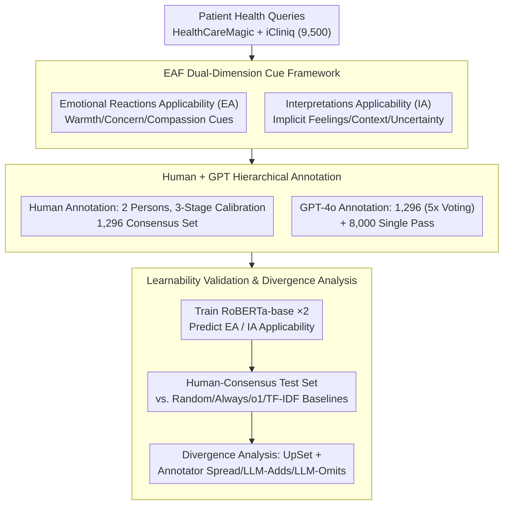

# Empathy Applicability Modeling for General Health Queries

**Conference**: ACL2026 Findings  
**arXiv**: [2601.09696](https://arxiv.org/abs/2601.09696)  
**Code**: https://github.com/shanmrandhawa/Empathy-Applicability-Framework  
**Area**: Medical NLP / Clinical Empathy Modeling  
**Keywords**: clinical empathy, health queries, empathy applicability, annotation framework, RoBERTa classifier

## TL;DR
This paper proposes the Empathy Applicability Framework (EAF) to determine whether it is "appropriate" to express emotional reactions or interpretive understanding in single-turn health queries. By constructing a benchmark with human and GPT-4o annotations and training classifiers, the study provides upstream signals for empathy requirement identification in medical LLMs before response generation.

## Background & Motivation
**Background**: Empathy in clinical communication typically includes components such as understanding the patient's situation, responding to emotions, and taking action. Existing NLP frameworks like EmpatheticDialogues, ESConv, and EPITOME mostly focus on "how to generate or evaluate empathetic responses."

**Limitations of Prior Work**: Not every medical question-answering query requires an emotional response. For instance, purely factual questions are better suited for direct medical information, whereas queries involving fear, severe symptoms, life burdens, or uncertainty require varying degrees of emotional response or interpretive understanding. Existing frameworks often annotate empathy after response generation, lacking an applicability decision prior to responding.

**Key Challenge**: If LLMs express empathy indiscriminately, they may appear vacuous, offensive, or factually tangential. Conversely, if they fail to express it at all, they miss the patient's genuine emotional needs. Thus, systems must first determine "when an empathetic response is needed and which type of empathy is appropriate."

**Goal**: The authors aim to establish a cue-based framework to predict the applicability of two empathy dimensions in single-turn, asynchronous, general health queries: Emotional Reactions Applicability (EA) and Interpretations Applicability (IA).

**Key Insight**: The paper moves empathy from a response quality problem to a query understanding problem. Instead of generating a response and evaluating its empathy, the system identifies clinical, contextual, and linguistic cues within the patient's query beforehand.

**Core Idea**: Using EAF, the tasks of "suitability for expressing emotional warmth" and "suitability for understanding/interpreting feelings or situations" are framed as two binary classification tasks. These are validated through human and GPT annotations, classifier training, and divergence analysis to prove the framework is learnable and explainable while retaining inherent subjectivity.

## Method
The focus of EAF is applicability rather than generating specific empathetic sentences. The framework labels patient queries as EA Applicable/Not Applicable and IA Applicable/Not Applicable. EA leans toward emotional responses (e.g., warmth, concern, compassion), while IA focuses on cognitive empathy (e.g., understanding explicit/implicit feelings, experiences, context, or health uncertainty).

### Overall Architecture
The authors sampled 9,500 patient queries from HealthCareMagic and iCliniq. 1,500 queries were reserved for dual human and GPT-4o annotation, while the remaining 8,000 were annotated by GPT-4o only. Following three stages of training and calibration, 1,296 queries were independently labeled by two human annotators. GPT-4o performed five annotation passes on these 1,296 queries, using majority voting for the final labels, and a single pass for the 8,000 queries. Subsequently, two independent RoBERTa-base binary classifiers were trained to predict EA and IA applicability, compared against baselines such as random, always applicable, always not applicable, o1 zero-shot, and TF-IDF+LR/SVM.

### Key Designs
**1. EAF Dual-Dimension Cue Framework: Decomposing "Empathy Requirement" into Emotional Reaction and Interpretive Understanding upstream judgments.**

In medical QA, "patient having emotions" and "response needing understanding" are not identical. Grouping all non-factual queries into emotional support makes responses vacuous. EAF splits empathy into two dimensions: EA (Emotional Reactions Applicability) assesses if emotional responses like warmth or sympathy are appropriate. Its Applicable cues include severe negative emotion, inferred negative state, seriousness of symptoms, and concern for relations. IA (Interpretations Applicability) focuses on cognitive empathy, targeting cues like expression of feeling, contextual experiences affecting emotional state, and distressing uncertainty about health. These independent judgments capture queries that lack explicit emotion but carry life burdens or uncertainty requiring interpretation rather than just comfort.

**2. Hierarchical Data Construction (Human + GPT Annotation): Calibrating with a small, reliable human consensus set while scaling with GPT annotations.**

Empathy judgment is highly subjective; crowdsourcing struggles with stable labels, yet human labeling is hard to scale. EAF uses two layers: two lay annotators with English proficiency independently labeled 1,296 queries after a three-stage calibration to form a high-confidence consensus set. GPT-4o annotated the same 1,296 queries using contrastive prompts with definitions and examples (5 passes with majority vote) and 8,000 additional queries (single pass). Emphasizing consistency training over crowdsourcing controls subjective noise, while the 8,000 GPT labels test whether automated labels can train models that approximate human consensus.

**3. Learnability Validation and Divergence Analysis: Proving labels are learnable while clarifying the reasons for disagreement.**

EAF demonstrates its validity by forming predictable and explainable label patterns. Classifiers are evaluated on the human-consensus test set for accuracy, macro-F1, and weighted-F1. Since medical empathy is not purely about reaching the highest F1, the framework analyzes which cues cause disagreement. Using UpSet plots, the study checks if GPT and humans selected the same subcategory rationales, further decomposing mismatches into Annotator Spread, LLM-Adds, and LLM-Omits to treat disagreement as an analyzable signal.

### Loss & Training
The modeling consists of two independent binary classification tasks: given a patient query $P_i$, the models predict whether $A_{i,EA}$ and $A_{i,IA}$ are Applicable. The model used is RoBERTa-base, trained for 10 epochs with a learning rate of $2\times10^{-5}$ and a batch size of 8. The Human Set is split 75%/5%/20% for training, validation, and testing. The Autonomous Set uses only the 8,000 GPT-labeled queries for training but is evaluated on the same human-consensus test set to ensure alignment with human labels. The goal is to verify learnability rather than pursuing SOTA architecture.

## Key Experimental Results

### Main Results
The reliability of EAF was first measured by annotation consistency. Humans reached moderate agreement, while GPT showed higher agreement with the human-consensus subset.

| Dimension | Human-Human κ | Human-Human Agree/Disagree | Human-GPT κ | Human-GPT Agree/Disagree |
| :--- | :---: | :---: | :---: | :---: |
| EA | 0.521 | 981 / 315 | 0.614 | 667 / 153 |
| IA | 0.404 | 898 / 398 | 0.659 | 681 / 139 |

Classification results show that RoBERTa-base significantly outperforms simple baselines and classical text classifiers, indicating that EAF labels possess learnable linguistic patterns.

| Training Set / Model | EA Acc | EA Macro-F1 | EA Wtd-F1 | IA Acc | IA Macro-F1 | IA Wtd-F1 |
| :--- | :---: | :---: | :---: | :---: | :---: | :---: |
| Random | 0.47 | 0.47 | 0.47 | 0.44 | 0.43 | 0.44 |
| Always Applicable | 0.52 | 0.34 | 0.36 | 0.53 | 0.35 | 0.37 |
| Always Not Applicable | 0.48 | 0.32 | 0.31 | 0.47 | 0.32 | 0.30 |
| o1 Zero-Shot | 0.55 | 0.40 | 0.41 | 0.62 | 0.53 | 0.54 |
| Logistic Regression | 0.84 | 0.84 | 0.84 | 0.80 | 0.80 | 0.80 |
| Linear SVM | 0.83 | 0.83 | 0.83 | 0.77 | 0.77 | 0.77 |
| RoBERTa, Human Set | 0.92 | 0.92 | 0.92 | 0.87 | 0.87 | 0.87 |
| RoBERTa, GPT Autonomous Set | 0.85 | 0.85 | 0.85 | 0.78 | 0.77 | 0.77 |

### Ablation Study
The paper uses training data sources and baselines to provide interpretative comparisons rather than traditional module ablation.

| Comparison | Goal | Key Result | Description |
| :--- | :--- | :---: | :--- |
| o1 Zero-Shot vs RoBERTa | Test if framework labels are more learnable than direct LLM judgment | EA Macro-F1 0.40 vs 0.92 | Structured annotation training significantly outperforms zero-shot judgment. |
| LR/SVM vs RoBERTa | Test if surface features are sufficient | LR EA/IA F1 0.84/0.80 | Surface cues are strong, but contextual representations provide gains. |
| Human vs GPT-only Set | Test if GPT labels can replace humans | GPT-only RoBERTa F1 0.85/0.77 | Automated labels are useful but show loss compared to human consensus. |
| EA vs IA | Test difficulty difference between dimensions | Human-Human κ: 0.521 vs 0.404 | IA relies more on implicit feelings and context, having higher subjectivity. |

### Key Findings
- Human annotation consistency falls within the common moderate range for empathy annotation, confirming the task is not objective fact classification.
- The κ scores between GPT and human-consensus exceed 0.6, indicating EAF effectively guides GPT in predicting empathy applicability for clearer cases.
- RoBERTa achieves 0.92 and 0.87 Macro-F1 on EA and IA respectively in the human-consensus set, proving EAF cues are not arbitrary but possess stable linguistic signals.
- Three systemic challenges emerged: subjective inference of implied distress, clinical severity ambiguity, and cultural differences in contextual hardship.

## Highlights & Insights
- The primary highlight is shifting empathy modeling upstream to "judgment of applicability before response." This is crucial as it serves as a control signal for generative models rather than a post-hoc evaluation score.
- The dual-dimension design of EAF avoids the simplification of "emotion = empathy." Many health queries lack explicit emotion but include distressing uncertainty or life burdens that still require interpretive understanding.
- The authors analyzed disagreement between humans and GPT rather than treating it as noise, which is vital for medical NLP as culture, gender, and clinical background affect empathy judgment.
- Models trained on GPT-only data perform reasonably well, suggesting LLMs can scale annotation, though human consensus remains significantly more reliable.

## Limitations & Future Work
- The human pool consists of only two lay annotators without clinical training, which may not represent broader patient or expert viewpoints; clinical severity judgments are particularly limited by this.
- Automated annotation only utilized GPT-4o; results may not generalize to Gemini, Claude, reasoning models, or open-source models.
- Humans selected only one primary subcategory per dimension, whereas GPT could return multiple; this procedural inconsistency affects rationale-level disagreement analysis.
- Modeling used only RoBERTa-base; modern architectures like ModernBERT, larger LLMs, or prompt-based classifiers were not explored for upper limits.
- Applicability is binary. Future work should address intensity (low/medium/high) or uncertainty calibration.
- Ethically, EAF should assist rather than replace clinician judgment; automated empathy that feels insincere could lead to an "uncanny valley" effect or perceived manipulation.

## Related Work & Insights
- **vs EPITOME**: EPITOME evaluates empathy mechanisms expressed in a response; EAF judges if a query needs those mechanisms beforehand.
- **vs EmpatheticDialogues / ESConv**: These datasets usually assume emotional support is needed; EAF addresses medical queries where empathy may not always be appropriate.
- **vs cause-aware empathetic generation**: Cause-aware methods enhance generation when empathy is assumed relevant; EAF acts as an upstream gate to trigger these strategies.
- **vs zero-shot LLM classification**: Directly asking o1 for applicability has limited effectiveness; the structured cue framework and training significantly improve stability.
- **Insight**: For medical LLMs, style control should rely on query-level emotional/cognitive demand identifiers rather than just system prompts.

## Rating
- Novelty: ⭐⭐⭐⭐☆ Moves empathy from response evaluation to applicability modeling.
- Experimental Thoroughness: ⭐⭐⭐⭐☆ Includes consistency, training, baselines, and disagreement analysis, though the annotator and model pool is narrow.
- Writing Quality: ⭐⭐⭐⭐☆ Framework is clearly defined; case studies and ethical discussions add credibility.
- Value: ⭐⭐⭐⭐⭐ High direct utility for medical LLMs, asynchronous messaging, and clinical communication aids.

<!-- RELATED:START -->

## Related Papers

- [\[ACL 2026\] HypEHR: Hyperbolic Modeling of Electronic Health Records for Efficient Question Answering](hypehr_hyperbolic_modeling_of_electronic_health_records_for_efficient_question_a.md)
- [\[NeurIPS 2025\] Faithful Summarization of Consumer Health Queries: A Cross-Lingual Framework with LLMs](../../NeurIPS2025/medical_nlp/faithful_summarization_of_consumer_health_queries_a_cross-lingual_framework_with.md)
- [\[ACL 2026\] Can Continual Pre-training Bridge the Performance Gap between General-purpose and Specialized Language Models in the Medical Domain?](can_continual_pre-training_bridge_the_performance_gap_between_general-purpose_an.md)
- [\[ACL 2026\] Responsible Evaluation of AI for Mental Health](responsible_evaluation_of_ai_for_mental_health.md)
- [\[ACL 2026\] ProMedical: Hierarchical Fine-Grained Criteria Modeling for Medical LLM Alignment via Explicit Injection](promedical_hierarchical_fine-grained_criteria_modeling_for_medical_llm_alignment.md)

<!-- RELATED:END -->
