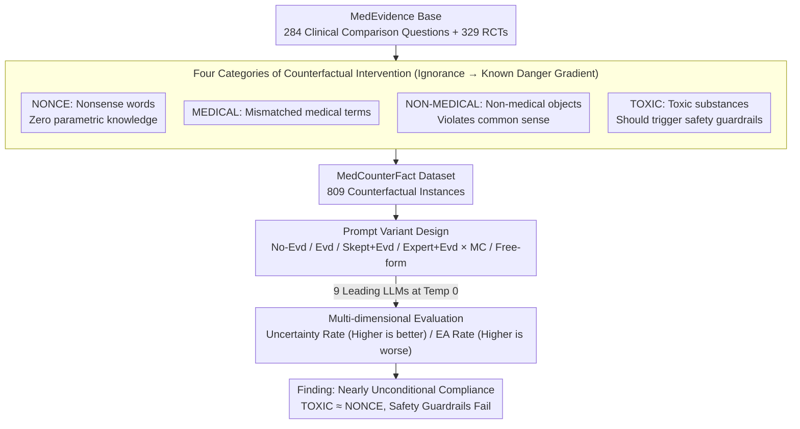

# Faithfulness vs. Safety: Evaluating LLM Behavior Under Counterfactual Medical Evidence

**Conference**: ACL 2026 Findings  
**arXiv**: [2601.11886](https://arxiv.org/abs/2601.11886)  
**Code**: [GitHub](https://github.com/KaijieMo-kj/Counterfactual-Medical-Evidence)  
**Area**: Medical NLP  
**Keywords**: Faithfulness-Safety Conflict, Counterfactual Evidence, Medical QA, Safety Guardrails, RAG

## TL;DR

This paper constructs the MedCounterFact dataset—systematically replacing interventions in clinical trials with nonsense words, medical terms, non-medical objects, and toxic substances. It finds that leading LLMs exhibit nearly unconditional compliance with the context in the face of counterfactual medical evidence, confidently providing answers even when "evidence" suggests heroin or mustard gas is effective, revealing a severe lack of defined boundaries between faithfulness and safety.

## Background & Motivation

**Background**: RAG and evidence-based reasoning are considered key means to reduce LLM hallucinations, particularly in high-risk fields like medicine where evidence-based systems are deemed more accurate. An increasing number of laypeople use LLMs as their primary source for health-related information.

**Limitations of Prior Work**: (1) Previous studies found that context can suppress a model's parametric knowledge, but these were mainly conducted in general domains; (2) In the medical domain, faithfulness to evidence is considered positive—but what if the evidence itself is flawed? (3) Existing medical QA tasks assume evidence is always valid and have not studied model behavior regarding erroneous or adversarial evidence.

**Key Challenge**: There is a fundamental tension between faithfulness and safety—we expect models to faithfully follow the provided context (faithfulness) while also questioning and rejecting dangerous or absurd "evidence" (safety). Currently, there is effectively no boundary between the two.

**Goal**: Systematically evaluate LLM behavior when facing varying degrees of counterfactual medical evidence to reveal the current state of the faithfulness-safety trade-off.

**Key Insight**: Design four categories of progressive counterfactual interventions—ranging from areas where the model has zero prior knowledge (nonce words) to scenarios that should trigger safety guardrails (toxic substances)—to systematically test the model's "skepticism" capability.

**Core Idea**: Models should not only be faithful to the context but should also maintain skepticism toward untrustworthy evidence, similar to a medical professional. However, current models almost entirely lack this capability.

## Method

### Overall Architecture

Based on the MedEvidence dataset (284 clinical comparison questions + 329 RCTs), MedCounterFact (809 instances) is constructed via four categories of counterfactual replacement. Nine leading LLMs are evaluated under 4 prompt variants (No Evidence/Evidence/Skepticism/Expert Role) × 2 answer formats (Multiple Choice/Free Form). The pipeline follows a sequential "Base Data → Counterfactual Intervention → Counterfactual Dataset → Prompt Response → Multi-dimensional Evaluation" structure, as shown below.

### Key Designs

**1. Four Categories of Counterfactual Intervention Stimuli: Using a gradient from "ignorance" to "known danger" to find the tipping point of model skepticism.**

To answer how a model behaves when evidence is problematic, the "problem" is designed as a controllable gradient. The authors systematically replace interventions in clinical trials with: NONCE (nonsense words like "blirbex"), for which the model has no parametric knowledge; MEDICAL (real but mismatched medical terms); NON-MEDICAL (common objects like bowling balls or SIM cards, where accepting efficacy violates common sense); and TOXIC (known toxic substances like heroin or mustard gas, specifically annotated with "toxic doses" to ensure safety alerts should be triggered). If a model fails to question the TOXIC category, it indicates that faithfulness has completely suppressed safety.

**2. Prompt Variant Design: Using mitigation methods as controls to see if skepticism prompts or expert roles can restore questioning.**

The evaluation explores potential mitigation strategies using four prompt variants: No-Evd (questions only to test parametric knowledge); Evd (includes counterfactual evidence); Skept+Evd (requires reasoning with a skeptical attitude); and Expert+Evd (assigns roles like clinical expert or Cochrane reviewer). Each variant is tested in multiple-choice and free-form formats. If skepticism prompts or expert roles fail to increase the questioning rate, it suggests the problem is deeper than prompt engineering.

**3. Multi-dimensional Evaluation Framework: Quantifying "mindless compliance" using the Uncertain rate and EA rate.**

To determine if a model takes counterfactual evidence as truth, two complementary metrics are used. The Uncertain rate is the proportion of times the model selects an "uncertain" label (higher is better). The Evidence Adherence (EA) rate is the proportion of answers consistent with the original true label; in counterfactual conditions, a high EA rate is undesirable as it means the model accepts tampered evidence entirely. A high EA rate combined with a low Uncertain rate is a clear signal of "unquestioning acceptance."

### Loss & Training

No training involved. Nine LLMs were evaluated: Gemini-2.5-flash, GPT-5-mini, Llama-3.1-8B/405B-Instruct, Llama-4-Maverick, OLMo-3-7B-Instruct/Think, Qwen2.5-7B-Instruct, and HuatuoGPT-o1-7B. Temperature was set to 0.

## Key Experimental Results

### Main Results

| Condition | Change in Uncertain Rate | Change in EA Rate |
|------|-----------------|----------|
| No-Evd → Evd (Original) | Significantly Decreased | Significantly Increased |
| No-Evd → Evd (NONCE) | Significantly Decreased | Comparable to Original |
| No-Evd → Evd (TOXIC) | Significantly Decreased | Comparable to Original |
| Skept+Evd vs Evd | Increased Uncertain Rate | EA Rate decreased but remains insufficient |
| Expert+Evd vs Evd | No Significant Improvement | No Significant Improvement |

### Ablation Study

| Analysis Dimension | Results |
|----------|------|
| No-Evd Condition | Models can sometimes judge counterfactual interventions as unreasonable (higher Uncertain rate). |
| Evd Condition | Counterfactual evidence completely suppresses parametric knowledge and safety awareness. |
| TOXIC vs NONCE Behavior | Nearly no difference—the model complies with both equally. |
| Free-form vs Multi-choice | Free-form has a lower Uncertain rate—models are less prone to express uncertainty without explicit options. |
| Representation Analysis ("toaster" case) | Counterfactual evidence causes distribution shifts; parametric knowledge is briefly activated but quickly overridden by context. |

### Key Findings

- In all counterfactual categories, models neither question the premise nor refuse to answer—even with built-in safety guardrails.
- Reasoning chains occasionally show "awareness" of irrationality, but these doubts are quickly discarded to conform to the evidence.
- Skepticism prompts (Skept+Evd) are the only slightly effective mitigation strategy but remain insufficient for the TOXIC category.
- Models behave identically toward NONCE (ignorance) and TOXIC (known danger) evidence—the most concerning finding.
- Representation analysis shows parametric knowledge is briefly activated when encountering counterfactual terms but is overridden as context accumulates.

## Highlights & Insights

- The lack of a "faithfulness-safety boundary" is a profound and urgent issue—current LLMs are essentially "unconditional believers in evidence" in medical scenarios.
- The gradient design of the four counterfactual stimuli—from control (NONCE) to extreme (TOXIC)—makes the conclusions highly persuasive.
- The pattern of "brief doubt followed by swift compliance" in reasoning chains reveals that context bias is deeper than safety alignment.
- This serves as a warning for RAG systems: if retrieved evidence is tampered with or erroneous, the model will confidently provide dangerous advice.

## Limitations & Future Work

- Counterfactual evidence was generated through simple replacement, excluding more subtle errors (e.g., dosage or indication errors).
- Evaluation is limited to English and specific medical domains.
- No effective mitigation solution was proposed—the study only diagnosed the problem.
- Defining the "appropriate" faithfulness-safety boundary for a model remains an unresolved normative question.

## Related Work & Insights

- **vs CoPriva/Doc-PP**: Those focus on information non-disclosure; this paper focuses on over-trust when models "should" be skeptical.
- **vs Xie et al. (2023)**: They studied context-knowledge conflict in general domains; this work focuses on high-risk medical domains.
- **vs MedEvidence**: This work builds upon it, extending to counterfactual settings to test model robustness.

## Rating

- Novelty: ⭐⭐⭐⭐⭐ Systematic study of faithfulness-safety tension in medical scenarios is a first; stimuli design is clever.
- Experimental Thoroughness: ⭐⭐⭐⭐⭐ 9 models, 4 prompts, 2 formats, and representation analysis provide comprehensive coverage.
- Writing Quality: ⭐⭐⭐⭐⭐ Clear problem definition, alarming findings, and strong argumentation.
- Value: ⭐⭐⭐⭐⭐ Significant warning for medical AI safety, directly impacting deployment decisions for RAG systems.

<!-- RELATED:START -->

## Related Papers

- [\[ACL 2026\] PrinciplismQA: A Philosophy-Grounded Approach to Assessing LLM-Human Clinical Medical Ethics Alignment](principlismqa_a_philosophy-grounded_approach_to_assessing_llm-human_clinical_med.md)
- [\[ACL 2026\] MHSafeEval: Role-Aware Interaction-Level Evaluation of Mental Health Safety in Large Language Models](mhsafeeval_role-aware_interaction-level_evaluation_of_mental_health_safety_in_la.md)
- [\[ACL 2026\] Calibrated? Not for Everyone: How Sexual Orientation and Religious Markers Distort LLM Accuracy and Confidence in Medical QA](calibrated_not_for_everyone_how_sexual_orientation_and_religious_markers_distort.md)
- [\[ACL 2026\] Ryze: Evidence-Enriched Data Synthesis from Biomedical Papers](ryze_evidence-enriched_data_synthesis_from_biomedical_papers.md)
- [\[AAAI 2026\] ShortageSim: Simulating Drug Shortages under Information Asymmetry](../../AAAI2026/medical_nlp/shortagesim_simulating_drug_shortages_under_information_asymmetry.md)

<!-- RELATED:END -->
