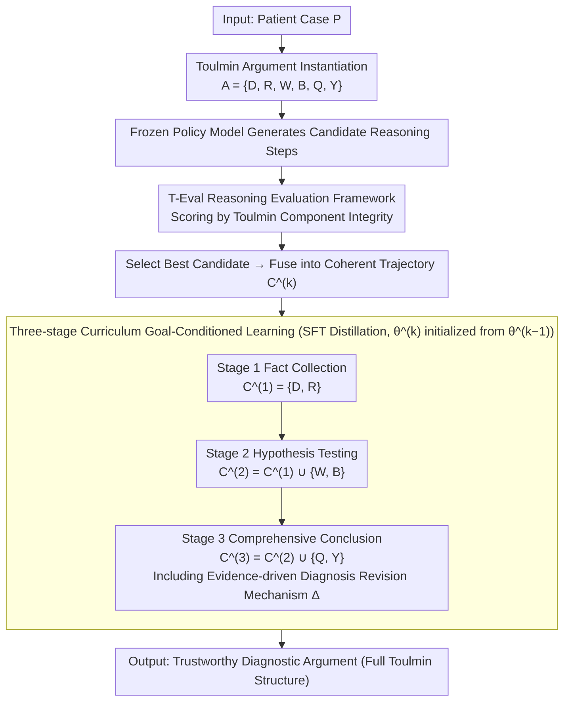

# From Answers to Arguments: Toward Trustworthy Clinical Diagnostic Reasoning with Toulmin-Guided Curriculum Goal-Conditioned Learning

**Conference**: ACL 2026  
**arXiv**: [2604.11137](https://arxiv.org/abs/2604.11137)  
**Code**: [https://github.com/Leonard-zc/CGCL](https://github.com/Leonard-zc/CGCL)  
**Area**: Medical NLP  
**Keywords**: Clinical Reasoning, Toulmin Argumentation Model, Curriculum Learning, Goal-Conditioned Learning, Trustworthy Diagnosis

## TL;DR
This paper adapts the Toulmin argumentation model to the clinical diagnostic process and proposes the CGCL three-stage curriculum training framework (Fact Collection → Hypothesis Testing → Comprehensive Conclusion). Coupled with T-Eval for quantifying reasoning structural integrity, it achieves diagnostic reasoning quality comparable to RL methods without requiring RL.

## Background & Motivation

**Background**: LLMs perform excellently on medical benchmarks (e.g., MedQA, USMLE), even surpassing human experts. jedoch, standardized exams $\neq$ real clinical practice. Clinical decision-making requires reasoning under uncertainty, integrating incomplete information, and bearing the cost of errors.

**Limitations of Prior Work**: (1) Current LLMs exhibit a dangerous "correct answer + incorrect reasoning" phenomenon—deriving correct conclusions through pattern matching while the reasoning process is flawed and lacks robust understanding; (2) Existing evaluations focus only on the correctness of the final answer, failing to examine the logicality and evidential support of the reasoning path; (3) RL methods can theoretically optimize reasoning quality, but rewarded model design is difficult, training is unstable, and computational demands are high.

**Key Challenge**: In the medical field, a correct answer with incorrect reasoning is more dangerous than an incorrect answer—it provides false confidence and fails unpredictably when facing real clinical complexities. Current evaluation paradigms systematically overestimate the actual capabilities of LLMs by looking only at outcomes.

**Goal**: (1) Establish a structured evaluation framework for clinical reasoning; (2) Design a stable and efficient training method to teach LLMs Toulmin-style argumentative reasoning.

**Key Insight**: The Toulmin argumentation model emphasizes that claims must be supported by evidence, qualified by uncertainty, and defended against rebuttals—highly consistent with the reasoning process of clinicians moving from symptoms to diagnosis. This model is instantiated as a structured output for clinical diagnosis.

**Core Idea**: A three-stage curriculum simulates the natural progression of medical training—interns extract facts and preliminary differentials → senior residents perform hypothesis testing and rebuttal → attending physicians synthesize judgments and qualify conclusions.

## Method

### Overall Architecture
CGCL bridges "evaluation" and "training": the evaluation side is T-Eval—a framework based on the Toulmin argumentation model that directly quantifies reasoning quality; the training side is a three-stage goal-conditioned offline imitation learning pipeline—candidate reasoning trajectories are generated by a frozen policy model, T-Eval scores them to select the optimum, and the best trajectories are distilled into the target model via SFT. The entire process avoids RL yet aims to achieve RL-level reasoning quality.

### Key Designs

**1. T-Eval Reasoning Evaluation Framework: Focusing on Structural Integrity Rather Than Just Answer Accuracy**

Judging a model solely on whether the final diagnosis is correct conflates models that "guess right via pattern matching" with those that "reason correctly via rigorous logic"—their answer accuracies might be identical, but their clinical reliability differs vastly. T-Eval addresses this by formalizing a diagnostic reasoning process as a Toulmin argument $A=\{D,R,W,B,Q,Y\}$: $D$ represents case evidence (Data), $R$ represents differential diagnosis ranking (Rebuttals/Reservations), $W$ is the argument from evidence to hypothesis (Warrant, e.g., pathophysiological links), $B$ is the supporting clinical principles (Backing), $Q$ is the uncertainty calibration (Qualifier), and $Y$ is the final diagnosis (Claim). By scoring these six components independently and synthesizing them into an argumentation integrity score, the reasoning path shifts from an "invisible process" to a measurable object. Models with "false confidence"—correct answers lacking $W/B/Q$ support—are thus directly exposed.

**2. Three-stage Curriculum Goal-Conditioned Learning: Mimicking Medical Training Progression from Fact Gathering to Conclusion**

Requiring a model to generate a complete argument in one step is too difficult for models with limited capacity and often results in superficial learning. CGCL instead increments the target condition $C$ stepwise, simulating the growth path of Intern → Senior Resident → Attending. In Stage 1 (Fact Collection), with target $C^{(1)}=\{D,R\}$, the model only needs to extract clinical findings and provide preliminary differentials. In Stage 2 (Hypothesis Testing), with $C^{(2)}=C^{(1)}\cup\{W,B\}$, the model must use pathophysiological evidence to argue for the primary hypothesis and refute alternatives. In Stage 3 (Comprehensive Conclusion), with $C^{(3)}=C^{(2)}\cup\{Q,Y,\Delta\}$, the model integrates all analyses to provide a conclusion with uncertainty qualifiers and evidence-driven revisions where necessary. Training data for each stage is constructed by generating candidates with a policy model → scoring with T-Eval to select the best → fusing into coherent trajectories → distilling via SFT. Each stage initializes from the previous stage's model, allowing capabilities to accumulate layer by layer.

**3. Evidence-driven Diagnosis Revision Mechanism: Forcing Models to Revise When Evidence Shifts**

A good clinician does not just get it right once; they must correct themselves based on new evidence when a preliminary judgment is found to be incorrect. This meta-cognitive ability is central to clinical trustworthiness. CGCL encodes this into the hard constraints of Stage 3: when the final diagnosis $Y$ is inconsistent with the preliminary ranking in Stage 1, the model must generate a revision rationale $\Delta$, explicitly stating which evidence triggered the change, marked by a revision indicator $\mathbb{I}_{\text{rev}}$. Thus, revision is no longer an accidental "recantation" but an explicitly trained and verifiable behavior.

### Loss & Training
The framework utilizes the standard negative log-likelihood loss for SFT across three sequential training stages. Training data for each stage is formed by generating candidates with a policy model (e.g., GPT-4), scoring them via T-Eval, and selecting the optimal candidates for fusion. It employs imitation learning only, without using RL.

## Key Experimental Results

### Main Results

| Method | Diagnostic Accuracy | T-Eval Reasoning Score | Training Stability |
| :--- | :--- | :--- | :--- |
| Direct SFT | Moderate | Low | High |
| RL Methods (e.g., GRPO) | High | Medium-High | Low (Unstable) |
| **Ours (CGCL)** | **High (Comparable to RL)** | **High** | **High** |

### Ablation Study

| Configuration | Accuracy | T-Eval | Description |
| :--- | :--- | :--- | :--- |
| Full CGCL (3 Stages) | Best | Best | Complete Curriculum |
| Single-stage direct $C^{(3)}$ generation | Lower | Lower | Lacks progressive capability building |
| w/o Diagnosis Revision | Slightly Lower | Lower than Full | Contribution of meta-cognitive ability |
| w/o T-Eval Selection | Decrease | Decrease | Random trajectory quality is insufficient |

### Key Findings
- CGCL is comparable to RL methods in diagnostic accuracy but offers higher training stability and computational efficiency.
- T-Eval reveals the hidden issue of "correct answers but flawed reasoning"—some high-accuracy methods are significantly deficient in reasoning quality.
- Curriculum training provides the most significant boost to smaller models; limited capacity requires more progressive guidance.
- The evidence-driven revision mechanism is crucial for clinical trustworthiness.

## Highlights & Insights
- **Paradigm Shift from "Getting the Answer Right" to "Explaining Clearly"**: T-Eval upgrades clinical reasoning quality from subjective assessment to a quantifiable, automated metric, which is valuable for any domain requiring explainable reasoning.
- **Curriculum Learning as an RL Alternative**: Carefully designed curricula can reach RL-level reasoning quality while avoiding reward design complexity and training instability. This provides a practical choice for resource-constrained scenarios.
- **Clinical Instantiation of the Toulmin Model**: By precisely aligning philosophical argumentation theory with clinical practice, this work provides an operational framework for structured reasoning.

## Limitations & Future Work
- Reliance on GPT-4 as a policy model for candidate trajectory generation remains costly.
- The quality of T-Eval scoring depends on the capabilities of the evaluator LLM.
- Verification is limited to diagnostic reasoning; it has not yet been extended to treatment decisions or prognosis assessment.
- The three-stage division is manually designed; finer-grained or adaptive curricula could be explored.

## Related Work & Insights
- **vs HuatuoGPT-O1**: It uses CoT distillation + RL training but does not evaluate reasoning structure. CGCL directly optimizes the Toulmin integrity of reasoning.
- **vs MedPRM**: It uses process reward models to supervise reasoning paths at high cost. CGCL uses T-Eval for offline quality assessment as a substitute for online PRM.
- **vs General Clinical LLMs**: Most clinical LLMs only optimize for answer accuracy; CGCL is the first to treat reasoning structure as a first-class optimization objective.

## Rating
- Novelty: ⭐⭐⭐⭐⭐ The clinical instantiation of the Toulmin model and the T-Eval framework are highly original contributions.
- Experimental Thoroughness: ⭐⭐⭐⭐ Sufficient comparison with various baselines and methods; T-Eval provides a new dimension of evaluation.
- Writing Quality: ⭐⭐⭐⭐⭐ Profound motivation (the danger of "correct answer + wrong reasoning"), elegant method design.
- Value: ⭐⭐⭐⭐⭐ Provides a fundamental methodological contribution to the trustworthiness of medical AI.

<!-- RELATED:START -->

## Related Papers

- [\[ACL 2026\] CURE-Med: Curriculum-Informed Reinforcement Learning for Multilingual Medical Reasoning](cure-med_curriculum-informed_reinforcement_learning_for_multilingual_medical_rea.md)
- [\[ACL 2026\] Dr. Assistant: Enhancing Clinical Diagnostic Inquiry via Structured Diagnostic Reasoning Data and Reinforcement Learning](dr_assistant_enhancing_clinical_diagnostic_inquiry_via_structured_diagnostic_rea.md)
- [\[ACL 2026\] MultiDx: A Multi-Source Knowledge Integration Framework towards Diagnostic Reasoning](multidx_a_multi-source_knowledge_integration_framework_towards_diagnostic_reason.md)
- [\[ACL 2026\] Multi-View Attention Multiple-Instance Learning Enhanced by LLM Reasoning for Cognitive Distortion Detection](multi-view_attention_multiple-instance_learning_enhanced_by_llm_reasoning_for_co.md)
- [\[ACL 2026\] RADS: Reinforcement Learning-Based Sample Selection Improves Transfer Learning in Low-resource and Imbalanced Clinical Settings](rads_reinforcement_learning-based_sample_selection_improves_transfer_learning_in.md)

<!-- RELATED:END -->
