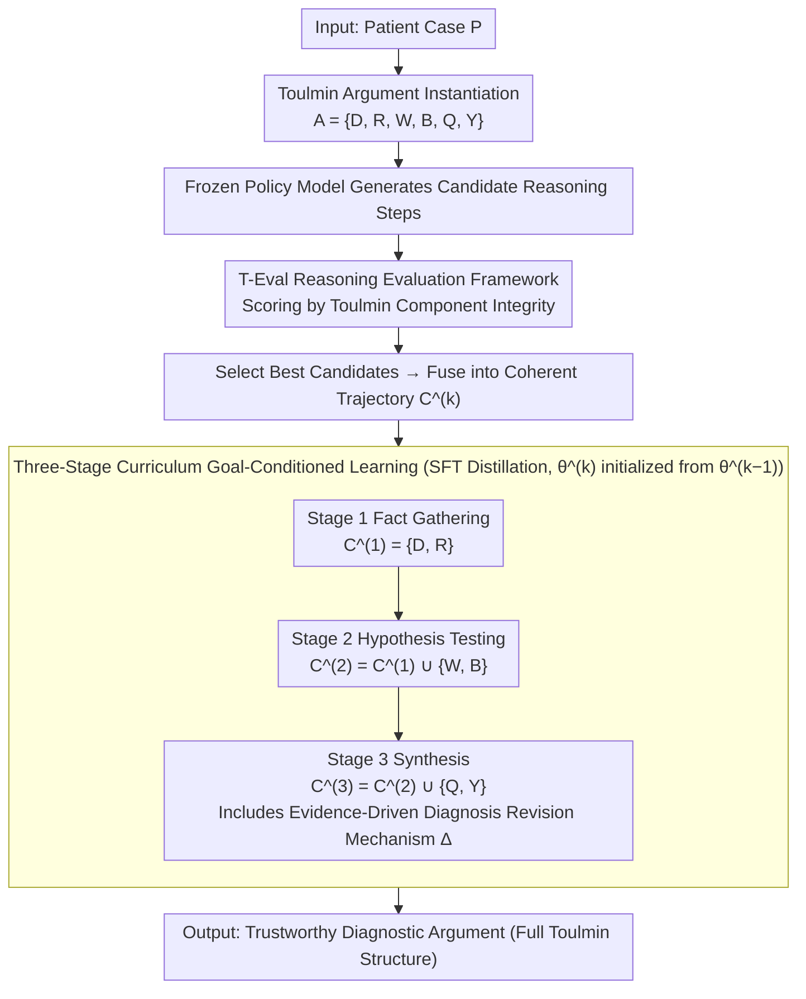

# From Answers to Arguments: Toward Trustworthy Clinical Diagnostic Reasoning with Toulmin-Guided Curriculum Goal-Conditioned Learning

**Conference**: ACL 2026  
**arXiv**: [2604.11137](https://arxiv.org/abs/2604.11137)  
**Code**: [https://github.com/Leonard-zc/CGCL](https://github.com/Leonard-zc/CGCL)  
**Area**: Medical NLP  
**Keywords**: Clinical Reasoning, Toulmin Argument Model, Curriculum Learning, Goal-Conditioned Learning, Trustworthy Diagnosis

## TL;DR
This paper adapts the Toulmin Argumentation Model to the clinical diagnostic process and proposes CGCL, a three-stage curriculum training framework (Fact Gathering → Hypothesis Testing → Synthesis). Combined with the T-Eval metric for quantifying reasoning structural integrity, it achieves diagnostic reasoning quality comparable to Reinforcement Learning (RL) methods without the need for RL.

## Background & Motivation

**Background**: LLMs perform excellently on medical benchmarks (e.g., MedQA, USMLE), even surpassing human experts. However, standardized tests do not equal real-world clinical practice. Clinical decision-making requires reasoning under uncertainty, integrating incomplete information, and bearing the cost of errors.

**Limitations of Prior Work**: (1) Current LLMs exhibit the dangerous "right answer + wrong reasoning" phenomenon—reaching correct conclusions through pattern matching while the reasoning process has flawed signals and lacks robust understanding; (2) Existing evaluations focus only on final answer correctness, failing to examine the logicality and evidence support of the reasoning path; (3) RL methods can theoretically optimize reasoning quality, but reward model design is difficult, training is unstable, and computational demands are high.

**Key Challenge**: In the medical field, a correct answer with incorrect reasoning is more dangerous than a wrong answer—it provides false confidence and fails unpredictably when facing real-world clinical complexity. Current evaluation paradigms systematically overestimate the actual capabilities of LLMs by looking only at results.

**Goal**: (1) Establish a structured clinical reasoning evaluation framework; (2) Design a stable and efficient training method to teach LLMs Toulmin-style argumentative reasoning.

**Key Insight**: The Toulmin Argument Model emphasizes that claims must have evidence support, uncertainty qualifiers, and rebuttals—this highly aligns with the reasoning process of clinicians moving from symptoms to diagnosis. This model is instantiated as a structured output for clinical diagnosis.

**Core Idea**: A three-stage curriculum simulates the natural progression of medical training: residents extract facts and preliminary differentials → senior residents perform hypothesis testing and rebuttals → attending physicians synthesize judgments and qualify conclusions.

## Method

### Overall Architecture
CGCL bridges "evaluation" and "training": the evaluation side is T-Eval—a framework based on the Toulmin model that directly quantifies reasoning quality; the training side is a three-stage goal-conditioned offline imitation learning pipeline. It uses a frozen policy model to generate candidate reasoning trajectories, uses T-Eval to score and select the optimal ones, and then distills these optimal trajectories into the target model via SFT. The entire process avoids RL while aiming to achieve RL-level reasoning quality.

### Key Designs

**1. T-Eval Reasoning Evaluation Framework: Structural Integrity Over Answer Correctness**

Judging a model solely on whether the final diagnosis is correct conflates models that "guess right via pattern matching" with those that "reason correctly via rigorous logic." Their answer accuracy might be identical, but their clinical reliability differs vastly. T-Eval solves this by formalizing a diagnostic reasoning process as a Toulmin argument $A=\{D,R,W,B,Q,Y\}$: $D$ is the case evidence, $R$ is the differential diagnosis ranking, $W$ is the warrant from evidence to hypothesis (pathophysiological link), $B$ is the backing clinical principles, $Q$ is the uncertainty qualifier, and $Y$ is the final diagnosis. By scoring these six components independently and combining them into an argumentative integrity score, the reasoning path transforms from an "invisible process" into a measurable object. "False confidence" models—those with correct answers but lacking $W/B/Q$ support—are directly exposed.

**2. Three-Stage Curriculum Goal-Conditioned Learning: Mimicking Medical Progression**

Requiring a model to generate a complete argument in one step is too difficult for models with limited capacity and often results in superficial learning. CGCL instead gradually increases the goal condition $C$, simulating the growth path from resident to senior resident to attending. Stage 1 (Fact Gathering) targets $C^{(1)}=\{D,R\}$, where the model only needs to extract clinical findings and provide preliminary differentials. Stage 2 (Hypothesis Testing) targets $C^{(2)}=C^{(1)}\cup\{W,B\}$, requiring the model to use pathophysiological evidence to argue for the primary hypothesis and rebut alternatives. Stage 3 (Synthesis) targets $C^{(3)}=C^{(2)}\cup\{Q,Y,\Delta\}$, where the model integrates all analysis to give a qualified conclusion, including evidence-driven revisions where necessary. Training data for each stage is generated by a policy model $\rightarrow$ scored by T-Eval $\rightarrow$ fused into trajectories $\rightarrow$ distilled via SFT, with each stage initialized from the previous one to accumulate capabilities layered by layer.

**3. Evidence-Driven Diagnosis Revision Mechanism: Forcing Updates Based on Evidence**

A good clinician does not just get it right once; they must correct themselves based on new evidence if an initial judgment is found wanting. This metacognitive ability is the core of clinical trustworthiness. CGCL encodes this as a hard constraint in Stage 3: when the final diagnosis $Y$ is inconsistent with the preliminary ranking in Stage 1, the model must generate a revision justification $\Delta$, explicitly stating which evidence triggered the change, marked by a revision indicator $\mathbb{I}_{\text{rev}}$. Thus, revision is no longer an accidental "change of mind" but an explicitly trained and verifiable behavior.

### Loss & Training
The standard SFT negative log-likelihood loss is used for sequential three-stage training. Training data for each stage consists of candidate trajectories generated by a policy model (e.g., GPT-4), scored by T-Eval, and fused after optimal selection. No RL is used; only imitation learning is employed.

## Key Experimental Results

### Main Results

| Method | Diagnostic Accuracy | T-Eval Reasoning Score | Training Stability |
|--------|---------------------|-----------------------|--------------------|
| Direct SFT | Medium | Low | High |
| RL Methods (GRPO, etc.) | High | Medium-High | Low (Unstable) |
| **CGCL (Ours)** | **High (Comparable to RL)** | **High** | **High** |

### Ablation Study

| Configuration | Accuracy | T-Eval | Description |
|---------------|----------|--------|-------------|
| Full CGCL (3 Stages) | Best | Best | Complete curriculum |
| Single-stage direct $C^{(3)}$ | Lower | Lower | Lacks progressive capability building |
| w/o Diagnosis Revision | Slightly lower | Lower than full | Contribution of metacognition |
| w/o T-Eval Selection | Decrease | Decrease | Random trajectory quality is insufficient |

### Key Findings
- **Ours** is comparable to RL methods in diagnostic accuracy but offers higher training stability and computational efficiency.
- T-Eval reveals hidden "correct answer but flawed reasoning" issues—some high-accuracy methods are significantly lacking in reasoning quality.
- Curriculum training provides the most significant boost for small models—limited capacity requires more incremental guidance.
- The evidence-driven revision mechanism is crucial for clinical trustworthiness.

## Highlights & Insights
- **Paradigm Shift from "Answering Correctly" to "Explaining Clearly"**: T-Eval upgrades clinical reasoning quality from subjective assessment to quantifiable automated metrics, which is valuable for any domain requiring explainable reasoning.
- **Curriculum Learning as an RL Alternative**: Carefully designed curricula can reach RL-level reasoning quality while avoiding reward design complexities and training instabilities. This provides a practical option for resource-constrained scenarios.
- **Clinical Instantiation of the Toulmin Model**: Precisely bridges philosophical argumentation theory with clinical practice, providing an actionable structured reasoning framework.

## Limitations & Future Work
- Dependency on GPT-4 as a policy model for candidate trajectory generation remains costly.
- T-Eval scoring quality depends on the capability of the evaluating LLM.
- Validated only on diagnostic reasoning; not yet extended to treatment decisions or prognosis assessment.
- The three-stage division is manually designed; finer-grained or adaptive curricula could be explored.

## Related Work & Insights
- **vs HuatuoGPT-O1**: Uses CoT distillation + RL but does not evaluate reasoning structure. **Ours** directly optimizes the Toulmin integrity of reasoning.
- **vs MedPRM**: Trains process reward models to supervise reasoning paths, which is costly. **Ours** uses T-Eval for offline quality assessment as a surrogate for online PRMs.
- **vs General Clinical LLMs**: Most clinical LLMs only optimize answer accuracy; **Ours** is the first to treat reasoning structure as a first-class optimization objective.

## Rating
- Novelty: ⭐⭐⭐⭐⭐ Clinical instantiation of the Toulmin model and the T-Eval framework are highly original contributions.
- Experimental Thoroughness: ⭐⭐⭐⭐ Sufficient comparison with multiple baselines; T-Eval provides a new dimension of evaluation.
- Writing Quality: ⭐⭐⭐⭐⭐ Deep motivation (danger of "correct answer + wrong reasoning"), elegant method design.
- Value: ⭐⭐⭐⭐⭐ Proposes fundamental methodological contributions to the trustworthiness of medical AI.

<!-- RELATED:START -->

## Related Papers

- [\[ACL 2026\] CURE-Med: Curriculum-Informed Reinforcement Learning for Multilingual Medical Reasoning](cure-med_curriculum-informed_reinforcement_learning_for_multilingual_medical_rea.md)
- [\[ACL 2026\] Dr. Assistant: Enhancing Clinical Diagnostic Inquiry via Structured Diagnostic Reasoning Data and Reinforcement Learning](dr_assistant_enhancing_clinical_diagnostic_inquiry_via_structured_diagnostic_rea.md)
- [\[ACL 2026\] MultiDx: A Multi-Source Knowledge Integration Framework towards Diagnostic Reasoning](multidx_a_multi-source_knowledge_integration_framework_towards_diagnostic_reason.md)
- [\[ACL 2026\] Multi-View Attention Multiple-Instance Learning Enhanced by LLM Reasoning for Cognitive Distortion Detection](multi-view_attention_multiple-instance_learning_enhanced_by_llm_reasoning_for_co.md)
- [\[ACL 2026\] RADS: Reinforcement Learning-Based Sample Selection Improves Transfer Learning in Low-resource and Imbalanced Clinical Settings](rads_reinforcement_learning-based_sample_selection_improves_transfer_learning_in.md)

<!-- RELATED:END -->
