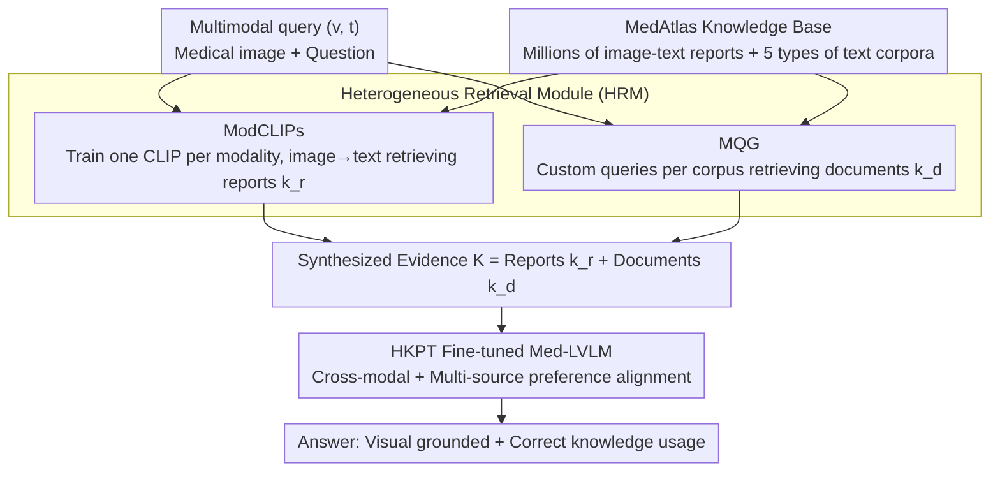

# HeteroRAG: A Heterogeneous Retrieval-Augmented Generation Framework for Medical Vision Language Tasks

**Conference**: ACL 2026 Findings  
**arXiv**: [2508.12778](https://arxiv.org/abs/2508.12778)  
**Code**: https://github.com/Jack-ZC8/HeteroRAG-Med  
**Area**: Medical NLP  
**Keywords**: Heterogeneous RAG, Modality-specific CLIP, Multi-corpora Query Generation, Preference Fine-tuning, Med-LVLM

## TL;DR
HeteroRAG constructs the MedAtlas knowledge base containing 2.7 million image-text pairs and five types of corpora. It decomposes medical multimodal RAG into three components—ModCLIPs (modality-specific report retrieval), MQG (corpus-customized query generation), and HKPT (preference fine-tuning to align cross-modal and multi-source knowledge)—enabling a 7B model to consistently outperform open-source Med-LVLMs with 4–5× more parameters across 11 datasets.

## Background & Motivation

**Background**: Medical Large Vision-Language Models (Med-LVLMs) are widely utilized for multimodal diagnosis and clinical decision support. However, poor factuality and reliability significantly hinder their actual deployment. Mainstream mitigation strategies involve multimodal RAG: using medical CLIPs (e.g., FactMM-RAG, RULE, MMed-RAG) to retrieve relevant reports based on images as context, or using zero-shot query rewriting (e.g., ChatCAD+, MIRA) to retrieve documents.

**Limitations of Prior Work**: (1) **Poor report retrieval**—existing medical CLIPs are fine-tuned on very few training sets of public datasets, resulting in low retrieval recall (Radiology recall@5 ~30%). Retrieved reports are often irrelevant, thereby polluting the generation; (2) **Inferior document retrieval**—medical corpora (research papers, textbooks, clinical guidelines, knowledge graphs) vary in linguistic style. Using a unified multimodal query directly fails to retrieve the correct information, and MIRA's zero-shot rewriting cannot adapt to the characteristics of each corpus; (3) **Knowledge misalignment**—even when retrieval is accurate, models often ignore images to copy reports directly, or conversely, stick to internal knowledge while disregarding external evidence.

**Key Challenge**: The two types of knowledge sources in medical RAG (image-text reports vs. pure text heterogeneous corpora) require fundamentally different retrieval strategies, yet existing works force them into the same retriever. Furthermore, even with accurate retrieval, neither cross-modality nor multi-source alignment has been explicitly addressed.

**Goal**: (1) Construct a truly "large and broad" medical multimodal knowledge base, expanding the report database to the million-scale and the corpora from single literature to five types; (2) Design tailored retrievers for reports and documents respectively; (3) Use a unified preference learning framework to simultaneously address "modality neglect" and "knowledge utilization/robustness" alignment issues.

**Key Insight**: (a) The image-text alignment distributions differ significantly across different modalities (Radiology, Ophthalmology, Pathology) → train one ModCLIP per modality; (b) Different corpora (PubMed, Wikipedia, Textbooks, Guidelines, Knowledge Graphs) require different query styles → train a Multi-Corpora Query Generator (MQG) to explicitly generate corpus-specific queries; (c) Cross-modality and multi-source alignment can both be addressed by constructing "should use vs. should not use" counterfactual preference pairs.

**Core Idea**: Treat "heterogeneity" as a first-class citizen—Heterogeneous Knowledge Base + Heterogeneous Retrievers (image-side ModCLIPs + document-side MQG) + Heterogeneous Knowledge Preference Tuning (HKPT handling both modality and multi-source alignment).

## Method

### Overall Architecture
HeteroRAG implements "heterogeneity" across three sequential modules. The first is the **MedAtlas Knowledge Base**—containing 1.10M Radiology / 0.11M Ophthalmology / 1.51M Pathology image-text pairs, plus five types of text corpora (Research/Wiki/Book/Guideline/Graph), which is significantly larger in scale and breadth than previous medical RAG knowledge bases. The second is the **Heterogeneous Retrieval Module (HRM)**: on the image side, ModCLIPs (individually trained from BiomedCLIP for each modality) retrieve relevant reports; on the document side, the **Multi-Corpora Query Generator (MQG)** generates a set of customized queries $Q=\{(i,j,q_j^i)\}$ for each multimodal query $(v,t)$ to retrieve documents. The third is the **Heterogeneous Knowledge Preference Tuning (HKPT)**: it constructs preference pairs for cross-modal alignment $\mathcal{D}_{cm}$ and multi-source alignment $\mathcal{D}_{mk}$, using a DPO-style loss $\mathcal{L}_{\text{HKPT}}$ to simultaneously tune "visual grounding" and "correct knowledge usage."

### Key Designs

**1. Modality-specific CLIPs (ModCLIPs): A dedicated retriever for each modality instead of a one-size-fits-all CLIP**

Visual statistical differences in medical imaging across different modalities are immense—grayscale in X-rays, color fundus photos, and Pathology H&E are effectively three different worlds. The feature space learned by a single "general medical CLIP" is not sufficiently differentiated, and cross-modal noise interferes with retrieval, which is the root cause of low recall in existing medical CLIPs. HeteroRAG initializes from BiomedCLIP and uses the entire remaining samples (Radiology 1.10M, Oph 0.11M, Pathology 1.51M) for modality-specific contrastive learning after setting aside 2000 dev/test samples. Training volume is an order of magnitude larger than "fine-tuning only on a few public training sets." Consequently, the three ModCLIPs achieved recall@5 in image→text at 79.40 / 47.55 / 77.35, more than doubling FactMM-RAG’s 44.25 (Rad) and MMed-RAG’s 19.25 (Oph)/30.20 (Pat)—demonstrating that in vertical domains, modality-specific training is almost always worthwhile.

**2. Multi-Corpora Query Generator (MQG): Generating "targeted" retrieval queries for each corpus**

PubMed papers utilize scientific terminology, Wikipedia requires general encyclopedic phrasing, clinical guidelines recognize disease/procedure nomenclature, and knowledge graphs require "term, relation" structures. Using a single multimodal query to retrieve all corpora is like using one key for five different locks, causing the inaccuracy in zero-shot rewriting like MIRA. MQG explicitly parameterizes "corpus-style query generation": for each $(v,t)$, an expert MLLM (Lingshu-32B AWQ) exploratorily generates 6 candidate queries per corpus, then the same expert serves as a judge to evaluate if the document retrieved by each query supports the reference answer (this VLM-as-a-judge achieved acc=0.836, F1=0.855 against 500 human-verified samples). Candidates judged as supportive are $Q_w$, and others are $Q_l$. MQG is trained in two stages: SFT to learn good query generation $\mathcal{L}_{\text{SFT}}=-\mathbb{E}\log\mathcal{M}_\theta(Q_w\mid v,t)$, followed by DPO to differentiate good and bad queries:

$$\mathcal{L}_{\text{DPO}}=-\log\sigma\Big(\beta\log\tfrac{\mathcal{M}_\theta(Q_w\mid v,t)}{\mathcal{M}_{\text{ref}}}-\beta\log\tfrac{\mathcal{M}_\theta(Q_l\mid v,t)}{\mathcal{M}_{\text{ref}}}\Big).$$

Compared to prompt-level zero-shot rewriting, this transforms "which query fits which corpus" into a learnable behavior.

**3. Heterogeneous Knowledge Preference Tuning (HKPT): A single DPO loss treating three "knowledge misalignment" issues**

Accurate retrieval does not guarantee correct usage—models often fail in three ways: ignoring images to copy reports, failing to use external knowledge, or lacking robustness against noisy knowledge. Previous methods like MMed-RAG only addressed modality alignment, while K-LLaVA types only addressed document utilization; none handled all three. HKPT unifies these into chosen/rejected preference pairs via counterfactual data construction. For cross-modal alignment $\mathcal{D}_{cm}$: the most dissimilar image from the same modality in the training set is selected as $v^*$. If $\mathcal{M}(v,t,K)=y$, $\mathcal{M}(v^*,t)\ne y$, but $\mathcal{M}(v^*,t,K)=y$, it indicates the model answers correctly even with the wrong image by purely copying $K$. Thus, $(v,t,K)$ is set as chosen and $(v^*,t,K)$ as rejected to force visual attention. For multi-source alignment $\mathcal{D}_{mk}$: verification steps are performed for each $k\in\{\{k_r\},\{k_d\},\{k_r,k_d\}\}$. Regarding utility, if $\mathcal{M}(v,t,K)=y$ but $\mathcal{M}(v,t,K\setminus k)\ne y$, then $k$ is critical, and the chosen pair is the correct answer with $K$. Regarding robustness, if $\mathcal{M}(v,t,K\setminus k)=y$ but $\mathcal{M}(v,t,K)\ne y$, then $k$ is noise, and the chosen pair is changed to the correct answer $y_w$ which ignores $k$. All preference pairs are finally optimized together:

$$\mathcal{L}_{\text{HKPT}}=-\mathbb{E}\log\sigma\Big(\beta\log\tfrac{\mathcal{M}_{\theta'}(y_w\mid x_w)}{\mathcal{M}_{\text{ref}'}}-\beta\log\tfrac{\mathcal{M}_{\theta'}(y_l\mid x_l)}{\mathcal{M}_{\text{ref}'}}\Big)$$

This optimization effectively uses the model's own predictive shifts to "freely" generate supervisory signals, correcting three failure modes—modality neglect, misuse, and over-reliance on noise—in one pass.

### A Complete Example: Walking through a Radiology VQA task
Assume the input is a chest X-ray $v$ with question $t$: "Is there a pneumothorax?". First, in the image-side of HRM: the Radiology ModCLIP encodes $v$ and performs image→text retrieval in the million-scale report database to pull the most relevant reports $k_r$. Simultaneously, document-side MQG takes $(v,t)$ and generates customized queries for the five corpora—technical queries for Research, "pneumothorax management" nomenclature for Guidelines, and "pneumothorax, treatment" structures for Graphs—retrieving documents $k_d$. The two streams of evidence are synthesized into $K=\{k_r,k_d\}$ and fed to the HKPT-tuned Med-LVLM. Because it was forced to "look at the image" by cross-modal counterfactual pairs during training, it won't ignore the X-ray to copy the report. Because it learned "which knowledge to use and which is noise," it adopts reports and guidelines that truly support the diagnosis while filtering out irrelevant documents, providing a grounded answer. This process uses reports to supplement image-specific details and documents to supplement open-domain knowledge, corresponding to the performance drops observed in ablations (w/o Doc in open-domain QA and w/o Reports in image-grounded tasks).

### Loss & Training
ModCLIPs: Unimodal image-text contrastive learning. MQG: Two-stage SFT + DPO. Med-LVLM: Unified fine-tuning with $\mathcal{L}_{\text{HKPT}}$ DPO-style loss. Base model: Lingshu-7B.

## Key Experimental Results

### Main Results: Medical VQA (Lingshu-7B base model, Accuracy ↑)

| Method | Retrieval | VQA-RAD | SLAKE | OMVQA-Rad† | DME-VQA | OMVQA-Oph† | PathMMU | PathVQA | Quilt-VQA† |
|------|------|---------|-------|------------|---------|------------|---------|---------|------------|
| Original | — | 72.79 | 83.65 | 74.92 | 81.92 | 80.83 | 57.36 | 77.38 | 49.27 |
| FactMM-RAG (Report) | R | 76.84 | 83.89 | 75.58 | 81.92 | 81.50 | 73.58 | 91.98 | 69.68 |
| MMed-RAG (Report) | R | 75.74 | 86.06 | 76.33 | 80.70 | 79.08 | 68.06 | 85.67 | 67.35 |
| K-LLaVA (Doc) | D | 77.21 | 84.62 | 76.00 | 88.48 | 83.75 | 73.75 | 87.76 | 61.81 |
| MIRA (R+D) | R+D | 76.84 | 84.38 | 76.58 | 87.95 | 82.50 | 74.25 | **92.10** | 68.80 |
| **Ours (HeteroRAG)** | R+D | **81.99** | **87.50** | **80.42** | **88.56** | **86.00** | **75.59** | 90.83 | **72.89** |

(†=OOD dataset, no training split.)

For report generation (BLEU/ROUGE-L/RaTEScore/METEOR), HeteroRAG similarly achieves SOTA on most metrics for MIMIC-CXR / IU-Xray / Harvard-FairVLMed (see Table 4). Figure 3 shows HeteroRAG-7B outperforming models with 4–5× parameters such as HuatuoGPT-V-34B, HealthGPT-32B, and Lingshu-32B.

### Ablation Study: Knowledge Sources, SFT vs HKPT, Retriever Comparison

| Config | OMVQA-Rad | OMVQA-Oph | Quilt-VQA |
|------|------|------|------|
| Original | 74.92 | 80.83 | 49.27 |
| SFT | 75.00 | 82.17 | 63.85 |
| **Ours** | **80.42** | **86.00** | **72.89** |
| w/o Reports | 75.08 | 81.33 | 62.97 |
| w/o Doc | 74.17 | 79.08 | 53.94 |
| w/o Research | 79.42 | 84.33 | 68.80 |
| w/o Wiki | 77.75 | 84.00 | 67.64 |
| w/o Book | 75.17 | 80.92 | 67.06 |
| w/o Guideline | 79.33 | 84.58 | 69.68 |
| w/o Graph | 78.58 | 83.25 | 66.47 |

Retriever Comparison (image→text Recall@5): ModCLIPs in HeteroRAG achieved 79.40/47.55/77.35 in Rad/Oph/Pat, significantly outperforming Prev. SOTA FactMM-RAG (44.25) and MMed-RAG (19.25 / 30.20).

### Key Findings
- **Reports + Documents are both essential**: w/o Doc caused a plunge from 72.89 to 53.94 on Quilt-VQA, proving report-only RAG is severely insufficient for open-domain OOD pathology QA. w/o Reports caused a drop from 80.42 to 75.08 on OMVQA-Rad, proving reports are indispensable for tasks matching images closely.
- **HKPT outperforms pure SFT by 5–9 points**: SFT provides only marginal gains on three OOD datasets, while HKPT shows significant improvement, proving preference tuning is more effective than pure supervision at forcing models to "visually ground + use correct knowledge."
- **Contribution varies across corpora**: w/o Book nearly dropped to the baseline on OMVQA-Oph, indicating textbooks are critical for ophthalmology QA; w/o Research had minor impacts, possibly due to PubMed's broad coverage and low specificity; w/o Graph's influence suggests "term+relation" structures are useful for terminology questions.
- **Small model + High-quality RAG > Large model**: The 7B + HeteroRAG configuration surpassed the 32B original Lingshu in most tasks, proving that investing compute in retrieval quality and knowledge alignment is more efficient than scaling parameters.

## Highlights & Insights
- **Modality-specific partitioning taken to the extreme**: Medical RAG has long assumed a single CLIP could handle all modalities. This paper proves that using three independent ModCLIPs with million-scale training data doubles recall—demonstrating that modality-specific training is almost always worthwhile in vertical domains, including remote sensing, satellite, or microscopy scenarios.
- **MQG elevates "corpus adaptation" to a training objective**: Previously, RAG query rewriting was mostly a prompt trick. This paper uses VLM-as-a-judge to automatically generate chosen/rejected DPO data to train a dedicated generator, making the mapping of "which query suits which corpus" a learnable behavior. This can be extended to law or finance RAG with multiple corpora.
- **Counterfactual preference construction in HKPT**: Using "correct answer despite unrelated image" → model copying knowledge; using "wrong answer without k" → knowledge is critical. This paradigm of constructing positive/negative pairs from the model's own predictive changes generates supervision signals for free, elegantly instantiating RLAIF for RAG alignment.

## Limitations & Future Work
- **MedAtlas is primarily English + three imaging modalities**: Other vital modalities like CT, MRI, Ultrasound, and ECG are not covered; Chinese/low-resource medical corpora are missing.
- **Dependency on Lingshu-32B for judging and query generation**: The upper bound of the entire pipeline is locked by the 32B teacher model; the judge accuracy of 0.836 still leaves a 16% error rate in medical contexts.
- **Self-constructed HKPT preference pairs**: These might amplify the base model's biases (if the model inherently ignores a certain modality, counterfactual pairs might reinforce this).
- **Future Directions**: Expanding to CT/MRI/Chinese corpora; using stronger ensemble judges; introducing active learning for MedAtlas expansion based on retrieval uncertainty; and end-to-end joint optimization of MQG and retrievers.

## Related Work & Insights
- **vs FactMM-RAG / RULE / MMed-RAG**: These works only performed report retrieval and modality alignment without a document side. HeteroRAG adds the document side and multi-source alignment, with an order of magnitude larger retriever training data.
- **vs K-LLaVA / MKGF**: These focused on document retrieval without report retrieval, and used unified queries. HeteroRAG's MQG is more granular by customizing queries for each corpus.
- **vs MIRA**: MIRA used report+doc but only with zero-shot rewriting. HeteroRAG upgrades rewriting to an SFT+DPO trained MQG and uses HKPT for alignment, outperforming MIRA by 4–6 points on most benchmarks.
- **vs text-only Multi-Corpora Query (Chen 2025)**: This work extends that idea into the multimodal medical domain and solves the open challenge of integrating visual evidence into query generation.

## Rating
- Novelty: ⭐⭐⭐⭐ MQG customized queries + HKPT heterogeneous preference alignment is a novel combination in medical RAG.
- Experimental Thoroughness: ⭐⭐⭐⭐⭐ 11 datasets × 3 modalities × 4 baseline types + retriever comparisons + 7-dimensional ablation; very solid.
- Writing Quality: ⭐⭐⭐⭐ Three-module diagram is clear, HKPT pseudo-code is complete, and tables are readable.
- Value: ⭐⭐⭐⭐ MedAtlas and ModCLIPs are released as infrastructure for the medical MMRAG community.

<!-- RELATED:START -->

## Related Papers

- [\[ACL 2026\] SEMA-RAG: A Self-Evolving Multi-Agent Retrieval-Augmented Generation Framework for Medical Reasoning](sema-rag_a_self-evolving_multi-agent_retrieval-augmented_generation_framework_fo.md)
- [\[ACL 2026\] RA-RRG: Multimodal Retrieval-Augmented Radiology Report Generation with Key Phrase Extraction](ra-rrg_multimodal_retrieval-augmented_radiology_report_generation_with_key_phras.md)
- [\[ACL 2025\] MedBioRAG: Semantic Search and Retrieval-Augmented Generation with Large Language Models for Medical and Biological QA](../../ACL2025/medical_nlp/medbiorag_semantic_search_and_retrieval-augmented_generation_for_biomedical_lite.md)
- [\[ACL 2025\] Towards Omni-RAG: Comprehensive Retrieval-Augmented Generation for Large Language Models in Medical Applications](../../ACL2025/medical_nlp/omni_rag_medical.md)
- [\[AAAI 2026\] Expert-Guided Prompting and Retrieval-Augmented Generation for Emergency Medical Service Question Answering](../../AAAI2026/medical_nlp/expert-guided_prompting_and_retrieval-augmented_generation_for_emergency_medical.md)

<!-- RELATED:END -->
