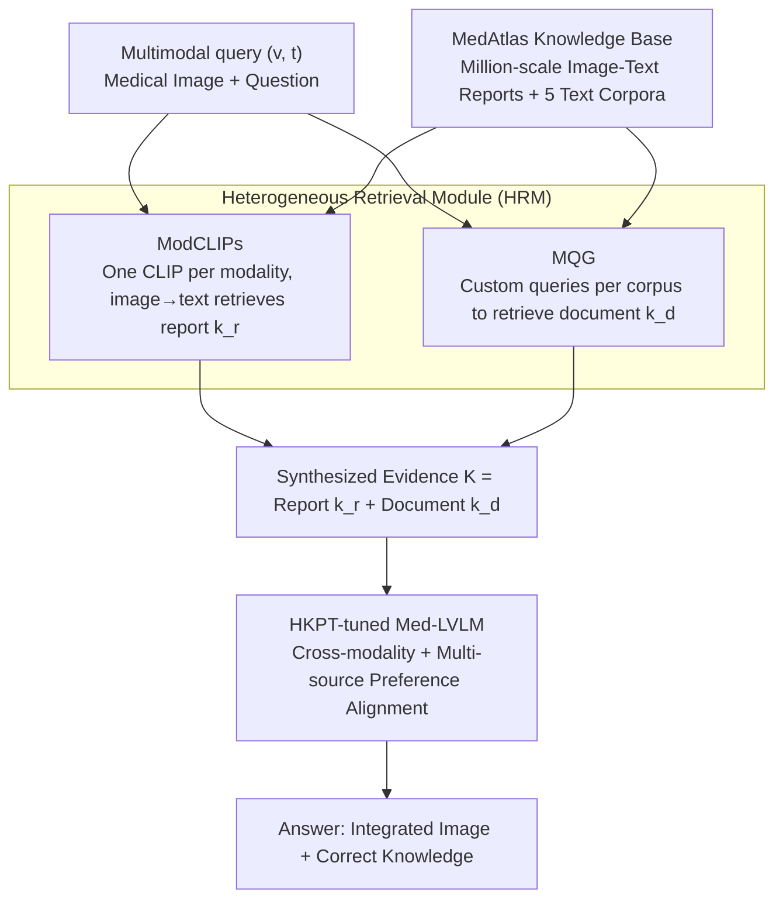

# HeteroRAG: A Heterogeneous Retrieval-Augmented Generation Framework for Medical Vision Language Tasks

**Conference**: ACL 2026 Findings  
**arXiv**: [2508.12778](https://arxiv.org/abs/2508.12778)  
**Code**: https://github.com/Jack-ZC8/HeteroRAG-Med  
**Area**: Medical NLP  
**Keywords**: Heterogeneous RAG, Modality-Specific CLIP, Multi-Corpora Query Generation, Preference Fine-tuning, Med-LVLM

## TL;DR
HeteroRAG constructs the MedAtlas knowledge base with 2.7 million image-text pairs and five types of corpora. It decomposes medical multimodal RAG into three components—ModCLIPs trained by modality to retrieve reports, MQG generating customized queries per corpus to retrieve documents, and HKPT preference fine-tuning to align cross-modality and multi-source knowledge—enabling a 7B model to consistently outperform open-source Med-LVLMs with 4-5× its parameters across 11 datasets.

## Background & Motivation

**Background**: Medical Large Vision-Language Models (Med-LVLMs) are widely used for multimodal diagnosis and clinical decision support, but poor factuality and reliability significantly hinder real-world deployment. Prevailing mitigation strategies involve multimodal RAG: using medical CLIPs (e.g., FactMM-RAG, RULE, MMed-RAG) to retrieve relevant reports as context based on images, or using zero-shot query rewriting (e.g., ChatCAD+, MIRA) to retrieve documents.

**Limitations of Prior Work**: (1) **Poor report retrieval**: Existing medical CLIPs are fine-tuned on very few training sets of public datasets, resulting in low retrieval recall (Radiology recall@5 ~30); retrieved reports are often irrelevant and contaminate generation. (2) **Worse document retrieval**: Medical corpora (research papers, textbooks, clinical guidelines, knowledge graphs) vary in linguistic style; using a uniform multimodal query directly fails to retrieve correct information, and MIRA's zero-shot rewriting cannot adapt to the characteristics of each corpus. (3) **Knowledge misalignment**: Even when retrieval is accurate, models often ignore images to copy reports directly, or conversely, stick to internal knowledge while ignoring external evidence.

**Key Challenge**: The two types of knowledge sources in medical RAG (image-text reports vs. text-only heterogeneous corpora) require fundamentally different retrieval strategies, yet existing works force them into the same retriever. Furthermore, even with accurate retrieval, the alignment of cross-modality and multi-source knowledge has not been explicitly addressed.

**Goal**: (1) Construct a truly "large and broad" medical multimodal knowledge base, expanding the report library to the million-scale and the corpus from single documents to five types. (2) Design "targeted" retrievers for reports and documents respectively. (3) Use a unified preference learning framework to simultaneously address "modality neglect" and "knowledge utilization/robustness" alignment issues.

**Key Insight**: (a) Visual-text alignment distributions differ significantly across modalities (Radiology, Ophthalmology, Pathology) → Train a ModCLIP for each modality. (b) Different corpora (PubMed, Wikipedia, Textbooks, Guidelines, Knowledge Graphs) require different query styles → Train a Multi-Corpora Query Generator (MQG) to explicitly generate dedicated queries per corpus. (c) Both cross-modality and multi-source alignment can be addressed by constructing "should use vs. should not use" counterfactual preference pairs.

**Core Idea**: Treat "heterogeneity" as a first-class citizen—heterogeneous knowledge bases + heterogeneous retrievers (ModCLIPs for images + MQG for text) + heterogeneous knowledge preference tuning (HKPT managing both modality and multi-source alignment).

## Method

### Overall Architecture
HeteroRAG implements "heterogeneity" across three serial modules. The first is the **MedAtlas Knowledge Base**—containing Cardiology 1.10M / Ophthalmology 0.11M / Pathology 1.51M image-text pairs, plus five text corpora (Research, Wiki, Book, Guideline, Graph), significantly larger in scale and scope than previous medical RAG knowledge bases. The second is the **Heterogeneous Retrieval Module (HRM)**: on the image side, ModCLIPs (individually trained BiomedCLIPs per modality) retrieve relevant reports $k_r$; on the text side, the **Multi-Corpora Query Generator (MQG)** generates customized query sets $Q=\{(i,j,q_j^i)\}$ for each multimodal query $(v,t)$ to retrieve documents. The third is **Heterogeneous Knowledge Preference Tuning (HKPT)**: constructing cross-modality alignment $\mathcal{D}_{cm}$ and multi-source alignment $\mathcal{D}_{mk}$ preference pairs, using a DPO-style loss $\mathcal{L}_{\text{HKPT}}$ to simultaneously align "image observation" and "correct knowledge utilization."

### Key Designs

**1. Modality-specific CLIPs (ModCLIPs): A dedicated retriever for each modality rather than a one-size-fits-all CLIP**

Visual statistical differences in medical imaging across modalities are extreme—the grayscale of X-rays, color fundus photos, and Pathology H&E are effectively distinct worlds. The feature space learned by a "general medical CLIP" is insufficiently differentiated, and cross-modality noise causes interference, leading to low retrieval recall. HeteroRAG initializes from BiomedCLIP and performs contrastive learning separately using the remaining samples (Radiology 1.10M, Oph 0.11M, Pathology 1.51M) after setting aside dev/test sets. The resulting three ModCLIPs achieved image→text recall@5 of 79.40, 47.55, and 77.35 respectively, more than doubling FactMM-RAG's 44.25 (Rad) and MMed-RAG's 19.25 (Oph) / 30.20 (Pat).

**2. Multi-Corpora Query Generator (MQG): Generating "targeted" retrieval queries for each corpus**

PubMed papers utilize scientific terminology, Wikipedia requires general encyclopedic phrasing, clinical guidelines recognize disease/procedure nomenclature, and knowledge graphs require "term, relation" structures. Using a single multimodal query for all corpora is ineffective. MQG explicitly parameterizes "corpus-specific query generation": for each $(v,t)$, an expert MLLM (Lingshu-32B AWQ) generates six candidate queries per corpus. Then, the same expert acts as a judge to evaluate if the documents retrieved by each query support the reference answer. Queries judged as supporting are categorized as $Q_w$, and those not supporting as $Q_l$. MQG is trained in two stages: SFT to learn good query generation $\mathcal{L}_{\text{SFT}}=-\mathbb{E}\log\mathcal{M}_\theta(Q_w\mid v,t)$, followed by DPO to differentiate good and bad queries:

$$\mathcal{L}_{\text{DPO}}=-\log\sigma\Big(\beta\log\tfrac{\mathcal{M}_\theta(Q_w\mid v,t)}{\mathcal{M}_{\text{ref}}}-\beta\log\tfrac{\mathcal{M}_\theta(Q_l\mid v,t)}{\mathcal{M}_{\text{ref}}}\Big).$$

**3. Heterogeneous Knowledge Preference Tuning (HKPT): A unified DPO loss addressing three types of "knowledge misalignment"**

Accurate retrieval does not guarantee correct utilization. Models often suffer from three issues: ignoring images to copy reports, failing to use external knowledge, or low robustness to noisy knowledge. HKPT unifies these into chosen/rejected preference pairs via counterfactual data construction. For cross-modality alignment $\mathcal{D}_{cm}$: if retrieving the most dissimilar image $v^*$ from the same modality results in $\mathcal{M}(v,t,K)=y$ and $\mathcal{M}(v^*,t)\ne y$ but $\mathcal{M}(v^*,t,K)=y$, it indicates the model can answer correctly even with the wrong image by copying $K$. Thus, $(v,t,K)$ is set as chosen and $(v^*,t,K)$ as rejected. For multi-source alignment $\mathcal{D}_{mk}$: for $k\in\{\{k_r\},\{k_d\},\{k_r,k_d\}\}$, if $\mathcal{M}(v,t,K)=y$ but $\mathcal{M}(v,t,K\setminus k)\ne y$, then $k$ is critical and the chosen pair includes $K$. If $\mathcal{M}(v,t,K\setminus k)=y$ but $\mathcal{M}(v,t,K)\ne y$, $k$ is noise, and the chosen pair is the correct answer ignoring $k$. All pairs are optimized via:

$$\mathcal{L}_{\text{HKPT}}=-\mathbb{E}\log\sigma\Big(\beta\log\tfrac{\mathcal{M}_{\theta'}(y_w\mid x_w)}{\mathcal{M}_{\text{ref}'}}-\beta\log\tfrac{\mathcal{M}_{\theta'}(y_l\mid x_l)}{\mathcal{M}_{\text{ref}'}}\Big)$$

### Loss & Training
ModCLIPs: Unimodal image-text contrastive learning. MQG: Two-stage SFT + DPO. Med-LVLM: Unified fine-tuning via $\mathcal{L}_{\text{HKPT}}$ in a DPO style. Base model: Lingshu-7B.

## Key Experimental Results

### Main Results: Medical VQA (Lingshu-7B Base Model, Accuracy ↑)

| Method | Retrieval | VQA-RAD | SLAKE | OMVQA-Rad† | DME-VQA | OMVQA-Oph† | PathMMU | PathVQA | Quilt-VQA† |
|------|------|---------|-------|------------|---------|------------|---------|---------|------------|
| Original | — | 72.79 | 83.65 | 74.92 | 81.92 | 80.83 | 57.36 | 77.38 | 49.27 |
| FactMM-RAG (Report) | R | 76.84 | 83.89 | 75.58 | 81.92 | 81.50 | 73.58 | 91.98 | 69.68 |
| MMed-RAG (Report) | R | 75.74 | 86.06 | 76.33 | 80.70 | 79.08 | 68.06 | 85.67 | 67.35 |
| K-LLaVA (Doc) | D | 77.21 | 84.62 | 76.00 | 88.48 | 83.75 | 73.75 | 87.76 | 61.81 |
| MIRA (R+D) | R+D | 76.84 | 84.38 | 76.58 | 87.95 | 82.50 | 74.25 | **92.10** | 68.80 |
| **HeteroRAG (Ours)** | R+D | **81.99** | **87.50** | **80.42** | **88.56** | **86.00** | **75.59** | 90.83 | **72.89** |

(†=OOD datasets with no training split.)

HeteroRAG-7B exceeds models with 4-5× its parameters, such as HuatuoGPT-V-34B and Lingshu-32B.

### Ablation Study: Knowledge Sources, SFT vs HKPT

| Configuration | OMVQA-Rad | OMVQA-Oph | Quilt-VQA |
|------|------|------|------|
| Original | 74.92 | 80.83 | 49.27 |
| SFT | 75.00 | 82.17 | 63.85 |
| **HeteroRAG** | **80.42** | **86.00** | **72.89** |
| w/o Reports | 75.08 | 81.33 | 62.97 |
| w/o Doc | 74.17 | 79.08 | 53.94 |
| w/o Textbook | 75.17 | 80.92 | 67.06 |

### Key Findings
- **Reports and documents are both indispensable**: Removing documents (w/o Doc) leads to a crash in Quilt-VQA (72.89 to 53.94), proving that purely report-based RAG is insufficient for open-domain pathology QA. Removing reports (w/o Reports) drops OMVQA-Rad from 80.42 to 75.08, showing reports are vital for tasks requiring strong image alignment.
- **HKPT outperforms pure SFT by 5–9 points**: SFT provides only marginal gains on OOD datasets, while HKPT significantly widens the gap.
- **Small model + good RAG > Large model**: The 7B HeteroRAG outperforms the 32B Lingshu on most tasks, proving that investing compute into retrieval quality and knowledge alignment is more efficient than increasing parameters.

## Highlights & Insights
- **Pushing "modality-split retrievers" to the extreme**: Medical RAG has long assumed a single CLIP can handle all modalities. Ours uses three independent ModCLIPs with million-scale data to double recall—suggesting that in vertical domains, modality-specific training is almost always worthwhile.
- **MQG treats "corpus adaptation" as a training objective**: Previously, query rewriting in RAG was mostly a prompt trick. Ours uses a VLM-as-a-judge to automatically generate DPO data, making "which query fits which corpus" a learnable behavior.
- **Counterfactual preference construction in HKPT**: Using changes in the model's own predictions to construct supervision signals for "ignoring images" or "trusting noise" allows for "free" alignment data.

## Limitations & Future Work
- **MedAtlas is English-centric and limited to three modalities**: CT, MRI, Ultrasound, and ECG are not covered; Chinese/low-resource language medical corpora are missing.
- **Reliance on Lingshu-32B for judging and query generation**: The performance "ceiling" is capped by the teacher model.
- **Counterfactual construction depends on model predictions**: This might amplify base model biases.
- **Future directions**: Expand to Chinese corpora and more imaging modalities; introduce ensemble judges; use active learning for MedAtlas expansion.

## Related Work & Insights
- **vs FactMM-RAG / MMed-RAG**: Previous works focused on report retrieval and modality alignment without document-side integration. HeteroRAG completes both and uses a significantly larger training scale for retrievers.
- **vs K-LLaVA**: They focus on document retrieval but use a single query type; MQG's per-corpus customization is more granular.
- **vs MIRA**: MIRA uses both reports and docs but relies on zero-shot rewriting; HeteroRAG upgrades this to a trained MQG and HKPT, outperforming MIRA by 4–6 points on most benchmarks.

## Rating
- Novelty: ⭐⭐⭐⭐ MQG customized queries + HKPT heterogeneous preference alignment is a novel combination in medical RAG.
- Experimental Thoroughness: ⭐⭐⭐⭐⭐ Extremely solid with 11 datasets, 3 modalities, 4 baseline categories, and detailed ablations.
- Writing Quality: ⭐⭐⭐⭐ Clear modules and complete pseudo-code for algorithms.
- Value: ⭐⭐⭐⭐ MedAtlas and ModCLIPs serve as foundational infrastructure for the medical MM-RAG community.

<!-- RELATED:START -->

## Related Papers

- [\[ACL 2026\] SEMA-RAG: A Self-Evolving Multi-Agent Retrieval-Augmented Generation Framework for Medical Reasoning](sema-rag_a_self-evolving_multi-agent_retrieval-augmented_generation_framework_fo.md)
- [\[ACL 2026\] RA-RRG: Multimodal Retrieval-Augmented Radiology Report Generation with Key Phrase Extraction](ra-rrg_multimodal_retrieval-augmented_radiology_report_generation_with_key_phras.md)
- [\[ACL 2025\] MedBioRAG: Semantic Search and Retrieval-Augmented Generation with Large Language Models for Medical and Biological QA](../../ACL2025/medical_nlp/medbiorag_semantic_search_and_retrieval-augmented_generation_for_biomedical_lite.md)
- [\[ACL 2025\] Towards Omni-RAG: Comprehensive Retrieval-Augmented Generation for Large Language Models in Medical Applications](../../ACL2025/medical_nlp/omni_rag_medical.md)
- [\[AAAI 2026\] Expert-Guided Prompting and Retrieval-Augmented Generation for Emergency Medical Service Question Answering](../../AAAI2026/medical_nlp/expert-guided_prompting_and_retrieval-augmented_generation_for_emergency_medical.md)

<!-- RELATED:END -->
