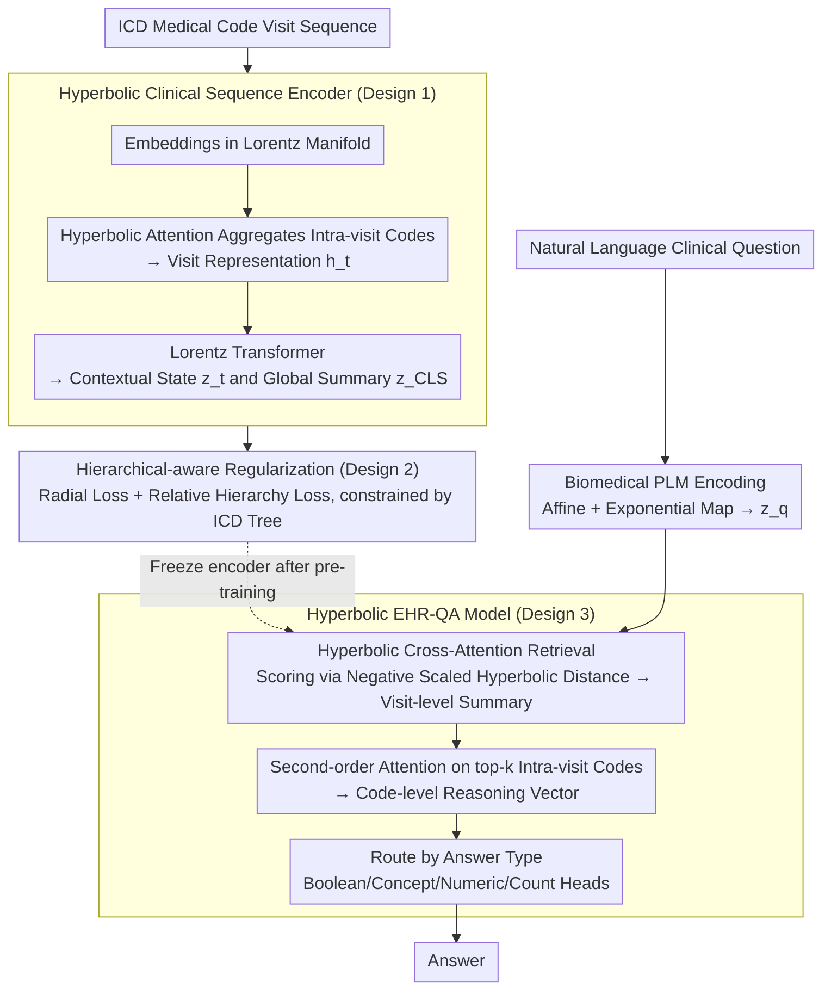

# HypEHR: Hyperbolic Modeling of Electronic Health Records for Efficient Question Answering

**Conference**: ACL 2026 (Findings)  
**arXiv**: [2604.21027](https://arxiv.org/abs/2604.21027)  
**Code**: [https://github.com/yuyuliu11037/HypEHR](https://github.com/yuyuliu11037/HypEHR)  
**Area**: Medical NLP
**Keywords**: EHR-QA, Hyperbolic Space, Lorentz Model, ICD Hierarchical Modeling, Lightweight Clinical Models

## TL;DR
Ours proposes HypEHR, a Lorentz hyperbolic model with only 22M parameters. It embeds medical codes, visit records, and questions into hyperbolic space and aligns them with the ICD ontology structure via hierarchical-aware regularization, achieving performance close to LLM-based methods on the MIMIC-IV EHR-QA task.

## Background & Motivation

**Background**: Electronic Health Record Question Answering (EHR-QA) aims to answer natural language clinical questions regarding a patient's longitudinal records. Current methods mainly fall into three categories: EHR representation learning (sequence/graph models), Text-to-SQL semantic parsing, and RAG-LLM pipelines based on GPT-3.5/4.

**Limitations of Prior Work**: While accurate, these methods incur high computational overhead, are difficult to deploy under strict privacy constraints, and mostly ignore the strong structural priors in EHR data. LLM pipelines with trillions of parameters are hard to deploy locally within hospitals.

**Key Challenge**: Medical codes and patient trajectories are inherently hierarchical (ICD codes are organized by Chapter → Block → Category → Subcategory). Euclidean embeddings distort this tree-like structure, and existing methods fail to fully utilize this geometric prior.

**Goal**: Construct a compact model consistent with the intrinsic geometry of EHRs to achieve comparable performance on complex QA tasks with significantly fewer parameters than LLMs.

**Key Insight**: Hyperbolic space can embed hierarchical structures with arbitrarily low distortion. Previous research demonstrated that hyperbolic embeddings improve medical code hierarchy modeling, but final patient representations were still modeled in Euclidean space. This work proposes modeling patient-level representations directly in hyperbolic space.

**Core Idea**: Embed ICD codes, visits, and questions using the Lorentz hyperbolic manifold. Align these with the ICD ontology via hierarchical-aware regularization, and answer questions using geometrically consistent cross-attention and type-specific pointer heads.

## Method

### Overall Architecture

HypEHR aims to solve a problem: can a small, geometrically "EHR-like" model perform EHR-QA without relying on trillion-parameter LLMs. Its core bet is that medical codes and patient trajectories are essentially hierarchical trees, and hyperbolic space is naturally suited for embedding tree structures with minimal distortion. Thus, the entire model—from codes and visits to questions—remains within the Lorentz hyperbolic manifold. Training occurs in two stages: first, pre-training the patient encoder in hyperbolic space (jointly with next-visit prediction and hierarchical regularization), then freezing it to train four lightweight QA heads based on answer types (Boolean, Concept, Numeric, Count). The full model has only 22M parameters.

### Key Designs

**1. Hyperbolic Clinical Sequence Encoder: Staying in hyperbolic space to avoid losing hierarchical structure during coordinate transformations.**

Embedding the ICD tree ontology in Euclidean space causes exponential branches to be compressed and distorted, losing hierarchical information. HypEHR embeds each medical code $c$ directly into the Lorentz manifold $\mathbb{H}_L^d$. It first uses hyperbolic attention to aggregate codes within a visit into a visit representation $h_t$, then processes the visit sequence with a multi-layer Lorentz Transformer (adapting self-attention, residual connections, and normalization to the Lorentz manifold). This outputs contextual states $\{z_t\}_{t=1}^T$ and a global summary $z_{\text{[CLS]}}$. A crucial distinction is "operating entirely in hyperbolic space": previous methods often switched between Euclidean and hyperbolic spaces, losing geometric information at every step.

**2. Hierarchical-aware Regularization: Explicitly mapping the ICD tree into the embedding space via geometric constraints.**

Next-visit prediction alone does not force a model to learn parent-child relationships. HypEHR adds two constraints derived from the ICD code tree: Radial Hierarchy Loss $\mathcal{L}_{\text{rad}}$ requires the hyperbolic norm of a parent node embedding to be smaller than its children (deeper codes move further from the origin); Relative Hierarchy Loss $\mathcal{L}_{\text{rel}}$ uses triplet constraints to keep codes with the same ancestor closer than those without. These are integrated into a joint objective:

$$\mathcal{L} = \mathcal{L}_{\text{diag}} + \lambda \mathcal{L}_{\text{hier}}$$

The signals of "depth-radius monotonicity" and "kinship proximity" exploit the property that hyperbolic space expands as it moves away from the origin, allowing fine-grained codes to occupy larger representation spaces.

**3. Hyperbolic EHR-QA Model: Retrieving patient representations using distance within the same hyperbolic space.**

After freezing the encoder, the natural language question must be integrated. The question is first encoded by a biomedical PLM into a Euclidean vector, then projected to the hyperbolic space as $z_q$ via affine and exponential maps. Hyperbolic cross-attention retrieval follows, where attention scores are calculated using negative scaled hyperbolic distance $s_t = -\gamma\, d_{\mathbb{H}}(z_q, z_t)$. A visit-level summary $z_{p|q}^{\text{visit}}$ is aggregated, followed by second-order attention on code-level vectors within the top-$k$ visits to generate $z_{p|q}^{\text{code}}$. Decisions are then routed to type-specific heads. Using hyperbolic distance for attention scoring naturally separates concepts at different hierarchy depths.

### Loss & Training

Pre-training utilizes a joint loss of next-visit diagnosis prediction (binary cross-entropy) and hierarchical regularization. In the QA phase, the language encoder and patient encoder are frozen, and only answer-type-specific classification heads are trained using standard cross-entropy loss. Total parameters are 22M.

## Key Experimental Results

### Main Results

| Model | EHRXQA (Acc%) | MIMIC-Instr (Acc%) |
|------|-------------|-------------------|
| RETAIN | 81.19 ± 1.95 | 65.91 ± 0.84 |
| NeuralSQL (GPT-5.2) | **95.97** ± 0.50 | 75.17 ± 0.73 |
| Llama-3 | 82.88 ± 1.38 | 70.90 ± 0.86 |
| Llemr | 87.25 ± 0.77 | **77.53** ± 0.54 |
| EHRAgent | 93.06 ± 1.09 | 74.16 ± 0.56 |
| **HypEHR (22M)** | 89.53 ± 0.60 | 76.02 ± 0.41 |

### Ablation Study

| Configuration | EHRXQA | MIMIC-Instr |
|------|--------|-------------|
| w/o $\mathcal{L}_{\text{hier}}$ | 82.72 ± 3.41 | 70.38 ± 0.54 |
| w/o pretraining | 74.05 ± 4.76 | 68.12 ± 1.39 |
| EucEHR (Euclidean) | 80.33 ± 1.14 | 69.88 ± 1.07 |
| **HypEHR** | **89.53** ± 0.60 | **76.02** ± 0.41 |

### Key Findings
- Patient encoder pre-training is the most critical component; without it, EHRXQA performance drops by 15.5 percentage points.
- Under identical pre-training settings, the hyperbolic model (HypEHR) outperforms the Euclidean model (EucEHR) by 9.2 pts (EHRXQA) and 6.1 pts (MIMIC-Instr).
- While hierarchical regularization is not the primary performance driver, it effectively enables explicit modeling of the code hierarchy.
- Geometric analysis confirms that the code radius in the Lorentz model increases monotonically with ICD tree depth, whereas the Euclidean norm has a noisy relationship with depth.

## Highlights & Insights
- Achieving EHR-QA performance near trillion-parameter LLMs with only 22M parameters highlights the power of structural priors (Hyperbolic geometry + ICD hierarchy). Trading parameter count for effective inductive bias is vital in resource-constrained clinical settings.
- The design of the radial hierarchy loss is insightful: it leverages the expanding volume of hyperbolic space relative to the distance from the origin to naturally allocate more representation room for fine-grained codes.
- The hyperbolic cross-attention mechanism is transferable to any scenario requiring retrieval or attention over hierarchical structures, such as KG reasoning or taxonomy navigation.

## Limitations & Future Work
- Relies on pre-processing to categorize answers into four fixed formats (Boolean, Concept, Numeric, Count), introducing engineering overhead and preventing open-ended generation.
- Hyperbolic neural network computation is more complex than Euclidean counterparts, and public libraries are less mature, potentially leading to instability in large-scale training.
- Evaluated only on de-identified MIMIC-IV data; not yet validated in real-world clinical deployment.
- Authors emphasize this should serve as a decision-support tool under human supervision, not as an autonomous clinical agent.

## Related Work & Insights
- **vs NeuralSQL (GPT-5.2)**: NeuralSQL uses GPT-5.2 to generate SQL, reaching 96% on EHRXQA, but depends on massive LLMs and SQL paradigms. HypEHR reaches 89.5% in a non-SQL paradigm with <1/1000th the parameters.
- **vs Llemr**: Llemr is an LLM-based baseline reaching 77.5% on MIMIC-Instr. HypEHR approaches this at 76% with vastly reduced inference costs.
- **vs Lu et al. (2023)**: That work used hyperbolic embeddings for medical code hierarchies but kept patient representations in Euclidean space. HypEHR extends hyperbolic modeling to the patient level.

## Rating
- Novelty: ⭐⭐⭐⭐ Moving hyperbolic modeling from code-level to patient-level is a natural yet effective extension; the regularization design is elegant.
- Experimental Thoroughness: ⭐⭐⭐⭐ Two QA benchmarks, four clinical tasks, detailed ablation, and geometric analysis.
- Writing Quality: ⭐⭐⭐⭐ Clear motivation, though technical details of hyperbolic space might be challenging for non-specialists.
- Value: ⭐⭐⭐⭐ Provides a lightweight alternative for privacy-sensitive clinical scenarios; the use of geometric priors is highly generalizable.

<!-- RELATED:START -->

## Related Papers

- [\[AAAI 2026\] CliCARE: Grounding Large Language Models in Clinical Guidelines for Decision Support over Longitudinal Cancer Electronic Health Records](../../AAAI2026/medical_nlp/clicare_grounding_large_language_models_in_clinical_guidelines_for_decision_supp.md)
- [\[ACL 2026\] Query Pipeline Optimization for Cancer Patient Question Answering Systems](query_pipeline_optimization_for_cancer_patient_question_answering_systems.md)
- [\[ACL 2026\] Empathy Applicability Modeling for General Health Queries](empathy_applicability_modeling_for_general_health_queries.md)
- [\[AAAI 2026\] Expert-Guided Prompting and Retrieval-Augmented Generation for Emergency Medical Service Question Answering](../../AAAI2026/medical_nlp/expert-guided_prompting_and_retrieval-augmented_generation_for_emergency_medical.md)
- [\[ACL 2026\] Efficient and Effective Internal Memory Retrieval for LLM-Based Healthcare Prediction](efficient_and_effective_internal_memory_retrieval_for_llm-based_healthcare_predi.md)

<!-- RELATED:END -->
