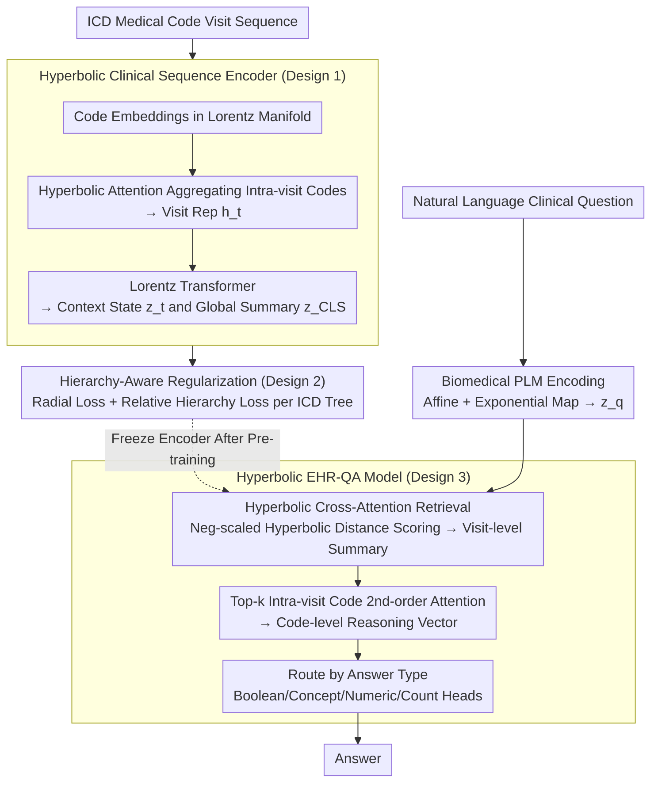

# HypEHR: Hyperbolic Modeling of Electronic Health Records for Efficient Question Answering

**Conference**: ACL 2026 (Findings)  
**arXiv**: [2604.21027](https://arxiv.org/abs/2604.21027)  
**Code**: [https://github.com/yuyuliu11037/HypEHR](https://github.com/yuyuliu11037/HypEHR)  
**Area**: Medical NLP  
**Keywords**: EHR-QA, Hyperbolic Space, Lorentz Model, ICD Hierarchical Modeling, Lightweight Clinical Model

## TL;DR
This paper proposes HypEHR, a Lorentz hyperbolic model with only 22M parameters. It embeds medical codes, visit records, and questions into hyperbolic space and aligns them with the ICD ontology structure via hierarchy-aware regularization, achieving performance close to LLM-based methods on the MIMIC-IV EHR-QA task.

## Background & Motivation

**Background**: Electronic Health Record Question Answering (EHR-QA) aims to answer natural language clinical questions regarding longitudinal patient records. Current methods mainly fall into three categories: EHR representation learning (sequence/graph models), Text-to-SQL semantic parsing, and retrieval-augmented LLM pipelines based on GPT-3.5/4.

**Limitations of Prior Work**: While accurate, these methods incur high computational overhead, are difficult to deploy under strict privacy constraints, and mostly ignore the strong structural priors in EHR data. LLM pipelines with trillions of parameters are challenging to deploy locally within hospitals.

**Key Challenge**: Medical codes and patient trajectories are inherently hierarchical (ICD codes are organized by chapter $\rightarrow$ block $\rightarrow$ category $\rightarrow$ subcategory). Euclidean embeddings distort this tree-like structure, and existing methods fail to fully exploit this geometric prior.

**Goal**: Construct a compact model consistent with the intrinsic geometry of EHRs to achieve comparable performance to LLMs on complex QA tasks with significantly fewer parameters.

**Key Insight**: Hyperbolic space can embed hierarchical structures with arbitrarily low distortion. Previous research has shown that hyperbolic embeddings improve medical code hierarchy modeling, but final patient representations were still modeled in Euclidean space. The authors propose modeling patient-level representations directly in hyperbolic space.

**Core Idea**: Embed ICD codes, visits, and questions using the Lorentz hyperbolic manifold. Use hierarchy-aware regularization to align with the ICD ontology, and answer questions via geometrically consistent cross-attention and type-specific pointer heads.

## Method

### Overall Architecture

HypEHR asks if EHR-QA can be performed effectively using a small model that is geometrically "shaped like an EHR" rather than relying on trillion-parameter LLMs. Its core premise is that since medical codes and patient trajectories are hierarchical trees, modeling the entire process—from encoding and visits to questions—within the Lorentz hyperbolic manifold can minimize distortion. Training occurs in two stages: first, pre-training the patient encoder in hyperbolic space (combining next-visit prediction with hierarchical regularization), then freezing it to train four lightweight QA heads based on answer types (Boolean, Concept, Numeric, Count). The full model has only 22M parameters.

### Key Designs

**1. Hyperbolic Clinical Sequence Encoder: Remaining in Hyperbolic Space to Avoid Structural Loss**

Embedding tree-like ontologies like ICD in Euclidean space leads to exponential branch crowding and loss of hierarchical information. HypEHR embeds each medical code $c$ directly into the Lorentz manifold $\mathbb{H}_L^d$. It uses hyperbolic attention to aggregate codes within a visit into a visit representation $h_t$, then processes the visit sequence using a multi-layer Lorentz Transformer (adapting self-attention, residual connections, and normalization to the Lorentz manifold) to output context states $\{z_t\}_{t=1}^T$ and a global summary $z_{\text{[CLS]}}$. By staying within the manifold throughout, the model naturally preserves the ICD hierarchical structure.

**2. Hierarchy-Aware Regularization: Explicitly Encoding ICD Topology via Geometric Constraints**

Next-visit prediction alone does not force the model to learn parent-child relationships between codes. HypEHR adds two constraints derived from the ICD tree: Radial Hierarchical Loss $\mathcal{L}_{\text{rad}}$, which requires the hyperbolic norm of a parent embedding to be smaller than its children (moving deeper codes further from the origin), and Relative Hierarchical Loss $\mathcal{L}_{\text{rel}}$, a triplet constraint ensuring codes with common ancestors are closer than those without. These are combined into a joint objective:

$$\mathcal{L} = \mathcal{L}_{\text{diag}} + \lambda \mathcal{L}_{\text{hier}}$$

This "depth-radius monotonicity" and "familial proximity" leverage the property where space grows exponentially as one moves away from the origin in hyperbolic space, allowing fine-grained codes to occupy larger representation volumes.

**3. Hyperbolic EHR-QA Model: Geometric Retrieval in Synchronized Space**

With the patient encoder frozen, natural language questions are encoded by a biomedical PLM into Euclidean vectors and projected via affine and exponential maps into the hyperbolic space as $z_q$. Hyperbolic cross-attention retrieval follows, where scores are calculated using negative scaled hyperbolic distance $s_t = -\gamma\, d_{\mathbb{H}}(z_q, z_t)$. A visit-level summary $z_{p|q}^{\text{visit}}$ is aggregated, followed by second-order attention on codes within the top-$k$ visits to generate a code-level reasoning vector $z_{p|q}^{\text{code}}$. Finally, it routes to specific heads. Hyperbolic distance is superior for retrieval here as it naturally separates concepts at different hierarchical depths.

### Loss & Training

Pre-training uses a joint loss of next-visit diagnosis prediction (Binary Cross-Entropy) and hierarchical regularization. In the QA phase, the language and patient encoders are frozen, and only type-specific classification heads are trained using standard cross-entropy. Total parameters: 22M.

## Key Experimental Results

### Main Results

| Model | EHRXQA (Acc%) | MIMIC-Instr (Acc%) |
|------|-------------|-------------------|
| RETAIN | 81.19 ± 1.95 | 65.91 ± 0.84 |
| NeuralSQL (GPT-5.2) | **95.97** ± 0.50 | 75.17 ± 0.73 |
| Llama-3 | 82.88 ± 1.38 | 70.90 ± 0.86 |
| Llemr | 87.25 ± 0.77 | **77.53** ± 0.54 |
| EHRAgent | 93.06 ± 1.09 | 74.16 ± 0.56 |
| **HypEHR (22M)** | 89.53 ± 0.60 | 76.02 ± 0.41 |

### Ablation Study

| Configuration | EHRXQA | MIMIC-Instr |
|------|--------|-------------|
| w/o $\mathcal{L}_{\text{hier}}$ | 82.72 ± 3.41 | 70.38 ± 0.54 |
| w/o pretraining | 74.05 ± 4.76 | 68.12 ± 1.39 |
| EucEHR (Euclidean) | 80.33 ± 1.14 | 69.88 ± 1.07 |
| **HypEHR** | **89.53** ± 0.60 | **76.02** ± 0.41 |

### Key Findings
- Patient encoder pre-training is the most critical component; removing it drops EHRXQA performance by 15.5 percentage points.
- Under the same pre-training setup, the hyperbolic model (HypEHR) outperforms its Euclidean counterpart (EucEHR) by 9.2% on EHRXQA and 6.1% on MIMIC-Instr.
- While hierarchical regularization is not the primary performance driver, it significantly aids in the explicit modeling of code hierarchies.
- Geometric analysis confirms that the Lorentz model's code radius increases monotonically with ICD tree depth, whereas Euclidean norms show only a weak, noisy relationship with depth.

## Highlights & Insights
- Achieving EHR-QA performance near trillion-parameter LLMs with just 22M parameters highlights the power of structural priors (hyperbolic geometry + ICD hierarchy). Trading parameter count for correct inductive biases is crucial for resource-constrained clinical settings.
- The design of radial hierarchical loss is clever: it utilizes the "expanding space" property of hyperbolic manifolds to allow fine-grained codes to occupy larger representation volumes naturally.
- The hyperbolic cross-attention mechanism is transferable to any scenario requiring retrieval or attention over hierarchical structures, such as KG reasoning or taxonomy navigation.

## Limitations & Future Work
- Dependency on pre-processing to classify answers into four fixed formats (Boolean/Concept/Numeric/Count) introduces engineering overhead and lacks support for open-ended generation.
- Computational complexity of hyperbolic neural networks is higher than Euclidean ones, and the lack of mature public libraries can lead to training instability at scale.
- Evaluation is limited to de-identified MIMIC-IV data and lacks validation in real-world clinical deployment.
- The authors emphasize that this should be a decision-support tool under human supervision, not an autonomous clinical agent.

## Related Work & Insights
- **vs NeuralSQL (GPT-5.2)**: NeuralSQL uses GPT-5.2 for SQL generation, reaching 96% on EHRXQA, but relies on massive LLMs and SQL-matched paradigms. HypEHR reaches 89.5% with <1/1000th the parameters without SQL.
- **vs Llemr**: Llemr is an LLM-based EHR-QA baseline reaching 77.5% on MIMIC-Instr. HypEHR matches it at 76% with significantly lower inference costs.
- **vs Lu et al. (2023)**: That work used hyperbolic embeddings for code hierarchies but reverted to Euclidean space for patient representations. HypEHR maintains hyperbolic modeling through to the patient level.

## Rating
- Novelty: ⭐⭐⭐⭐ Extending hyperbolic modeling from codes to patient-level QA is a natural but well-executed progression.
- Experimental Thoroughness: ⭐⭐⭐⭐ Two QA benchmarks, four clinical tasks, detailed ablation, and geometric analysis.
- Writing Quality: ⭐⭐⭐⭐ Clear motivation, though technical details of hyperbolic manifolds might be dense for non-experts.
- Value: ⭐⭐⭐⭐ Provides a lightweight alternative for privacy-sensitive clinical settings; the use of geometric priors is highly generalizable.

<!-- RELATED:START -->

## Related Papers

- [\[AAAI 2026\] CliCARE: Grounding Large Language Models in Clinical Guidelines for Decision Support over Longitudinal Cancer Electronic Health Records](../../AAAI2026/medical_nlp/clicare_grounding_large_language_models_in_clinical_guidelines_for_decision_supp.md)
- [\[ACL 2026\] Empathy Applicability Modeling for General Health Queries](empathy_applicability_modeling_for_general_health_queries.md)
- [\[ACL 2026\] Query Pipeline Optimization for Cancer Patient Question Answering Systems](query_pipeline_optimization_for_cancer_patient_question_answering_systems.md)
- [\[AAAI 2026\] Expert-Guided Prompting and Retrieval-Augmented Generation for Emergency Medical Service Question Answering](../../AAAI2026/medical_nlp/expert-guided_prompting_and_retrieval-augmented_generation_for_emergency_medical.md)
- [\[ACL 2026\] Efficient and Effective Internal Memory Retrieval for LLM-Based Healthcare Prediction](efficient_and_effective_internal_memory_retrieval_for_llm-based_healthcare_predi.md)

<!-- RELATED:END -->
