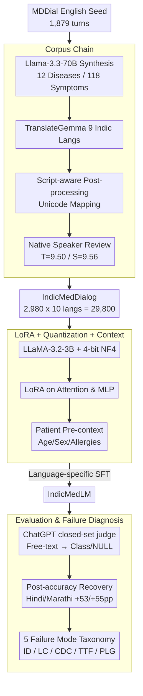

# IndicMedDialog: A Parallel Multi-Turn Medical Dialogue Dataset for Accessible Healthcare in Indic Languages

**Conference**: ACL 2026  
**arXiv**: [2605.13292](https://arxiv.org/abs/2605.13292)  
**Code**: https://github.com/ShubhamKumarNigam/IndicMedDialog (Available)  
**Area**: Medical NLP  
**Keywords**: Indic medical dialogue, parallel multilingual dataset, LoRA fine-tuning, clinical diagnosis, Asha translation quality assurance  

## TL;DR
This paper constructs IndicMedDialog—the first **parallel multi-turn** medical diagnostic dialogue dataset covering English and 9 Indic languages (Assamese / Bengali / Gujarati / Hindi / Marathi / Punjabi / Tamil / Telugu / Urdu), consisting of 2,980 dialogues per language (29,800 instances). The pipeline involves LLaMA-3.3-70B for dialogue synthesis + TranslateGemma for translation + native speaker verification + script-aware post-processing for phonetic/spelling/character spacing correction. Based on 4-bit quantized LLaMA-3.2-3B + LoRA, the authors developed IndicMedLM, which achieves the highest post-processed accuracy in 7/10 languages (including English, Hindi, and Marathi) with a 95.3% medical safety pass rate, while identifying 5 systematic failure modes (ID/LC/CDC/TTF/PLG).

## Background & Motivation

**Background**: Medical dialogue AI has significant potential for symptom assessment and initial diagnostic advice. However, existing systems are mostly single-turn QA and English-centric. Realistic clinical diagnosis requires multi-turn follow-ups to narrow down the differential diagnosis space, yet there are almost no multi-turn medical dialogue datasets accessible for the 1.5 billion Indic language speakers.

**Limitations of Prior Work**: (1) **Single-turn dominance**: Systems like ChatDoctor assume single-turn interactions, failing to simulate the "physician inquiry -> differential diagnosis" process; (2) **Templated datasets**: MDDial provides multi-turn English diagnostic corpora but uses template generation, resulting in weak linguistic diversity; (3) **Multilingual gap**: BiMediX addresses English-Arabic bilingualism, but parallel data for the nine major Indic languages is completely absent; (4) **Naive translation failure**: Off-the-shelf LLM translations for Indic languages frequently exhibit systematic errors in transliteration, lexical accuracy, and character spacing.

**Key Challenge**: Deploying usable medical dialogue AI for low-resource languages requires solving the "triple constraint" of high-quality multi-turn clinical corpora × multilingual parallelism × affordable compute—the former is expensive and involves privacy issues, while the latter two present high technical barriers.

**Goal**: (a) Construct the first 10-language parallel multi-turn medical dialogue corpus via a hybrid pipeline of synthesis + translation + human correction; (b) Train IndicMedLM using 4-bit quantized small models + LoRA for deployment on commodity hardware; (c) Introduce optional patient pre-context (age/sex/allergies) to simulate realistic clinical contexts; (d) Reveal real-world failure modes of Indic medical dialogue through physician evaluation and error taxonomy.

**Key Insight**: Utilize MDDial as a seed corpus → expand dialogue diversity via LLM synthesis → ensure translation reliability via TranslateGemma + native speaker raters + script-aware post-processing → enable deployment via LoRA + quantization.

**Core Idea**: A three-part approach comprising "corpus construction + small model engineering deployment + systematic error diagnosis" to tackle the challenges of low-resource Indic medical NLP.

## Method

### Overall Architecture
The framework is divided into data construction, model training, and error analysis:

1.  **Data Construction**: (i) Llama-3.3-70B-Versatile (via Groq) was used to synthesize 1,101 multi-turn diagnostic dialogues covering 12 diseases / 118 symptoms / 4-8 turns, incorporating non-deterministic patient responses and vague descriptions; these were merged with 1,879 MDDial dialogues for a total of 2,980 instances; (ii) TranslateGemma translated the English version into 9 Indic languages with structured prompts; (iii) Script-aware post-processing mapped phonetic/spelling/spacing errors to the nearest correct forms; (iv) Two native speakers per language independently scored translation quality $T$ and clinical safety $S$ (out of 10), yielding means of $\bar T = 9.50$ and $\bar S = 9.56$.
2.  **Model Training (IndicMedLM)**: LLaMA-3.2-3B-Instruct base model + 4-bit NF4 quantization + LoRA (rank 16, α=16, dropout 0) applied to all attention and MLP projections. Training used AdamW-8bit, $lr=2\times 10^{-4}$, weight decay 0.001, batch size 8, over 300 steps. Conversations follow the ShareGPT format (human/gpt). Optional patient pre-context is prefixed to the dialogue.
3.  **Two-stage Post-processing Evaluation**: Model outputs often wrap correct diagnoses in long explanatory sentences, causing raw accuracy to underestimate true capability. A ChatGPT-based LLM judge was used for "constrained semantic equivalence classification"—given the free-text output and 12 standard disease names, the judge selects from the closed set or returns NULL, avoiding hallucinations while recovering "correct but incorrectly formatted" cases.

### Key Designs

**1. Three-stage corpus chain (Synthesis + Translation + Script-aware Post-processing): Creating 10-language parallel corpora that are semantically consistent and clinically sound.**
The primary obstacle for low-resource Indic languages is that off-the-shelf LLMs often produce strings that look like the target script but are misspelled. By utilizing script-aware post-processing, the pipeline maps distorted Unicode forms back to the nearest correct linguistic representation. Human verification by native speakers ensures the upper bound of quality.

**2. LoRA + 4-bit Quantization + Patient Pre-context: Enabling 3B models to perform personalized inquiry on commodity hardware.**
To address the lack of high-end GPUs in rural clinics, the authors used 4-bit NF4 quantization and LoRA. Applying LoRA to all projections ensures the model adapts both linguistic representation and task knowledge. The patient pre-context allows the model to skip known information (e.g., age, allergies) and focus follow-up questions on differentiating symptoms, mimicking real-world clinical workflows.

**3. Two-stage post-processing + 5 Failure Mode taxonomy: Recovering hidden accuracy and identifying specific failure mechanisms.**
The "Raw vs. Post" evaluation highlights that models often provide correct diagnoses but fail to follow formatting instructions. The 5 Failure Modes (FMs) categorize errors into: FM1 Instruction Drift, FM2 Label Collapse (mapping multiple diseases to one pseudonym), FM3 Cross-Domain Confusion, FM4 Tokenization/Truncation Failure (specific to Punjabi/Telugu), and FM5 Paraphrase-over-Label Generation.

### Loss & Training
Standard causal LM SFT loss; individual language training with identical hyperparameters; inference with temperature=0.1, top-p=0.95, max_new_tokens=128. Evaluation included (i) automated diagnostic accuracy (raw vs. post) and (ii) expert Likert scoring (1-5) and safety checks by three MBBS students (Krippendorff's α=0.81).

## Key Experimental Results

### Main Results

Diagnostic accuracy (%) across 10 languages:

| Language | GEMMA Post | Tiny-AYA Post | LLaMA Base Post | **IndicMedLM Raw** | **IndicMedLM Post** |
| :--- | :--- | :--- | :--- | :--- | :--- |
| English | 45.11 | 13.19 | 15.74 | 80.85 | **80.85** |
| Hindi | 25.10 | 13.19 | 11.06 | 19.15 | **72.76 (+53.6pp)** |
| Marathi | 9.36 | 5.11 | 11.50 | 13.19 | **68.51 (+55.3pp)** |
| Bengali | 19.57 | 5.96 | 11.50 | 25.11 | **58.72** |
| Urdu | 2.12 | 13.61 | 2.55 | 4.26 | **28.51** |
| Gujarati | 18.72 | **37.02** | 18.30 | 18.30 | 19.57 |
| Punjabi | 7.66 | 8.12 | 8.51 | 5.96 | **20.42** |
| Assamese | 7.66 | 8.08 | 3.83 | 5.96 | 5.96 |
| Tamil | 11.91 | 3.83 | 6.80 | 6.38 | 6.80 |
| Telugu | 6.38 | 0.00 | 4.68 | 1.28 | 5.96 |

### Ablation Study / Evaluation (IndicMedLM Performance)

| Metric | IndicMedLM |
| :--- | :--- |
| Medical Safety Pass Rate | **95.3%** |
| Symptom Extraction (1-5) | 4.20 |
| Context Memory (1-5) | 4.40 |
| Diagnostic Correctness (1-5) | 4.10 |
| Conversational Flow (1-5) | 4.30 |
| Inter-annotator Krippendorff α | 0.81 |

### Key Findings
-   **Artificially Low Raw Scores**: Hindi/Marathi raw scores (19%/13%) jump to (73%/69%) after post-processing, suggesting models possess diagnostic knowledge but use idiomatic hedging that breaks exact matching.
-   **Disease Variance**: Performance for "Traumatic Brain Injury" reaches 94.7% in English/Hindi but 0% in Assamese/Tamil/Telugu, indicating high heterogeneity across language-disease pairs.
-   **Tokenizer Gap**: FM4 (Truncation) occurred in Punjabi/Telugu but not Hindi/Marathi, proving the bottleneck is the LLaMA base model's Unicode coverage rather than training data volume.
-   **Bengali Label Collapse**: Five diseases were flattened into "lung infection," reflecting a majority-class bias in semantic hypernyms.

## Highlights & Insights
-   The construction of a **10-language parallel multi-turn corpus** provides immense value to the community, addressing a resource gap for 1.5 billion people.
-   The **5-category FM taxonomy** is the first systematic error diagnosis framework for this field, offering specific prescriptions (e.g., FM4 requires changing the tokenizer, FM1 requires format rewards).
-   The **post-processing recovery** highlights a universal lesson for low-resource NLP: idiomatic hedging in target languages can lead to significant underestimation of model capabilities.
-   The **4-bit + LoRA engineering path** specifically targets deployment in resource-constrained regions, aligning the technical approach with the paper's mission of accessibility.

## Limitations & Future Work
-   Data coverage is limited to 12 diseases and 118 symptoms; the corpus lacks real patient-physician interactions as ground truth.
-   Performance in Assamese, Tamil, Telugu, and Urdu remains low (<10% accuracy), primarily due to base model tokenization and pre-training distribution.
-   Evaluation relies on ChatGPT as a judge, creating a circular dependency on closed-source models.
-   The logic for when to stop inquiry and finalize a diagnosis (termination logic) was not fully explored.

## Related Work & Insights
-   **vs. MDDial**: MDDial is English-template based; this work upgrades it to a diverse, verified, and parallel multilingual corpus.
-   **vs. BiMediX**: Expands multilingual coverage from 2 to 10 languages.
-   **vs. ChatDoctor / AMIE**: While those focus on English or Chinese, this work proves that small models with LoRA/Quantization can achieve usable multi-turn diagnosis in low-resource settings.

## Rating
-   Novelty: ⭐⭐⭐⭐ (First of its kind dataset; engineering-focused but high social impact).
-   Experimental Thoroughness: ⭐⭐⭐⭐ (Comprehensive 10-language analysis and expert evaluation, though some ablations are missing).
-   Writing Quality: ⭐⭐⭐⭐ (Clear structure and well-designed tables).
-   Value: ⭐⭐⭐⭐⭐ (Strong community impact via open-source data and code).

<!-- RELATED:START -->

- (Macherla et al., 2023) MDDial: Multi-turn Differential Diagnosis Dialogue
- (Pieri et al., 2024) BiMediX: Bilingual Medical Mixture of Experts
- (Wang et al., 2024) NoteChat: Leveraging Clinical Notes for Medical Dialogue

<!-- RELATED:END -->

## Related Papers

- [\[ICLR 2026\] ATPO: Adaptive Tree Policy Optimization for Multi-Turn Medical Dialogue](../../ICLR2026/medical_nlp/atpo_adaptive_tree_policy_optimization_for_multi-turn_medical_dialogue.md)
- [\[ACL 2026\] Region-Grounded Report Generation for 3D Medical Imaging: A Fine-Grained Dataset and Graph-Enhanced Framework](region-grounded_report_generation_for_3d_medical_imaging_a_fine-grained_dataset_.md)
- [\[NeurIPS 2025\] Shallow Robustness, Deep Vulnerabilities: Multi-Turn Evaluation of Medical LLMs](../../NeurIPS2025/medical_nlp/shallow_robustness_deep_vulnerabilities_multi-turn_evaluation_of_medical_llms.md)
- [\[ACL 2026\] MARCH: Multi-Agent Radiology Clinical Hierarchy for CT Report Generation](march_multi-agent_radiology_clinical_hierarchy_for_ct_report_generation.md)
- [\[ACL 2025\] VITAL: A New Dataset for Benchmarking Pluralistic Alignment in Healthcare](../../ACL2025/medical_nlp/vital_pluralistic_alignment_healthcare.md)

<!-- RELATED:END -->
