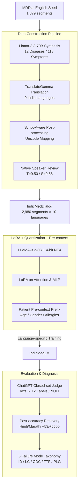

# IndicMedDialog: A Parallel Multi-Turn Medical Dialogue Dataset for Accessible Healthcare in Indic Languages

**Conference**: ACL 2026  
**arXiv**: [2605.13292](https://arxiv.org/abs/2605.13292)  
**Code**: https://github.com/ShubhamKumarNigam/IndicMedDialog (Available)  
**Area**: Medical NLP  
**Keywords**: Indic Medical Dialogue, Parallel Multilingual Dataset, LoRA Fine-tuning, Clinical Diagnosis, Translation Quality Assurance

## TL;DR
This paper constructs IndicMedDialog, the first **parallel multi-turn** medical diagnostic dialogue dataset covering English and 9 Indic languages (Assamese, Bengali, Gujarati, Hindi, Marathi, Punjabi, Tamil, Telugu, and Urdu), totaling 29,800 instances (2,980 dialogues × 10 languages). The dataset was created using LLaMA-3.3-70B for dialogue synthesis, TranslateGemma for translation, native speaker verification, and script-aware post-processing for phonetic/spelling/spacing corrections. Furthermore, IndicMedLM was trained using 4-bit quantized LLaMA-3.2-3B with LoRA, achieving the highest post-processed accuracy in 7 out of 10 languages and a 95.3% medical safety pass rate, while identifying 5 systematic failure modes (ID/LC/CDC/TTF/PLG).

## Background & Motivation

**Background**: Medical dialogue AI holds significant potential for symptom assessment and initial diagnostic advice. However, existing systems are predominantly single-turn QA and English-centric. Realistic clinical diagnosis requires multi-turn follow-ups to narrow down differential diagnoses, yet multi-turn medical dialogue data for the 1.5 billion speakers of Indic languages is nearly non-existent.

**Limitations of Prior Work**: (1) **Single-turn dominance**: Systems like ChatDoctor assume single-turn interactions, failing to simulate the "doctor-led inquiry → differential diagnosis" process. (2) **Templated datasets**: MDDial provides multi-turn English diagnostic corpora but relies on template generation, leading to weak linguistic diversity. (3) **Multilingual gap**: While BiMediX addressed English-Arabic bilingualism, parallel data for the major Indic languages is completely lacking. (4) **Simple translation failure**: Off-the-shelf LLM translations for Indic languages suffer from systematic errors such as transliteration confusion, lexical inaccuracy, and script spacing issues.

**Key Challenge**: To deploy usable medical dialogue AI in low-resource languages, one must resolve the "trilemma" of high-quality multi-turn clinical corpora, multilingual parallelism, and affordable computational costs—since the former is expensive and privacy-sensitive, while the latter two have high technical barriers.

**Goal**: (a) Construct the first 10-language parallel multi-turn medical dialogue corpus using a hybrid pipeline of synthesis, translation, and manual verification; (b) Train IndicMedLM using 4-bit quantized small models with LoRA for deployment on commodity hardware; (c) Introduce optional patient pre-context (age, gender, allergy history, etc.) to simulate realistic clinical contexts; (d) Reveal true failure modes of Indic medical dialogues through physician evaluation and error taxonomy.

**Key Insight**: Utilize MDDial as a seed corpus → expand dialogue diversity via LLM synthesis → ensure translation reliability through TranslateGemma, native speaker rating, and script-aware post-processing → enable deployment via LoRA and quantization.

**Core Idea**: A three-pronged approach—corpus construction, small-model engineering for deployment, and systematic error diagnosis—to address the challenges of low-resource Indic medical NLP.

## Method

### Overall Architecture
The framework is divided into data construction, model training, and error analysis:

1. **Detailed Data Construction**: (i) Llama-3.3-70B-Versatile (via Groq) was used to synthesize 1,101 multi-turn diagnostic dialogues covering 12 diseases, 118 symptoms, and 4-8 turns, incorporating non-deterministic patient responses and vague descriptions; these were merged with 1,879 segments from MDDial to reach 2,980 dialogues. (ii) TranslateGemma translated the English version into 9 Indic languages using structured prompts to preserve clinical semantics. (iii) Script-aware post-processing mapped phonetic/spelling errors to the nearest correct script forms. (iv) Two native speakers per language independently rated quality (Translation $T$, Safety $S$ out of 10), yielding means $\bar T = 9.50$ and $\bar S = 9.56$.
2. **Model Training (IndicMedLM)**: The base model was LLaMA-3.2-3B-Instruct with 4-bit NF4 quantization and LoRA (rank 16, α=16). LoRA was applied to all attention and MLP projections. Training used AdamW-8bit, lr=$2\times 10^{-4}$, bsz=8, and 300 steps. Each language was trained individually using ShareGPT-style formatting. Optional patient pre-context was prefixed to dialogues to allow personalized questioning based on age/gender.
3. **Two-Stage Post-processing Evaluation**: Since models often wrap correct diagnoses in long explanatory sentences, raw accuracy underestimates performance. A ChatGPT-based LLM judge was used for "restricted semantic equivalence classification"—given free-text output and 12 standard labels, the judge chooses one or returns NULL, recovering cases where the diagnosis was correct but the format was not.

### Key Designs

**1. Synthesis-Translation-Postprocessing Pipeline: Generating semantically consistent, clinically sound, and linguistically accurate parallel corpora across 10 languages without existing clinical data.**

The primary obstacle for low-resource Indic languages is that off-the-shelf LLMs often output strings that look like a specific script (e.g., Bengali) but are phonetically or orthographically incorrect. This study first synthesized English dialogues under a schema of 12 diseases and 118 symptoms. After translation, **script-aware post-processing** used Unicode rules to map malformed scripts back to their nearest correct forms, providing more stability than LLM-based polishing.

**2. LoRA + 4-bit Quantization + Patient Pre-context: Enabling 3B-scale models to perform personalized diagnostics on commodity hardware.**

The bottleneck for medical AI deployment is often compute, especially in rural clinics. By selecting LLaMA-3.2-3B and applying 4-bit NF4 quantization, the memory footprint was reduced to levels acceptable for consumer GPUs. LoRA was applied to all projections (Attention + MLP) to ensure both linguistic representation and task knowledge were tuned. The inclusion of **patient pre-context** (age, gender, allergies) allows the model to skip known information and focus follow-up questions on differentiating symptoms, mimicking real clinical workflows.

**3. Two-Stage Evaluation + 5-class Failure Mode Taxonomy: Recovering correct but poorly formatted predictions while defining localizable failure mechanisms.**

Raw accuracy significantly underestimates true diagnostic capability, as models often output "hedging" sentences in Indic languages (e.g., Hindi/Marathi raw accuracy was only 19%/13%, while post-processed accuracy jumped to 73%/69%). The first stage uses an LLM judge for closed-set mapping. The second stage categorizes failures into 5 modes: FM1 Instruction Drift (missing labels), FM2 Label Collapse (multiple diseases mapped to one label), FM3 Cross-Domain Confusion, FM4 Tokenization/Truncation Failure (specific to languages like Punjabi/Telugu), and FM5 Paraphrase-over-Label Generation.

### Loss & Training
Standard causal LM SFT loss was used. Hyperparameters included temperature=0.1, top-p=0.95, and max_new_tokens=128. Evaluation involved automated accuracy (raw vs. post) and a 1-5 Likert scale assessment by three MBBS doctors, achieving a Krippendorff's α of 0.81.

## Key Experimental Results

### Main Results

Diagnostic Accuracy (%) across 10 languages (Raw vs. Post-processed):

| Language | GEMMA Post | Tiny-AYA Post | LLaMA Base Post | **IndicMedLM Raw** | **IndicMedLM Post** |
| :--- | :--- | :--- | :--- | :--- | :--- |
| English | 45.11 | 13.19 | 15.74 | 80.85 | **80.85** |
| Hindi | 25.10 | 13.19 | 11.06 | 19.15 | **72.76 (+53.6pp)** |
| Marathi | 9.36 | 5.11 | 11.50 | 13.19 | **68.51 (+55.3pp)** |
| Bengali | 19.57 | 5.96 | 11.50 | 25.11 | **58.72** |
| Urdu | 2.12 | 13.61 | 2.55 | 4.26 | **28.51** |
| Gujarati | 18.72 | **37.02** | 18.30 | 18.30 | 19.57 |
| Punjabi | 7.66 | 8.12 | 8.51 | 5.96 | **20.42** |
| Assamese | 7.66 | 8.08 | 3.83 | 5.96 | 5.96 |
| Tamil | 11.91 | 3.83 | 6.80 | 6.38 | 6.80 |
| Telugu | 6.38 | 0.00 | 4.68 | 1.28 | 5.96 |

### Ablation / Expert Evaluation (IndicMedLM Performance)

| Metric | IndicMedLM |
| :--- | :--- |
| Medical Safety Pass Rate | **95.3%** |
| Symptom Extraction (1-5) | 4.20 |
| Context Memory (1-5) | 4.40 |
| Diagnostic Correctness (1-5) | 4.10 |
| Conversational Flow (1-5) | 4.30 |
| Inter-annotator Krippendorff α | 0.81 |

### Key Findings
- **Pseudo-low scores in Hindi/Marathi**: The jump from 19%/13% (raw) to 73%/69% (post) indicates the model possesses diagnostic knowledge but prefers idiomatic hedging in these scripts, highlighting the necessity of semantic-equivalence-based evaluation.
- **Disease-level Variance**: Accuracy for Traumatic Brain Injury was 94.7% in English/Hindi but 0% in Assamese/Tamil/Telugu, suggesting risk assessment must be performed at the (language, disease) pair level.
- **Tokenizer Gap**: FM4 (Truncation) occurred in Punjabi/Telugu but not in Devanagari scripts (Hindi/Marathi), proving the bottleneck is the LLaMA base model’s Unicode coverage rather than data volume.
- **95.3% Safety Pass**: Physician evaluation confirms that the synthesis + LoRA route significantly mitigates clinical safety risks.

## Highlights & Insights
- **Dataset Value**: Fills a resource gap for 1.5 billion people. The script-aware post-processing pipeline is a reusable contribution for future Indic NLP tasks.
- **FM Taxonomy**: Provides a systematic framework for "diagnosing diagnostic errors," translating vague performance issues into specific engineering prescriptions (e.g., FM4 suggests replacing the tokenizer).
- **Metric Artifacts**: Demonstrates that for low-resource languages, idiomatic usage can severely penalize models under string-matching metrics.
- **Clinical Realism**: The inclusion of patient pre-context is a simple but effective step toward realistic clinical workflows.

## Limitations & Future Work
- **Domain Coverage**: Limited to 12 diseases and 118 symptoms; lacks real patient-doctor interaction data for ground truth validation.
- **Failure in Specific Languages**: Assamese, Tamil, Telugu, and Urdu results remain poor (<10%), likely requiring base models optimized for Indic scripts (e.g., Sarvam-1).
- **Evaluation Bias**: Dependence on ChatGPT as a judge creates a circular evaluation loop.

## Related Work & Insights
- **vs. MDDial**: Expands from English-only templates to synthesized, verified 10-language parallel corpora.
- **vs. BiMediX**: Increases the language count from 2 to 10, focusing on the highly underserved Indic region.
- **vs. Engineering Baselines**: Demonstrates that "Small Model + LoRA + Quantization + Synthetic Data" is a viable path for specialized diagnostic AI in low-resource settings.

## Rating
- Novelty: ⭐⭐⭐⭐ (First parallel dataset of its kind; innovative error taxonomy).
- Experimental Thoroughness: ⭐⭐⭐⭐ (Cross-language analysis, expert evaluation, and systematic FM study; lacks some component-wise ablation).
- Writing Quality: ⭐⭐⭐⭐ (Clear structure and well-organized tables).
- Value: ⭐⭐⭐⭐⭐ (Strong social impact for underserved regions; open-source data and code).

<!-- RELATED:START -->

## Related Papers

- [\[ICLR 2026\] ATPO: Adaptive Tree Policy Optimization for Multi-Turn Medical Dialogue](../../ICLR2026/medical_nlp/atpo_adaptive_tree_policy_optimization_for_multi-turn_medical_dialogue.md)
- [\[ACL 2026\] Region-Grounded Report Generation for 3D Medical Imaging: A Fine-Grained Dataset and Graph-Enhanced Framework](region-grounded_report_generation_for_3d_medical_imaging_a_fine-grained_dataset_.md)
- [\[NeurIPS 2025\] Shallow Robustness, Deep Vulnerabilities: Multi-Turn Evaluation of Medical LLMs](../../NeurIPS2025/medical_nlp/shallow_robustness_deep_vulnerabilities_multi-turn_evaluation_of_medical_llms.md)
- [\[ACL 2026\] MARCH: Multi-Agent Radiology Clinical Hierarchy for CT Report Generation](march_multi-agent_radiology_clinical_hierarchy_for_ct_report_generation.md)
- [\[ACL 2026\] BioHiCL: Hierarchical Multi-Label Contrastive Learning for Biomedical Retrieval with MeSH Labels](biohicl_hierarchical_multi-label_contrastive_learning_for_biomedical_retrieval_w.md)

<!-- RELATED:END -->
