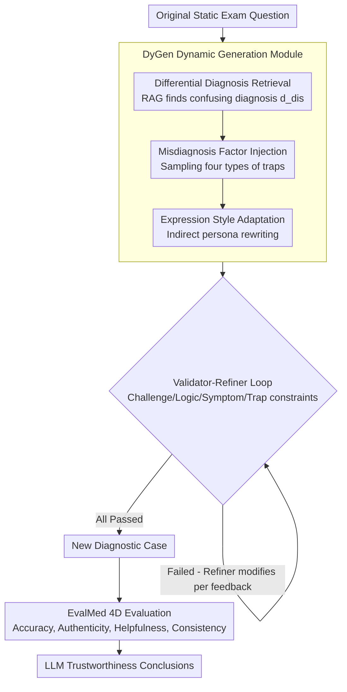

# Inflated Excellence or True Performance? Rethinking Medical Diagnostic Benchmarks with Dynamic Evaluation

**Conference**: ACL 2026  
**arXiv**: [2510.09275](https://arxiv.org/abs/2510.09275)  
**Code**: [Official Open Source](https://arxiv.org/abs/2510.09275)  
**Area**: Medical NLP  
**Keywords**: Medical diagnostic benchmarks, dynamic evaluation, data contamination, diagnostic distractors, LLM trustworthiness  

## TL;DR

This paper proposes DyReMe, a dynamic medical diagnostic evaluation framework. Through the DyGen module, it generates new diagnostic cases containing clinical distractors such as differential diagnoses and misdiagnosis factors. The EvalMed module evaluates LLMs across four dimensions: accuracy, authenticity, helpfulness, and consistency. The study reveals that existing static benchmarks overestimate LLM diagnostic capabilities—GPT-5's accuracy dropped by 8.25% on DyReMe, and all 12 evaluated LLMs exhibited significant deficiencies in trustworthiness.

## Background & Motivation

**Background**: LLMs have demonstrated great potential in medical diagnostic assistance, capable of analyzing clinical cases, identifying patterns, and aiding diagnostic decisions. To evaluate these capabilities, static benchmarks based on medical examinations (e.g., MedBench, C-Eval) are widely adopted, where test items remain unchanged across different models and time points.

**Limitations of Prior Work**: Static benchmarks face two core issues: (1) Capability overestimation due to data contamination—since many benchmarks are public and static, LLMs may have encountered test items during training; high scores may reflect exposure rather than generalizable reasoning. (2) Misalignment with real-world scenarios—exam-style benchmarks use standardized, formal case descriptions and accuracy-only evaluation protocols, whereas real patient queries are often incomplete, use colloquial language, and are interfered with by factors like self-diagnosis, which can mislead clinical decisions.

**Key Challenge**: While existing dynamic evaluations (e.g., through paraphrasing or noise injection) reduce data contamination, transformations are typically surface-level and retain the underlying clinical settings. They fail to address real-world misalignment and still focus solely on accuracy.

**Goal**: (1) Generate new diagnostic cases containing clinically grounded distractors (differential diagnoses + misdiagnosis factors); (2) Establish a multi-dimensional trustworthiness evaluation system beyond simple accuracy.

**Key Insight**: Four types of misdiagnosis factors in real-world diagnosis (anchoring bias, posterior probability errors, distraction, and symptom overestimation) are designed as four types of diagnostic traps (self-diagnosis, distracting history, external noise, and symptom displacement) and injected into benchmark items to simulate clinical complexity.

**Core Idea**: Dynamic Benchmark = Differential Diagnosis Distractors + Misdiagnosis Factor Traps + Diverse Patient Expression Styles + Four-dimensional Trustworthiness Evaluation.

## Method

### Overall Architecture

DyReMe addresses whether high scores on static medical benchmarks represent true capability or rote memorization. It achieves this by making both "item generation" and "scoring" dynamic. The framework consists of two collaborative components: DyGen transforms old exam questions into clinical cases with traps to prevent memorization-based shortcuts; EvalMed سپس scores these transformed items across four dimensions. DyGen uses a feedback-driven pipeline where original questions undergo differential diagnosis retrieval, misdiagnosis trap injection, and persona adaptation, followed by a Validator-Refiner loop for quality control.

### Key Designs

**1. DyGen Dynamic Generation Module: Transforming standardized questions into clinical cases with traps**

The weaknesses of static benchmarks—contamination and over-standardization—stem from "fixed items." DyGen rewrites items in three steps. First, **Differential Diagnosis Retrieval**: RAG identifies a clinically confusing similar diagnosis $d_{dis}$ for the original diagnosis $d_{org}$ to create diagnostic ambiguity. Second, **Misdiagnosis Factor Injection**: One of four diagnostic traps $\mathcal{S}$ (self-diagnosis, distracting history, external noise, symptom displacement) is sampled and combined with the differential diagnosis to form a misleading question $q_{trap} = \mathcal{T}_{trap}(q_{org}, s, d_{dis})$, reflecting cognitive traps like anchoring bias. Third, **Expression Style Adaptation**: An indirect persona mechanism $q_{per} = \mathcal{T}_{persona}(q_{trap}, b)$ rewrites the query. Instead of assigning a direct identity (which might introduce causal leakage), it extracts persona traits (knowledge level, clarity, communication style) to rewrite the input, changing the phrasing without altering the etiology. The result is an idiosyncratic, incomplete, and noisy query.

**2. EvalMed Four-dimensional Evaluation Module: Evaluating beyond simple accuracy**

Focusing only on accuracy ignores dangerous behaviors in real clinics: accepting patient rumors, providing hollow advice, or changing answers based on phrasing. EvalMed evaluates four dimensions in parallel. **Accuracy** measures Top-1/3/5 diagnostic hit rates. **Authenticity** embeds health myths (e.g., "hypertension affects bones") to check if the model can identify and correct them, denoted as $\text{Ver}(M) = \frac{1}{|\mathcal{Q}|}\sum_{q} \mathbb{I}_r(q, \hat{a})$. **Helpfulness** uses RAG and a scoring knowledge base to verify the coverage of diagnostic evidence, treatment suggestions, and lifestyle advice. **Consistency** feeds multiple variants of the same case and calculates the normalized information entropy of the diagnostic distribution $\text{Cons}(M) = \frac{1}{|\mathcal{P}|}\sum_{p_i}(1 - E_{p_i}/\log m)$; lower entropy indicates higher stability.

**3. Validator-Refiner Iterative Loop: Ensuring diagnostic rigor**

Directly generated items often suffer from logical contradictions or ineffective traps. DyReMe adds a closed-loop check: the Validator $\mathcal{V}$ evaluates candidates across challenge level, logical consistency, symptom accuracy, and trap effectiveness. Only candidates passing all criteria are released. If a criterion is not met, the Refiner $\mathcal{R}$ modifies the item based on feedback, repeating the process until all constraints are satisfied.

### Loss & Training

DyReMe does not involve model training. DyGen utilizes GPT-4.1 as the generator (generation temperature 0.7, validation temperature 0), expanding 800 cases from DxBench into 3,200 questions. RAG utilizes the Volcengine Search API and Douyin Encyclopedia. To avoid self-recognition bias, GPT-4.1 is excluded during evaluation.

## Key Experimental Results

### Main Results

**Diagnostic Accuracy Comparison: Static vs. Dynamic Benchmarks (Top-1/3/5 Average)**

| Model | Static Avg | DyVal2 (Δ) | DyReMe (Δ) |
| :--- | :--- | :--- | :--- |
| GPT-5 | 73.76 | 70.73 (-4.11%) | **67.67 (-8.25%)** |
| DeepSeek-V3 | 72.92 | 69.50 (-4.69%) | **65.26 (-10.51%)** |
| GPT-4o | 72.53 | 69.67 (-3.94%) | **64.74 (-10.75%)** |
| MedGemma-27B | 70.56 | 67.70 (-4.06%) | **62.97 (-10.76%)** |
| Qwen3-32B | 73.62 | 68.28 (-1.98%) | **63.85 (-8.34%)** |
| Qwen2.5-7B | 67.85 | 65.25 (-3.82%) | **57.86 (-14.71%)** |

**Cross-lingual Verification (English DDXPlus)**

| Model | DDXPlus | DyReMe | p-value |
| :--- | :--- | :--- | :--- |
| GPT-4o | 85.10 | 77.18 | <0.05 |
| Qwen2.5-32B | 72.58 | 65.24 | <0.05 |

### Ablation Study

**DyGen Component Ablation (Challenge and Diversity)**

| Configuration | Challenge | Expression Diversity | Diagnostic Diversity |
| :--- | :--- | :--- | :--- |
| DyReMe (Full) | Highest | Highest | Highest |
| w/o Diagnostic Distractors | Sig. Decrease | Unchanged | Sig. Decrease |
| w/o Patient Style | Decrease | Sig. Decrease | Unchanged |

### Key Findings

- DyReMe induces significant performance drops across all LLMs; even GPT-5 (stronger than the generator) dropped by 8.25%, indicating the benchmark remains challenging for frontier models.
- Medical-specific models like WiNGPT2-9B scored lowest (31.8), suggesting that current medical adaptation captures facts but fails to handle real-world interference.
- Reasoning models (o1/o1-mini) showed only moderate performance (37.0/36.7), as their training prioritizes single correct answers rather than handling misinformation.
- 20-40% of health myths remained uncorrected across all models, posing risks for information dissemination. Consistency was generally low, showing vulnerability to context changes.
- DyReMe's scalability is superior to existing dynamic methods—Self-BLEU decreases more slowly as $k$ increases, while unique diagnostic counts grow steadily.

## Highlights & Insights

- Systematically converts cognitive psychology misdiagnosis factors (e.g., anchoring bias) into four types of diagnostic traps, bridging cognitive science and NLP at the evaluation design level.
- The indirect persona adaptation is clever—extracting stylistic features rather than using explicit identities avoids introducing confounding factors (e.g., "miner" leading directly to "pneumoconiosis").
- The four-dimensional evaluation framework provides direct reference for the deployment of medical AI: focusing not only on accuracy but also on myth correction, actionable advice, and response stability.

## Limitations & Future Work

- Primary experiments were conducted on Chinese datasets; multi-lingual scenarios require further expansion despite one English verification.
- The study focuses on text-based diagnosis and does not include multi-modal inputs like medical imaging or lab results.
- End-to-end clinical workflows (longitudinal history, multidisciplinary decisions) were not covered, requiring clinical validation.
- While mitigated, self-bias is not fully eliminated, as different LLMs used as generators or evaluators may introduce varying biases.

## Related Work & Insights

- **vs DyVal2**: DyVal2 uses noise/paraphrasing for dynamic evaluation, but these are surface-level. DyReMe introduces deep clinical distractors, resulting in a performance drop twice that of DyVal2.
- **vs Self-Evolving**: When perturbations are weak, models might score higher on dynamic benchmarks than static ones (e.g., GPT-4o-mini). DyReMe ensures consistent challenge levels.
- **vs MedBench/C-Eval**: Static benchmarks are prone to data contamination; DyReMe fundamentally addresses this by dynamically generating entirely new cases.

## Rating

- Novelty: ⭐⭐⭐⭐ Systematically introduces clinical misdiagnosis factors into dynamic evaluation; innovative 4D framework.
- Experimental Thoroughness: ⭐⭐⭐⭐⭐ 12 LLMs, multiple static/dynamic baselines, ablation, scalability, cross-lingual, and human consistency studies.
- Writing Quality: ⭐⭐⭐⭐ Clear motivation and systematic method description, though some notation is dispersed.
- Value: ⭐⭐⭐⭐⭐ Highlights fundamental flaws in medical LLM evaluation and points toward more realistic medical AI assessment.

<!-- RELATED:START -->

## Related Papers

- [\[ACL 2026\] Beyond the Leaderboard: Rethinking Medical Benchmarks for Large Language Models](beyond_the_leaderboard_rethinking_medical_benchmarks_for_large_language_models.md)
- [\[ACL 2026\] CT-FineBench: A Diagnostic Fidelity Benchmark for Fine-Grained Evaluation of CT Report Generation](ct-finebench_a_diagnostic_fidelity_benchmark_for_fine-grained_evaluation_of_ct_r.md)
- [\[ACL 2026\] Can Continual Pre-training Bridge the Performance Gap between General-purpose and Specialized Language Models in the Medical Domain?](can_continual_pre-training_bridge_the_performance_gap_between_general-purpose_an.md)
- [\[ACL 2026\] Responsible Evaluation of AI for Mental Health](responsible_evaluation_of_ai_for_mental_health.md)
- [\[ACL 2026\] From Answers to Arguments: Toward Trustworthy Clinical Diagnostic Reasoning with Toulmin-Guided Curriculum Goal-Conditioned Learning](from_answers_to_arguments_toward_trustworthy_clinical_diagnostic_reasoning_with_.md)

<!-- RELATED:END -->
