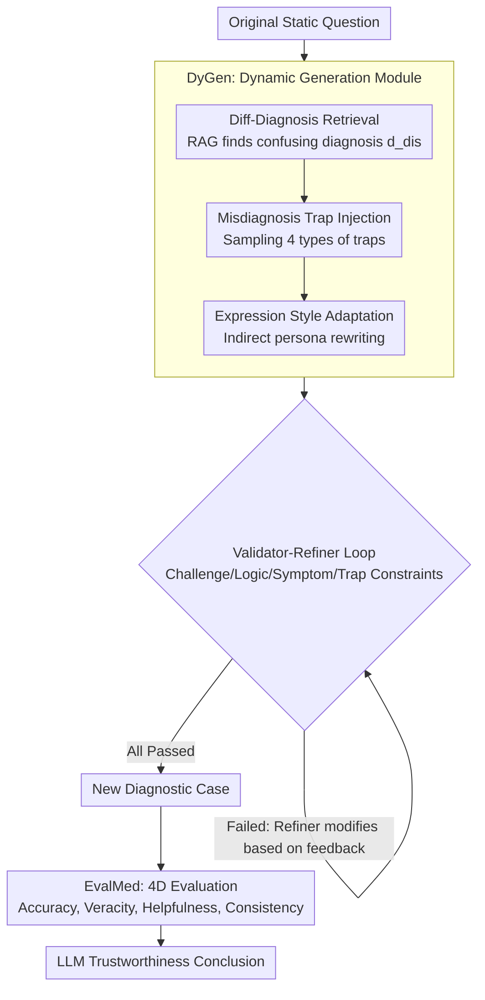

# Inflated Excellence or True Performance? Rethinking Medical Diagnostic Benchmarks with Dynamic Evaluation

**Conference**: ACL 2026  
**arXiv**: [2510.09275](https://arxiv.org/abs/2510.09275)  
**Code**: [Official Open Source](https://arxiv.org/abs/2510.09275)  
**Area**: Medical NLP  
**Keywords**: Medical Diagnostic Benchmarks, Dynamic Evaluation, Data Contamination, Diagnostic Distractors, LLM Trustworthiness

## TL;DR

This paper proposes DyReMe, a dynamic medical diagnostic evaluation framework. It utilizes the DyGen module to generate brand-new diagnostic cases incorporating clinical distractors such as differential diagnoses and misdiagnosis factors. Through the EvalMed module, LLMs are evaluated across four dimensions—Accuracy, Veracity, Helpfulness, and Consistency—revealing that existing static benchmarks overestimate the diagnostic capabilities of LLMs. For instance, GPT-5's accuracy dropped by 8.25% on DyReMe, and 12 LLMs all exhibited significant deficiencies in trustworthiness.

## Background & Motivation

**Background**: LLMs have demonstrated great potential in medical diagnostic assistance, capable of analyzing clinical cases, identifying patterns, and aiding diagnostic decisions. To evaluate these capabilities, static benchmarks based on medical examinations (e.g., MedBench, C-Eval) are widely adopted, where test questions remain unchanged across different models and time points.

**Limitations of Prior Work**: Static benchmarks suffer from two core issues: (1) Capability overestimation due to data contamination—since many benchmarks are public and static, LLMs may encounter test questions during training, meaning high scores may reflect exposure rather than generalizable reasoning; (2) Misalignment with real-world scenarios—exam-style benchmarks use standardized, formal case descriptions and evaluation protocols focused solely on accuracy, whereas real patient queries are often incomplete, use colloquial language, and are interfered with by factors like self-diagnosis, which can mislead clinical decisions.

**Key Challenge**: While existing dynamic evaluations (e.g., through paraphrasing or noise injection) reduce data contamination, the transformations are typically surface-level, retaining the underlying clinical setting. They fail to address the misalignment with real-world complexities and still focus primarily on accuracy.

**Goal**: (1) Generate novel diagnostic cases containing clinically grounded distractors (differential diagnosis + misdiagnosis factors); (2) Establish a multi-dimensional trustworthiness evaluation system beyond simple accuracy.

**Key Insight**: Four types of misdiagnosis factors in real diagnosis (anchoring bias, posterior probability error, distraction, and symptom overestimation) are designed as four categories of diagnostic traps (self-diagnosis, interfering history, external noise, and symptom displacement), which are injected into benchmark questions to simulate clinical complexity.

**Core Idea**: Dynamic Benchmark = Differential Diagnosis Distractors + Misdiagnosis Factor Traps + Diverse Patient Expression Styles + Four-Dimensional Trustworthiness Evaluation.

## Method

### Overall Architecture

DyReMe aims to answer whether high scores on static medical benchmarks represent true capability or mere memorization. Its solution is making both "question generation" and "scoring" dynamic. The framework consists of two collaborative parts: DyGen is responsible for transforming an old exam question into a brand-new clinical case with traps to prevent models from relying on memory; EvalMed then scores these transformed questions across four dimensions, moving beyond "is it correct?". DyGen functions as a feedback-driven pipeline—original questions first undergo differential diagnosis retrieval, followed by the injection of misdiagnosis traps, and finally, a rewriting of expression styles, all while passing through a Generator-Validator loop until constraints are met.

### Key Designs

**1. DyGen Dynamic Generation Module: Transforming standardized questions into clinical trap-laden cases**

The two main weaknesses of static benchmarks—surface-level contamination and overly standardized descriptions—stem from fixed questions. DyGen rewrites questions in three steps. First, **Differential Diagnosis Retrieval**: RAG is used to find a clinically confusing similar diagnosis $d_{dis}$ for the original diagnosis $d_{org}$ (e.g., pairing "Adrenal Adenoma" with "Pheochromocytoma") to create ambiguity. Second, **Misdiagnosis Factor Injection**: One of four diagnostic traps $\mathcal{S}$ (Self-diagnosis, Interfering History, External Noise, Symptom Displacement) is sampled and combined with the differential diagnosis to form a misleading question $q_{trap} = \mathcal{T}_{trap}(q_{org}, s, d_{dis})$, corresponding to cognitive traps like anchoring bias. Third, **Expression Style Adaptation**: Using an indirect persona mechanism $q_{per} = \mathcal{T}_{persona}(q_{trap}, b)$ to rewrite the query. Instead of direct persona adoption (which might introduce causal leakage like "miner → pneumoconiosis"), it extracts the persona's linguistic features (knowledge level, clarity, communication style) to rewrite the question, changing the phrasing without altering the etiology.

**2. EvalMed Four-Dimensional Evaluation Module: Evaluating trustworthiness beyond accuracy**

Focusing only on accuracy overlooks dangerous LLM behaviors in real clinics: accepting patient rumors at face value, providing empty/useless advice, or changing answers when a question is phrased differently. EvalMed measures four dimensions in parallel. **Accuracy** measures the traditional Top-1/3/5 diagnostic hit rate. **Veracity** specifically embeds health rumors (e.g., "hypertension affects bones") to see if the model corrects them, calculated as $\text{Ver}(M) = \frac{1}{|\mathcal{Q}|}\sum_{q} \mathbb{I}_r(q, \hat{a})$. **Helpfulness** refers to real medical platform standards, checking the coverage of diagnostic reasoning, treatment suggestions, and lifestyle advice via a RAG-based knowledge base. **Consistency** feeds multiple variations of the same case into the model to calculate the normalized information entropy of the diagnostic distribution $\text{Cons}(M) = \frac{1}{|\mathcal{P}|}\sum_{p_i}(1 - E_{p_i}/\log m)$; lower entropy indicates higher stability across expressions.

**3. Validator-Refiner Iterative Loop: Ensuring generated questions are both challenging and valid**

Direct generation often results in logical contradictions or poorly designed traps (e.g., symptoms not matching the disease). DyReMe adds a closed-loop check: a **Validator** $\mathcal{V}$ evaluates candidate questions across four dimensions: Challenge, Logical Consistency, Symptom Accuracy, and Trap Effectiveness. Only those passing all checks are released; otherwise, a **Refiner** $\mathcal{R}$ modifies the question based on feedback and returns it to the Validator. This cycle ensures dynamic questions become harder without becoming "noisy."

### Loss & Training

DyReMe does not involve model training. DyGen uses GPT-4.1 as the generator (generation temperature 0.7, validation temperature 0), expanding 800 cases from DxBench into 3200 questions. RAG utilizes the Volcano Engine search API and Douyin Encyclopedia. To avoid self-recognition bias, GPT-4.1 is excluded from the evaluation models to ensure it does not "recognize its own questions."

## Key Experimental Results

### Main Results

**Diagnostic Accuracy Comparison: Static vs. Dynamic Benchmarks (Avg. Top-1/3/5)**

| Model | Static Avg | DyVal2 (Δ) | DyReMe (Δ) |
|------|---------|-----------|-----------|
| GPT-5 | 73.76 | 70.73 (-4.11%) | **67.67 (-8.25%)** |
| DeepSeek-V3 | 72.92 | 69.50 (-4.69%) | **65.26 (-10.51%)** |
| GPT-4o | 72.53 | 69.67 (-3.94%) | **64.74 (-10.75%)** |
| MedGemma-27B | 70.56 | 67.70 (-4.06%) | **62.97 (-10.76%)** |
| Qwen3-32B | 73.62 | 68.28 (-1.98%) | **63.85 (-8.34%)** |
| Qwen2.5-7B | 67.85 | 65.25 (-3.82%) | **57.86 (-14.71%)** |

**Cross-Lingual Validation (English DDXPlus)**

| Model | DDXPlus | DyReMe | p-value |
|------|---------|--------|-----|
| GPT-4o | 85.10 | 77.18 | <0.05 |
| Qwen2.5-32B | 72.58 | 65.24 | <0.05 |

### Ablation Study

**Ablation of DyGen Components (Challenge & Diversity)**

| Configuration | Challenge | Expression Diversity | Diagnostic Diversity |
|------|-------|----------|----------|
| DyReMe (Full) | Highest | Highest | Highest |
| w/o Diagnostic Distractors | Sig. Decrease | Unchanged | Sig. Decrease |
| w/o Patient Expression Style | Decrease | Sig. Decrease | Unchanged |

### Key Findings

- DyReMe induces a larger performance drop across all LLMs; even GPT-5 (stronger than the generator GPT-4.1) dropped by 8.25%, indicating the benchmark remains challenging for frontier models.
- The medical-specific model WiNGPT2-9B scored the lowest (31.8), suggesting current medical adaptation may capture medical facts but fails to handle real-world distractors and diverse expressions.
- Reasoning models (o1/o1-mini) showed only mediocre performance (37.0/36.7), as their training prioritizes single correct answers over debunking rumors or providing actionable information.
- 20-40% of health rumors remained uncorrected across all models, posing risks for information dissemination; consistency was generally low, showing vulnerability to input context changes.
- DyReMe's scalability is superior to existing dynamic methods—as $k$ increases, Self-BLEU drops more slowly while the number of unique diagnoses continues to grow.

## Highlights & Insights

- Systematically transforms misdiagnosis factors from cognitive psychology (e.g., anchoring bias) into four types of diagnostic traps, bridging cognitive science and NLP at the evaluation design level.
- The design of indirect persona adaptation is clever—extracting stylistic features rather than using explicit identities avoids the introduction of confounders like "miner → pneumoconiosis."
- The 4D evaluation system has direct reference value for the actual deployment of medical AI: it's not just about "being right," but also "correcting rumors," "providing useful advice," and "remaining stable."

## Limitations & Future Work

- Main experiments were conducted on Chinese datasets with only one English cross-lingual validation; further expansion to multilingual scenarios is needed.
- Focuses primarily on text-based diagnosis and does not include multimodal inputs like medical imaging or laboratory tests.
- Does not cover end-to-end clinical workflows (longitudinal history, multi-disciplinary decision-making), which requires clinical trials for validation.
- While mitigated, self-bias is not entirely eliminated; using different LLMs as generators and evaluators might still introduce varied biases.

## Related Work & Insights

- **vs DyVal2**: DyVal2 uses noise/paraphrasing for dynamic evaluation, but the transformations are surface-level. DyReMe introduces deep clinical distractors, resulting in performance drops twice as large as DyVal2.
- **vs Self-Evolving**: When perturbations are weak, models might even score higher on dynamic evaluations than static ones (e.g., GPT-4o-mini); DyReMe ensures consistent challenge.
- **vs MedBench/C-Eval**: Static benchmarks are prone to data contamination; DyReMe fundamentally addresses this by dynamically generating brand-new cases.

## Rating

- Novelty: ⭐⭐⭐⭐ Systematically introduces clinical misdiagnosis factors into dynamic evaluation design; the 4D framework is innovative.
- Experimental Thoroughness: ⭐⭐⭐⭐⭐ 12 LLMs, multiple static/dynamic baselines, ablation, scalability, cross-lingual, and human consistency studies.
- Writing Quality: ⭐⭐⭐⭐ Clear motivation and systematic method description, though some notation definitions are scattered.
- Value: ⭐⭐⭐⭐⭐ Reveals fundamental flaws in medical LLM evaluation and points the way toward more realistic medical AI assessment.

<!-- RELATED:START -->

## Related Papers

- [\[ACL 2026\] Beyond the Leaderboard: Rethinking Medical Benchmarks for Large Language Models](beyond_the_leaderboard_rethinking_medical_benchmarks_for_large_language_models.md)
- [\[ACL 2026\] CT-FineBench: A Diagnostic Fidelity Benchmark for Fine-Grained Evaluation of CT Report Generation](ct-finebench_a_diagnostic_fidelity_benchmark_for_fine-grained_evaluation_of_ct_r.md)
- [\[ACL 2026\] Can Continual Pre-training Bridge the Performance Gap between General-purpose and Specialized Language Models in the Medical Domain?](can_continual_pre-training_bridge_the_performance_gap_between_general-purpose_an.md)
- [\[ACL 2026\] Responsible Evaluation of AI for Mental Health](responsible_evaluation_of_ai_for_mental_health.md)
- [\[ACL 2026\] From Answers to Arguments: Toward Trustworthy Clinical Diagnostic Reasoning with Toulmin-Guided Curriculum Goal-Conditioned Learning](from_answers_to_arguments_toward_trustworthy_clinical_diagnostic_reasoning_with_.md)

<!-- RELATED:END -->
