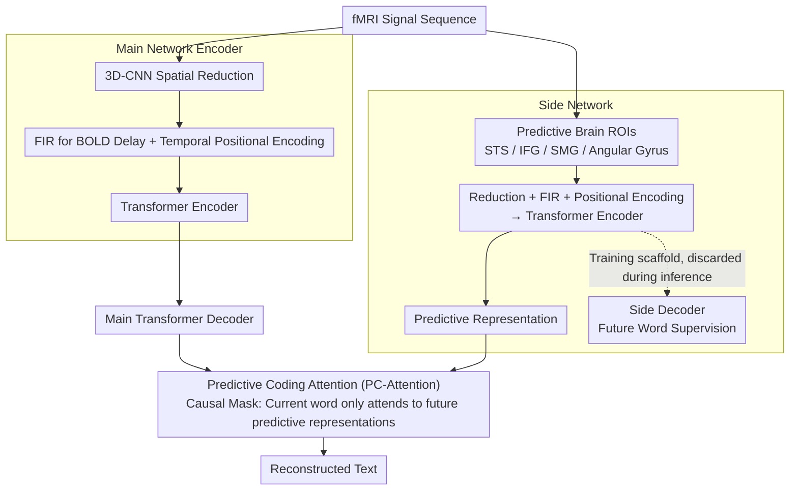

# Language Reconstruction with Brain Predictive Coding from fMRI Data

**Conference**: ACL 2026  
**arXiv**: [2405.11597](https://arxiv.org/abs/2405.11597)  
**Code**: None  
**Area**: Brain-Computer Interface / Language Decoding  
**Keywords**: fMRI language reconstruction, predictive coding, brain signal decoding, neurolinguistics, lateral network

## TL;DR

Ours proposes PredFT, an end-to-end fMRI-to-Text decoding model that integrates a main network (language decoding) and a side network (brain predictive coding representation). By extracting forward-looking semantic representations from predictive brain regions (PTO areas) and fusing them into the decoding process, PredFT achieves a BLEU-1 of 34.95% (Sub-1) on the LeBel dataset, a Gain of 7.84 percentage points compared to the strongest baseline MapGuide.

## Background & Motivation

**Background**: Reconstructing natural language from fMRI signals is an important window for understanding the mechanism of language formation in the human brain. Recent studies have utilized pre-trained language models to achieve open-vocabulary fMRI-to-Text decoding: Tang et al. used GPT to generate semantic candidates and then used brain signals to select matching content; Xi et al. converted the problem into sequence-to-sequence translation.

**Limitations of Prior Work**: Existing research focuses on model architecture design and language model utilization but ignores a key neuroscientific foundation—how natural language is encoded in the human brain. Specifically, the brain naturally makes multi-time-scale predictions about future content while perceiving current speech stimuli (Predictive Coding Theory), but this information has never been used to guide language reconstruction.

**Key Challenge**: Brain signals contain rich forward-looking predictive information, but existing decoding models only utilize brain activity representations at the current moment, wasting the predictive signals naturally generated by the brain.

**Goal**: (1) Verify the feasibility of Predictive Coding Theory in fMRI-to-Text decoding; (2) design a decoding model that can effectively utilize brain predictive representations; (3) analyze the impact of different brain regions, prediction distances, and lengths on decoding performance.

**Key Insight**: Predictive Coding Theory points out that the brain naturally predicts future words when hearing speech. Caucheteux et al. have proved that the linear mapping between language model activations and brain responses is enhanced if the language model representations are constructed with predicted content. This inspires: can predictive representations be extracted from brain signals to assist language reconstruction?

**Core Idea**: Design a dual-network architecture—the main network is responsible for standard fMRI-to-Text decoding, and the side network extracts forward-looking representations from predictive brain regions (PTO areas), merging predictive information into the decoding process through Predictive Coding Attention.

## Method

### Overall Architecture

PredFT aims to introduce "predictive coding" from neuroscience—the information that the brain naturally predicts what to say next when listening to speech—into fMRI-to-Text decoding. It is an end-to-end model consisting of two networks: the main network $\mathcal{M}_\theta$ (encoder-decoder) performs standard fMRI-to-text conversion, encoding fMRI sequences into spatio-temporal features and then outputting text via a Transformer decoder; the side network $\mathcal{M}_\phi$ (encoder-decoder) extracts "forward-looking" representations from predictive brain regions, and its encoder output $H_{\phi_\text{Enc}}^M$ is injected into the main network to assist decoding. Both networks are jointly optimized during training. During inference, the side network decoder is discarded, leaving only its encoder to continuously supply predictive representations.

### Key Designs

**1. Main Network Encoder: Extracting aligned spatio-temporal features from delayed raw fMRI signals**

The difficulty with fMRI is that the BOLD signal has a delay of approximately 4-6 seconds, which causes misalignment between brain activity and speech if used directly. The main network encoder first performs spatial reduction: for 4D volumetric images $F_{i,j} \in \mathbb{R}^{w \times h \times d \times (k+1)}$, it uses $L$ layers of 3D-CNN (including Group Normalization, ReLU, and residual connections) to gradually compress them into a 1D vector $x_{i,j}^t \in \mathbb{R}^{d_m}$. For 2D surface fMRI, linear reduction is used directly. Then, a crucial step is using an FIR model $g_t$ to compensate for BOLD delay by concatenating $k-k^*$ future frames followed by linear fusion; this temporal compensation is essential for correctly aligning brain activity and speech. Finally, temporal positional encoding is added before feeding into a Transformer encoder to capture sequential dependencies.

**2. Side Network: Extracting forward-looking semantic representations only from "predictive" brain regions**

Predictive signals are not present across the entire brain—the authors' predictive coding verification experiments found that prediction scores in the PTO region are significantly higher than whole-brain or random ROIs. Effective predictive information can only be obtained by selecting the right brain regions. The side network encoder $\mathcal{M}_{\phi_\text{Enc}}$ therefore only receives sequences $R_{i,j}$ from predictive ROIs (concatenated from regions like STS, IFG, SMG, and Angular Gyrus). It also undergoes fully connected reduction, FIR compensation, and positional encoding before being sent to a Transformer encoder to output predictive representations $H_{\phi_\text{Enc}}^M$. How does it learn to "predict"? The side network decoder uses future words $V_j$ (prediction targets with distance $d$ and length $l$) as supervision signals, using cross-entropy to force the encoder to encode "what will be said next" into the representations. This decoder is purely a training scaffold and is entirely discarded during inference, similar to the concept of knowledge distillation—assisting training while not being used in inference.

**3. Predictive Coding Attention (PC-Attention): Allowing the main network to only borrow future predictive signals when decoding current words**

Predictive representations from the side network are only useful if merged into the main network, but the merging method must respect the "forward-looking" nature. PredFT adds a PC-Attention module to each layer of the main Transformer decoder, with the decoder hidden state $H_{\theta_\text{Dec}^l}$ as query and the side encoder output $H_{\phi_\text{Enc}}^M$ as key and value. The true ingenuity lies in the attention mask: for each token in the text segment $u_j^t$, it is only allowed to attend to predictive representations from time steps after $t$, with all prior steps masked—because predictive information, by definition, should come from brain activity "after the present." This causal mask ensures current word decoding only consumes future predictive signals, cleanly corresponding to the forward-looking semantics of predictive coding.

### Loss & Training

Joint end-to-end training is performed with the total loss $\mathcal{L} = \mathcal{L}_\text{Main} + \lambda \mathcal{L}_\text{Side}$. The two networks share the word embedding layer (gradients updated only by the main network), and each uses left-to-right autoregressive cross-entropy. During inference, the side network decoder is discarded, and only the encoder is kept to provide predictive representations.

## Key Experimental Results

### Main Results

**Within-subject decoding on LeBel dataset (10 frames = 20 seconds)**

| Model | BLEU-1 | BLEU-4 | ROUGE1-F | BERTScore |
|------|--------|--------|---------|-----------|
| Tang's | 22.25 | 0.00 | 19.44 | 80.84 |
| BrainLLM | 24.18 | 1.11 | 21.16 | 83.26 |
| MapGuide | 27.11 | 1.54 | 24.83 | 82.66 |
| PredFT w/o SideNet | 27.91 | 1.29 | 26.82 | 81.35 |
| **Ours (PredFT)** | **34.95** | **1.78** | **32.03** | 82.92 |

**Cross-subject decoding on Narratives dataset**

| Length | Model | BLEU-1 | ROUGE1-F | BERTScore |
|------|------|--------|---------|-----------|
| 10 frames | UniCoRN | 20.64 | 19.23 | 75.35 |
| 10 frames | **Ours** | **24.73** | **19.53** | **78.52** |
| 40 frames | UniCoRN | 21.76 | 25.30 | 74.40 |
| 40 frames | **Ours** | **27.80** | **25.96** | **78.63** |

### Ablation Study

**Impact of ROI selection on decoding performance (LeBel dataset)**

| ROI Type | Description | Relative Performance |
|---------|------|---------|
| BPC (Predictive ROIs) | STS, IFG, SMG, Angular Gyrus | **Optimal** |
| Whole (Whole-brain) | Entire cerebral cortex | Sub-optimal |
| Random | Randomly selected regions | Worst |

### Key Findings

- Significant side network contribution: Compared to w/o SideNet, PredFT improves BLEU-1 on Sub-1 from 27.91 to 34.95 (+7.04), proving that brain predictive information provides substantial help for decoding.
- ROI selection is critical: BPC regions (PTO) consistently outperform whole-brain and random ROIs, verifying the regional specificity of predictive coding.
- Optimal intervals exist for prediction length and distance: Prediction lengths that are too short ($l=1, 2$) or too long ($l=11, 12$) are not ideal. Medium lengths ($l=6, 7, 8$) combined with appropriate distances ($d=3-5$) yield the best results.
- Within-subject decoding significantly outperforms cross-subject decoding, and all models still struggle with long-text generation (BLEU-3/4).

## Highlights & Insights

- Directly transforming Predictive Coding Theory from neuroscience into model design is an elegant interdisciplinary innovation—the side network's "assisted training, discarded inference" strategy is similar to knowledge distillation.
- The causal mask design of PC-Attention is simple yet powerful—ensuring current words only attend to future predictive representations perfectly matches the forward-looking nature of predictive coding.
- The predictive coding verification experiment itself has independent value—systematically demonstrating the interaction between brain regions, prediction distance, and length.

## Limitations & Future Work

- Verified only on fMRI data; the applicability to other brain signal modalities (MEG, EEG) has not been explored.
- Unexpected content for the subject may interfere with the brain's predictive function, affecting decoding results.
- There is still much room for improvement in long accurate text generation for all models (BLEU-4 is generally below 2%).
- Could be extended to brain signal decoding scenarios for visual stimuli.

## Related Work & Insights

- **vs Tang's**: Tang uses GPT beam search to generate candidates for selection, whereas PredFT is end-to-end and utilizes brain predictive information.
- **vs UniCoRN**: UniCoRN uses a three-stage training framework for BART, while PredFT introduces predictive coding priors through a side network, achieving a BLEU-1 Gain of 6+ percentage points in cross-subject settings.
- **vs BrainLLM**: BrainLLM fine-tunes Llama2 by concatenating fMRI and word embeddings; PredFT provides more targeted auxiliary signals through an independent predictive network.

## Rating

- Novelty: ⭐⭐⭐⭐⭐ First systematic application of Predictive Coding Theory to fMRI-to-Text decoding, with outstanding interdisciplinary innovation.
- Experimental Thoroughness: ⭐⭐⭐⭐ Comprehensive across two datasets, multiple subjects, ROI analysis, and prediction parameter analysis, though lacking human evaluation.
- Writing Quality: ⭐⭐⭐⭐ Clear and smooth logical deduction from predictive coding verification to model design.
- Value: ⭐⭐⭐⭐ Provides a theoretically supported new method for the brain-computer interface field and verifies the practical value of brain predictive information.

<!-- RELATED:START -->

## Related Papers

- [\[ACL 2025\] Aligning AI Research with the Needs of Clinical Coding Workflows: Eight Recommendations Based on US Data Analysis and Critical Review](../../ACL2025/medical_nlp/clinical_coding_eight_recommendations.md)
- [\[ICML 2026\] Exploring Accurate and Transparent Domain Adaptation in Predictive Healthcare via Concept-Grounded Orthogonal Inference](../../ICML2026/medical_nlp/exploring_accurate_and_transparent_domain_adaptation_in_predictive_healthcare_vi.md)
- [\[ACL 2026\] Ryze: Evidence-Enriched Data Synthesis from Biomedical Papers](ryze_evidence-enriched_data_synthesis_from_biomedical_papers.md)
- [\[ACL 2026\] Beyond the Leaderboard: Rethinking Medical Benchmarks for Large Language Models](beyond_the_leaderboard_rethinking_medical_benchmarks_for_large_language_models.md)
- [\[ACL 2026\] CURA: Clinical Uncertainty Risk Alignment for Language Model-Based Risk Prediction](cura_clinical_uncertainty_risk_alignment_for_language_model-based_risk_predictio.md)

<!-- RELATED:END -->
