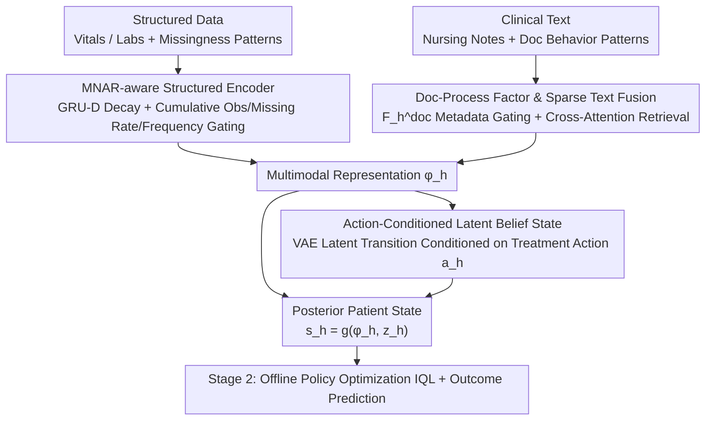

# Learning Dynamic Representations and Policies from Multimodal Clinical Time-Series with Informative Missingness

**Conference**: ACL 2026 Findings  
**arXiv**: [2604.21235](https://arxiv.org/abs/2604.21235)  
**Code**: [GitHub](https://github.com/CausalMLResearch/OPL-MT-MNAR)  
**Area**: Medical NLP  
**Keywords**: Multimodal clinical time-series, informative missingness, offline reinforcement learning, Bayesian filtering, ICU treatment strategies

## TL;DR
Proposes the OPL-MT-MNAR framework, which learns dynamic ICU patient representations by combining MNAR-aware multimodal encoders, Bayesian filtered latent states, and offline policy learning. By utilizing "information carried by the missingness patterns themselves" in structured data and clinical text, it achieves sepsis treatment policies superior to clinician behavior (FQE 0.679 vs 0.528).

## Background & Motivation

**Background**: Electronic Health Records (EHR) contain structured data (vital signs, lab tests) and clinical text (nursing notes, reports), serving as rich data sources for learning patient dynamic representations to support outcome prediction and sequential treatment decisions. Significant work has been done in offline RL for ICU sepsis treatment, but most treat clinical observations as complete data after preprocessing.

**Limitations of Prior Work**: Two key features of clinical data are often ignored: (1) **The observation process itself is informative** (informative missingness) — sicker patients are monitored more frequently, meaning missingness patterns reflect latent health states and are missing-not-at-random (MNAR); (2) **Observation patterns differ across modalities** — vitals are routine, labs require physician orders, and text notes depend on documentation behavior, with these differences evolving over time.

**Key Challenge**: Existing methods either ignore missingness information or handle it only within structured time-series (e.g., GRU-D), failing to utilize missingness patterns as information signals in a joint multimodal and temporal setting. Specifically, the observation process of clinical text (when notes are written, how documentation frequency changes) is completely neglected.

**Goal**: Construct a patient representation learning framework that explicitly exploits multimodal informative missingness to support downstream offline treatment policy optimization and outcome prediction.

**Key Insight**: Three strong signals are identified from real ICU data: (a) sicker patients have denser monitoring; (b) high-acuity patients are more likely to have text updates; (c) the temporal availability of different modalities evolves differently. These observation patterns contain vital information regarding patient states.

**Core Idea**: Treat the observation process (missingness patterns in structured data + documentation patterns in clinical text) as explicit feature inputs, constructing patient representations through MNAR-aware encoding, Bayesian filtering, and action-conditioned latent states.

## Method

### Overall Architecture

The core stance of this framework is "missingness as a signal": the frequency of monitoring and nursing notes in the ICU reflects the severity of the illness and should not be treated as noise to be imputed. OPL-MT-MNAR utilizes this signal in two stages. Stage 1 learns patient state representations — an MNAR-aware multimodal encoder compresses structured data and clinical text (along with their respective missingness/documentation patterns) into a unified representation $\phi_h$. Then, a Bayesian filter using variational inference maintains a latent belief state $z_h$. These are combined into a posterior patient state $s_h = g_\theta(\phi_h, z_h)$. Stage 2 utilizes $s_h$ for offline policy optimization (IQL) and outcome prediction.

### Key Designs

**1. MNAR-aware Structured Data Encoding: Integrating Monitoring Frequency as a Feature**

Standard GRU-D only uses time intervals for decay, losing a key piece of information: sicker patients are measured more frequently. This "observation frequency" carries acuity signals and is MNAR. This paper extends GRU-D by explicitizing missingness patterns: cumulative observation counts, missingness rates, and windowed observation frequency are directly input into the GRU gating updates. Meanwhile, the GRU-D decay mechanism is retained—when a variable is missing for a long time, a learned decay factor gradually pulls its value back to the empirical mean. Thus, "when it was measured" and "how frequently" are no longer smoothed out but become part of characterizing the patient state.

**2. Doc-Process Factor and Sparse Text Fusion: Analyzing Text Metadata Before Content**

The availability of clinical text is also endogenous — nursing notes for high-acuity patients are written more frequently. States like "no text," "outdated text," or "dense updates" carry distinct meanings even if the underlying content is similar. The model introduces a documentation process factor $F_h^{doc}$: an MLP encodes text existence, freshness, and recent documentation density per step, accumulated over time via a GRU. For content, a multi-head cross-attention mechanism uses the structured representation as a query to retrieve text embeddings. Finally, $F_h^{doc}$ controls a gate that adaptively determines the fusion ratio between text and structured representations. This allows the model to use "behavioral metadata" for weighting, decoupling "when it was recorded" from "what was recorded."

**3. Action-Conditioned Latent Belief States: Propagating Causal Effects of Treatment History**

Observation encoding $\phi_h$ alone is insufficient for policy optimization because $\phi_h$ is a deterministic function of recorded observations and lacks causal traces of actions. This paper uses a VAE to parameterize a latent state transition $z_{h+1} \sim p_\theta(z_{h+1}|z_h, \phi_h, a_h)$, where the transition function is conditioned on the treatment action $a_h$. The authors provide Theorem 1 for support: if the latent state transition does not depend on the action, the policy gradient of "current action on future rewards" will be zero—in terminal reward settings, all non-terminal steps would receive no learning signal. This latent state channel ensures that the cumulative effects of treatment actions are propagated through the patient trajectory.

### Loss & Training

Three-stage training: (1) Pre-train the encoder with a reconstruction loss comprising four components (structured values, missingness mask BCE, text embeddings, doc-process factors), plus dynamics consistency and KL regularization; (2) Freeze the encoder to train the RL policy using IQL (Double Q + Expectile Value Function + Advantage-Weighted Behavior Cloning); (3) Joint fine-tuning.

## Key Experimental Results

### Main Results (Policy Learning FQE)

| Method | Information | MIMIC-III | MIMIC-IV | eICU |
|------|------|-----------|----------|------|
| AI Clinician | Model-free | 0.487 | 0.491 | 0.478 |
| DDPG+Clinician | Model-free | 0.529 | 0.538 | 0.524 |
| MedDreamer | Model-based | 0.583 | 0.591 | 0.579 |
| Clinician Behavior | Behavior | 0.528 | 0.521 | 0.534 |
| **OPL-MT-MNAR** | **MNAR+Text** | **0.679** | **0.634** | **0.604** |

### Ablation Study (MIMIC-III Building Block Study)

| Configuration | FQE | Gain (Relative to Baseline) |
|------|-----|------------|
| Baseline (MDP, no MNAR) | 0.507 | — |
| + Semi-MDP | 0.518 | +2.2% |
| + MNAR + DocProcess | **0.679** | **+33.9%** |
| + All | 0.689 | +35.9% |

### Key Findings
- **MNAR modeling is the primary contributor**: Explicit MNAR and DocProcess modeling contributed a +33.9% gain, far exceeding the +2.2% from Semi-MDP.
- **Text provides substantial value for policy learning**: Structured-only achieved 0.574, nursing notes increased it to 0.624, and the full multimodal approach reached 0.679.
- **High-acuity patients benefit most**: For the high SOFA (>10) group, clinician behavior FQE was only 0.192, while Ours reached 0.344.
- **Outcome prediction AUROC of 0.886**: Superior to GRU-D (0.844) and MedDreamer (0.867).

## Highlights & Insights
- **The "missingness as signal" concept** is insightful: rather than imputing missing values, the framework directly uses "what was observed, when, and how often" as features. This is applicable to any domain with incomplete data.
- **Theoretical proof for action-conditioned latent states** (Theorem 1) provides rigorous support for the architecture design.
- **Doc-process factors** use only the metadata of the observation process to regulate fusion weights, effectively decoupling documentation "behavioral signals" from "content signals."

## Limitations & Future Work
- Relies on Offline Policy Evaluation (FQE) without prospective clinical validation.
- The action space is discretized into 9 actions with 4-hour intervals, limiting fine-grained treatment control.
- Unrecorded information (e.g., verbal communication, bedside assessment) may still cause unobserved confounding.
- Validated only on US ICU datasets; generalization across different countries/healthcare systems requires further verification.

## Related Work & Insights
- **vs GRU-D**: GRU-D only handles time interval decay in structured series; Ours extends this to multimodal MNAR and incorporates cumulative observation features.
- **vs MedDreamer**: MedDreamer is model-based RL; Ours achieves higher FQE via explicit MNAR modeling without requiring a full world model.
- **vs Liang et al. (2025)**: A previous work from the same team modeled informative missingness but lacked temporal dynamics; this work adds Bayesian filtering and action conditioning.

## Rating
- Novelty: ⭐⭐⭐⭐⭐ Unified framework for multimodal informative missingness, documentation behavior, and action-conditioned latent states; highly original.
- Experimental Thoroughness: ⭐⭐⭐⭐⭐ Three datasets, complete ablation, acuity-stratified analysis, and robustness testing.
- Writing Quality: ⭐⭐⭐⭐⭐ Rigorous theoretical derivation with persuasive motivation charts.
- Value: ⭐⭐⭐⭐ Significant practical relevance for clinical AI; the "missingness as signal" approach has broad transferability.

<!-- RELATED:START -->

## Related Papers

- [\[NeurIPS 2025\] Time-IMM: A Dataset and Benchmark for Irregular Multimodal Multivariate Time Series](../../NeurIPS2025/medical_nlp/time-imm_a_dataset_and_benchmark_for_irregular_multimodal_multivariate_time_seri.md)
- [\[ACL 2026\] RADS: Reinforcement Learning-Based Sample Selection Improves Transfer Learning in Low-resource and Imbalanced Clinical Settings](rads_reinforcement_learning-based_sample_selection_improves_transfer_learning_in.md)
- [\[ACL 2026\] Dr. Assistant: Enhancing Clinical Diagnostic Inquiry via Structured Diagnostic Reasoning Data and Reinforcement Learning](dr_assistant_enhancing_clinical_diagnostic_inquiry_via_structured_diagnostic_rea.md)
- [\[ACL 2026\] RA-RRG: Multimodal Retrieval-Augmented Radiology Report Generation with Key Phrase Extraction](ra-rrg_multimodal_retrieval-augmented_radiology_report_generation_with_key_phras.md)
- [\[AAAI 2026\] Learning Cell-Aware Hierarchical Multi-Modal Representations for Robust Molecular Modeling](../../AAAI2026/medical_nlp/learning_cell-aware_hierarchical_multi-modal_representations.md)

<!-- RELATED:END -->
