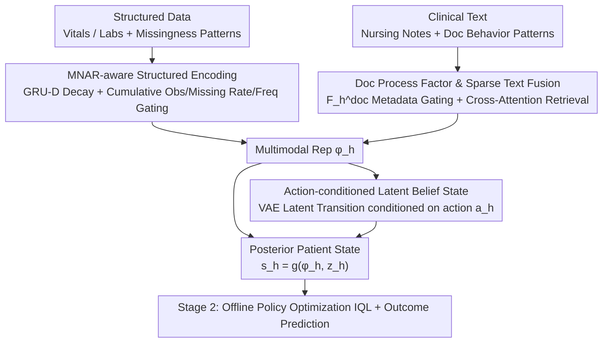

# Learning Dynamic Representations and Policies from Multimodal Clinical Time-Series with Informative Missingness

**Conference**: ACL 2026 Findings  
**arXiv**: [2604.21235](https://arxiv.org/abs/2604.21235)  
**Code**: [GitHub](https://github.com/CausalMLResearch/OPL-MT-MNAR)  
**Area**: Medical NLP  
**Keywords**: Multimodal clinical time-series, informative missingness, offline reinforcement learning, Bayesian filtering, ICU treatment policy

## TL;DR
The OPL-MT-MNAR framework is proposed, which learns dynamic representations of ICU patients from "information carried by the missingness patterns themselves" in structured data and clinical text. By combining MNAR-aware multimodal encoders, Bayesian filtering latent states, and offline policy learning, it achieves sepsis treatment policies superior to clinician behavior (FQE 0.679 vs. 0.528).

## Background & Motivation

**Background**: Electronic Health Records (EHR) containing structured data (vital signs, lab tests) and clinical text (nursing notes, reports) are rich data sources for learning patient dynamic representations to support outcome prediction and sequential treatment decisions. Extensive work has applied offline RL to ICU sepsis treatment, but most treat clinical observations as pre-processed complete data.

**Limitations of Prior Work**: Two critical features of clinical data are often neglected: (1) **The observation process itself is informative** (informative missingness)—severely ill patients are monitored more frequently, and missingness patterns reflect underlying health states, constituting missing-not-at-random (MNAR); (2) **Observation patterns differ across modalities**—vital signs are routine, lab tests require orders, and text notes depend on physician documentation behavior, with these differences evolving over time.

**Key Challenge**: Existing methods either ignore missingness information or only handle it in structured time-series (e.g., GRU-D), failing to utilize missingness patterns as informational signals in a joint multimodal and temporal setting. Specifically, the clinical text observation process (when nursing notes are written and how frequencies change) is entirely overlooked.

**Goal**: Construct a patient representation learning framework that explicitly utilizes multimodal informative missingness to support downstream offline treatment policy optimization and outcome prediction.

**Key Insight**: Three strong signals were discovered in real ICU data: (a) higher acuity leads to denser monitoring; (b) high-acuity patients are more likely to have text updates; (c) the temporal availability of different modalities evolves differently. These observation patterns contain vital information regarding patient states.

**Core Idea**: Treat the observation process (missingness patterns in structured data + documentation behavior patterns in text) as explicit features. Build patient representations through MNAR-aware encoding, Bayesian filtering, and action-conditioned latent states.

## Method

### Overall Architecture

The core philosophy of this framework is "missingness is a signal": the frequency of monitoring and note-taking in the ICU reflects illness severity and should not be treated as noise to be imputed. OPL-MT-MNAR utilizes this signal in two stages. Stage 1 learns patient state representations—using an MNAR-aware multimodal encoder to compress structured data and clinical text (along with their respective patterns) into a unified representation $\phi_h$, then maintaining a latent belief state $z_h$ via variational Bayesian filtering. These are combined into a posterior patient state $s_h = g_\theta(\phi_h, z_h)$. Stage 2 utilizes $s_h$ for offline policy optimization (IQL) and outcome prediction.

### Key Designs

**1. MNAR-aware Structured Encoding: Treating monitoring frequency as a feature**

Standard GRU-D only uses time intervals for decay, losing critical info: sicker patients are measured more often. This "observation frequency" carries an acuity signal (MNAR). This work explicates missingness patterns by feeding cumulative observations, missingness rates, and windowed observation frequencies directly into GRU gating. It retains the GRU-D decay mechanism to pull values toward empirical means during long absences. Consequently, "when and how often" measurements occur becomes part of the patient state characterization.

**2. DocProcess and Sparse Text Fusion: Behavioral metadata as a gating mechanism**

Availability of clinical text is endogenous—nursing notes are more frequent for high-acuity patients. States like "no text," "stale text," and "dense updates" have different meanings even if content is similar. The model introduces a documentation process factor $F_h^{doc}$: an MLP encodes text existence, timeliness, and recent density at each step, accumulated via GRU. For content, a multi-head cross-attention mechanism uses structured representations as queries to retrieve text embeddings. $F_h^{doc}$ then controls a gate to adaptively fuse text and structured representations, decoupling "when it was recorded" from "what was recorded."

**3. Action-conditioned Latent State: Propagating causal impacts of treatment history**

Observation encoding $\phi_h$ alone is insufficient for policy optimization because $\phi_h$ is a deterministic function of recorded observations without causal traces of actions. The model uses a VAE to parameterize a latent state transition $z_{h+1} \sim p_\theta(z_{h+1}|z_h, \phi_h, a_h)$, conditioned on treatment action $a_h$. Theorem 1 provides theoretical support: if latent transitions are independent of actions, the gradient of current actions relative to future rewards becomes zero—in terminal reward settings, all non-terminal steps would receive no learning signal. This action-conditioned channel allows cumulative effects to propagate through the patient trajectory.

### Loss & Training

A three-stage training strategy: (1) Pre-training encoders with a four-term reconstruction loss (structured values, missingness BCE, text embeddings, documentation factors), plus dynamics consistency and KL regularization; (2) Training the RL policy with frozen encoders using IQL (Double Q + Expectile Value Function + Advantage Weighted Behavioral Cloning); (3) Joint fine-tuning.

## Key Experimental Results

### Main Results (Policy Learning FQE)

| Method | Information | MIMIC-III | MIMIC-IV | eICU |
|------|------|-----------|----------|------|
| AI Clinician | Model-free | 0.487 | 0.491 | 0.478 |
| DDPG+Clinician | Model-free | 0.529 | 0.538 | 0.524 |
| MedDreamer | Model-based | 0.583 | 0.591 | 0.579 |
| Clinician Behavior | Behavior | 0.528 | 0.521 | 0.534 |
| **OPL-MT-MNAR** | **MNAR+Text** | **0.679** | **0.634** | **0.604** |

### Ablation Study (MIMIC-III Building Block Study)

| Configuration | FQE | Gain (Relative to Baseline) |
|------|-----|------------|
| Baseline (MDP, no MNAR) | 0.507 | — |
| + Semi-MDP | 0.518 | +2.2% |
| + MNAR + DocProcess | **0.679** | **+33.9%** |
| + All | 0.689 | +35.9% |

### Key Findings
- **MNAR modeling is the primary contributor**: Explicit MNAR and DocProcess modeling provided a +33.9% gain, significantly higher than Semi-MDP (+2.2%).
- **Text adds substantial value to policy learning**: FQE rose from 0.574 (structured only) to 0.624 (with notes) and reached 0.679 with full multimodal input.
- **High-acuity patients benefit most**: For the high SOFA (>10) group, clinician FQE was only 0.192, while this method reached 0.344.
- **Outcome prediction AUROC of 0.886**: Superior to GRU-D (0.844) and MedDreamer (0.867).

## Highlights & Insights
- The **"missingness is signal"** philosophy is compelling: instead of imputing missing values, the model uses "what was observed, when, and how often" as direct features. This is applicable to any domain with incomplete data.
- The **theoretical proof of action-conditioned latent states** (Theorem 1) provides rigorous support for the architecture.
- The **Documentation Process Factor** utilizes metadata of the observation process rather than just content to weight fusion, effectively decoupling behavioral and content signals.

## Limitations & Future Work
- Relies on offline policy evaluation (FQE) without prospective clinical validation.
- The action space is discretized into 9 categories with 4-hour intervals, limiting fine-grained control.
- Unrecorded information (e.g., verbal communication, bedside assessment) may still lead to unobserved confounding.
- Validated only on US ICU datasets; generalization across countries or healthcare systems remains to be verified.

## Related Work & Insights
- **vs. GRU-D**: Whereas GRU-D only handles time interval decay in structured series, this work extends to multimodal MNAR and incorporates cumulative observation features.
- **vs. MedDreamer**: While MedDreamer uses model-based RL, this work achieves higher FQE via explicit MNAR modeling without needing a full world model.
- **vs. Liang et al. (2025)**: While the same team previously modeled informative missingness, this work adds temporal dynamics via Bayesian filtering and action-conditioning.

## Rating
- Novelty: ⭐⭐⭐⭐⭐ Unified framework for multimodal MNAR, documentation behavior, and action-conditioned latent states.
- Experimental Thoroughness: ⭐⭐⭐⭐⭐ Three datasets, complete ablation, acuity stratification, and robustness checks.
- Writing Quality: ⭐⭐⭐⭐⭐ Rigorous theoretical derivation and convincing motivation.
- Value: ⭐⭐⭐⭐ Significant for clinical AI; the "missingness as signal" approach is widely transferable.

<!-- RELATED:START -->

## Related Papers

- [\[NeurIPS 2025\] Time-IMM: A Dataset and Benchmark for Irregular Multimodal Multivariate Time Series](../../NeurIPS2025/medical_nlp/time-imm_a_dataset_and_benchmark_for_irregular_multimodal_multivariate_time_seri.md)
- [\[ACL 2026\] RADS: Reinforcement Learning-Based Sample Selection Improves Transfer Learning in Low-resource and Imbalanced Clinical Settings](rads_reinforcement_learning-based_sample_selection_improves_transfer_learning_in.md)
- [\[ACL 2026\] Dr. Assistant: Enhancing Clinical Diagnostic Inquiry via Structured Diagnostic Reasoning Data and Reinforcement Learning](dr_assistant_enhancing_clinical_diagnostic_inquiry_via_structured_diagnostic_rea.md)
- [\[ACL 2026\] RA-RRG: Multimodal Retrieval-Augmented Radiology Report Generation with Key Phrase Extraction](ra-rrg_multimodal_retrieval-augmented_radiology_report_generation_with_key_phras.md)
- [\[AAAI 2026\] Learning Cell-Aware Hierarchical Multi-Modal Representations for Robust Molecular Modeling](../../AAAI2026/medical_nlp/learning_cell-aware_hierarchical_multi-modal_representations.md)

<!-- RELATED:END -->
