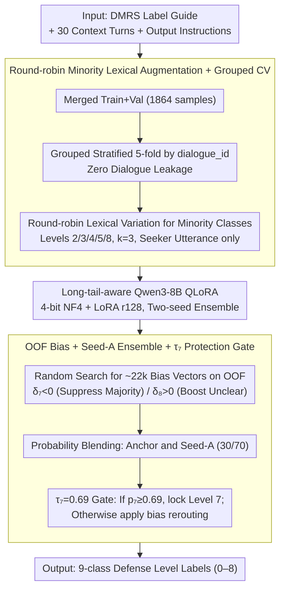

# LinguIUTics at PsyDefDetect: Iterative Imbalance-Aware Fine-tuning of Qwen3-8B for Psychological Defense Mechanism Classification

**Conference**: ACL 2026 / BioNLP 2026  
**arXiv**: [2606.00647](https://arxiv.org/abs/2606.00647)  
**Code**: https://github.com/Shefwef/LingIUTics-PsyDefDetect-BIONLP26  
**Area**: Clinical NLP / Mental Health Text Classification / Imbalanced Learning  
**Keywords**: Psychological Defense Mechanisms, Class Imbalance, QLoRA, Grouped Cross-Validation, Post-processing Calibration

## TL;DR
This PsyDefDetect competition system utilizes Qwen3-8B QLoRA, minority lexical augmentation, grouped 5-fold cross-validation, Out-of-Fold (OOF) logit bias, and multi-seed ensembles to improve the official macro F1 for psychological defense mechanism classification to 0.3917, ranking 4th among 21 teams.

## Background & Motivation
**Background**: The PsyDefDetect 2026 task requires classifying seeker utterances in psychological support dialogues into 9 psychological defense levels under the DMRS framework. This task is valuable for clinical NLP and mental health dialogue systems, as defense mechanisms reflect how users handle stress, anxiety, and conflict.

**Limitations of Prior Work**: Extreme data imbalance. The merged training set contains 1,864 samples, where Level 7 (High-Adaptive) accounts for 51.9% while Level 8 (Unclear) represents only 1.5%. The ratio between Level 7 and Level 8 is approximately 34.6:1. Since the official metric is macro F1, optimizing for accuracy causes the model to collapse toward the majority class.

**Key Challenge**: Small encoder-based models and zero-shot LLMs struggle to identify rare psychological defense categories. Directly fine-tuning large models often leads to poor leaderboard generalization due to class imbalance and validation leakage risks. The system must simultaneously address model capacity, minority class recall, validation reliability, and post-processing calibration.

**Goal**: The authors aim to construct a minority-friendly Qwen3-8B fine-tuning system that obtains reliable OOF signals without dialogue group leakage and recovers rare class recall through post-processing.

**Key Insight**: An iterative engineering pipeline is adopted: starting with trials of MentalBERT, MentalRoBERTa, DeBERTa, RoBERTa, and zero-shot LLMs, which revealed near-zero performance on rare classes. The focus then shifted to Qwen3-8B QLoRA, incrementally incorporating weighted CE, label smoothing, round-robin augmentation, grouped CV, logit bias, and ensembles.

**Core Idea**: In extreme long-tail clinical text classification, model capacity is a prerequisite, but leakage-safe validation, minority data construction, and macro F1-oriented post-processing calibration are the primary performance determinants.

## Method

### Overall Architecture

The system addresses an extreme long-tail clinical text classification problem: assigning seeker utterances in psychological dialogues to 9 defense levels. The difficulty lies in the data distribution — Level 7 accounts for over half of the 1,864 training samples, while Level 8 is only 1.5%. The official macro F1 metric necessitates prioritizing rare classes. The pipeline is designed around this constraint: data preprocessing and minority augmentation are followed by dual-seed grouped 5-fold Qwen3-8B QLoRA training, finalized with OOF calibration and multi-seed probability fusion to recover minority recall. Each component targets a failure mode: insufficient encoder capacity, poor single-fold generalization, Level 7 over-attraction, and near-zero recall for Level 8.

On the input side, samples consist of three segments: a DMRS Label Guide, the 30 most recent dialogue turns, and output instructions. The model outputs integer labels from 0–8. Training uses the merged PsyDefConv train+validation sets (1,864 samples) across 200 source dialogues. A critical step is using `dialogue_id` for grouped stratified 5-fold CV to ensure that a dialogue and its augmented versions are never split across folds, enabling trustworthy OOF signals.

### Key Designs

**1. Long-tail-aware Qwen3-8B QLoRA Architecture: Using superior semantic capacity to distinguish clinically similar classes**

After testing BERT-family models (MentalBERT, MentalRoBERTa, DeBERTa, RoBERTa), the highest validation macro F1 was only 0.314, with Classes 3, 5, and 8 frequently dropping to zero due to linguistic overlap. Qwen3-8B was selected for stronger contextual understanding. PEFT (4-bit NF4 + double quantization) reduced peak VRAM from ~32GB to ~8GB. LoRA was applied to q/k/v/o/gate/up/down/score with rank/alpha of 128/256 and 0.1 dropout, resulting in ~31M (0.4%) trainable parameters.

**2. Round-robin Minority Lexical Augmentation + Grouped CV: Increasing minority samples without dialogue leakage**

Since defense signals hide in subtle phrasing, aggressive paraphrasing is risky. The authors limited augmentation to $k=3$ round-robin lexical variations (contraction/hedging, style shifts, filler/hesitation markers) for Levels 2, 3, 4, 5, and 8, modifying only the seeker utterance. This increased minority counts from 28–84 to 65–252. Grouped CV ensured source dialogues and their variants remained in the same fold, achieving "zero leaked dialogues" for reliable validation.

**3. OOF Bias + Seed-A Ensemble + $\tau_7$ Protection Gate: Recovering minority recall without sacrificing majority precision**

To counter the inherent bias towards Level 7, the authors searched ~22,000 bias vectors on Anchor OOF predictions using the rule $\hat{y}=\arg\max_c[\log p_c+\delta_c]$, where $\delta_7<0$ and $\delta_8>0$. Probabilities from Anchor and Seed-A models were blended ($p_{blend}=0.30\,p_{anchor}+0.70\,p_{seedA}$). A protection gate at $\tau_7=0.69$ was introduced: if $p_{blend,7}\geq 0.69$, Level 7 is locked; otherwise, bias rerouting is applied. This prioritizes minority recall only for ambiguous samples while preserving high-confidence majority predictions.

### Loss & Training
Training employed inverse-square-root class weighting, where $w_c=(1/\sqrt{n_c})/\sum_i(1/\sqrt{n_i})$ (e.g., $w_8=1.67, w_5=1.29, w_7=0.28$). Label smoothing ($\epsilon=0.05$) prevented early logit saturation of Level 7. Optimization used AdamW with a learning rate of $1.2\times10^{-4}$, weight decay of 0.01, and cosine annealing with 8% warmup. Effective batch size was 16 (per-device 2, grad accum 8) on NVIDIA RTX 3090 Ti 24GB.

## Key Experimental Results

### Main Results
The final system achieved a macro F1 of 0.3917 on the official positive-class leaderboard, ranking 4th. This represents a +7.7 point absolute improvement (~24.4% relative gain) over the Ministral-8B fine-tuned baseline.

| System | Acc. (%) | Macro F1 (%) |
|------|----------|--------------|
| GPT-5 zero-shot (task paper) | 52.75 | 19.53 |
| Gemini 2.5 Pro zero-shot | 56.36 | 25.99 |
| DeepSeek-V3.2 zero-shot (CoT) | 55.72 | 26.17 |
| Llama 3.1-8B fine-tuned | 62.92 | 30.51 |
| InternLM3-8B fine-tuned | 63.98 | 30.53 |
| Ministral-8B fine-tuned (SOTA) | 64.83 | 31.48 |
| Qwen3-8B LoRA baseline | 54.45 | 24.91 |
| Qwen3-8B LoRA + grouped CV + bias tuning | 58.43 | 35.48 |
| Qwen3-8B LoRA + SeedA ensemble + v2decode | 64.19 | 39.17 |

### Ablation Study
Ablations show that components cumulatively improved performance from 0.249 to 0.392.

| Configuration | Macro F1 | Note |
|------|----------|------|
| R0: 1-fold, rr=64, no weighting | 0.249 | Early Qwen3-8B baseline |
| + 5-fold CV, rr=128 | 0.284 | Increased LoRA rank + 5-fold |
| + Weighted CE + label smoothing | 0.329 | Suppressed majority collapse |
| + Grouped-clean 5-fold | 0.355 | Dialogue-level grouping; reduced OOF-LB gap |
| + Data augmentation (RR-k3) | 0.355 | No direct F1 gain, but stabilized minority classes |
| + Seed-A blend (30/70) + v2 decode | 0.392 | Final submission strategy |

### Key Findings
- The grouped-clean augmented run yielded an OOF macro F1 of 0.3716, with individual folds ranging from 0.3326 to 0.3899.
- Level 8 ("Unclear") F1 improved from near-zero to 0.797 via bias tuning, while Level 7 (High-Adaptive) maintained an F1 of 0.709.
- The blended system metrics: Precision 0.431, Recall 0.436, F1 0.426 (Official macro F1 0.3917).
- Level 4 (Minor Image-Distorting) and Level 5 (Neurotic) remain the most difficult (F1 ~0.254 and ~0.278) due to linguistic overlap with the majority class.
- Grouped CV reduced the OOF-leaderboard gap from 9.6 points to 1.7–4.5 points, making threshold tuning more reliable.

## Highlights & Insights
- The system demonstrates that success in long-tail classification stems from integrating validation, augmentation, loss weighting, and decoding strategies rather than just increasing model size.
- Round-robin lexical augmentation is conservative, preserving clinical signals while providing surface-level variety.
- The $\tau_7$ gate is a practical engineering solution: it avoids unnecessary calibration for high-confidence majority samples while enabling logit bias for ambiguous cases.
- The use of detailed run logs (R0 to R10) provides a clear iteration path, which is helpful for reproducing shared task systems.

## Limitations & Future Work
- The OOF bias vectors and decoding rules are dataset-specific and require recalibration for different domains.
- Grouped CV mitigates augmentation leakage but cannot entirely eliminate risks from similar dialogue themes or templates.
- Hardware constraints limited exploration to 8B models; larger models or clinically pre-trained LLMs may offer better results.
- Future work could explore more robust paraphrase methods or label-preserving dialogue context augmentation.
- Blurred boundaries between Levels 4/5 suggest a need for expert knowledge, more granular label descriptions, or hierarchy-aware losses.

## Related Work & Insights
- **vs BERT-family**: MentalBERT and others encounter capacity bottlenecks on rare classes; Qwen3-8B provides superior contextual understanding.
- **vs Zero-shot LLMs**: Zero-shot performances range from 8–16% macro F1, suggesting that prompt-based task definitions are insufficient for learning DMRS nuances.
- **vs Standard CE Tuning**: High accuracy (e.g., Ministral-8B's 64.71%) can mask poor macro F1 (14.74), highlighting accuracy's deceptiveness in long-tail clinical tasks.
- **Inspiration**: Similar healthcare tasks can adopt the "grouped CV + conservative augmentation + OOF bias + majority gate" paradigm.

## Rating
- Novelty: ⭐⭐⭐
- Experimental Thoroughness: ⭐⭐⭐⭐
- Writing Quality: ⭐⭐⭐⭐
- Value: ⭐⭐⭐⭐

<!-- RELATED:START -->

## Related Papers

- [\[CVPR 2026\] Towards Efficient Medical Reasoning with Minimal Fine-Tuning Data](../../CVPR2026/medical_nlp/towards_efficient_medical_reasoning_with_minimal_fine-tuning_data.md)
- [\[ACL 2025\] CheXalign: Preference Fine-tuning in Chest X-ray Interpretation Models without Human Feedback](../../ACL2025/medical_nlp/chexalign_preference_finetuning.md)
- [\[ACL 2026\] RePrompT: Recurrent Prompt Tuning for Integrating Structured EHR Encoders with Large Language Models](reprompt_recurrent_prompt_tuning_for_integrating_structured_ehr_encoders_with_la.md)
- [\[ACL 2026\] Beyond Prompt: Fine-grained Simulation of Cognitively Impaired Standardized Patients via Stochastic Steering](beyond_prompt_fine-grained_simulation_of_cognitively_impaired_standardized_patie.md)
- [\[ACL 2026\] ProMedical: Hierarchical Fine-Grained Criteria Modeling for Medical LLM Alignment via Explicit Injection](promedical_hierarchical_fine-grained_criteria_modeling_for_medical_llm_alignment.md)

<!-- RELATED:END -->
