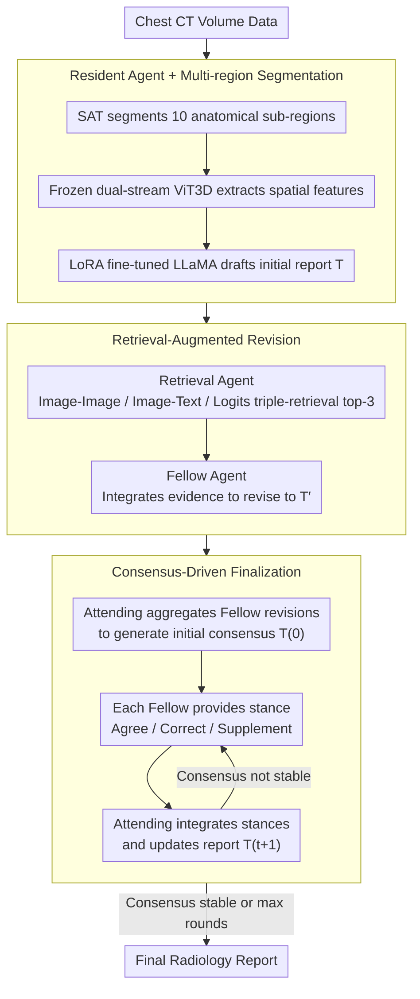

# MARCH: Multi-Agent Radiology Clinical Hierarchy for CT Report Generation

**Conference**: ACL 2026  
**arXiv**: [2604.16175](https://arxiv.org/abs/2604.16175)  
**Code**: None  
**Area**: Medical NLP  
**Keywords**: Multi-Agent, Radiology Report Generation, Consensus-driven, Retrieval-Augmented, 3D CT

## TL;DR

This paper proposes MARCH, a multi-agent framework that simulates the clinical resident-fellow-attending hierarchical collaboration. Through a three-stage process (initial drafting, retrieval-augmented revision, and consensus-driven finalization), it generates CT reports. It achieves a CE-F1 of 0.399 on the RadGenome-ChestCT dataset, representing a 57.7% improvement over the best baseline, Reg2RG (0.253).

## Background & Motivation

**Background**: Automated radiology report generation is a critical direction in medical AI. While Vision-Language Models (VLMs) have progressed in 2D chest X-ray reports, report generation for 3D volumetric data (e.g., chest CT) remains in its early stages.

**Limitations of Prior Work**: (1) End-to-end "black-box" models lack the iterative verification and cross-checking mechanisms found in clinical workflows, making them prone to clinical hallucinations; (2) Abnormal findings in 3D CT data are sparse, making it difficult for a single model to reliably detect all pathologies; (3) The inherent cognitive bias of a single-reader mode cannot be corrected.

**Key Challenge**: In clinical practice, departments reduce misdiagnosis rates through a hierarchical review process (resident-fellow-attending). Existing automated systems are single-agent and lack this multi-layered verification mechanism.

**Goal**: Design a multi-agent framework reflecting the clinical hierarchy of radiology to achieve interpretable and verifiable CT report generation.

**Key Insight**: Drawing from the "readout session" system—where a resident drafts, a fellow reviews, and an attending finalizes—different responsibilities are assigned to different AI agents.

**Core Idea**: Replace a single end-to-end model with a multi-agent hierarchical structure, significantly enhancing clinical accuracy through retrieval augmentation and multi-round consensus discussions.

## Method

### Overall Architecture

MARCH addresses the "single-reader bias" in 3D chest CT report generation. In an end-to-end model, a single reader functions without oversight, often missing sparse anomalies. The authors map the clinical readout session—Resident drafting, Fellow reviewing, and Attending certifying—directly onto a multi-agent pipeline. Input consists of chest CT volume data, and the output is the final report, following three stages: the Resident agent drafts the initial report; the Retrieval agent identifies similar cases for the Fellow agent to revise; and the Attending agent moderates multi-round consensus discussions until clinical agreement is reached.

### Key Designs

**1. Resident Agent + Multi-region Segmentation: Driving sparse anomalies into specific anatomical regions**

Anomalies in 3D CT are often localized and sparse; global encoding tends to miss them. The Resident agent first uses SAT (Segment Anything with Text) to segment the CT into 10 anatomical sub-regions (e.g., bones, breasts). It then uses a frozen dual-stream ViT3D (pre-trained from RadFM) to extract spatial features. Finally, a LoRA-fine-tuned LLaMA-2-Chat-7B generates a draft $T = A_{res}(I; \theta_{res})$. Segmenting before reading forces the model to focus on local anatomy and pathological entities, mitigating the sparsity of anomaly detection.

**2. Retrieval-Augmented Revision: Providing an "evidence-based second opinion"**

Since single generative models may hallucinate, the authors use retrieval as an external evidence source. Three complementary retrieval paradigms are designed: Image-to-Image and Image-to-Text retrieval use a 3D vision encoder to find visually similar CTs and their reports; Logits retrieval uses a classification head to predict 18 clinical anomalies and finds reports with similar diagnostic profiles. The top-3 from each are combined into structured evidence $R = A_{ret}(I, D)$, which the Fellow agent uses to revise the draft: $T' = A_{fel}(T, R)$. This mimics the clinical process of looking up literature or reference cases.

**3. Consensus-Driven Finalization: Solving disagreements through multi-round stance exchange rather than simple voting**

Reports modified by multiple Fellows may not be consistent, and simple voting loses nuanced information. The Attending agent $A_{att}$ first aggregates revisions to generate an initial consensus $T^{(0)}$. In each subsequent round, each Fellow agent $A_{fel,i}$ reviews the current consensus and provides a stance $S_i^{(t)}$ (Agree, Correct, or Supplement). The Attending integrates these to update the report $T^{(t+1)} = A_{att}(T^{(t)}, \{S_i^{(t)}\})$, iterating until consensus stabilizes or the round limit is reached.

### Mechanism Example: Processing a Chest CT

Consider a chest CT with subtle pericardial effusion. **Resident Stage**: The CT is partitioned into 10 regions. ViT3D extracts features and LLaMA drafts the report. Due to the weak signal, the draft might mention lung fields but miss the pericardium. **Revision Stage**: Retrieval fetches visually similar CTs; logits retrieval identifies reports with pericardial issues. The Fellow agent incorporates "pericardial effusion" into the revised draft based on this evidence. **Finalization Stage**: The Attending aggregates revisions. One Fellow might "Correct" the magnitude of the effusion while another "Supplements" follow-up advice. The Attending updates the report until stable. The final report captures low-frequency anomalies missed by the Resident alone.

### Loss & Training

The Resident agent is trained using AdamW (lr=1e-5) for 10 epochs. The ViT3D backbone is frozen, and LLaMA-2-Chat-7B is fine-tuned via LoRA. Fellow and Attending agents utilize GPT-4/GPT-4o as LLM backbones (temperature=0) without additional training.

## Key Experimental Results

### Main Results

| Method | BLEU-1 | BLEU-4 | METEOR | ROUGE-L | CE-Precision | CE-Recall | CE-F1 |
|------|--------|--------|--------|---------|-------------|-----------|-------|
| R2GenPT | 0.433 | 0.242 | 0.399 | 0.323 | 0.340 | 0.066 | 0.110 |
| MedVInT | 0.443 | 0.246 | 0.404 | 0.326 | 0.377 | 0.148 | 0.212 |
| M3D | 0.436 | 0.245 | 0.400 | 0.326 | 0.407 | 0.090 | 0.148 |
| RadFM | 0.442 | 0.237 | 0.399 | 0.315 | 0.382 | 0.131 | 0.195 |
| Reg2RG | 0.473 | 0.249 | 0.441 | 0.367 | 0.423 | 0.181 | 0.253 |
| **MARCH** | **0.482** | **0.257** | **0.456** | **0.383** | **0.495** | **0.335** | **0.399** |

### Ablation Study

| Configuration | BLEU-1 | BLEU-4 | METEOR | CE-F1 |
|------|--------|--------|--------|-------|
| Resident-only | 0.469 | 0.246 | 0.435 | 0.219 |
| SR-SA (Single-round, Single-agent) | 0.476 | 0.250 | 0.447 | 0.332 |
| SR-MA (Single-round, Multi-agent) | 0.475 | 0.251 | 0.454 | 0.352 |
| MR-MA (Multi-round, Multi-agent) | 0.479 | 0.255 | 0.456 | 0.362 |
| **MARCH (Full)** | **0.482** | **0.257** | **0.456** | **0.399** |

### Key Findings

- CE-F1 improved from 0.219 (Resident-only) to 0.399 (Full MARCH), an 82% increase, driven primarily by retrieval (+0.113) and consensus (+0.037).
- Retrieval augmentation contributed most to clinical utility (SR-SA vs Resident-only: CE-F1 +0.113), indicating evidence-based revision is key to reducing hallucinations.
- Performance variance across different LLM backbones (GPT-4/4o/5) was minimal (CE-F1 0.391-0.399), suggesting framework design is more critical than LLM capacity.
- MARCH showed particularly significant improvements in detecting low-frequency anomalies like hiatal hernia and pericardial effusion.

## Highlights & Insights

- Mapping the clinical hierarchy to a multi-agent architecture is an elegant design that mirrors verified error-prevention mechanisms in medicine.
- The three complementary retrieval paradigms (visual, text, logits) ensure different types of similarity are covered; this multi-modal ensemble is transferable to other evidence-based medical AI tasks.
- The consensus mechanism uses "stances" (Agree/Correct/Supplement) rather than voting, preserving the information density of disagreements.

## Limitations & Future Work

- Reliance on the GPT-4 family for reasoning is costly and difficult to deploy within hospitals; the feasibility of open-source LLMs remains unverified.
- Lack of a long-term memory mechanism prevents utilization of historical longitudinal imaging or learning from past diagnostic errors.
- Evaluation was limited to RadGenome-ChestCT; generalization to other anatomical regions (e.g., brain, abdomen) has not been tested.
- The number of consensus rounds requires a preset limit; there is no adaptive mechanism for determining the optimal number of iterations.

## Related Work & Insights

- **vs Reg2RG**: Reg2RG uses region-guided retrieval but remains single-agent; MARCH adds multi-agent consensus, increasing CE-F1 from 0.253 to 0.399.
- **vs RadFM**: RadFM is a general 3D medical foundation model that uses end-to-end generation, lacking verification and error-correction.
- **vs MedAgent**: General medical multi-agent systems focus on diagnosis and recommendation; MARCH is the first multi-agent framework specifically for 3D report generation.

## Rating

- Novelty: ⭐⭐⭐⭐ The mapping of clinical hierarchy to multi-agent roles is natural and meaningful.
- Experimental Thoroughness: ⭐⭐⭐⭐ Comprehensive ablation, backbone comparison, and anomaly-specific analysis.
- Writing Quality: ⭐⭐⭐⭐ Clear framework description and clinical context.
- Value: ⭐⭐⭐⭐ Provides a verifiable collaborative paradigm for high-stakes medical AI.

<!-- RELATED:START -->

## Related Papers

- [\[ACL 2026\] CT-FineBench: A Diagnostic Fidelity Benchmark for Fine-Grained Evaluation of CT Report Generation](ct-finebench_a_diagnostic_fidelity_benchmark_for_fine-grained_evaluation_of_ct_r.md)
- [\[ACL 2025\] Automated Structured Radiology Report Generation](../../ACL2025/medical_nlp/automated_structured_radiology_report_generation.md)
- [\[ACL 2025\] Online Iterative Self-Alignment for Radiology Report Generation](../../ACL2025/medical_nlp/oisa_radiology_report_gen.md)
- [\[ACL 2026\] RA-RRG: Multimodal Retrieval-Augmented Radiology Report Generation with Key Phrase Extraction](ra-rrg_multimodal_retrieval-augmented_radiology_report_generation_with_key_phras.md)
- [\[ACL 2026\] SEMA-RAG: A Self-Evolving Multi-Agent Retrieval-Augmented Generation Framework for Medical Reasoning](sema-rag_a_self-evolving_multi-agent_retrieval-augmented_generation_framework_fo.md)

<!-- RELATED:END -->
