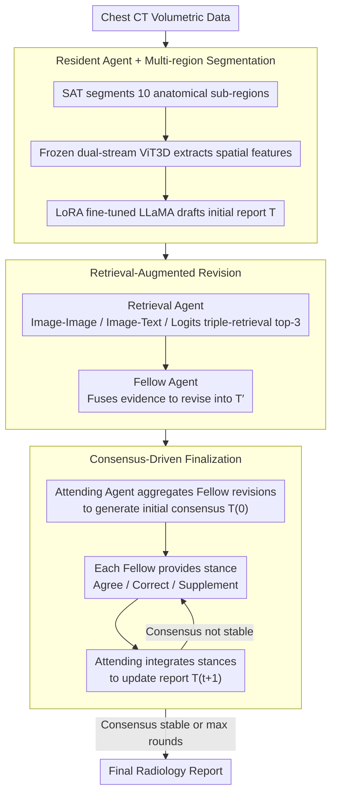

# MARCH: Multi-Agent Radiology Clinical Hierarchy for CT Report Generation

**Conference**: ACL 2026  
**arXiv**: [2604.16175](https://arxiv.org/abs/2604.16175)  
**Code**: None  
**Area**: Medical NLP  
**Keywords**: Multi-agent, Radiology report generation, Consensus-driven, Retrieval-augmented, 3D CT

## TL;DR

This paper proposes MARCH, a multi-agent framework that simulates the hierarchical collaboration of radiology Residents, Fellows, and Attending physicians. Through a three-stage process (initial drafting, retrieval-augmented revision, and consensus-driven finalization), it generates CT reports. On the RadGenome-ChestCT dataset, it achieves a CE-F1 of 0.399, representing a 57.7% improvement over the best baseline, Reg2RG (0.253).

## Background & Motivation

**Background**: Automated radiology report generation is a critical direction in medical AI. While existing vision-language models (VLMs) have made progress on 2D chest X-ray reports, report generation for 3D volumetric data (e.g., chest CT) remains in its early stages.

**Limitations of Prior Work**: (1) End-to-end "black-box" models lack iterative validation and cross-checking mechanisms found in clinical workflows, making them prone to clinical hallucinations; (2) Abnormal findings in 3D CT data are sparse, making it difficult for a single model to reliably detect all pathologies; (3) Cognitive biases inherent in a single-reader mode cannot be corrected.

**Key Challenge**: In clinical practice, departments reduce misdiagnosis rates through a hierarchical review process (Resident-Fellow-Attending). However, existing automated systems are single-agent and lack this multi-layer verification mechanism.

**Goal**: To design a multi-agent framework that simulates the clinical hierarchy of radiology to achieve interpretable and verifiable CT report generation.

**Key Insight**: Drawing inspiration from the radiology readout session system—where residents perform an initial reading, fellows review, and attendings finalize—different responsibilities are assigned to different AI agents.

**Core Idea**: Replace the single end-to-end model with a multi-agent hierarchical structure, significantly improving clinical accuracy through retrieval augmentation and multi-round consensus discussions.

## Method

### Overall Architecture

MARCH addresses the "single-reader bias" in 3D chest CT report generation: end-to-end models act like a solitary physician reading scans without peer review, often missing sparse abnormalities or hallucinating findings. The authors map the real-world radiology readout session—Resident initial reading, Fellow review, and Attending finalization—directly into a multi-agent pipeline. The input is 3D chest CT volumetric data, and the output is the final radiology report, processed in three stages: the Resident agent first drafts an initial report; the Retrieval agent fetches similar cases, and the Fellow agent revises accordingly; finally, the Attending agent chairs multi-round consensus discussions where multiple Fellow agents repeatedly exchange stances until a clinical consensus is reached.

### Key Designs

**1. Resident Agent + Multi-region Segmentation: Focusing Sparse Abnormalities on Specific Anatomical Regions**

Abnormalities in 3D CT are often confined to specific anatomical sub-regions and are highly sparse; global encoding often smears these details. The Resident agent first uses SAT (Segment Anything with Text) to segment the CT into 10 anatomical sub-regions (e.g., bone, breast), then uses a frozen dual-stream ViT3D (pre-trained from RadFM) to extract spatial features, and finally employs a LoRA-fine-tuned LLaMA-2-Chat-7B to generate a text draft $T = A_{res}(I; \theta_{res})$. Segmenting before reading forces the model to focus on local anatomy and pathological entities, mitigating the sparsity of abnormality detection.

**2. Retrieval-Augmented Revision: Providing an "Evidence-Based Second Opinion"**

Since a single generative model may miss details or hallucinate, the authors use retrieval to provide an external evidence source. Three complementary retrieval paradigms are designed: image-to-image/image-to-text retrieval uses 3D vision encoders to find visually similar CTs and their reports; logits retrieval uses a classification head to predict logits for 18 clinical abnormalities and finds reports with similar diagnostic profiles. The top-3 from each method are aggregated into structured evidence $R = A_{ret}(I, D)$, which is handed to the Fellow agent to fuse and revise the draft: $T' = A_{fel}(T, R)$. This step analogous to consulting literature or reference cases in clinical practice, and evidence-based revision contributes the most to performance in subsequent experiments.

**3. Consensus-Driven Finalization: Resolving Discrepancies via Multi-turn Stance Exchange Instead of Voting**

Reports modified by multiple Fellow agents may not be consistent, and simple voting loses the information contained in disagreements. The Attending agent $A_{att}$ first aggregates revisions to generate an initial consensus $T^{(0)}$. In each subsequent round, every Fellow agent $A_{fel,i}$ reviews the current consensus and provides a stance $S_i^{(t)}$ (Agree / Correct / Supplement). The Attending agent integrates all stances to update the report $T^{(t+1)} = A_{att}(T^{(t)}, \{S_i^{(t)}\})$, iterating until consensus stabilizes or the round limit is reached. This replicates the "devil's advocate" mechanism in real readout sessions—resolving differences through discussion rather than majority rule has been clinically proven to reduce misdiagnosis.

### Mechanism: A Walkthrough of a 3D Chest CT Case

Consider a chest CT with subtle pericardial effusion. In the Resident stage, the CT is segmented into 10 regions, and LLaMA drafts the report after ViT3D feature extraction; however, due to the faint signs of effusion, the draft might only mention lung fields and miss the pericardium. In the Revision stage, image retrieval pulls visually similar CTs, and logits retrieval finds reports containing pericardial abnormalities; the Fellow agent then incorporates "pericardial effusion" into the revised draft based on this evidence. In the Finalization stage, the Attending agent aggregates revisions into an initial consensus. One Fellow agent might provide a "Correct" stance regarding the volume of the effusion, while another adds "Supplement" for follow-up recommendations. The Attending integrates these into the updated report until consensus is reached. The final report captures the low-frequency abnormality missed during the Resident's solitary reading—explaining why MARCH shows significant gains for conditions like hiatal hernia and pericardial effusion.

### Loss & Training

The Resident agent is trained using AdamW (lr=1e-5) for 10 epochs, with the ViT3D backbone frozen and LLaMA-2-Chat-7B fine-tuned via LoRA. The Fellow and Attending agents directly use GPT-4.1/GPT-4o as the LLM backbone (temperature=0) without additional training.

## Key Experimental Results

### Main Results

| Method | BLEU-1 | BLEU-4 | METEOR | ROUGE-L | CE-Precision | CE-Recall | CE-F1 |
|------|--------|--------|--------|---------|-------------|-----------|-------|
| R2GenPT | 0.433 | 0.242 | 0.399 | 0.323 | 0.340 | 0.066 | 0.110 |
| MedVInT | 0.443 | 0.246 | 0.404 | 0.326 | 0.377 | 0.148 | 0.212 |
| M3D | 0.436 | 0.245 | 0.400 | 0.326 | 0.407 | 0.090 | 0.148 |
| RadFM | 0.442 | 0.237 | 0.399 | 0.315 | 0.382 | 0.131 | 0.195 |
| Reg2RG | 0.473 | 0.249 | 0.441 | 0.367 | 0.423 | 0.181 | 0.253 |
| **MARCH** | **0.482** | **0.257** | **0.456** | **0.383** | **0.495** | **0.335** | **0.399** |

### Ablation Study

| Configuration | BLEU-1 | BLEU-4 | METEOR | CE-F1 |
|------|--------|--------|--------|-------|
| Resident-only | 0.469 | 0.246 | 0.435 | 0.219 |
| SR-SA (Single-round, Single-agent) | 0.476 | 0.250 | 0.447 | 0.332 |
| SR-MA (Single-round, Multi-agent) | 0.475 | 0.251 | 0.454 | 0.352 |
| MR-MA (Multi-round, Multi-agent) | 0.479 | 0.255 | 0.456 | 0.362 |
| **MARCH (Full)** | **0.482** | **0.257** | **0.456** | **0.399** |

### Key Findings

- CE-F1 improved from 0.219 (Resident-only) to 0.399 (Full MARCH), an 82% increase, primarily driven by retrieval augmentation (+0.113) and the consensus mechanism (+0.037).
- Retrieval augmentation contributed the most to clinical efficacy (SR-SA vs. Resident-only: CE-F1 +0.113), indicating that evidence-based revision is key to reducing hallucinations.
- Performance variance across different LLM backbones (GPT-4.1-mini/GPT-4.1/GPT-4o/GPT-5) was minimal (CE-F1 0.391-0.399), suggesting the framework design is more important than the specific LLM capability.
- MARCH showed particularly significant improvements in detecting low-frequency abnormalities such as hiatal hernia and pericardial effusion.

## Highlights & Insights

- Mapping the radiology hierarchical collaboration workflow directly to a multi-agent architecture is an elegant design—roles are not assigned arbitrarily but correspond to clinically validated misdiagnosis prevention mechanisms.
- The three complementary retrieval paradigms (visual, text, and logits) cover different types of similarity; this multi-modal retrieval combination is transferable to other medical AI tasks requiring evidence-based reasoning.
- The consensus mechanism uses "stances" (Agree/Correct/Supplement) rather than simple voting, preserving the information depth contained in disagreements.

## Limitations & Future Work

- Reliance on the GPT-4 series as the reasoning backbone is costly and difficult to deploy within hospitals; the feasibility of open-source LLMs has not been verified.
- Lack of a long-term memory mechanism prevents the system from utilizing historical patient imaging for comparison or learning from past diagnostic errors.
- Evaluation was conducted only on RadGenome-ChestCT; generalization to other anatomical regions (e.g., brain, abdomen) has not been demonstrated.
- The number of consensus rounds requires a preset upper limit; there is no adaptive mechanism to determine the optimal number of rounds.

## Related Work & Insights

- **vs. Reg2RG**: Reg2RG uses region-guided retrieval augmentation but remains single-agent; MARCH adds a multi-agent consensus on top of this, increasing CE-F1 from 0.253 to 0.399.
- **vs. RadFM**: RadFM is a general 3D medical foundation model that uses end-to-end generation, lacking verification and correction mechanisms.
- **vs. MedAgent**: General medical multi-agent systems are primarily used for diagnosis and recommendation; MARCH is the first multi-agent framework specifically targeting 3D report generation.

## Rating

- Novelty: ⭐⭐⭐⭐ Natural and meaningful mapping from clinical hierarchy to multi-agent architecture.
- Experimental Thoroughness: ⭐⭐⭐⭐ Complete ablation, including LLM backbone comparisons and abnormality-specific analysis.
- Writing Quality: ⭐⭐⭐⭐ Clear framework description and well-explained clinical background.
- Value: ⭐⭐⭐⭐ Provides an interpretable collaboration paradigm for high-stakes medical AI.

<!-- RELATED:START -->

## Related Papers

- [\[ACL 2026\] CT-FineBench: A Diagnostic Fidelity Benchmark for Fine-Grained Evaluation of CT Report Generation](ct-finebench_a_diagnostic_fidelity_benchmark_for_fine-grained_evaluation_of_ct_r.md)
- [\[ACL 2026\] RA-RRG: Multimodal Retrieval-Augmented Radiology Report Generation with Key Phrase Extraction](ra-rrg_multimodal_retrieval-augmented_radiology_report_generation_with_key_phras.md)
- [\[ACL 2025\] Automated Structured Radiology Report Generation](../../ACL2025/medical_nlp/automated_structured_radiology_report_generation.md)
- [\[ACL 2025\] Online Iterative Self-Alignment for Radiology Report Generation](../../ACL2025/medical_nlp/oisa_radiology_report_gen.md)
- [\[ACL 2025\] Radar: Enhancing Radiology Report Generation with Supplementary Knowledge Injection](../../ACL2025/medical_nlp/radar_radiology_report_gen.md)

<!-- RELATED:END -->
