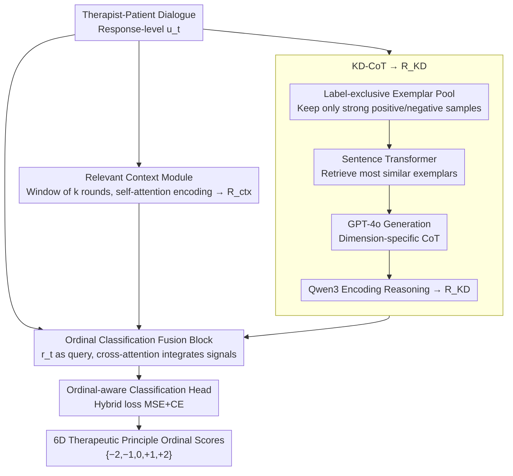

# Measuring What Matters!! Assessing Therapeutic Principles in Mental-Health Conversation

**Conference**: ACL 2026  
**arXiv**: [2604.05795](https://arxiv.org/abs/2604.05795)  
**Code**: [https://github.com/](https://github.com/)  
**Area**: Medical NLP  
**Keywords**: Mental health conversation assessment, therapeutic principle alignment, ordinal classification, knowledge distillation, chain-of-thought

## TL;DR
This paper proposes the CARE framework and the FAITH-M benchmark dataset. By integrating local dialogue context encoding with contrastive exemplar retrieval and Knowledge Distillation Chain-of-Thought (KD-CoT), it performs fine-grained ordinal assessment of AI-generated psychotherapy dialogues across six therapeutic principles. The framework achieves a weighted F1 of 63.34, representing a 64.26% Gain over the strongest baseline, Qwen3.

## Background & Motivation

**Background**: The use of Large Language Models (LLMs) in mental health support is steadily increasing, ranging from rule-based chatbots to advanced LLMs like ChatGPT. Over 80% of mental health help-seekers already utilize LLMs instead of clinically validated tools. Previous research indicates that laypeople often judge ChatGPT-generated therapeutic responses as comparable to those from trained clinicians.

**Limitations of Prior Work**: Existing evaluation methods primarily rely on surface-level metrics such as fluency and empathy, lacking a structured assessment of core therapeutic principles (e.g., non-judgmental acceptance, respect for autonomy, situational appropriateness). Most approaches employ generic metrics or subjective judgments rather than a clinically grounded evaluation framework.

**Key Challenge**: The linguistic fluency of LLMs masks deficiencies in clinical alignment—responses that appear "empathetic" on the surface may violate therapeutic principles (e.g., by being overly directive or ignoring patient autonomy), and existing evaluation systems cannot distinguish these nuances.

**Goal**: (1) Define fine-grained ordinal assessment tasks for six major therapeutic principles; (2) Construct an expert-annotated benchmark dataset; (3) Propose a structured evaluation framework that surpasses simple prompt engineering.

**Key Insight**: Drawing from psychotherapy theory, the authors model the assessment of therapist responses as a multi-label ordinal classification problem. Each response is independently scored on six therapeutic dimensions (from $-2$ to $+2$), and the framework utilizes dialogue context and exemplar-driven reasoning to simulate the expert clinical judgment process.

**Core Idea**: The approach achieves clinical-grade ordinal therapeutic assessment by fusing local dialogue context encoding, contrastive exemplar retrieval, and Knowledge Distillation Chain-of-Thought (KD-CoT).

## Method

### Overall Architecture
The CARE framework addresses the following problem: given a therapist-patient dialogue, it evaluates each therapist response $u_t$ across six therapeutic principle dimensions, outputting ordinal labels in the set $\{-2, -1, 0, +1, +2\}$. Instead of passing a single sentence to a classifier in isolation, CARE fuses three distinct signals for scoring: one encodes the local dialogue history context, another distills the reasoning logic of clinical experts, and the final one uses cross-attention to integrate these signals with the response itself before passing them to an ordinal-aware classification head. Intuitively, these three components answer: "In what context was this said?", "How would an experienced therapist reason about it?", and "What is the final score based on all information?"

### Key Designs

**1. Relevant Context Module: Contextualizing boundaries for valid responses**

Therapeutic assessment is inherently context-dependent—a statement like "You should go out more" might be appropriate guidance after a patient expresses loneliness, but it could be an invasive directive if it follows a patient's expression of autonomy being dismissed. This module captures the previous $k$ rounds of dialogue for each response $u_t$ to form a window $\{p_{t-k}, u_{t-k}, ..., p_t, u_t\}$. Self-attention is used to capture the dependency chain of "how the patient's state evolves and how the therapist's intervention responds," outputting the context representation $\mathbf{R}_{\text{ctx}}$. Experiments show that $k=2\sim3$ is optimal; $k \geq 4$ introduces irrelevant early dialogue as noise, reducing accuracy.

**2. Knowledge Distillation Chain-of-Thought (KD-CoT): Distilling expert reasoning for ordinal calibration**

Directly prompting GPT-4o often fails at fine-grained ordinal calibration, as it tends to collapse negative or neutral samples into a single neutral category. KD-CoT bypasses this by using a "teacher-generation, student-distillation" approach: first, it constructs label-exclusive exemplar pools for each dimension, keeping only strongly positive and negative samples to avoid contamination from ambiguous middle classes. Next, a Sentence Transformer embeds test samples to retrieve the most similar exemplar pairs. These are passed to GPT-4o to generate dimension-specific CoT explanations, which are then encoded by Qwen3 into a knowledge representation $\mathbf{R}_{\text{KD}}$. Consequently, the smaller model learns reasoning trajectories of "why this score was given" rather than just mimicking labels.

**3. Ordinal Classification Fusion Block: Distance-aware loss functions**

The fusion block uses the response embedding $r_t$ as a query, while $\mathbf{R}_{\text{ctx}}$ and $\mathbf{R}_{\text{KD}}$ serve as keys and values. A cross-attention mechanism integrates these signals before they enter the classification head. The critical component is the loss function: pure cross-entropy (CE) treats labels as unordered categories, penalizing a "miss by 4 levels" (e.g., $+2$ vs $-2$) identically to a "miss by 1 level" ($+2$ vs $+1$). CARE employs a hybrid loss:

$$\mathcal{L} = \alpha \cdot \text{MSE}(\hat{y}, y) + \beta \cdot \text{CE}(\hat{y}, y)$$

The MSE term penalizes the numerical distance between the prediction and the ground truth (larger distances incur higher penalties), while the CE term ensures classification precision. The optimal balance was found at $\alpha = \beta = 0.5$.

### Loss & Training
The aforementioned hybrid ordinal loss is used with $\alpha = \beta = 0.5$. To ensure fair comparison, all baselines utilize the same context window ($k=2$) and loss functions.

## Key Experimental Results

### Main Results

| Model Category | Model | Accuracy | Precision | Recall | F1w |
|---------|------|----------|-----------|--------|-----|
| Zero-shot | GPT-4o | 31.09 | 36.19 | 31.09 | 30.49 |
| Encoder | DeBERTa | 33.79 | 35.32 | 33.79 | 34.52 |
| Decoder | Qwen3 | 45.47 | 45.10 | 45.38 | 38.56 |
| Decoder | LLaMA 3.2 | 44.91 | 44.78 | 44.91 | 37.90 |
| **Ours** | **CARE-Qwen3** | **63.30** | **64.05** | **62.65** | **63.34** |
| **Ours** | **CARE-LLaMA 3.2** | **62.07** | **64.11** | **62.07** | **63.07** |
| **Gain** | ΔBaseline(%) | ↑39.21% | ↑42.03% | ↑38.05% | **↑64.26%** |

### Ablation Study

| Configuration | Acc | F1w | Description |
|------|-----|-----|------|
| CARE-Qwen3 Full | 63.30 | 63.34 | Full model |
| w/o KD-CoT (w/o label-context) | 57.08 | 57.20 | F1 drops by 6.14 |
| w/o Exemplar Retrieval (w/o label-exclusive) | 53.81 | 53.08 | F1 drops by 10.26 |
| Expert Agreement (NJL) | - | 81.60% | Highest dimension |
| Expert Agreement (RF) | - | 66.70% | Lowest dimension |

### Key Findings
- The KD-CoT module contributes most significantly; removing it causes F1 to drop by over 10 points, indicating that structured reasoning—rather than backbone model capacity—is the key driver of performance.
- A context window of $k=2\sim3$ is optimal; performance declines when $k \geq 4$ due to the introduction of irrelevant dialogue noise.
- In cross-dataset generalization tests (PTSD, CheeseBurger), CARE significantly outperforms baselines, with F1 gains exceeding 20 percentage points.
- Errors are primarily concentrated between adjacent ordinal categories (e.g., Mild Positive vs. Strong Positive), which is expected in ordinal classification tasks.

## Highlights & Insights
- The **Contrastive Exemplar + Knowledge Distillation** paradigm is highly effective: utilizing a large model (GPT-4o) as a "teacher" to generate reasoning trajectories and a smaller model to encode that distilled knowledge allows for the transfer of reasoning capabilities rather than simple label imitation.
- This work expands therapeutic assessment beyond coarse metrics like "fluency/empathy" into six independent clinical dimensions. This multi-dimensional ordinal assessment approach can be migrated to any scenario requiring fine-grained quality evaluation (e.g., educational dialogues, customer service quality).
- The hybrid ordinal loss (MSE+CE) is a versatile technique applicable to any ordinal classification task.

## Limitations & Future Work
- The study only covers six therapeutic principles, omitting other vital clinical dimensions such as cultural adaptation, trauma-informed care, and crisis intervention.
- The assessment is at the single-response level and does not model the long-term therapeutic alliance across sessions.
- KD-CoT relies on GPT-4o to generate reasoning trajectories, which entails high deployment costs.
- Labeling middle categories (Mild Positive/Negative) involves inherent subjectivity; misclassifications in these intervals are difficult to eliminate entirely.

## Related Work & Insights
- **vs. General Empathy Detection (Sharma et al. 2021)**: While they focus on the expression of empathy, this work focuses on comprehensive therapeutic principle alignment, where empathy is only one of six dimensions.
- **vs. ChatGPT Therapeutic Evaluation (Hatch et al. 2025)**: They had humans evaluate ChatGPT responses and found ratings were driven by surface quality; this work replaces subjective judgment with a structured framework.

## Rating
- **Novelty**: ⭐⭐⭐⭐ Novel task definition and effectively designed KD-CoT framework.
- **Experimental Thoroughness**: ⭐⭐⭐⭐⭐ Includes 15 baselines, cross-dataset generalization, expert evaluation, and comprehensive ablations.
- **Writing Quality**: ⭐⭐⭐⭐ Clear structure, though some experimental details require referring to the appendix.

<!-- RELATED:START -->

## Related Papers

- [\[ACL 2026\] Responsible Evaluation of AI for Mental Health](responsible_evaluation_of_ai_for_mental_health.md)
- [\[ACL 2026\] MHGraphBench: Knowledge Graph-Grounded Benchmarking of Mental Health Knowledge in Large Language Models](mhgraphbench_knowledge_graph-grounded_benchmarking_of_mental_health_knowledge_in.md)
- [\[ACL 2026\] MHSafeEval: Role-Aware Interaction-Level Evaluation of Mental Health Safety in Large Language Models](mhsafeeval_role-aware_interaction-level_evaluation_of_mental_health_safety_in_la.md)
- [\[AAAI 2026\] Voices, Faces, and Feelings: Multi-modal Emotion-Cognition Captioning for Mental Health Understanding](../../AAAI2026/medical_nlp/voices_faces_and_feelings_multi-modal_emotion-cognition_captioning_for_mental_he.md)
- [\[ICLR 2026\] CounselBench: A Large-Scale Expert Evaluation and Adversarial Benchmarking of LLMs in Mental Health QA](../../ICLR2026/medical_nlp/counselbench_llm_mental_health_qa.md)

<!-- RELATED:END -->
